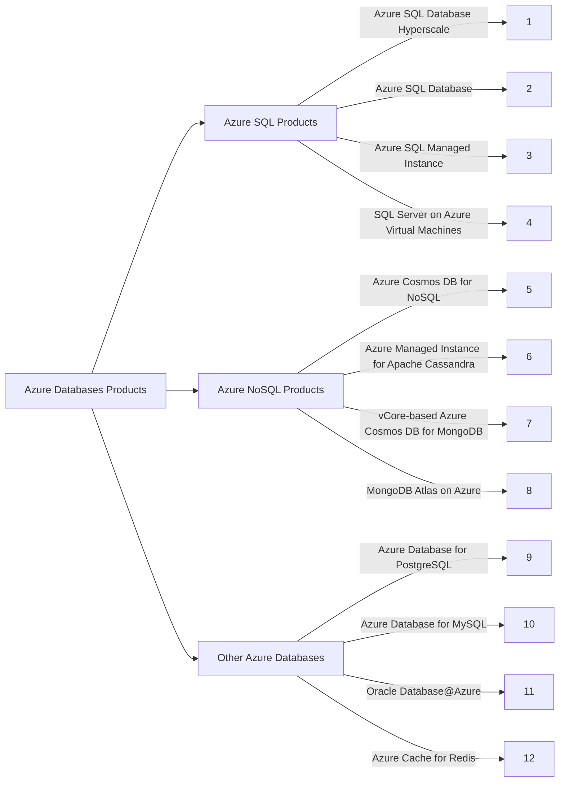

# Azure Databases Overview 

Costa Rica

[brown9804](https://github.com/brown9804)

Last updated: 2024-11-15

----------

> These functionalities include the ability to query data, manage relationships between different data items, enforce data integrity rules, and perform transactions. These products are typically used when you need to work with structured or unstructured data, and need more advanced features compared to basic data storage products.

  

| Properties               | Structured Data                                  | Unstructured Data                               |
|--------------------------|--------------------------------------------------|-------------------------------------------------|
| Formats                  | Pre-defined                                      | A huge variety of formats                       |
| Storage model            | Pre-defined/not flexible                         | Not pre-defined/flexible                        |
| Databases                | SQL Relational databases                         | NoSQL Non-relational databases                  |
| Ease of search           | Easy to search                                   | Difficult to search                             |
| Analysis methods         | Quantitative                                     | Qualitative                                     |
| Tools and technologies   | RDBMS, OLAP, CRM, OLTP                           | NoSQL DBMS, Data mining, Data visualization tools |
| Specialists to handle    | Business analysts, Software engineers, Marketing Analysts     | AI architects, Data scientists, Analysts with deep expertise  |

## Products 

| Product | Description | Benefits | Differentiators | Use Cases | Related Products (tendency used with) |
| --- | --- | --- | --- | --- | --- |
|  **Azure SQL Database** | A fully managed platform as a service (PaaS) Database Engine that handles most of the database management functions such as upgrading, patching, backups, and monitoring without user involvement. | Reduces management overhead and total cost of ownership. | Fully managed with built-in high availability. | Ideal for modern cloud applications that need to scale and perform fast. | Azure App Service, Power BI, Azure Analysis Services. | 
|  **Azure SQL Managed Instance** | Fully managed SQL Server Database engine instance that's highly compatible with on-premises SQL Server. | Enables seamless migration of SQL Server workloads to the cloud. | Offers near 100% compatibility with the latest SQL Server on-premises. | Best for most migration scenarios from on-premises SQL Server. | Azure Data Factory, Azure Databricks, Azure Synapse Analytics. | 
|  **SQL Server on Azure Virtual Machines** | Allows you to use full versions of SQL Server in the Cloud without having to manage any on-premises hardware. | Provides more control over the database and OS. | Offers the ability to run SQL Server versions that Azure SQL does not support. | Suitable for applications requiring OS-level access. | Azure Backup, Azure Site Recovery, Azure Monitor. | 
|  **Azure Database for PostgreSQL** | A fully managed, enterprise-ready community PostgreSQL database as a service. | Provides high performance and scalability with up to 99.99% availability. | Supports popular open-source PostgreSQL functionalities. | Ideal for applications written in languages and frameworks that PostgreSQL supports. | Azure Kubernetes Service, Azure App Service, Power BI. | 
|  **Azure Database for MySQL** | Offers fully managed, enterprise-ready community MySQL database as a service. | Delivers high performance and resilience with up to 99.99% availability. | Supports popular open-source MySQL functionalities. | Perfect for applications written in languages and frameworks that MySQL supports. | Azure Web Apps, Azure Functions, Azure Logic Apps. | 
|  **Oracle Database on Azure** | Offers a set of solutions that enable customers to run Oracle software workloads on Azure. | Allows leveraging existing Oracle investments in the cloud. | Provides a variety of deployment options for Oracle workloads. | Best for running Oracle workloads alongside other Azure services. | Azure Site Recovery, Azure Backup, Azure Active Directory. | 
|  **Azure Cosmos DB** | A globally distributed, multi-model database service for managing data at planet-scale. | Offers turnkey global distribution and elastic scaling. | Provides multi-model support including key-value, document, column-family, and graph. | Ideal for globally distributed applications needing low latency. | Azure Functions, Azure Logic Apps, Azure Container Instances. | 
|  **Azure Managed Instance for Apache Cassandra** | A scalable multi-master database with no single points of failure. | Provides automatic scaling and repair with zero downtime. | Offers Cassandra API compatibility and seamless data movement. | Best for applications requiring a wide-column store. | Azure Synapse Analytics, Azure HDInsight, Azure Databricks. | 
|  **Azure Cosmos DB for MongoDB** | Provides a fully managed, compatibility layer for MongoDB applications to leverage Cosmos DB. | Delivers comprehensive SLAs on throughput, latency, availability, and consistency. | Provides MongoDB wire protocol compatibility. | Ideal for existing MongoDB applications needing to scale. | Azure Kubernetes Service, Azure Databricks, Azure Functions. | 
|  **MongoDB Atlas on Azure** | A global cloud database service for modern applications. | Offers built-in automation for resource and workload optimization. | Provides a fully managed MongoDB service on Azure. | Best for applications requiring a document database. | Azure Kubernetes Service, Azure Databricks, Azure Functions. | 
|  **Azure Cache for Redis** | Improves the performance of your application by increasing its responsiveness and enabling it to handle increasing loads with less web-compute resources. | Provides high throughput and low-latency access to data. | Offers a secure and dedicated Redis cache, managed by Microsoft. | Ideal for applications needing to cache frequently queried data. | Azure Web Apps, Azure Functions, Azure Logic Apps. | 
|  **SQL Server 2022** | The most cloud-connected version of SQL Server yet. | Enables hybrid scenarios with cloud connectivity. | Provides the latest SQL Server innovations in the cloud. | Best for modern applications needing the latest SQL Server features. | Azure Synapse Analytics, Power BI, Azure Data Factory. | 

  <h3 style="color: #4CAF50;">Total Visitors</h3>
  

