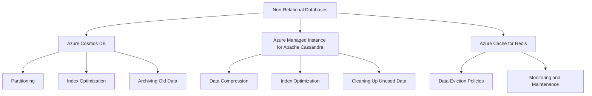

# Optimizing Database Performance by Freeing Up Unused Space 

Costa Rica

[](https://github.com) 
[](https://github.com/)
[brown9804](https://github.com/brown9804)

Last updated: 2024-12-23

----------

> Microsoft offers a variety of database solutions, both relational and non-relational. Quick overview about strategies for managing and reducing their size, ensuring optimal performance and efficient use of storage resources. It's essential to `follow best practices and monitor the operation to avoid potential issues like long-running commands or blocking sessions`.

## Wiki 

<details>
<summary><b>Table of Wiki </b> (Click to expand)</summary>

- [Shrink a database](https://learn.microsoft.com/en-us/sql/relational-databases/databases/shrink-a-database?view=sql-server-ver16)
- [Types of Databases](https://azure.microsoft.com/en-gb/products/category/databases/)
- [Shrink Database Task (Maintenance Plan)](https://learn.microsoft.com/en-us/sql/relational-databases/maintenance-plans/shrink-database-task-maintenance-plan?view=sql-server-ver16)
- [Manage file space for databases in Azure SQL Database](https://learn.microsoft.com/en-us/azure/azure-sql/database/file-space-manage?view=azuresql-db)
  
</details>

## Content 

<details>
<summary><b>Table of Content </b> (Click to expand)</summary>

- [Wiki](#wiki)
- [Content](#content)
- [Overview](#overview)
- [Relational Databases](#relational-databases)
    - [Azure SQL Database](#azure-sql-database)
    - [Azure SQL Managed Instance](#azure-sql-managed-instance)
    - [SQL Server on Azure Virtual Machines](#sql-server-on-azure-virtual-machines)
    - [Azure Database for PostgreSQL](#azure-database-for-postgresql)
    - [Azure Database for MySQL](#azure-database-for-mysql)
- [Non-Relational Databases](#non-relational-databases)
    - [Azure Cosmos DB](#azure-cosmos-db)
    - [Azure Managed Instance for Apache Cassandra](#azure-managed-instance-for-apache-cassandra)
    - [Azure Cache for Redis](#azure-cache-for-redis)

</details>

## Overview 

General Strategies for All Databases:

- **Archiving Old Data**: Move old or rarely accessed data to an archive database or storage solution. Reduces the size of the active database, improving performance and manageability. `Use SQL Server's built-in tools or third-party solutions to archive data based on specific criteria (e.g., date, usage).`
- **Data Compression**: Apply data compression techniques to reduce storage space.
- **Partitioning Tables**: Split large tables into smaller, more manageable pieces.
- **Index Optimization**: Regularly rebuild or reorganize indexes to reduce fragmentation.
- **Removing Unused Indexes**: Identify and remove indexes that are not being used.
- **Cleaning Up Unused Data**: Regularly delete or archive unused or obsolete data.
- **Monitoring and Maintenance**: Regularly monitor database size and performance, and perform maintenance tasks.
- **Using Filegroups**: Distribute database objects across multiple filegroups to improve performance and manageability.


> General Tips:

| **Category**             | **Recommendation**                                                                                                                                                                                                 |
|--------------------------|---------------------------------------------------------------------------------------------------------------------------------------------------------------------------------------------------------------------|
| **Regular Maintenance**  | Perform regular database maintenance tasks such as index rebuilding, updating statistics, and cleaning up old data.|
| **Monitoring and Alerts**| Set up monitoring and alerts to notify you when free space falls below your defined thresholds. Use Azure Monitor and SQL Insights for comprehensive monitoring.|
| **Backup and Recovery**  | Ensure you have a robust backup and recovery strategy in place to prevent data loss and minimize downtime.|

## Relational Databases

```mermaid
graph TD
    A[Relational Databases]

    A1[Azure SQL Database]
    A2[Azure SQL Managed Instance]
    A3[SQL Server on Azure Virtual Machines]
    A4[Azure Database for PostgreSQL]
    A5[Azure Database for MySQL]

    A --> A1
    A --> A2
    A --> A3
    A --> A4
    A --> A5

    A1 --> A1_1[Shrinking the Database]
    A1 --> A1_2[Data Compression]
    A1 --> A1_3[Index Optimization]
    A1 --> A1_4[Partitioning Tables]

    A2 --> A2_1[Shrinking the Database]
    A2 --> A2_2[Archiving Old Data]
    A2 --> A2_3[Removing Unused Indexes]
    A2 --> A2_4[Using Filegroups]

    A3 --> A3_1[Cleaning Up Unused Data]
    A3 --> A3_2[Monitoring and Maintenance]
    A3 --> A3_3[Data Compression]

    A4 --> A4_1[Partitioning Tables]
    A4 --> A4_2[Index Optimization]
    A4 --> A4_3[Archiving Old Data]

    A5 --> A5_1[Data Compression]
    A5 --> A5_2[Index Optimization]
    A5 --> A5_3[Cleaning Up Unused Data]
```



### Azure SQL Database

To optimize your Azure SQL Database, you can use several strategies:

1. **Shrinking the Database**: This helps reclaim unused space. Use the command:
   ```sql
   DBCC SHRINKDATABASE (YourDatabaseName, 10);
   ```
   To check for blocking operations that might prevent the shrinking process from completing:
   ```sql
   SELECT blocking_session_id, wait_type, wait_time, wait_resource
   FROM sys.dm_exec_requests
   WHERE blocking_session_id <> 0;
   ```

2. **Data Compression**: Apply `PAGE` or `ROW` compression to reduce storage costs and improve performance. For example:
   ```sql
   ALTER TABLE YourTableName REBUILD WITH (DATA_COMPRESSION = PAGE);
   ```

3. **Index Optimization**: Regularly rebuild or reorganize indexes to maintain query performance:
   ```sql
   ALTER INDEX ALL ON YourTableName REBUILD;
   ```

4. **Partitioning Tables**: Split large tables into partitions to improve manageability and performance:
   ```sql
   CREATE PARTITION FUNCTION MyPartitionFunction (datetime) AS RANGE LEFT FOR VALUES ('2023-01-01', '2024-01-01');
   ```

### Azure SQL Managed Instance

For Azure SQL Managed Instance, consider these strategies:

> - DBCC SHRINKFILE: Shrinks a specific database file by moving data pages and reducing the file size. <br/>
> - DBCC SHRINKFILE (TRUNCATEONLY): Releases unused space at the end of a specific file without moving data pages.
> - DBCC SHRINKDATABASE: Shrinks all data and log files in a database by moving data pages and reducing the overall size. <br/>

| **Command**                      | **Description**                                                                 | **Syntax**                                                                                   | **Example**                                                                                   |
|----------------------------------|---------------------------------------------------------------------------------|----------------------------------------------------------------------------------------------|-----------------------------------------------------------------------------------------------|
| **DBCC SHRINKFILE**              | DBCC SHRINKFILE is used to shrink the size of a specific database file. This command attempts to move data pages from the end of the file to unoccupied space closer to the beginning of the file, thereby reducing the file size.            | `DBCC SHRINKFILE (file_id, target_size_in_MB);`                                              | `DBCC SHRINKFILE (1, 100);` -- Shrinks the file with ID 1 to 100 MB                       |
| **DBCC SHRINKFILE (TRUNCATEONLY)** | DBCC SHRINKFILE (TRUNCATEONLY) is a specific option for DBCC SHRINKFILE that releases all free space at the end of the file to the operating system without moving any data pages. This command is useful when you want to quickly release unused space without the overhead of moving data. | `DBCC SHRINKFILE (file_id, TRUNCATEONLY);`                                                   | `DBCC SHRINKFILE (1, TRUNCATEONLY);` -- Releases unused space at the end of the file with ID 1 |
| **DBCC SHRINKDATABASE**          | DBCC SHRINKDATABASE is used to shrink the size of all data and log files in a database. This command attempts to move data pages from the end of the files to unoccupied space closer to the beginning of the files, thereby reducing the overall size of the database. `target_percent_free_space`: The desired percentage of free space to remain in the database after the shrink operation.  | `DBCC SHRINKDATABASE (database_name, target_percent_free_space);`                             | `DBCC SHRINKDATABASE (YourDatabaseName, 10);` -- Shrinks the database to leave 10% free space |

1. Gather more detailed information about the current used and allocated space in your database:

    -  Detailed Space Usage by File: This query provides detailed information about each file, including the file name, type, growth settings, and more:
    
        ```sql
        WITH CTE AS (
            SELECT 
                file_id,
                name AS file_name,
                type_desc AS file_type,
                physical_name,
                CAST(FILEPROPERTY(name, 'SpaceUsed') AS bigint) * 8 / 1024.0 AS space_used_mb,
                CAST(size AS bigint) * 8 / 1024.0 AS space_allocated_mb,
                CAST(max_size AS bigint) * 8 / 1024.0 AS max_size_mb,
                growth,
                CASE 
                    WHEN is_percent_growth = 1 THEN 'Percentage'
                    ELSE 'MB'
                END AS growth_type
            FROM sys.database_files
        )
        SELECT 
            file_id,
            file_name,
            file_type,
            physical_name,
            space_used_mb,
            space_allocated_mb,
            max_size_mb,
            growth,
            growth_type,
            space_used_mb / space_allocated_mb * 100 AS [Occupancy %],
            100 - (space_used_mb / space_allocated_mb * 100) AS [Free %]
        FROM CTE
        ORDER BY [Occupancy %];
        ```

          
        
        | **Category**       | **Recommendation**                                                                                                                                                                                                 |
        |--------------------|---------------------------------------------------------------------------------------------------------------------------------------------------------------------------------------------------------------------|
        | **LOG Files**      | - **Free Space**: Maintain at least 25-30% free space in your log files. This ensures there is enough room for transaction logs to grow and prevents the database from running out of space during peak operations.<br>- **Monitoring**: Use the `sys.dm_db_log_space_usage`. Regularly check the percentage of log space used to avoid unexpected issues.<br>- **Maintenance**: Regularly back up your transaction logs to truncate inactive portions and free up space. |
        | **ROWS (Data Files)** | - **Free Space**: Aim to keep around 20-25% free space in your data files. This allows for growth and helps avoid performance issues related to frequent auto-growth events.<br>- **Auto-Growth Settings**: Configure auto-growth settings appropriately to avoid frequent small growths. Setting a fixed size for growth (e.g., 500 MB or 1 GB) is often better than a percentage-based growth.<br>- **Monitoring**: Use the `sys.database_files` view to monitor the size and free space of your data files. |
        | **FILESTREAM Data** | - **Free Space**: Ensure there is sufficient free space on the disk where the FILESTREAM data is stored. A good rule of thumb is to keep at least 20% free space.<br>- **Disk Monitoring**: Regularly monitor the disk space and set up alerts to notify you when free space falls below a certain threshold.<br>- **Maintenance**: Regularly clean up old or unused FILESTREAM data to free up space. |

    - Space Usage by Table: This query provides information about space usage at the table level, including the number of rows, reserved space, data space, index space, and unused space. Will iterate through all tables in your database and execute sp_spaceused for each one:
        
        ```sql
        -- Create a temporary table to store the results
        CREATE TABLE #SpaceUsed (
            TableName NVARCHAR(256),
            [Rows] INT,
            Reserved VARCHAR(50),
            Data VARCHAR(50),
            IndexSize VARCHAR(50),
            Unused VARCHAR(50),
            [Free %] FLOAT
        );
        
        DECLARE @TableName NVARCHAR(256);
        
        DECLARE TableCursor CURSOR FOR
        SELECT QUOTENAME(SCHEMA_NAME(schema_id)) + '.' + QUOTENAME(name)
        FROM sys.tables;
        
        OPEN TableCursor;
        FETCH NEXT FROM TableCursor INTO @TableName;
        
        WHILE @@FETCH_STATUS = 0
        BEGIN
            INSERT INTO #SpaceUsed (TableName, [Rows], Reserved, Data, IndexSize, Unused)
            EXEC sp_spaceused @TableName;
        
            FETCH NEXT FROM TableCursor INTO @TableName;
        END;
        
        CLOSE TableCursor;
        DEALLOCATE TableCursor;
        
        -- Use a CTE to calculate the Free %
        WITH CTE AS (
            SELECT 
                TableName,
                [Rows],
                CAST(REPLACE(Reserved, ' KB', '') AS FLOAT) AS ReservedKB,
                CAST(REPLACE(Data, ' KB', '') AS FLOAT) AS DataKB,
                CAST(REPLACE(IndexSize, ' KB', '') AS FLOAT) AS IndexSizeKB,
                CAST(REPLACE(Unused, ' KB', '') AS FLOAT) AS UnusedKB
            FROM #SpaceUsed
        )
        UPDATE #SpaceUsed
        SET [Free %] = 
            CASE 
                WHEN ReservedKB = 0 THEN 0
                ELSE (UnusedKB / ReservedKB) * 100
            END
        FROM CTE
        WHERE #SpaceUsed.TableName = CTE.TableName;
        
        -- Select the results from the temporary table
        SELECT * FROM #SpaceUsed
        ORDER BY TableName;
        
        -- Drop the temporary table
        DROP TABLE #SpaceUsed;
        ```

      

        | **Aspect**            | **Recommendation**|
        |-----------------------|---------------------------------------------------|
        | **Free Space**        | Maintain around 20-25% free space in your data files to accommodate table growth.|
        | **Index Maintenance** | Regularly rebuild or reorganize indexes to optimize performance and reclaim space. Fragmented indexes can lead to inefficient space usage.|
        | **Partitioning**      | Consider partitioning large tables to improve manageability and performance. This can also help in efficiently managing space.|
        | **Archiving**         | Implement an archiving strategy for old or infrequently accessed data. This can free up space and improve performance for active data.|
        | **Compression**       | Use data compression techniques to reduce the size of tables and indexes. SQL Server supports row and page compression, which can significantly reduce space usage.|

    - Space Usage by Index: This query provides detailed information about space usage by indexes, including the index name, type, and space used.
    
        ```sql
        SELECT 
            OBJECT_NAME(i.object_id) AS table_name,
            i.name AS index_name,
            i.type_desc AS index_type,
            SUM(a.used_pages) * 8 / 1024.0 AS index_size_mb
        FROM 
            sys.indexes AS i
            JOIN sys.partitions AS p ON i.object_id = p.object_id AND i.index_id = p.index_id
            JOIN sys.allocation_units AS a ON p.partition_id = a.container_id
        GROUP BY 
            i.object_id, i.index_id, i.name, i.type_desc
        ORDER BY 
            index_size_mb DESC;
        ```

      

    - Database Size and Space Usage: This query provides an overview of the database size and space usage, including the total size, used space, and free space.
        
        ```sql
        WITH SpaceInfo AS (
            SELECT 
                file_id,
                type_desc,
                name AS file_name,
                physical_name,
                size * 8 / 1024 AS size_mb,
                FILEPROPERTY(name, 'SpaceUsed') * 8 / 1024 AS space_used_mb
            FROM 
                sys.database_files
        )
        SELECT 
            db_name.database_name,
            SUM(size_mb) AS total_size_mb,
            SUM(space_used_mb) AS used_space_mb,
            SUM(size_mb) - SUM(space_used_mb) AS free_space_mb
        FROM 
            SpaceInfo,
            (SELECT DB_NAME() AS database_name) AS db_name
        GROUP BY 
            db_name.database_name;
        ```

      


    - Filegroup Space Usage: This query provides information about space usage by filegroups, including the filegroup name, total size, used space, and free space.
        
        ```sql
        -- Calculate the total size, used space, and free space for each filegroup
        SELECT 
            fg.name AS filegroup_name,
            SUM(df.size * 8 / 1024.0) AS total_size_mb,
            SUM(df.size * 8 / 1024.0) - SUM(a.total_pages * 8 / 1024.0) AS free_space_mb,
            SUM(a.total_pages * 8 / 1024.0) AS used_space_mb
        FROM 
            sys.filegroups AS fg
        JOIN 
            sys.database_files AS df ON fg.data_space_id = df.data_space_id
        JOIN 
            sys.allocation_units AS a ON df.data_space_id = a.data_space_id
        GROUP BY 
            fg.name
        ORDER BY 
            total_size_mb DESC;
        ```

      

2. **Shrink the Database File**:  Shrink the database file to reclaim unused space

   ```sql
    -- Shrink the database file (replace 1 with your file_id)
    DBCC SHRINKFILE (1);
   ```

      

3. **Monitor the Shrink Operation**: While the shrink operation is running, you can monitor for any blocking operations that might be affecting the process.

    ```sql
    -- Check for blocking operations
    SELECT 
        blocking_session_id, 
        wait_type, 
        wait_time, 
        wait_resource
    FROM 
        sys.dm_exec_requests
    WHERE 
        blocking_session_id <> 0;
    ```

   
   

4. **Check for Active Transactions**: Ensure there are no active transactions that might be preventing the shrink operation from completing.

   ```sql
   -- Check for active transactions
    DBCC OPENTRAN;
   ```

   

5. **Check for Long-Running Queries**: Identify any long-running queries that might be affecting the performance.

    ```sql
    -- Check for long-running queries
    SELECT 
        session_id, 
        start_time, 
        status, 
        command, 
        wait_type, 
        wait_time, 
        blocking_session_id
    FROM 
        sys.dm_exec_requests
    WHERE 
        status = 'running'
    ORDER BY
    ```

   


6. **Shrinking the Database**: Reclaim unused space with. Shrink the entire database to leave 10% free space.
   ```sql
   DBCC SHRINKDATABASE (YourDatabaseName, 10);
   ```

   

   To check for blocking operations:
   ```sql
   SELECT blocking_session_id, wait_type, wait_time, wait_resource
   FROM sys.dm_exec_requests
   WHERE blocking_session_id <> 0;
   ```

7. **Archiving Old Data**: Move old data to an archive database using SQL Server's built-in tools or third-party solutions.

8. **Removing Unused Indexes**: Identify and remove indexes that are not being used.

   ```sql
   SELECT * FROM sys.dm_db_index_usage_stats WHERE user_seeks = 0 AND user_scans = 0 AND user_lookups = 0;
   ```

    

9. **Using Filegroups**: Distribute objects across multiple filegroups to improve performance and manageability:
   ```sql
   CREATE TABLE YourTableName (...) ON [PrimaryFileGroup];
   ```

### SQL Server on Azure Virtual Machines
To maintain SQL Server on Azure VMs, you can:

1. **Cleaning Up Unused Data**: Regularly delete or archive obsolete data to free up space.

2. **Monitoring and Maintenance**: Use built-in monitoring tools and maintenance plans, such as SQL Server Management Studio (SSMS) or Azure Monitor.

3. **Data Compression**: Apply compression techniques to tables and indexes:
   ```sql
   ALTER TABLE YourTableName REBUILD WITH (DATA_COMPRESSION = PAGE);
   ```

### Azure Database for PostgreSQL
For Azure Database for PostgreSQL, these strategies are effective:

1. **Partitioning Tables**: Use PostgreSQL's native partitioning features to manage large tables:
   ```sql
   CREATE TABLE measurement_y2023m01 PARTITION OF measurement FOR VALUES FROM ('2023-01-01') TO ('2023-02-01');
   ```

2. **Index Optimization**: Regularly rebuild or reorganize indexes to maintain performance:
   ```sql
   REINDEX TABLE YourTableName;
   ```

3. **Archiving Old Data**: Move old data to an archive database using PostgreSQL's built-in tools or third-party solutions.

### Azure Database for MySQL
To optimize Azure Database for MySQL, you can:

1. **Data Compression**: Use MySQL's compression features to save space:
   ```sql
   ALTER TABLE YourTableName ROW_FORMAT=COMPRESSED;
   ```

2. **Index Optimization**: Regularly rebuild or reorganize indexes to keep the database performing well:
   ```sql
   OPTIMIZE TABLE YourTableName;
   ```

3. **Cleaning Up Unused Data**: Regularly delete or archive obsolete data to maintain database efficiency.


## Non-Relational Databases


### Azure Cosmos DB

A globally distributed, multi-model database service.

> **Strategies**:

- **Partitioning**: Use automatic partitioning to manage large datasets. Cosmos DB automatically partitions data based on the partition key you define. Ensure your partition key is chosen to evenly distribute data.
- **Index Optimization**: Customize indexing policies to optimize performance. Customize indexing policies using the Azure Portal or SDK. Example:
 ```json
 {
   "indexingMode": "consistent",
   "automatic": true,
   "includedPaths": [
     { "path": "/*" }
   ],
   "excludedPaths": [
     { "path": "/\"_etag\"/?" }
   ]
 }
 ```
- **Archiving Old Data**: Move old data to an archive database. Use Azure Data Factory to move old data to an archive storage solution.

### Azure Managed Instance for Apache Cassandra

A managed instance of Apache Cassandra.

> **Strategies**:

- **Data Compression**: Use Cassandra's compression features. Enable compression on tables:
  ```sql
  CREATE TABLE my_table (id UUID PRIMARY KEY, data TEXT) WITH compression = {'class': 'LZ4Compressor'};
  ```
- **Index Optimization**: Regularly rebuild or reorganize indexes. Rebuild indexes periodically:
  ```sql
  REBUILD INDEX my_index;
  ```
- **Cleaning Up Unused Data**: Regularly delete or archive obsolete data. Use TTL (Time to Live) to automatically delete old data.
  ```sql
  CREATE TABLE my_table (id UUID PRIMARY KEY, data TEXT) WITH default_time_to_live = 86400;
  ```

The value 86400 in the context of the default_time_to_live setting for Apache Cassandra represents the Time to Live (TTL) for data in seconds. Specifically, 86400 seconds is equivalent to 24 hours (1 day). This means that any data inserted into the table will automatically be deleted after 24 hours.

  ```
  86400 seconds = 24 hours = 1 day
  ```

  > So, when you set default_time_to_live = 86400, it ensures that data in the table will expire and be removed after one day. If you want to set a different TTL, you can adjust this value accordingly. For example:
  
  ```
  3600 seconds = 1 hour
  604800 seconds = 7 days (1 week)
  ```

### Azure Cache for Redis

An in-memory data store for caching and real-time analytics.

> **Strategies**:

- **Data Eviction Policies**: Use eviction policies to manage memory usage. Configure eviction policies in Redis configuration:
 ```
 maxmemory-policy allkeys-lru
 ```
- **Monitoring and Maintenance**: Regularly monitor and maintain cache performance. Use Azure Monitor to set up alerts and monitor performance metrics. Example:
 ```
 az monitor metrics alert create --name "HighMemoryUsage" --resource-group "MyResourceGroup" --scopes "/subscriptions/{subscription-id}/resourceGroups/{resource-group}/providers/Microsoft.Cache/Redis/{cache-name}" --condition "avg memory_usage_percentage > 80" --description "Alert when memory usage exceeds 80%"
 ```

<div align="center">
  <h3 style="color: #4CAF50;">Total Visitors</h3>
  
</div>

