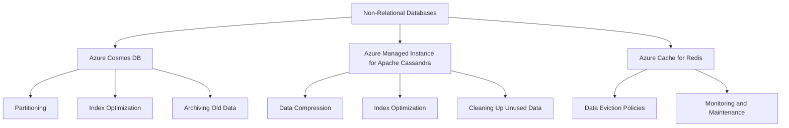

# Optimizing Database Performance by Freeing Up Unused Space 

Costa Rica

[](https://github.com) 
[](https://github.com/)
[brown9804](https://github.com/brown9804)

Last updated: 2024-12-16

----------

> Microsoft offers a variety of database solutions, both relational and non-relational. Quick overview about strategies for managing and reducing their size, ensuring optimal performance and efficient use of storage resources. It's essential to `follow best practices and monitor the operation to avoid potential issues like long-running commands or blocking sessions`.

## Wiki 

<details>
<summary><b>Table of Wiki </b> (Click to expand)</summary>

- [Shrink a database](https://learn.microsoft.com/en-us/sql/relational-databases/databases/shrink-a-database?view=sql-server-ver16)
- [Types of Databases](https://azure.microsoft.com/en-gb/products/category/databases/)
- [Shrink Database Task (Maintenance Plan)](https://learn.microsoft.com/en-us/sql/relational-databases/maintenance-plans/shrink-database-task-maintenance-plan?view=sql-server-ver16)

</details>

## Overview 

General Strategies for All Databases:

- **Archiving Old Data**: Move old or rarely accessed data to an archive database or storage solution. Reduces the size of the active database, improving performance and manageability. `Use SQL Server's built-in tools or third-party solutions to archive data based on specific criteria (e.g., date, usage).`
- **Data Compression**: Apply data compression techniques to reduce storage space.
- **Partitioning Tables**: Split large tables into smaller, more manageable pieces.
- **Index Optimization**: Regularly rebuild or reorganize indexes to reduce fragmentation.
- **Removing Unused Indexes**: Identify and remove indexes that are not being used.
- **Cleaning Up Unused Data**: Regularly delete or archive unused or obsolete data.
- **Monitoring and Maintenance**: Regularly monitor database size and performance, and perform maintenance tasks.
- **Using Filegroups**: Distribute database objects across multiple filegroups to improve performance and manageability.

## Relational Databases

```mermaid
graph TD
    A[Relational Databases]

    A1[Azure SQL Database]
    A2[Azure SQL Managed Instance]
    A3[SQL Server on Azure Virtual Machines]
    A4[Azure Database for PostgreSQL]
    A5[Azure Database for MySQL]

    A --> A1
    A --> A2
    A --> A3
    A --> A4
    A --> A5

    A1 --> A1_1[Shrinking the Database]
    A1 --> A1_2[Data Compression]
    A1 --> A1_3[Index Optimization]
    A1 --> A1_4[Partitioning Tables]

    A2 --> A2_1[Shrinking the Database]
    A2 --> A2_2[Archiving Old Data]
    A2 --> A2_3[Removing Unused Indexes]
    A2 --> A2_4[Using Filegroups]

    A3 --> A3_1[Cleaning Up Unused Data]
    A3 --> A3_2[Monitoring and Maintenance]
    A3 --> A3_3[Data Compression]

    A4 --> A4_1[Partitioning Tables]
    A4 --> A4_2[Index Optimization]
    A4 --> A4_3[Archiving Old Data]

    A5 --> A5_1[Data Compression]
    A5 --> A5_2[Index Optimization]
    A5 --> A5_3[Cleaning Up Unused Data]
```



### Azure SQL Database

To optimize your Azure SQL Database, you can use several strategies:

1. **Shrinking the Database**: This helps reclaim unused space. Use the command:
   ```sql
   DBCC SHRINKDATABASE (YourDatabaseName, 10);
   ```
   To check for blocking operations that might prevent the shrinking process from completing:
   ```sql
   SELECT blocking_session_id, wait_type, wait_time, wait_resource
   FROM sys.dm_exec_requests
   WHERE blocking_session_id <> 0;
   ```

2. **Data Compression**: Apply `PAGE` or `ROW` compression to reduce storage costs and improve performance. For example:
   ```sql
   ALTER TABLE YourTableName REBUILD WITH (DATA_COMPRESSION = PAGE);
   ```

3. **Index Optimization**: Regularly rebuild or reorganize indexes to maintain query performance:
   ```sql
   ALTER INDEX ALL ON YourTableName REBUILD;
   ```

4. **Partitioning Tables**: Split large tables into partitions to improve manageability and performance:
   ```sql
   CREATE PARTITION FUNCTION MyPartitionFunction (datetime) AS RANGE LEFT FOR VALUES ('2023-01-01', '2024-01-01');
   ```

### Azure SQL Managed Instance

For Azure SQL Managed Instance, consider these strategies:

1. **Shrinking the Database**: Reclaim unused space with:
   ```sql
   DBCC SHRINKDATABASE (YourDatabaseName, 10);
   ```
   To check for blocking operations:
   ```sql
   SELECT blocking_session_id, wait_type, wait_time, wait_resource
   FROM sys.dm_exec_requests
   WHERE blocking_session_id <> 0;
   ```

2. **Archiving Old Data**: Move old data to an archive database using SQL Server's built-in tools or third-party solutions.

3. **Removing Unused Indexes**: Identify and remove indexes that are not being used:
   ```sql
   SELECT * FROM sys.dm_db_index_usage_stats WHERE user_seeks = 0 AND user_scans = 0 AND user_lookups = 0;
   ```

4. **Using Filegroups**: Distribute objects across multiple filegroups to improve performance and manageability:
   ```sql
   CREATE TABLE YourTableName (...) ON [PrimaryFileGroup];
   ```

### SQL Server on Azure Virtual Machines
To maintain SQL Server on Azure VMs, you can:

1. **Cleaning Up Unused Data**: Regularly delete or archive obsolete data to free up space.

2. **Monitoring and Maintenance**: Use built-in monitoring tools and maintenance plans, such as SQL Server Management Studio (SSMS) or Azure Monitor.

3. **Data Compression**: Apply compression techniques to tables and indexes:
   ```sql
   ALTER TABLE YourTableName REBUILD WITH (DATA_COMPRESSION = PAGE);
   ```

### Azure Database for PostgreSQL
For Azure Database for PostgreSQL, these strategies are effective:

1. **Partitioning Tables**: Use PostgreSQL's native partitioning features to manage large tables:
   ```sql
   CREATE TABLE measurement_y2023m01 PARTITION OF measurement FOR VALUES FROM ('2023-01-01') TO ('2023-02-01');
   ```

2. **Index Optimization**: Regularly rebuild or reorganize indexes to maintain performance:
   ```sql
   REINDEX TABLE YourTableName;
   ```

3. **Archiving Old Data**: Move old data to an archive database using PostgreSQL's built-in tools or third-party solutions.

### Azure Database for MySQL
To optimize Azure Database for MySQL, you can:

1. **Data Compression**: Use MySQL's compression features to save space:
   ```sql
   ALTER TABLE YourTableName ROW_FORMAT=COMPRESSED;
   ```

2. **Index Optimization**: Regularly rebuild or reorganize indexes to keep the database performing well:
   ```sql
   OPTIMIZE TABLE YourTableName;
   ```

3. **Cleaning Up Unused Data**: Regularly delete or archive obsolete data to maintain database efficiency.


## Non-Relational Databases


### Azure Cosmos DB

A globally distributed, multi-model database service.

> **Strategies**:

- **Partitioning**: Use automatic partitioning to manage large datasets. Cosmos DB automatically partitions data based on the partition key you define. Ensure your partition key is chosen to evenly distribute data.
- **Index Optimization**: Customize indexing policies to optimize performance. Customize indexing policies using the Azure Portal or SDK. Example:
 ```json
 {
   "indexingMode": "consistent",
   "automatic": true,
   "includedPaths": [
     { "path": "/*" }
   ],
   "excludedPaths": [
     { "path": "/\"_etag\"/?" }
   ]
 }
 ```
- **Archiving Old Data**: Move old data to an archive database. Use Azure Data Factory to move old data to an archive storage solution.

### Azure Managed Instance for Apache Cassandra

A managed instance of Apache Cassandra.

> **Strategies**:

- **Data Compression**: Use Cassandra's compression features. Enable compression on tables:
  ```sql
  CREATE TABLE my_table (id UUID PRIMARY KEY, data TEXT) WITH compression = {'class': 'LZ4Compressor'};
  ```
- **Index Optimization**: Regularly rebuild or reorganize indexes. Rebuild indexes periodically:
  ```sql
  REBUILD INDEX my_index;
  ```
- **Cleaning Up Unused Data**: Regularly delete or archive obsolete data. Use TTL (Time to Live) to automatically delete old data.
  ```sql
  CREATE TABLE my_table (id UUID PRIMARY KEY, data TEXT) WITH default_time_to_live = 86400;
  ```

The value 86400 in the context of the default_time_to_live setting for Apache Cassandra represents the Time to Live (TTL) for data in seconds. Specifically, 86400 seconds is equivalent to 24 hours (1 day). This means that any data inserted into the table will automatically be deleted after 24 hours.

  ```
  86400 seconds = 24 hours = 1 day
  ```

  > So, when you set default_time_to_live = 86400, it ensures that data in the table will expire and be removed after one day. If you want to set a different TTL, you can adjust this value accordingly. For example:
  
  ```
  3600 seconds = 1 hour
  604800 seconds = 7 days (1 week)
  ```

### Azure Cache for Redis

An in-memory data store for caching and real-time analytics.

> **Strategies**:

- **Data Eviction Policies**: Use eviction policies to manage memory usage. Configure eviction policies in Redis configuration:
 ```
 maxmemory-policy allkeys-lru
 ```
- **Monitoring and Maintenance**: Regularly monitor and maintain cache performance. Use Azure Monitor to set up alerts and monitor performance metrics. Example:
 ```
 az monitor metrics alert create --name "HighMemoryUsage" --resource-group "MyResourceGroup" --scopes "/subscriptions/{subscription-id}/resourceGroups/{resource-group}/providers/Microsoft.Cache/Redis/{cache-name}" --condition "avg memory_usage_percentage > 80" --description "Alert when memory usage exceeds 80%"
 ```


