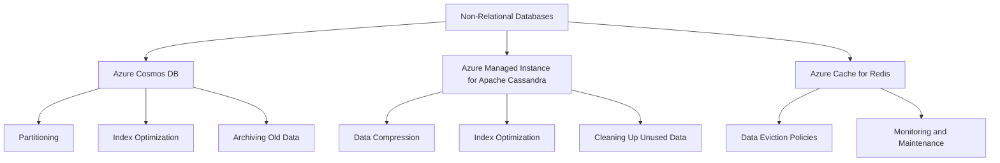

# Optimizing Database Performance by Freeing Up Unused Space 

Costa Rica

[](https://github.com) 
[](https://github.com/)
[brown9804](https://github.com/brown9804)

Last updated: 2025-01-20

----------

> Microsoft offers a variety of database solutions, both relational and non-relational. Quick overview about strategies for managing and reducing their size, ensuring optimal performance and efficient use of storage resources. It's essential to `follow best practices and monitor the operation to avoid potential issues like long-running commands or blocking sessions`.

## Wiki 

<details>
<summary><b>Table of Wiki </b> (Click to expand)</summary>

- [Shrink a database](https://learn.microsoft.com/en-us/sql/relational-databases/databases/shrink-a-database?view=sql-server-ver16)
- [Types of Databases](https://azure.microsoft.com/en-gb/products/category/databases/)
- [Shrink Database Task (Maintenance Plan)](https://learn.microsoft.com/en-us/sql/relational-databases/maintenance-plans/shrink-database-task-maintenance-plan?view=sql-server-ver16)
- [Manage file space for databases in Azure SQL Database](https://learn.microsoft.com/en-us/azure/azure-sql/database/file-space-manage?view=azuresql-db)
- [DBCC SHRINKFILE (Transact-SQL)](https://learn.microsoft.com/en-us/sql/t-sql/database-console-commands/dbcc-shrinkfile-transact-sql?view=sql-server-ver16)

</details>

## Content 

<details>
<summary><b>Table of Content </b> (Click to expand)</summary>

- [Wiki](#wiki)
- [Content](#content)
- [Overview](#overview)
- [Relational Databases](#relational-databases)
    - [Azure SQL Database](#azure-sql-database)
    - [Azure SQL Managed Instance](#azure-sql-managed-instance)
    - [SQL Server on Azure Virtual Machines](#sql-server-on-azure-virtual-machines)
    - [Azure Database for PostgreSQL](#azure-database-for-postgresql)
    - [Azure Database for MySQL](#azure-database-for-mysql)
- [Non-Relational Databases](#non-relational-databases)
    - [Azure Cosmos DB](#azure-cosmos-db)
    - [Azure Managed Instance for Apache Cassandra](#azure-managed-instance-for-apache-cassandra)
    - [Azure Cache for Redis](#azure-cache-for-redis)

</details>

## Overview 

General Strategies for All Databases:

- **Archiving Old Data**: Move old or rarely accessed data to an archive database or storage solution. Reduces the size of the active database, improving performance and manageability. `Use SQL Server's built-in tools or third-party solutions to archive data based on specific criteria (e.g., date, usage).`
- **Data Compression**: Apply data compression techniques to reduce storage space.
- **Partitioning Tables**: Split large tables into smaller, more manageable pieces.
- **Index Optimization**: Regularly rebuild or reorganize indexes to reduce fragmentation.
- **Removing Unused Indexes**: Identify and remove indexes that are not being used.
- **Cleaning Up Unused Data**: Regularly delete or archive unused or obsolete data.
- **Monitoring and Maintenance**: Regularly monitor database size and performance, and perform maintenance tasks.
- **Using Filegroups**: Distribute database objects across multiple filegroups to improve performance and manageability.


> General Tips:

| **Category**             | **Recommendation**                                                                                                                                                                                                 |
|--------------------------|---------------------------------------------------------------------------------------------------------------------------------------------------------------------------------------------------------------------|
| **Regular Maintenance**  | Perform regular database maintenance tasks such as index rebuilding, updating statistics, and cleaning up old data.|
| **Monitoring and Alerts**| Set up monitoring and alerts to notify you when free space falls below your defined thresholds. Use Azure Monitor and SQL Insights for comprehensive monitoring.|
| **Backup and Recovery**  | Ensure you have a robust backup and recovery strategy in place to prevent data loss and minimize downtime.|

## Relational Databases

```mermaid
graph TD
    A[Relational Databases]

    A1[Azure SQL Database]
    A2[Azure SQL Managed Instance]
    A3[SQL Server on Azure Virtual Machines]
    A4[Azure Database for PostgreSQL]
    A5[Azure Database for MySQL]

    A --> A1
    A --> A2
    A --> A3
    A --> A4
    A --> A5

    A1 --> A1_1[Shrinking the Database]
    A1 --> A1_2[Data Compression]
    A1 --> A1_3[Index Optimization]
    A1 --> A1_4[Partitioning Tables]

    A2 --> A2_1[Shrinking the Database]
    A2 --> A2_2[Archiving Old Data]
    A2 --> A2_3[Removing Unused Indexes]
    A2 --> A2_4[Using Filegroups]

    A3 --> A3_1[Cleaning Up Unused Data]
    A3 --> A3_2[Monitoring and Maintenance]
    A3 --> A3_3[Data Compression]

    A4 --> A4_1[Partitioning Tables]
    A4 --> A4_2[Index Optimization]
    A4 --> A4_3[Archiving Old Data]

    A5 --> A5_1[Data Compression]
    A5 --> A5_2[Index Optimization]
    A5 --> A5_3[Cleaning Up Unused Data]
```



### Azure SQL Database

> Click here for additional information on this topic [Azure SQL Database: Freeing Up Unused Space - Overview](https://github.com/MicrosoftCloudEssentials-LearningHub/Demos-ScenariosHub/blob/main/0_Azure/1_AzureData/1_Databases/demos/8_DBFreeingUpUnusedSpace/relational/0_az-sql-db.md) 

### Azure SQL Managed Instance

> Click here for additional information on this topic [Azure SQL Managed Instance: Freeing Up Unused Space - Overview](https://github.com/MicrosoftCloudEssentials-LearningHub/Demos-ScenariosHub/blob/main/0_Azure/1_AzureData/1_Databases/demos/8_DBFreeingUpUnusedSpace/relational/1_az-sql-mi.md) 

### SQL Server on Azure Virtual Machines

> Click here for additional information on this topic [Azure SQL Managed Instance: Freeing Up Unused Space - Overview](https://github.com/MicrosoftCloudEssentials-LearningHub/Demos-ScenariosHub/blob/main/0_Azure/1_AzureData/1_Databases/demos/8_DBFreeingUpUnusedSpace/relational/2_sql-az-vm.md)

### Azure Database for PostgreSQL

> Click here for additional information on this topic [Azure Database for PostgreSQL: Freeing Up Unused Space - Overview](https://github.com/MicrosoftCloudEssentials-LearningHub/Demos-ScenariosHub/blob/main/0_Azure/1_AzureData/1_Databases/demos/8_DBFreeingUpUnusedSpace/relational/3_az-postgreSQL.md)

### Azure Database for MySQL

> Click here for additional information on this topic [Azure Database for MySQL: Freeing Up Unused Space - Overview](https://github.com/MicrosoftCloudEssentials-LearningHub/Demos-ScenariosHub/blob/main/0_Azure/1_AzureData/1_Databases/demos/8_DBFreeingUpUnusedSpace/relational/4_az-db-mysql.md)

## Non-Relational Databases


### Azure Cosmos DB

> Click here for additional information on this topic [Azure Cosmos DB: Freeing Up Unused Space - Overview](https://github.com/MicrosoftCloudEssentials-LearningHub/Demos-ScenariosHub/blob/main/0_Azure/1_AzureData/1_Databases/demos/8_DBFreeingUpUnusedSpace/non-relational/0_az-cosmosdb.md)


### Azure Managed Instance for Apache Cassandra

A managed instance of Apache Cassandra.

> **Strategies**:

- **Data Compression**: Use Cassandra's compression features. Enable compression on tables:
  ```sql
  CREATE TABLE my_table (id UUID PRIMARY KEY, data TEXT) WITH compression = {'class': 'LZ4Compressor'};
  ```
- **Index Optimization**: Regularly rebuild or reorganize indexes. Rebuild indexes periodically:
  ```sql
  REBUILD INDEX my_index;
  ```
- **Cleaning Up Unused Data**: Regularly delete or archive obsolete data. Use TTL (Time to Live) to automatically delete old data.
  ```sql
  CREATE TABLE my_table (id UUID PRIMARY KEY, data TEXT) WITH default_time_to_live = 86400;
  ```

The value 86400 in the context of the default_time_to_live setting for Apache Cassandra represents the Time to Live (TTL) for data in seconds. Specifically, 86400 seconds is equivalent to 24 hours (1 day). This means that any data inserted into the table will automatically be deleted after 24 hours.

  ```
  86400 seconds = 24 hours = 1 day
  ```

  > So, when you set default_time_to_live = 86400, it ensures that data in the table will expire and be removed after one day. If you want to set a different TTL, you can adjust this value accordingly. For example:
  
  ```
  3600 seconds = 1 hour
  604800 seconds = 7 days (1 week)
  ```

### Azure Cache for Redis

An in-memory data store for caching and real-time analytics.

> **Strategies**:

- **Data Eviction Policies**: Use eviction policies to manage memory usage. Configure eviction policies in Redis configuration:
 ```
 maxmemory-policy allkeys-lru
 ```
- **Monitoring and Maintenance**: Regularly monitor and maintain cache performance. Use Azure Monitor to set up alerts and monitor performance metrics. Example:
 ```
 az monitor metrics alert create --name "HighMemoryUsage" --resource-group "MyResourceGroup" --scopes "/subscriptions/{subscription-id}/resourceGroups/{resource-group}/providers/Microsoft.Cache/Redis/{cache-name}" --condition "avg memory_usage_percentage > 80" --description "Alert when memory usage exceeds 80%"
 ```

<div align="center">
  <h3 style="color: #4CAF50;">Total Visitors</h3>
  
</div>

