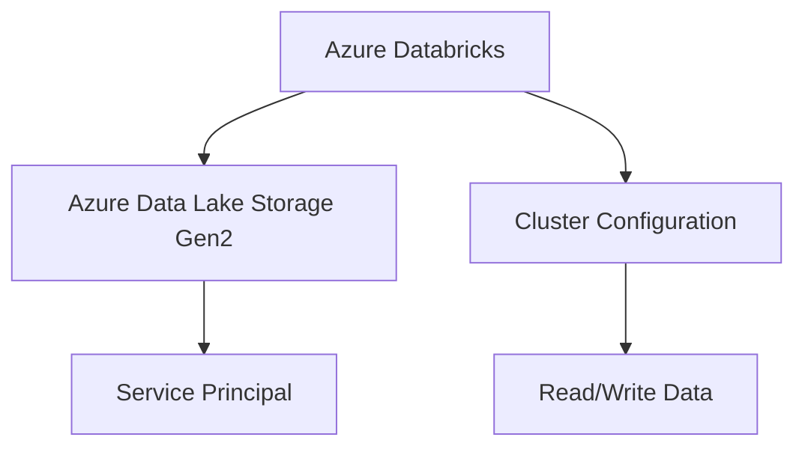

# Connecting to Azure Data Lake Storage 

Costa Rica

[](https://github.com/)
[brown9804](https://github.com/brown9804)

Last updated: 2024-11-15

----------

<div align="center">
  <h3 style="color: #4CAF50;">Total Visitors</h3>
  
</div>



1. **Create an Azure Data Lake Storage Gen2 Account**
   - Go to the Azure portal.
   - Create a new storage account and select the "Data Lake Storage Gen2" option.
   - Configure the storage account settings as needed.

2. **Set Up Azure Databricks**
   - Create an Azure Databricks workspace if you don't already have one.
   - Set up a cluster within your Databricks workspace.

3. **Configure Access to ADLS Gen2**
You can configure access using either a service principal or an access key. Here, we'll use a service principal for better security.
- **Create a Service Principal**:
   - Go to the Azure portal and navigate to "Azure Entra ID".
   - Create a new app registration and note down the Application (client) ID and Directory (tenant) ID.
   - Create a client secret for the app registration and note it down.
- **Assign Roles to the Service Principal**:
   - Navigate to your ADLS Gen2 account.
   - Go to "Access control (IAM)" and add a role assignment.
   - Assign the "Storage Blob Data Contributor" role to the service principal.
- **Configure Databricks to Use the Service Principal**:
   - In your Databricks workspace, go to the cluster configuration.
   - Under the "Advanced Options" tab, add the following Spark configuration:

```plaintext
spark.hadoop.fs.azure.account.auth.type.<storage-account-name>.dfs.core.windows.net OAuth
spark.hadoop.fs.azure.account.oauth.provider.type.<storage-account-name>.dfs.core.windows.net org.apache.hadoop.fs.azurebfs.oauth2.ClientCredsTokenProvider
spark.hadoop.fs.azure.account.oauth2.client.id.<storage-account-name>.dfs.core.windows.net <application-id>
spark.hadoop.fs.azure.account.oauth2.client.secret.<storage-account-name>.dfs.core.windows.net <client-secret>
spark.hadoop.fs.azure.account.oauth2.client.endpoint.<storage-account-name>.dfs.core.windows.net https://login.microsoftonline.com/<directory-id>/oauth2/token
```

4. **Access Data in ADLS Gen2 from Databricks**
Now you can read and write data to ADLS Gen2 from your Databricks notebooks.

**Example Code to Read Data:**

```python
# Configuration for ADLS Gen2
storage_account_name = "your_storage_account_name"
container_name = "your_container_name"
file_path = "your_file_path"

# Read data from ADLS Gen2
df = spark.read.format("csv").option("header", "true").load(f"abfss://{container_name}@{storage_account_name}.dfs.core.windows.net/{file_path}")
df.show()
```

**Example Code to Write Data:**

```python
# Write data to ADLS Gen2
output_path = f"abfss://{container_name}@{storage_account_name}.dfs.core.windows.net/output_folder"
df.write.format("csv").save(output_path)
```
