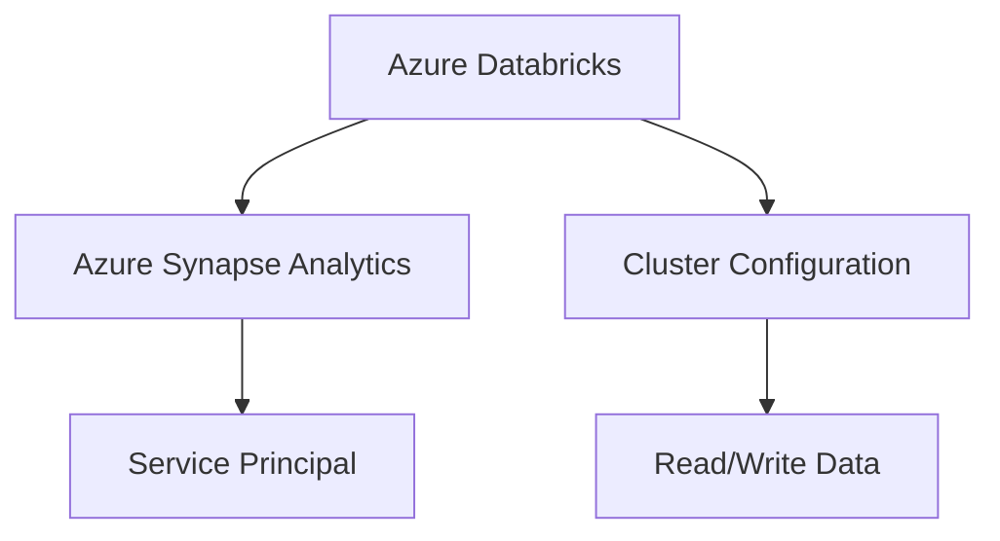

# Connecting to Azure Synapse Analytics

Costa Rica

[](https://github.com/)
[brown9804](https://github.com/brown9804)

Last updated: 2024-11-15

----------

<div align="center">
  <h3 style="color: #4CAF50;">Total Visitors</h3>
  
</div>




1. **Set Up Azure Synapse Analytics:** Create an Azure Synapse Workspace
   - Go to the Azure portal and create a new Synapse workspace.
   - Configure the necessary settings and create a dedicated SQL pool if needed.

2. **Set Up Azure Databricks:** Create an Azure Databricks Workspace
   - If you don't already have one, create a new Databricks workspace in the Azure portal.
   - Set up a cluster within your Databricks workspace.

3. **Configure Access to Azure Synapse Analytics**
You can configure access using a service principal or managed identity. Find below an example using a service principal for better security.
- **Create a Service Principal**:
   - Go to the Azure portal and navigate to "Azure Entra ID".
   - Create a new app registration and note down the Application (client) ID and Directory (tenant) ID.
   - Create a client secret for the app registration and note it down.
- **Assign Roles to the Service Principal**:
   - Navigate to your Synapse workspace.
   - Go to "Access control (IAM)" and add a role assignment.
   - Assign the "Synapse Contributor" role to the service principal.

4. Configure Databricks to Use the Service Principal**
- **Install the Synapse Connector**: You can install the Synapse connector using Maven coordinates in the cluster configuration.
```plaintext
com.microsoft.azure:spark-mssql-connector_2.12:1.2.0
```
- **Configure the Connection**: Use the following code snippet in a Databricks notebook to configure the connection to Synapse.

```python
# Configuration for Synapse
synapse_jdbc_url = "jdbc:sqlserver://<synapse_workspace>.sql.azuresynapse.net:1433;database=<database_name>;user=<username>@<synapse_workspace>;password=<password>;encrypt=true;trustServerCertificate=false;hostNameInCertificate=*.sql.azuresynapse.net;loginTimeout=30;"

# Read data from Synapse
df = spark.read.format("com.microsoft.sqlserver.jdbc.spark") \
    .option("url", synapse_jdbc_url) \
    .option("dbtable", "your_table_name") \
    .load()

df.show()
```

5. Access Data in Synapse from Databricks: Now you can read and write data to Azure Synapse Analytics from your Databricks notebooks.

**Example Code to Write Data:**

```python
# Write data to Synapse
df.write.format("com.microsoft.sqlserver.jdbc.spark") \
    .option("url", synapse_jdbc_url) \
    .option("dbtable", "your_table_name") \
    .mode("overwrite") \
    .save()
```
