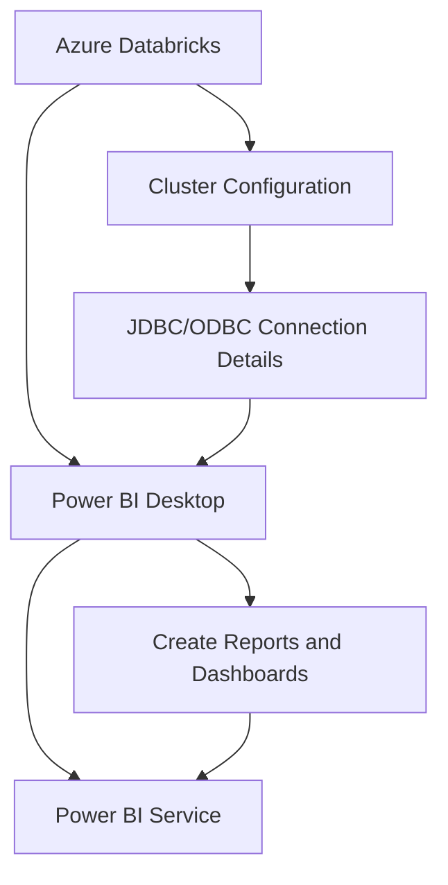

# Connecting to Azure Power BI

Costa Rica

[brown9804](https://github.com/brown9804)

Last updated: 2024-11-15

----------

  <h3 style="color: #4CAF50;">Total Visitors</h3>
  

> By integrating Azure Databricks with Power BI, you can harness Databricks' robust data processing capabilities alongside Power BI's dynamic visualization tools. Find below some guide:

1. **Set Up Azure Databricks**: Create an Azure Databricks Workspace
    - If you don't already have one, create a new Databricks workspace in the Azure portal.
    - Set up a cluster within your Databricks workspace.

2. **Configure Databricks Cluster**: Get the JDBC/ODBC Connection Details
    - Go to your Databricks workspace.
    - Navigate to your cluster and click on the "Advanced Options" tab.
    - Copy the **Server Hostname** and **HTTP Path** from the JDBC/ODBC section.

3. **Set Up Power BI**
    - **Open Power BI Desktop**:
       - Launch Power BI Desktop on your computer.
       - Click on "Get Data" in the toolbar and select "More...".
       - Search for "Azure Databricks" and select it.
    - **Connect to Azure Databricks**:
       - In the connection window, paste the **Server Hostname** and **HTTP Path** you copied earlier.
       - For authentication, select "Azure Active Directory" and sign in with your Azure credentials.
    - **Load Data**:
       - After connecting, you can browse the Databricks tables and views.
       - Select the tables you want to import and load them into Power BI.

4. **Create Reports and Dashboards**
    - **Build Visualizations**:
       - Use the imported data to create interactive reports and dashboards in Power BI.
       - You can use various visualization tools to analyze and present your data.
    
    - **Publish to Power BI Service**:
       - Once your report is ready, you can publish it to the Power BI Service.
       - This allows you to share your reports and dashboards with others in your organization.
