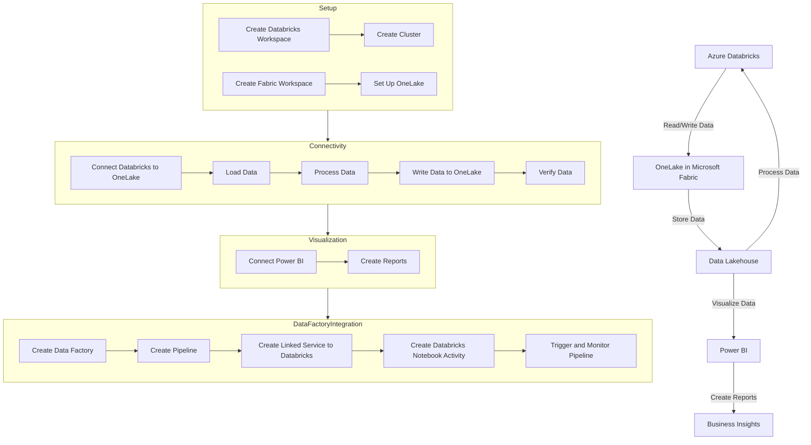

# Connecting to Azure Data Factory

Costa Rica

[brown9804](https://github.com/brown9804)

Last updated: 2024-11-15

----------

  <h3 style="color: #4CAF50;">Total Visitors</h3>
  

1. Create an Azure Databricks Workspace
    - **Go to the Azure Portal**: Navigate to the Azure portal and create a new Databricks workspace.
    - **Create a Cluster**: In the Databricks workspace, create a new cluster. Ensure that you enable Azure Data Lake Storage (ADLS) credential passthrough in the advanced options for authentication.

2. Create an Azure Data Factory
    - **Go to the Azure Portal**: Navigate to the Azure portal and create a new Data Factory.
    - **Create a Pipeline**: In the Data Factory, create a new pipeline.

3. Create a Linked Service to Azure Databricks
    - **Navigate to Manage Tab**: In Azure Data Factory, switch to the Manage tab on the left panel.
    - **Create Linked Service**: Select Linked services under Connections, and then select + New.
    - **Select Azure Databricks**: In the New linked service window, select Compute > Azure Databricks, and then select Continue.
    - **Configure Linked Service**: Complete the required fields:
    - **Name**: Enter a name for the linked service.
    - **Cluster URL**: Enter the URL of your Databricks cluster.
    - **Access Token**: Enter the access token for your Databricks workspace.
    - **Select Cluster**: Choose the cluster you created earlier.
    **Test Connection**: Click on Test connection to ensure the settings are correct, then click Create.

4. Create a Databricks Notebook Activity in the Pipeline
    - **Add Activity**: In the pipeline, add a new Databricks Notebook activity.
    - **Configure Activity**: Set up the activity by selecting the linked service you created earlier.
    - **Select Notebook**: Choose the notebook you want to run in Databricks.
    - **Set Parameters**: If needed, set any parameters required by the notebook.

5. Trigger and Monitor the Pipeline
    - **Trigger Pipeline**: Set up a trigger to run the pipeline manually or on a schedule.
    - **Monitor Pipeline**: Use the Monitor tab in Azure Data Factory to monitor the pipeline execution and check for any errors.

