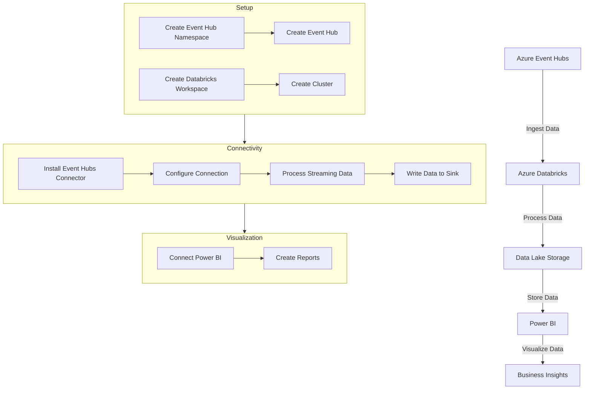

# Connecting to Azure Event Hubs

Costa Rica

[](https://github.com/)
[brown9804](https://github.com/brown9804)

Last updated: 2024-11-15

----------

<div align="center">
  <h3 style="color: #4CAF50;">Total Visitors</h3>
  
</div>



1. Set Up Azure Event Hubs
   - **Create an Event Hub Namespace**: Go to the Azure portal and create a new Event Hub namespace.
   - **Create an Event Hub**: Within the namespace, create an Event Hub to ingest your streaming data.
2. Set Up Azure Databricks
   - **Create a Databricks Workspace**: Go to the Azure portal and create a new Databricks workspace.
   - **Create a Cluster**: In the Databricks workspace, create a new cluster.
3. Install the Azure Event Hubs Connector
   - **Add Maven Library**: In your Databricks workspace, go to the cluster configuration and add the Maven library `com.microsoft.azure:azure-eventhubs-spark_2.11:2.3.17` (or the latest version).
4. Configure the Connection
   - **Get Connection String**: Obtain the connection string for your Event Hub from the Azure portal.
   - **Set Up Connection in Databricks**: Use the connection string to configure the connection in your Databricks notebook.

      ```python
      from pyspark.sql import SparkSession
      from pyspark.sql.functions import *
      from pyspark.sql.types import *

      connectionString = "Endpoint=sb://<namespace>.servicebus.windows.net/;SharedAccessKeyName=<key-name>;SharedAccessKey=<key>;EntityPath=<eventhub-name>"

      ehConf = {
         'eventhubs.connectionString': connectionString
      }

      spark = SparkSession.builder.appName("EventHubExample").getOrCreate()

      df = spark.readStream.format("eventhubs").options(**ehConf).load()
      ```

5. Process Streaming Data
   - **Define Schema**: Define the schema for the incoming data.

      ```python
      schema = StructType([
         StructField("body", BinaryType())
      ])
      ```

   - **Deserialize Data**: Deserialize the binary data into a readable format.

      ```python
      df = df.selectExpr("CAST(body AS STRING) as message")
      ```

   - **Process Data**: Apply any necessary transformations or processing to the data.

      ```python
      processedDF = df.withColumn("processed_message", upper(col("message")))
      ```

6. Write Data to a Sink: 
   **Write to Storage**: Write the processed data to a storage location, such as Azure Data Lake Storage or a database.

      ```python
      query = processedDF.writeStream.outputMode("append").format("parquet").option("path", "/mnt/datalake/processed_data").option("checkpointLocation", "/mnt/datalake/checkpoints").start()
      query.awaitTermination()
      ```
