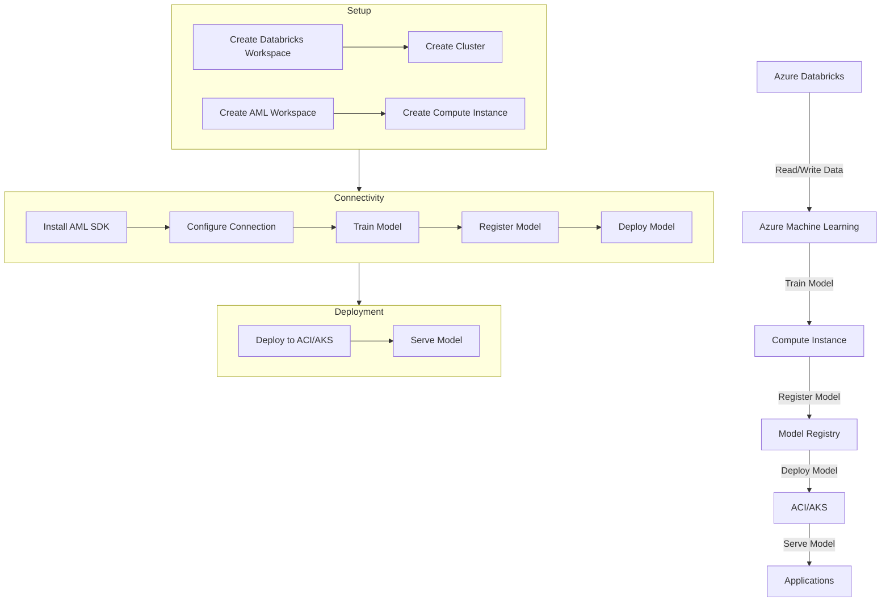

# Connecting to Azure Machine Learning 

Costa Rica

[](https://github.com/)
[brown9804](https://github.com/brown9804)

Last updated: 2024-11-15

----------

<div align="center">
  <h3 style="color: #4CAF50;">Total Visitors</h3>
  
</div>

1. Set Up Azure Databricks
   - **Create a Databricks Workspace**: Go to the Azure portal and create a new Databricks workspace.
   - **Create a Cluster**: In the Databricks workspace, create a new cluster.

2. Set Up Azure Machine Learning
   - **Create an Azure Machine Learning Workspace**: Go to the Azure portal and create a new Azure Machine Learning workspace.
   - **Create a Compute Instance**: In the Azure Machine Learning workspace, create a compute instance for running your experiments.

3. Install the Azure Machine Learning SDK in Databricks
   - **Add Maven Library**: In your Databricks workspace, go to the cluster configuration and add the Maven library `azureml-sdk[databricks]` from PyPi.

4. Configure the Connection
   - **Get Workspace Details**: Obtain the workspace ID, resource group, and subscription ID for your Azure Machine Learning workspace.
   - **Set Up Connection in Databricks**: Use the Azure Machine Learning SDK to configure the connection in your Databricks notebook.

      ```python
      from azureml.core import Workspace
      from azureml.core.authentication import ServicePrincipalAuthentication

      svc_pr = ServicePrincipalAuthentication(
         tenant_id="<tenant-id>",
         service_principal_id="<client-id>",
         service_principal_password="<client-secret>"
      )

      ws = Workspace.get(
         name="<workspace-name>",
         subscription_id="<subscription-id>",
         resource_group="<resource-group>",
         auth=svc_pr
      )
      ```

5. Train a Model
   - **Load Data**: Load your data into a DataFrame in Databricks.

      ```python
      dataDF = spark.read.format("csv").option("header", "true").option("inferSchema", "true").load("path_to_your_data.csv")
      ```

   - **Train Model**: Use Spark MLlib or any other machine learning library to train your model.

      ```python
      from pyspark.ml.classification import LogisticRegression

      lr = LogisticRegression(featuresCol='features', labelCol='label')
      model = lr.fit(dataDF)
      ```

6. Register the Model in Azure Machine Learning: Register the trained model in Azure Machine Learning.

   ```python
   from azureml.core.model import Model

   model_path = "path_to_your_model"
   model = Model.register(workspace=ws, model_path=model_path, model_name="my_model")
   ```

7. Deploy the Model to ACI/AKS: Deploy the registered model to Azure Container Instances (ACI) or Azure Kubernetes Service (AKS).

   ```python
   from azureml.core.webservice import AciWebservice, Webservice
   from azureml.core.model import InferenceConfig

   inference_config = InferenceConfig(entry_script="score.py", environment=myenv)
   deployment_config = AciWebservice.deploy_configuration(cpu_cores=1, memory_gb=1)

   service = Model.deploy(workspace=ws, name="my-service", models=[model], inference_config=inference_config, deployment_config=deployment_config)
   service.wait_for_deployment(show_output=True)
   ```



