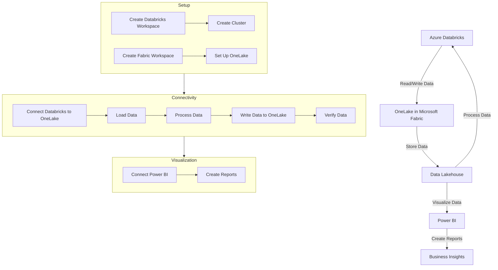

# Connecting to Azure Fabric

Costa Rica

[](https://github.com/)
[brown9804](https://github.com/brown9804)

Last updated: 2024-11-15

----------

<div align="center">
  <h3 style="color: #4CAF50;">Total Visitors</h3>
  
</div>

## Wiki
- [Using Azure Databricks with Microsoft Fabric and OneLake](https://blog.fabric.microsoft.com/en-us/blog/using-azure-databricks-with-microsoft-fabric-and-onelake?ft=All:)


- [Modern Analytics with Microsoft Fabric and Azure Databricks](https://microsoft.github.io/TechBoost-Fabric-with-Databricks-for-Data-Analytics/)


- [Integrating Microsoft Fabric with Azure Databricks Delta Tables](https://techcommunity.microsoft.com/t5/fasttrack-for-azure/integrating-microsoft-fabric-with-azure-databricks-delta-tables/ba-p/3916332)
  


- [Unlock real-time insights with AI-powered analytics in Microsoft Fabric](https://www.microsoft.com/en-us/microsoft-fabric/blog/2024/05/21/unlock-real-time-insights-with-ai-powered-analytics-in-microsoft-fabric/?msockid=3503e0f1146666d41e52f49515ff6798)

- [Microsoft Fabric with Azure Databricks for Data Analytics](https://microsoft.github.io/TechExcel-Fabric-with-Databricks-for-Data-Analytics/)


## How to Integrate Microsoft Fabric with Azure Databricks



1. Set Up Azure Databricks
   - **Create a Databricks Workspace**: Go to the Azure portal and create a new Databricks workspace.
   - **Create a Cluster**: In the Databricks workspace, create a new cluster. Ensure that you enable Azure Data Lake Storage (ADLS) credential passthrough in the advanced options for authentication.

2. Configure Microsoft Fabric
   - **Create a Fabric Workspace**: Set up a workspace in Microsoft Fabric.
   - **Set Up OneLake**: Ensure OneLake is configured as your unified data lake within Microsoft Fabric.

3. Establish Connectivity
   - **Connect Databricks to OneLake**:
      - Open a notebook in your Databricks workspace.
      - Copy the Azure Blob Filesystem (ABFS) path from your Fabric lakehouse properties.
      - Use this path in your Databricks notebook to read and write data.

      ```python
      oneLakePath = 'abfss://myWorkspace@onelake.dfs.fabric.microsoft.com/myLakehouse.lakehouse/Files/'
      ```

   - **Load Data**: Load data from your existing data sources into a DataFrame in Databricks.

      ```python
      dataDF = spark.read.format("csv").option("header", "true").option("inferSchema", "true").load("path_to_your_data.csv")
      ```

   - **Process Data**: Filter, transform, or prepare your data as needed.

      ```python
      processedDF = dataDF.filter(dataDF['column_name'] < value)
      ```

   - **Write Data to OneLake**: Write the processed data back to your Fabric lakehouse.

      ```python
      processedDF.write.format("csv").option("header", "true").mode("overwrite").csv(oneLakePath)
      ```

   - **Verify Data**: Read the data back from OneLake to ensure it was written correctly.

      ```python
      lakehouseRead = spark.read.format('csv').option("header", "true").load(oneLakePath)
      display(lakehouseRead.limit(10))
      ```

4. Visualize Data in Power BI
   - **Connect Power BI**: 
      - Use Power BI in Microsoft Fabric to connect directly to your OneLake data.
   - **Create Reports**: 
      - Build and share reports based on the data processed in Azure Databricks.
