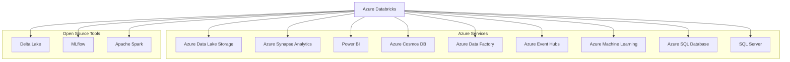

# Integration and Compatibility

Costa Rica

[brown9804](https://github.com/brown9804)

Last updated: 2024-11-15

----------

  <h3 style="color: #4CAF50;">Total Visitors</h3>
  

## Wiki

- [Connect to data sources from Azure Databricks](https://learn.microsoft.com/en-us/azure/databricks/scenarios/databricks-connect-to-data-sources)

## Integration with Azure Services

Azure Databricks can integrate with several other Azure services, enhancing its capabilities for data processing, analytics, and machine learning.

| **Azure Service**              | **Integration Description**                                                                 |
|--------------------------------|--------------------------------------------------------------------------------------------|
| **Azure Data Lake Storage**    | Provides scalable storage for big data analytics. Azure Databricks can read and write data directly to Azure Data Lake Storage, enabling efficient data processing and storage. [Click here to understand more about how to connect](/0_Azure/1_AzureData/2_Databricks/0_Connections/0_ADLS)|
| **Azure Synapse Analytics**    | Integrates with Azure Synapse to enable advanced analytics and data warehousing solutions. This allows for seamless data movement and transformation between Databricks and Synapse. [Click here to understand more about how to connect](/0_Azure/1_AzureData/2_Databricks/0_Connections/1_Synapse)|
| **Power BI**                   | Connects with Power BI for real-time data visualization and business intelligence. Users can create interactive dashboards and reports based on data processed in Azure Databricks. [Click here to understand more about how to connect](/0_Azure/1_AzureData/2_Databricks/0_Connections/2_PowerBI) |
| **Azure Cosmos DB**            | Allows for globally distributed, multi-model database integration. Azure Databricks can read from and write to Cosmos DB, enabling efficient data processing and analytics. [Click here to understand more about how to connect](/0_Azure/1_AzureData/2_Databricks/0_Connections/3_CosmosDB)|
| **Azure Data Factory**         | Orchestrates data workflows and integrates with Azure Databricks for data movement and transformation. [Click here to understand more about how to connect](/0_Azure/1_AzureData/2_Databricks/0_Connections/4_DataFactory)|
| **Azure Event Hubs**           | Ingests streaming data for real-time analytics and processing in Azure Databricks. [Click here to understand more about how to connect](/0_Azure/1_AzureData/2_Databricks/0_Connections/5_EventHubs)|
| **Azure Machine Learning**     | Integrates with Azure Databricks for building, training, and deploying machine learning models.  [Click here to understand more about how to connect](/0_Azure/1_AzureData/2_Databricks/0_Connections/6_AzureML) |
| **Azure SQL Database**         | Connects to Azure SQL Database for reading and writing data using JDBC or SQL connectors. [Click here to understand more about how to connect](/0_Azure/1_AzureData/2_Databricks/0_Connections/7_SQL-DBs)    |
| **SQL Server**                 | Connects to SQL Server for data processing and analytics using JDBC or SQL connectors. [Click here to understand more about how to connect](/0_Azure/1_AzureData/2_Databricks/0_Connections/7_SQL-DBs)    |
| **Microsoft Fabric**           | Integrates with Azure Databricks to provide a unified analytics platform. This allows for seamless data processing, AI model building, and insights discovery using OneLake as the unified data lake. [Click here to understand more about how to connect](/0_Azure/1_AzureData/2_Databricks/0_Connections/8_Fabric) |

## Open Source Tools 

> Support for open-source tools and frameworks such as Delta Lake, MLflow, and Apache Spark.

#### Apache Spark

> Azure Databricks service launches and manages Apache Spark clusters within your Azure subscription
