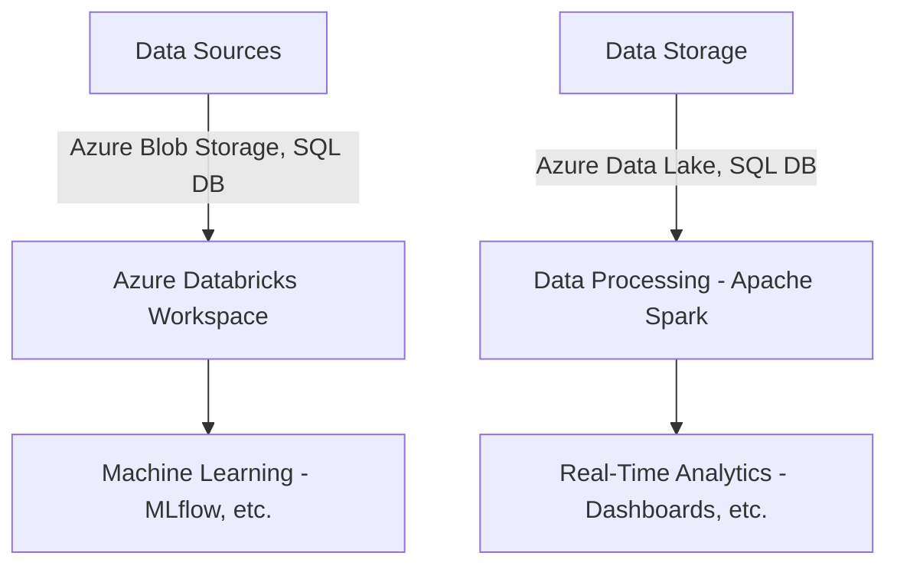
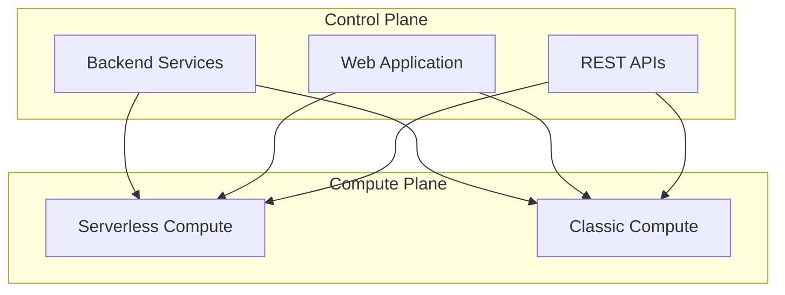

# Azure Databricks

Costa Rica

[brown9804](https://github.com/brown9804)

Last updated: 2024-07-30

----------

## Introduction to Azure Databricks

> Azure Databricks is a comprehensive analytics platform for big data and AI, built on Apache Spark. It offers a collaborative workspace for data engineers, scientists, and analysts to engage in data processing, machine learning, and real-time analytics.

<figure>

<figcaption>   From https://www.databricks.com/product/azure </figcaption>
</figure>

| Aspect | Details |
| ----- | ---- | 
| Pricing tier | - **Standard**: Includes core Apache Spark features and Microsoft Entra integration.   - **Premium**: Offers role-based access controls and advanced enterprise features.    - **Trial**: Provides a 14-day free trial of our premium workspace. | 

### **Key Features**
Here are some of the key features of Azure Databricks:

| **Feature**            | **Description**                                                                 |
|------------------------|---------------------------------------------------------------------------------|
| **Data Processing**    | Efficiently process large volumes of data using Apache Spark.                   |
| **Machine Learning**   | Build, train, and deploy machine learning models at scale.                      |
| **Real-Time Analytics**| Perform real-time data analysis and generate insights quickly.                  |
| **Collaborative Workspace** | Provides a collaborative environment for different roles to work together. |
| **Scalability**        | Automatically scales resources to handle varying workloads.                     |
| **Integration**        | Seamlessly integrates with other Azure services and open-source tools.          |

This diagram shows how Azure Databricks integrates with various data sources and storage solutions, processes data using Apache Spark, and supports machine learning and real-time analytics.

## Architecture and Components

Azure Databricks architecture is divided into two main components: 

| **Component**            | **Description**                                                                 |
|--------------------------|---------------------------------------------------------------------------------|
| **Control Plane**        | Manages backend services, authentication, job scheduling, and cluster management. Hosts the web application and REST APIs. |
| **Compute Plane**        | Where data processing happens, consisting of clusters running Apache Spark jobs. |

There are two types of compute planes:

| **Type of Compute Plane**            | **Description**                                                                 |
|--------------------------|---------------------------------------------------------------------------------|
| **Serverless Compute**   | Managed by Azure Databricks, with automatic scaling and resource management. Ideal for users preferring a hands-off approach. |
| **Classic Compute**      | Managed by the user, with full control over compute resources within their Azure subscription. Allows for more customization and manual scaling. |

This diagram below shows how the control plane interacts with both the serverless and classic compute planes.

## Wiki 
- [What is Azure Databricks?](https://learn.microsoft.com/en-us/azure/databricks/introduction/)
- [Tutorial: Implement Azure Databricks with an Azure Cosmos DB endpoint](https://learn.microsoft.com/en-us/azure/databricks/scenarios/service-endpoint-cosmosdb)
- [Query databases using JDBC](https://learn.microsoft.com/en-us/azure/databricks/connect/external-systems/jdbc)
- [Query SQL Server with Azure Databricks](https://learn.microsoft.com/en-us/azure/databricks/connect/external-systems/sql-server)
- [How to connect from Azure Databricks to Azure SQL DB using service](https://stackoverflow.com/collectives/azure/articles/75189853/how-to-connect-from-azure-databricks-to-azure-sql-db-using-service-principal)
- [Azure DataBricks To Connect SQL DataBase with Pyspark](https://stackoverflow.com/questions/76820391/azure-databricks-to-connect-sql-database-with-pyspark)
- [Use a SQL connector, driver, or API](https://learn.microsoft.com/en-us/azure/databricks/dev-tools/index-driver)
- [Connect to azure sql database from databricks](https://community.databricks.com/t5/data-engineering/connect-to-azure-sql-database-from-databricks-using-service/td-p/36174)
- [Query data in Azure Synapse Analytics](https://learn.microsoft.com/en-us/azure/databricks/connect/external-systems/synapse-analytics)
- [Connection from databricks to azure synapse](https://stackoverflow.com/questions/72873898/connection-from-databricks-to-azure-synapse)
  
## Recommended Trainings
- [Explore Azure Databricks](https://learn.microsoft.com/en-us/training/modules/explore-azure-databricks/)
- [Perform data analysis with Azure Databricks](https://learn.microsoft.com/en-us/training/modules/perform-data-analysis-azure-databricks/)
- [Use Apache Spark in Azure Databricks](https://learn.microsoft.com/en-us/training/modules/use-apache-spark-azure-databricks/)
