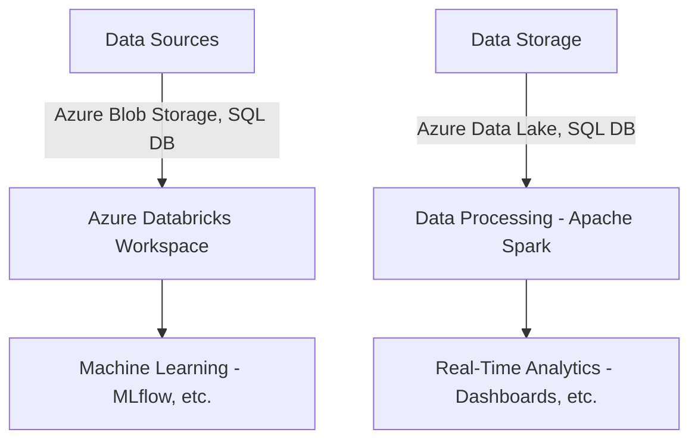
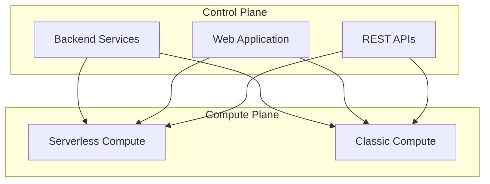
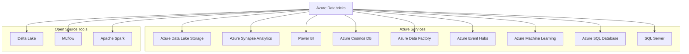

# Azure Databricks

Costa Rica

[](https://github.com/)
[brown9804](https://github.com/brown9804)

Last updated: 2024-07-30

----------

## Introduction to Azure Databricks

> Azure Databricks is a comprehensive analytics platform for big data and AI, built on Apache Spark. It offers a collaborative workspace for data engineers, scientists, and analysts to engage in data processing, machine learning, and real-time analytics.

<figure>

<figcaption> <br/> From https://www.databricks.com/product/azure </figcaption>
</figure>

| Aspect | Details |
| ----- | ---- | 
| Pricing tier | - **Standard**: Includes core Apache Spark features and Microsoft Entra integration. <br/> - **Premium**: Offers role-based access controls and advanced enterprise features. <br/>  - **Trial**: Provides a 14-day free trial of our premium workspace. | 


### **Key Features**
Here are some of the key features of Azure Databricks:

| **Feature**            | **Description**                                                                 |
|------------------------|---------------------------------------------------------------------------------|
| **Data Processing**    | Efficiently process large volumes of data using Apache Spark.                   |
| **Machine Learning**   | Build, train, and deploy machine learning models at scale.                      |
| **Real-Time Analytics**| Perform real-time data analysis and generate insights quickly.                  |
| **Collaborative Workspace** | Provides a collaborative environment for different roles to work together. |
| **Scalability**        | Automatically scales resources to handle varying workloads.                     |
| **Integration**        | Seamlessly integrates with other Azure services and open-source tools.          |

This diagram shows how Azure Databricks integrates with various data sources and storage solutions, processes data using Apache Spark, and supports machine learning and real-time analytics.



## Architecture and Components

Azure Databricks architecture is divided into two main components: 

| **Component**            | **Description**                                                                 |
|--------------------------|---------------------------------------------------------------------------------|
| **Control Plane**        | Manages backend services, authentication, job scheduling, and cluster management. Hosts the web application and REST APIs. |
| **Compute Plane**        | Where data processing happens, consisting of clusters running Apache Spark jobs. |

There are two types of compute planes:

| **Type of Compute Plane**            | **Description**                                                                 |
|--------------------------|---------------------------------------------------------------------------------|
| **Serverless Compute**   | Managed by Azure Databricks, with automatic scaling and resource management. Ideal for users preferring a hands-off approach. |
| **Classic Compute**      | Managed by the user, with full control over compute resources within their Azure subscription. Allows for more customization and manual scaling. |

This diagram below shows how the control plane interacts with both the serverless and classic compute planes.



## Integration and Compatibility

Azure Databricks can integrate with several other Azure services, enhancing its capabilities for data processing, analytics, and machine learning.



| **Azure Service**              | **Integration Description**                                                                 |
|--------------------------------|--------------------------------------------------------------------------------------------|
| **Azure Data Lake Storage**    | Provides scalable storage for big data analytics. Azure Databricks can read and write data directly to Azure Data Lake Storage, enabling efficient data processing and storage. [Click here to understand more about how to connect](/0_Azure/1_AzureData/2_Databricks/0_Connections/0_ADLS)|
| **Azure Synapse Analytics**    | Integrates with Azure Synapse to enable advanced analytics and data warehousing solutions. This allows for seamless data movement and transformation between Databricks and Synapse. [Click here to understand more about how to connect](/0_Azure/1_AzureData/2_Databricks/0_Connections/1_Synapse)|
| **Power BI**                   | Connects with Power BI for real-time data visualization and business intelligence. Users can create interactive dashboards and reports based on data processed in Azure Databricks. |
| **Azure Cosmos DB**        | Allows for globally distributed, multi-model database integration. Azure Databricks can read from and write to Cosmos DB, enabling efficient data processing and analytics. [Click here to understand more about how to connect](#connecting-to-azure-cosmos-db)|
| **Azure Data Factory**         | Orchestrates data workflows and integrates with Azure Databricks for data movement and transformation. |
| **Azure Event Hubs**           | Ingests streaming data for real-time analytics and processing in Azure Databricks. |
| **Azure Machine Learning**     | Integrates with Azure Databricks for building, training, and deploying machine learning models. |
| **Azure SQL Database**    | Connects to Azure SQL Database for reading and writing data using JDBC or SQL connectors. [Click here to understand more about how to connect](#connecting-to-sql-databases)    |
| **SQL Server**               | Connects to SQL Server for data processing and analytics using JDBC or SQL connectors. [Click here to understand more about how to connect](#connecting-to-sql-databases)    |


### Connecting to Azure Cosmos DB

For example:
```mermaid
graph TD
    A[Azure Databricks] --> B[Azure Cosmos DB]
    B --> C[Data Processing - Apache Spark]
    B --> D[Machine Learning - MLflow, etc.]
    B --> E[Real-Time Analytics - Dashboards, etc.]
````
1. Ensure you have Cosmos DB and Databricks with the cluster set up.
2.  Install the Cosmos DB Spark Connector:
     - Download the latest `azure-cosmosdb-spark` library.
     - Upload the JAR file to your Databricks workspace.
     - Install the library on your Databricks cluster.
3. Configure the Connection: Use the following code snippet in a Databricks notebook to configure the connection to Cosmos DB.
   
   > This setup allows you to read from and write to Azure Cosmos DB directly from your Databricks environment, enabling efficient data processing and analytics.

```python
   # Configuration for Cosmos DB
cosmos_endpoint = "your_cosmos_db_endpoint"
cosmos_master_key = "your_cosmos_db_master_key"
cosmos_database_name = "your_database_name"
cosmos_container_name = "your_container_name"

# Read data from Cosmos DB
cosmos_config = {
    "Endpoint": cosmos_endpoint,
    "Masterkey": cosmos_master_key,
    "Database": cosmos_database_name,
    "Collection": cosmos_container_name,
    "Upsert": "true"
}

df = spark.read.format("com.microsoft.azure.cosmosdb.spark").options(**cosmos_config).load()
df.show()
```
### **Connecting to SQL Databases**

You can connect to SQL databases using JDBC or SQL connectors. Here are the steps for both methods:

#### **Using JDBC**

1. **Configure the Connection**:
   - Use the following code snippet in a Databricks notebook to configure the connection to SQL Server or Azure SQL Database:

```python
# Configuration for SQL Database
jdbcHostname = "your_sql_server_hostname"
jdbcPort = 1433
jdbcDatabase = "your_database_name"
jdbcUsername = "your_username"
jdbcPassword = "your_password"

jdbcUrl = f"jdbc:sqlserver://{jdbcHostname}:{jdbcPort};database={jdbcDatabase}"

# Read data from SQL Database
df = spark.read.format("jdbc") \
    .option("url", jdbcUrl) \
    .option("dbtable", "your_table_name") \
    .option("user", jdbcUsername) \
    .option("password", jdbcPassword) \
    .load()

df.show()
```

#### **Using SQL Connectors**

1. **Install the SQL Spark Connector**:
   - You can install the SQL Spark Connector using Maven coordinates or within a Databricks notebook using `%pip`.

```python
# Install the SQL Spark Connector
%pip install pyodbc

# Configuration for SQL Database
jdbcHostname = "your_sql_server_hostname"
jdbcPort = 1433
jdbcDatabase = "your_database_name"
jdbcUsername = "your_username"
jdbcPassword = "your_password"

jdbcUrl = f"jdbc:sqlserver://{jdbcHostname}:{jdbcPort};database={jdbcDatabase}"

# Read data from SQL Database
df = spark.read.format("jdbc") \
    .option("url", jdbcUrl) \
    .option("dbtable", "your_table_name") \
    .option("user", jdbcUsername) \
    .option("password", jdbcPassword) \
    .load()

df.show()
```

### Open Source Tools 

> Support for open-source tools and frameworks such as Delta Lake, MLflow, and Apache Spark.

#### Apache Spark

> Azure Databricks service launches and manages Apache Spark clusters within your Azure subscription

## Wiki 
- [What is Azure Databricks?](https://learn.microsoft.com/en-us/azure/databricks/introduction/)
- [Tutorial: Implement Azure Databricks with an Azure Cosmos DB endpoint](https://learn.microsoft.com/en-us/azure/databricks/scenarios/service-endpoint-cosmosdb)
- [Query databases using JDBC](https://learn.microsoft.com/en-us/azure/databricks/connect/external-systems/jdbc)
- [Query SQL Server with Azure Databricks](https://learn.microsoft.com/en-us/azure/databricks/connect/external-systems/sql-server)
- [How to connect from Azure Databricks to Azure SQL DB using service](https://stackoverflow.com/collectives/azure/articles/75189853/how-to-connect-from-azure-databricks-to-azure-sql-db-using-service-principal)
- [Azure DataBricks To Connect SQL DataBase with Pyspark](https://stackoverflow.com/questions/76820391/azure-databricks-to-connect-sql-database-with-pyspark)
- [Use a SQL connector, driver, or API](https://learn.microsoft.com/en-us/azure/databricks/dev-tools/index-driver)
- [Connect to azure sql database from databricks](https://community.databricks.com/t5/data-engineering/connect-to-azure-sql-database-from-databricks-using-service/td-p/36174)
- [Query data in Azure Synapse Analytics](https://learn.microsoft.com/en-us/azure/databricks/connect/external-systems/synapse-analytics)
- [Connection from databricks to azure synapse](https://stackoverflow.com/questions/72873898/connection-from-databricks-to-azure-synapse)
  
## Recommended Trainings
- [Explore Azure Databricks](https://learn.microsoft.com/en-us/training/modules/explore-azure-databricks/)
- [Perform data analysis with Azure Databricks](https://learn.microsoft.com/en-us/training/modules/perform-data-analysis-azure-databricks/)
- [Use Apache Spark in Azure Databricks](https://learn.microsoft.com/en-us/training/modules/use-apache-spark-azure-databricks/)
