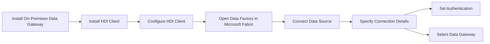
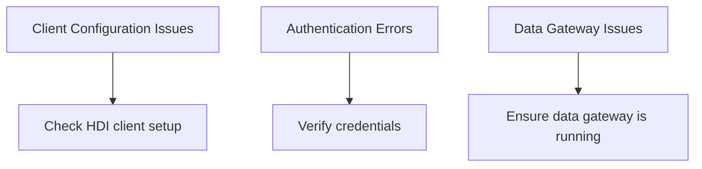

# Connecting Microsoft Fabric to HDI Platform

Costa Rica

[brown9804](https://github.com/brown9804)

Last updated: 2024-08-01

----------

## Wiki 

- [Transform data by running an Azure HDInsight activity](https://learn.microsoft.com/en-us/fabric/data-factory/azure-hdinsight-activity)

> Prerequisites: 
>  1. **Install On-Premises Data Gateway**: Ensure you have an on-premises data gateway installed and configured.  
>  2. **Install HDI Client**: Ensure the HDI client is installed on the machine running the on-premises data gateway. 

## How to

### Set Up HDI Connection
1. **Install HDI Client**: Ensure the HDI client is installed on the machine running the on-premises data gateway.
2. **Configure HDI Client**: Follow the HDI platform's documentation to configure the client.

### Configure Connection in Data Pipeline
1. **Open Data Factory**: Go to the Data Factory pipeline in Microsoft Fabric.
2. **Connect Data Source**: Browse to the "Connect data source" section.
3. **Specify Connection Details**:
   - **Server**: Enter the HDI platform server details.
   - **Connection Name**: Provide a name for your connection.
   - **Data Gateway**: Select your on-premises data gateway.

### Set Authentication
1. **Authentication Kind**: Choose the appropriate authentication type.
2. **Credentials**: Enter your HDI platform credentials.

## Possible Connection Issues and Solutions

1. Client Configuration Issues
    - **Issue**: HDI client is not properly configured.
    - **Solution**: Follow the HDI platform's documentation to ensure correct configuration.
2. Authentication Errors
    - **Issue**: Incorrect authentication type or credentials.
    - **Solution**: Verify the authentication type and credentials.
3. Data Gateway Issues
    - **Issue**: On-premises data gateway is not running or not configured correctly.
    - **Solution**: Ensure the data gateway is installed, running, and properly configured.
