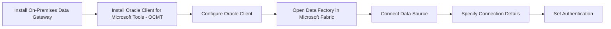
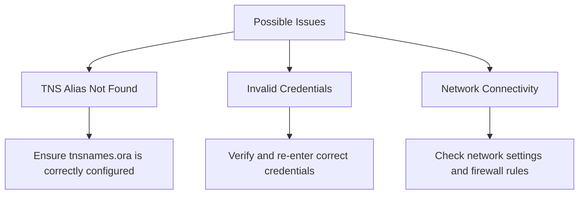

# Connecting Microsoft Fabric to Oracle Database

Costa Rica

[brown9804](https://github.com/brown9804)

Last updated: 2024-11-19

----------

## Wiki 

- [Set up your Oracle database connection](https://learn.microsoft.com/en-us/fabric/data-factory/connector-oracle-database): This article outlines the steps to create an Oracle database connection in Microsoft Fabric. It includes details on supported authentication types, prerequisites, and how to set up your connection in a data pipeline.
- [Oracle database connector overview](https://learn.microsoft.com/en-us/fabric/data-factory/connector-oracle-database#oracle-database-connector-overview): This provides an overview of the supported capabilities of the Oracle database connector in Microsoft Fabric, including support in data pipelines and the necessary prerequisites.
- [Move data from Oracle to Fabric Lakehouse via pipeline](https://learn.microsoft.com/en-us/fabric/data-factory/tutorial-oracle-to-fabric-lakehouse): This tutorial guides you through the process of moving data from an Oracle database to a Fabric Lakehouse using a pipeline and an on-premises data gateway.
- [Connnect to oracle database and load data - Community](https://community.fabric.microsoft.com/t5/Desktop/Connnect-to-oracle-database-and-load-data/td-p/3680668)

> Prerequisites: 
> 1. **Install On-Premises Data Gateway**: Ensure you have an on-premises data gateway installed and configured.   
> 2. **Install Oracle Client for Microsoft Tools (OCMT)**: Download and install the 64-bit OCMT on the computer running the on-premises data gateway.

## How to 

### Set Up Oracle Database Connection
1. **Download OCMT**: Download the 64-bit OCMT from the Oracle Client for Microsoft Tools page.
2. **Install OCMT**: Open the downloaded .exe file and follow the installation steps.
3. **Configure Oracle Client**: During installation, specify the directory where ODP.NET can find its Oracle Client configuration files.

### Configure Connection in Data Pipeline

1. **Open Data Factory**: Go to the Data Factory pipeline in Microsoft Fabric.

    

2. **Create a New Data Pipeline**:
    - Click on the “Create pipeline” button.
      
        

      

    - Add activities to your pipeline, such as **Copy data assistant**, to define the data transformation and movement.
      
      

3. Select the `Oracle DB` connector:

    

4. Select the `Oracle DB` tab to create or select an existing connection

   

5. **Specify Connection Details**:
   - **Server**: Enter the Oracle database location using one of the following:
     - **TNS Alias**: Predefined address name in the `tnsnames.ora` file.
     - **Connect Descriptor**: Example: `(DESCRIPTION=(ADDRESS=(PROTOCOL=tcp)(HOST=sales-server)(PORT=1521))(CONNECT_DATA=(SERVICE_NAME=sales.us.acme.com)))`
     - **Easy Connect**: Example: `salesserver1:1521/sales.us.example.com`
   - **Connection Name**: Provide a name for your connection.
   - **Data Gateway**: Select your on-premises data gateway.
6.  Set Authentication
    - **Authentication Kind**: Choose the authentication type (e.g., Basic).
    -  **Credentials**: Enter your Oracle database username and password.

## Possible Connection Issues and Solutions

1. **TNS Alias Not Found**:
   - **Issue**: The TNS alias specified in the `tnsnames.ora` file is not found.
   - **Solution**: Ensure the `tnsnames.ora` file is correctly configured and placed in the Oracle Client configuration directory.
2. **Invalid Credentials**:
   - **Issue**: Incorrect username or password.
   - **Solution**: Verify and re-enter the correct credentials.
3. **Network Connectivity**:
   - **Issue**: Unable to reach the Oracle server.
   - **Solution**: Check network settings and firewall rules to ensure the server is accessible.

  <h3 style="color: #4CAF50;">Total Visitors</h3>
  

