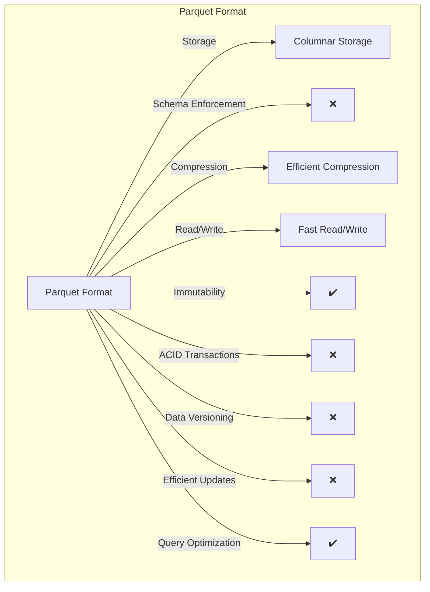
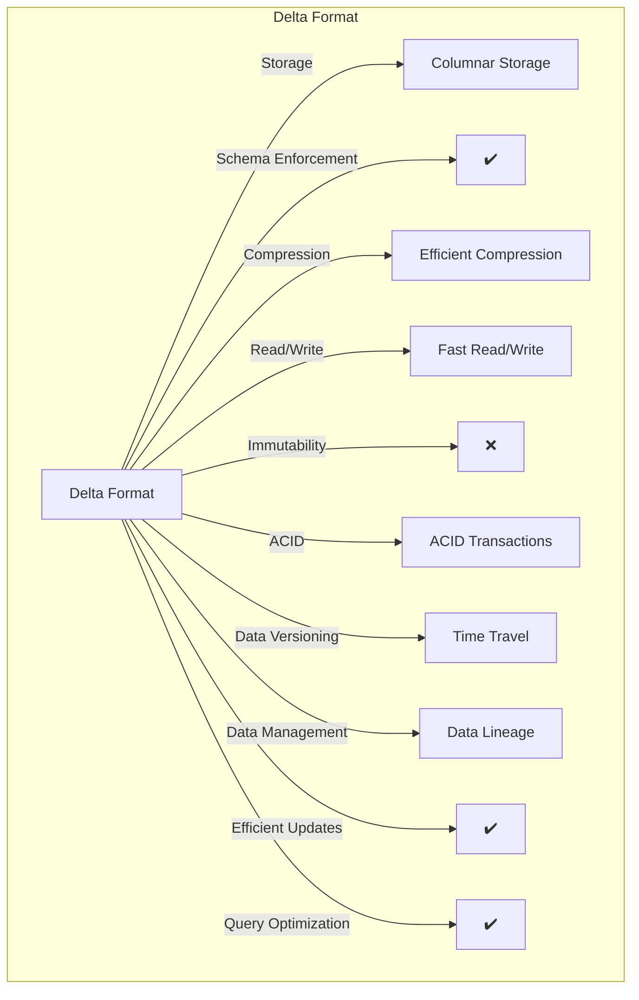

# Fabric Overview 

Costa Rica

[](https://github.com/)
[brown9804](https://github.com/brown9804)

Last updated: 2024-12-31

------------------------------------------


> Microsoft Fabric is a comprehensive analytics and data platform tailored for enterprise needs, offering a seamless solution
> by integrating `Software as a Service (SaaS)`. It merges both new and pre-existing elements from Power BI, Azure Synapse Analytics,
>  Azure Data Factory, among others, into one cohesive platform. <br/> <br/>
> Microsoft Fabric encompasses both Azure Data and Azure Analytics: <br/>
> - `Azure Data`: Incorporates tools for data engineering and management. <br/>
> - `Azure Analytics`: Features business intelligence and analytics tools, notably through its Power BI integration.

## Wiki 

<details>
<summary><b>Table of references</b> (Click to expand)</summary>

- [What is data warehousing in Microsoft Fabric?](https://learn.microsoft.com/en-us/fabric/data-warehouse/data-warehousing)
- [Query the SQL analytics endpoint or Warehouse in Microsoft Fabric](https://learn.microsoft.com/en-us/fabric/data-warehouse/query-warehouse)
- [What is the SQL analytics endpoint for a lakehouse?](https://learn.microsoft.com/en-us/fabric/data-engineering/lakehouse-sql-analytics-endpoint)
  
</details>

## Content 

<details>
<summary><b>Table of Contents</b> (Click to expand)</summary>

- [Wiki](#wiki)
- [Content](#content)
- [Overview](#overview)
    - [Key Components](#key-components)
    - [Features](#features)
- [OneLake in Microsoft Fabric](#onelake-in-microsoft-fabric)
    - [Lakehouse & Data Warehouse](#lakehouse--data-warehouse)
- [Parquet & Delta Data Formats](#parquet--delta-data-formats)
- [Z-Order and V-Order](#z-order-and-v-order)
- [Dataflow Gen2 & Data Pipelines](#dataflow-gen2--data-pipelines)
- [Shortcuts & Mirroring](#shortcuts--mirroring)
- [Data Factory](#data-factory)
- [Medallion Architecture Overview](#medallion-architecture-overview)
- [Fabric: Highlights into AI/LLMs](#fabric-highlights-into-aillms)
- [Writing SQL: SQL Analytics Endpoint](#writing-sql-sql-analytics-endpoint)
    - [How to Configure and Use the SQL Analytics Endpoint](#how-to-configure-and-use-the-sql-analytics-endpoint)
- [Fabric AI Skill](#fabric-ai-skill)

</details>

## Overview 

- [Free Trial Capacity](https://github.com/brown9804/MicrosoftCloudEssentialsHub/blob/main/0_Azure/2_AzureAnalytics/0_Fabric/demos/7_FreeTrialCapacity.md)
- [Fabric capabilities based on SKU size](https://github.com/brown9804/MicrosoftCloudEssentialsHub/blob/main/0_Azure/2_AzureAnalytics/0_Fabric/demos/9_Fabric_bySKU.md)
- [Fabric Capacity Reservations](https://github.com/brown9804/MicrosoftCloudEssentialsHub/blob/main/0_Azure/2_AzureAnalytics/0_Fabric/demos/12_FabricReservation.md)
- [Fabric: Overview of Configuration Settings](https://github.com/brown9804/MicrosoftCloudEssentialsHub/blob/main/0_Azure/2_AzureAnalytics/0_Fabric/demos/19_FabricConfigs.md)
- [Migration from Power BI Premium (P-SKUs) to Fabric (F-SKUs)](https://github.com/brown9804/MicrosoftCloudEssentialsHub/blob/main/0_Azure/2_AzureAnalytics/0_Fabric/demos/8_MigrationPtoFSku.md)
- [Fabric Tenant Migration - Overview](https://github.com/brown9804/MicrosoftCloudEssentialsHub/blob/main/0_Azure/2_AzureAnalytics/0_Fabric/demos/24_FabricTenantMigration.md)
- [Fabric Princing Calculator](https://azure.microsoft.com/en-us/pricing/calculator/?msockid=38ec3806873362243e122ce086486339)
- [Azure Support Plans - Overview](https://github.com/brown9804/MicrosoftCloudEssentialsHub/blob/main/0_Azure/7_AzureSupport/README.md)
  
### Key Components

- **Data Engineering, Data Factory, Data Science, Real-Time Analytics, Data Warehouse, and Databases**: These are the key services offered by Microsoft Fabric.
- **OneLake**: This is the unification of lakehouses.
- **Real-Time hub**: This is the unification of data streams.


| Component                | Purpose                                      | Key Features                                                                 | Why Fabric vs. Each Resource Individually                                  |
|--------------------------|----------------------------------------------|------------------------------------------------------------------------------|---------------------------------------------------------------------------|
| **Data Factory**         | Cloud-based data integration service         | Orchestrates and automates data movement and transformation. Supports ETL processes. | **Enhanced Integration**: Fabric integrates Data Factory with other components, reducing data silos and improving workflow efficiency. |
| **Synapse Data Engineering** | Big data processing                        | Utilizes Apache Spark for large-scale data preparation and transformation. Integrates with various data sources. | **Unified Platform**: Fabric provides a cohesive environment where data engineering seamlessly connects with analytics and other services, streamlining data processing and reducing complexity. |
| **Synapse Data Warehouse** | Scalable analytics service                  | Combines big data and data warehousing. Provides high-performance SQL-based analytics. | **Comprehensive Insights**: Fabric's integration allows for unified analytics, offering a holistic view of data across different services, enhancing decision-making and operational efficiency. |
| **Synapse Real-Time Analytics** | Real-time data analytics                | Processes streaming data for immediate insights. Supports real-time dashboards and alerts. | **Seamless Data Flow**: Fabric ensures continuous data flow and real-time analytics integration, enhancing responsiveness and enabling proactive decision-making. |
| **Power BI**             | Business analytics tool                      | Interactive visualizations, self-service BI capabilities. Allows users to create reports and dashboards easily. | **Enhanced Connectivity**: Fabric enhances Power BI's capabilities by providing better data connectivity and integration with other components, leading to richer insights and more comprehensive reporting. |
| **Data Activator**       | Trigger actions based on data conditions     | Automates responses to specific data events. Enhances data-driven decision-making. | **Integrated Automation**: Fabric leverages comprehensive data insights for more effective automation and action-triggering, improving operational efficiency and responsiveness. |
| **Synapse Data Science** | Machine learning and data science            | Tools for building, training, and deploying ML models. Integrates with the Synapse ecosystem for scalable data science workflows. | **Unified Workflows**: Fabric integrates data science workflows with other Synapse services, enhancing collaboration, scalability, and the ability to derive actionable insights from data. |

> Before Fabric

<p float="left">
  
  
</p>

### Features

- **Unification with SaaS foundation**: Fabric integrates workloads such as Data Engineering, Data Factory, Data Science, Data Warehouse, Real-Time Intelligence, Industry solutions, and Power BI into a shared SaaS foundation.
- **AI Integration**: The entire Fabric stack has AI integration and it accelerates the data journey.
- **Unified Management and Governance**: Fabric seamlessly integrates data and services, enabling unified management, governance, and discovery.
- **Security**: It ensures security for items, data, and row-level access.


## OneLake in Microsoft Fabric

> OneLake is a unified, logical data lake designed to be the single repository for all your organization's analytics data, similar to how OneDrive serves as a central location for documents. It automatically comes with every Microsoft Fabric tenant, ensuring that all data is stored in one place, reducing duplication and simplifying data management. `Designed to store all types of data in a single, centralized location. It serves as the foundational storage layer for all data within the Fabric ecosystem, ensuring seamless integration and accessibility across various services.`

| **Key Features of OneLake** | **Description**                                                                 |
|-----------------------------|---------------------------------------------------------------------------------|
| **Unified Data Storage**    | Stores all types of data, both structured and unstructured, in a single location.|
| **Integration with Fabric** | All Fabric data items, such as data warehouses and lakehouses, store their data in OneLake using the Delta Parquet format. |
| **Governance and Compliance** | Provides built-in data governance, including data lineage, protection, and catalog integration. |
| **Open Access**             | Supports ADLS Gen2 APIs and SDKs, making it compatible with existing ADLS Gen2 applications. |
| **Shortcuts**               | Allows data sharing across different domains without data movement, enabling virtual data products. |
| **Data Types in OneLake**   | - **Structured Data**: Tables, Databases, Data warehouses. <br/> - **Unstructured Data**: Files, Documents, Images, Videos. <br/> - **Semi-Structured Data**: JSON, XML, Log files. |


### Lakehouse & Data Warehouse

> `Lakehouse `is a `specific type of data architecture within Microsoft Fabric `that combines the features of data lakes and data warehouses. `It allows for the storage and processing of both structured and unstructured data`, providing the flexibility of a data lake with the performance and management features of a data warehouse. <br/> <br/>
> `Data Warehouse` is a centralized repository for `storing large volumes of structured data`. It is optimized for querying and analysis, providing high-performance SQL-based analytics.

| Lakehouse | Data Warehouse | 
| --- | --- | 
|  |  |

| **Aspect**               | **OneLake**                                                                 | **Lakehouse**                                                                 | **Data Warehouse**                                                         |
|--------------------------|------------------------------------------------------------------------------|-------------------------------------------------------------------------------|----------------------------------------------------------------------------|
| **Purpose**              | `Acts as the central storage repository for all data types within Microsoft Fabric.` | Provides a unified architecture for managing and analyzing data, combining the benefits of data lakes and data warehouses. | Focuses on storing and analyzing structured data for business intelligence and decision support. |
| **Functionality**        | Focuses on storing data in a unified, governed, and accessible manner.       | Focuses on enabling advanced analytics and machine learning by providing a flexible and scalable data architecture. | Optimized for high-performance SQL-based querying and reporting on structured data. |
| **When to Use Each**     | - As the central storage repository for all data types within Microsoft Fabric. <br/> - To ensure seamless integration and accessibility across various services. | - When you need to handle large volumes of diverse data types. <br/> - When you require flexibility in data processing with multiple engines (e.g., Spark, SQL). <br/> - For machine learning projects that `need access to both raw and processed data`. <br/> - For real-time analytics and advanced data processing. | - When you need optimized performance for SQL-based querying and reporting. <br/> - When your `primary focus is on structured data and historical analysis`. <br/> - For a robust environment supporting business intelligence and decision support. |

## Parquet & Delta Data Formats

> OneLake allows storage of delta parquet files, which can be read and worked with throughout all workloads. It's a single, unified, logical data lake for the whole organization. Like OneDrive, OneLake comes automatically with every Microsoft Fabric tenant and is designed to be the single place for all your analytics data.

<p float="left">
  
  
</p>

> `Parquet` is a `columnar storage file format` optimized for use with big data processing frameworks. `In Microsoft Fabric`, Parquet is commonly used for its efficiency in `storing and querying large datasets`. <br/>
> - `Columnar Storage`: Stores data in columns, which allows for efficient data compression and encoding schemes, reducing storage costs. <br/>
> - `Efficient Query Performance`: Optimized for read-heavy operations, making it ideal for analytical queries. <br/>
> - `Compatibility`: Supports various compression `codecs (encodes or decodes a data stream or signal, "coder-decoder" or "compressor-decompressor)` like gzip, snappy, and others, enhancing flexibility in data storage and retrieval. <br/> <br/>



> `Delta format`, often referred to as Delta Lake, is an `open-source storage layer that brings ACID (Atomicity, Consistency, Isolation, Durability) transactions to big data workloads`. It is designed to address the challenges of managing large-scale data lakes. <br/>
> - `ACID Transaction`s: Ensures data reliability and consistency, supporting complex data operations without data corruption.
> - `Schema Enforcement and Evolution`: Allows for schema changes over time, making it easier to manage evolving data structures.
> - `Time Travel:` Enables querying of historical data, providing the ability to access and revert to previous versions of data.
> - `Efficient Data Management`: Features like compaction, [Z-Order](#z-order-and-v-order), and [V-Order](#z-order-and-v-order) optimize data storage and query performance



| Feature                | Parquet                                      | Delta                                      | Available in Parquet? | Available in Delta? |
|------------------------|----------------------------------------------|--------------------------------------------|-----------------------|---------------------|
| **Storage Type**       | Columnar storage format, ideal for analytical queries. | Columnar storage format built on Parquet, optimized for data lakes. | ✔️                    | ✔️                  |
| **Schema Information** | Schema included in metadata, simplifying data processing. | Schema included in metadata, ensuring consistency. | ✔️                    | ✔️                  |
| **Compression**        | Supports various compression algorithms (e.g., Snappy, Gzip) for efficient storage. | High compression, leveraging Parquet's capabilities. | ✔️                    | ✔️                  |
| **Row Groups**         | Data organized into row groups with min/max statistics for efficient querying. | Similar row group structure with min/max statistics, enhancing performance. | ✔️                    | ✔️                  |
| **Immutability**       | Immutable files, ensuring data integrity but limiting updates. | Supports updates and deletes, providing flexibility for data modifications. | ✔️                    |  ❌                    |
| **ACID (Atomicity, Consistency, Isolation, Durability) Transactions**  | Not supported, making it less suitable for complex data operations. | Supports ACID transactions, ensuring reliable and consistent data operations. | ❌                    | ✔️                  |
| **Data Versioning**    | Not available, limiting the ability to track changes over time. | Provides data versioning, allowing for auditing and rollback scenarios. | ❌                    | ✔️                  |
| **Schema Enforcement** | No built-in schema enforcement, requiring external validation. | Enforces schema consistency, maintaining data quality. | ❌                    | ✔️                  |
| **Efficient Updates**  | Does not support efficient updates, making it less suitable for frequently changing data. | Allows for efficient updates and deletes, ideal for dynamic datasets. | ❌                    | ✔️                  |
| **Query Optimization** | Basic query optimization, relying on columnar storage benefits. | Advanced query optimization with features like data skipping and [Z-order](#z-order-and-v-order) indexing. | ✔️                    | ✔️                  |
| **Use Case**           | Ideal for data warehousing, batch processing, and scenarios where data is primarily read and not frequently updated. | Best suited for data lakes, real-time analytics, and environments requiring strict data integrity and frequent updates. | ✔️                    | ✔️                  |
| **Additional Context** | Parquet is excellent for read-heavy workloads and large-scale data analytics. It's widely supported and highly efficient for scenarios where data doesn't change frequently. | Delta builds on Parquet by adding features like ACID transactions, data versioning, and efficient updates/deletes. It's designed for environments where data integrity, frequent updates, and complex data operations are crucial. | ✔️                    | ✔️                  |

## Z-Order and V-Order

  
| **Aspect**               | **Z-Order**                                                                 | **V-Order**                                                                 |
|--------------------------|------------------------------------------------------------------------------|----------------------------------------------------------------------------|
| **Purpose**              | Improves query performance by co-locating related information in the same set of files. | Enhances read performance by organizing data in a way that leverages Microsoft Verti-Scan technology. |
| **Key Features**         | - Data Co-Location: Organizes data based on one or more columns, storing rows with similar values together. <br/> - Query Efficiency: Reduces the amount of data read during queries, improving performance. <br/> - Compatibility: Works with Delta Lake to enhance data-skipping algorithms. | - Special Sorting: Applies special sorting techniques to Parquet files. <br/> - Row Group Distribution: Optimizes row group distribution for better read performance. <br/> - Dictionary Encoding and Compression: Uses efficient dictionary encoding and compression. <br/> - Performance Boost: Provides fast reads under various compute engines. <br/> - Cost Efficiency: Reduces network, disk, and CPU resources during reads. |
| **Timing**               | Applied during read time (or table optimization).                            | Applied during write time.                                                 |
| **Use Cases**            | - When you need to improve query performance by reducing the amount of data read. <br/> - For queries that frequently filter on specific columns. | - When you need to enhance read performance and reduce storage costs. <br/> - For scenarios requiring efficient data access across various compute engines. |
| **Compatibility**        | Requires specific tools like Delta Lake.                                     | Universally compatible with all Parquet engines. 


## Dataflow Gen2 & Data Pipelines


| **Feature** | **Dataflow Gen2** | **Data Pipelines** |
|-------------|-------------------|--------------------|
|**Hint** | `ETL/ELT` | `Pipeline/Orchestrator` |
| **Purpose** | Data transformation and preparation using a low-code interface. | Orchestration of data workflows and control flow of execution. |
| **Use Case** | Ideal for cleaning, prepping, and transforming data with over 300 data and AI-based transformations. | Best for creating complex data workflows that involve multiple steps and dependencies. |
| **Authoring Experience** | Shorter and simpler with auto-save and background publishing. | More detailed and flexible, allowing for complex orchestration. |
| **Data Destinations** | Supports multiple destinations like Fabric Lakehouse, Azure Data Explorer, Azure Synapse Analytics, and Azure SQL Database. | Can call Dataflows and other activities to move data to various destinations. |
| **Integration** | Can be integrated within Data Pipelines for more complex workflows. | Can include Dataflows as part of the pipeline activities. |
| **Flexibility** | Provides a low-code interface for easy data transformation. | Offers rich out-of-the-box orchestration capabilities for enterprise needs. |
| **Monitoring and Refresh History** | Improved monitoring and refresh history features. | Provides detailed monitoring and logging for all pipeline activities. |
| **Scalability** | High-scale compute capabilities for large data transformations. | Scalable orchestration for large and complex workflows. |
| **When to Use** | When you need to perform data transformations and preparations with a low-code interface. When you require a quick and easy way to clean and prep data. When you want to leverage AI-based transformations. | When you need to orchestrate complex data workflows with multiple steps and dependencies. When you require detailed control over the execution flow of your data processes. When you need to integrate various data activities, including Dataflows, into a single workflow. |
| **Important Information** | Designed to make data transformation easier and more efficient with features like auto-save, background publishing, and support for multiple data destinations. | Provides a robust framework for orchestrating data workflows, allowing you to create logical groupings of activities and manage dependencies effectively. |

## Shortcuts & Mirroring

| **Feature** | **Shortcuts** | **Mirroring** |
|-------------|---------------|---------------|
| **Definition** | Objects that point to other storage locations, either internal or external to OneLake. | A data replication solution that continuously replicates data from various sources into OneLake. |
| **Purpose** | To unify data across different domains, clouds, and accounts by creating a single virtual data lake. | To bring data from different systems together into a single analytics platform, ensuring data is up-to-date and readily available for analysis. |
| **Data Movement** | No data is copied or moved. Shortcuts link directly to the source data. | Data is copied and stored in OneLake, providing a low-latency and centralized data management solution. |
| **Usage** | Shortcuts appear as folders in OneLake and can be used by any service or workload that has access to OneLake. | Mirrored data can be accessed and analyzed using various tools within Microsoft Fabric, such as Power BI and Azure Synapse. |
| **Benefits** | - Reduces data duplication. <br> - Enhances accessibility by providing a unified view of data. <br> - Simplifies data management by abstracting the data retrieval process. | - Provides real-time data replication. <br> - Ensures data consistency and availability. <br> - Simplifies the process of keeping data synchronized across different systems. |
| **Key Differences** | - No data movement. <br> - Live access to external data sources. <br> - Ideal for accessing data across multiple locations without duplication. | - Data is physically replicated. <br> - Access to a centralized, up-to-date copy of data. <br> - Suitable for centralized analysis and ensuring data consistency. |
| **Compatible Products** | - Azure Data Lake Storage (ADLS) Gen2 <br> - Amazon S3 <br> - Google Cloud Storage <br> - Dataverse <br> - On-premises data sources via Fabric on-premises data gateway | - Azure SQL Database <br> - Azure Cosmos DB <br> - Snowflake |

## Data Factory

> Example over ETL (Extract, Transform, Load)


Steps: Click [here to see a visual guidance](https://github.com/brown9804/MicrosoftCloudEssentialsHub/blob/main/0_Azure/2_AzureAnalytics/0_Fabric/demos/15_FabricMedallionArch/README.md#step-2-ingest-data-into-the-bronze-layer)
1. Select **`Data pipeline`**.
2. You can either click on **`Copy data assist`** right away or simply click on **`Copy data`**.

    

3. Add the connection to your data source. In this example, we'll use **Azure SQL Database**.
4. Choose the tables you want to include. You can do this using the **Tables view**, by writing a **Query** or **Stored procedure**.

    | **Option**          | **Description**                                                                 | **Use Case**                                                                 |
    |---------------------|---------------------------------------------------------------------------------|------------------------------------------------------------------------------|
    | **Table**           | Allows you to select and work with entire tables from your data source.         | Ideal for scenarios where you need to copy or transform all data within a specific table. |
    | **Query**           | Enables you to write custom SQL queries to select specific data from your data source. | Useful when you need to filter, join, or aggregate data before copying or transforming it. |
    | **Stored Procedure**| Allows you to execute predefined stored procedures in your database.            | Best for complex data operations that are encapsulated within stored procedures, such as data transformations or business logic. |
      

5. Select your destination, such as the **Bronze layer**.
6. Test and validate your data pipeline.

    

## Medallion Architecture Overview

Click [here](https://github.com/brown9804/MicrosoftCloudEssentialsHub/blob/main/0_Azure/2_AzureAnalytics/0_Fabric/demos/15_FabricMedallionArch/README.md#fabric-medallion-architecture-overview) to go to a quick guide over the medallion architecture, and see a demo with conventional lakehouse.

  

## Fabric: Highlights into AI/LLMs

Click [here](https://github.com/brown9804/MicrosoftCloudEssentialsHub/blob/main/0_Azure/2_AzureAnalytics/0_Fabric/demos/13_FabricAI_LLMs#configure-azure-openai-service) to see a quick guide and demo.

- Example of [how to integrate Azure OpenAI with Fabric](https://github.com/brown9804/MicrosoftCloudEssentialsHub/blob/main/0_Azure/2_AzureAnalytics/0_Fabric/demos/13_FabricAI_LLMs#configure-azure-openai-service): Call a deployed model and request information.
- [Basic Usage of LangChain Transformer](https://github.com/brown9804/MicrosoftCloudEssentialsHub/blob/main/0_Azure/2_AzureAnalytics/0_Fabric/demos/13_FabricAI_LLMs#basic-usage-of-langchain-transformer): Create a prompt template, set up an LLMChain, and configure the transformer to execute the processing chain.
- Example of [Using LangChain for Large Scale Literature Review](https://github.com/brown9804/MicrosoftCloudEssentialsHub/blob/main/0_Azure/2_AzureAnalytics/0_Fabric/demos/13_FabricAI_LLMs#using-langchain-for-large-scale-literature-review): This example is around extracting content from PDFs linked in arXiv papers and generating prompts for extracting specific information.
- [Machine Learning Integration with Microsoft Fabric](https://github.com/brown9804/MicrosoftCloudEssentialsHub/blob/main/0_Azure/2_AzureAnalytics/0_Fabric/demos/13_FabricAI_LLMs#machine-learning-integration-with-microsoft-fabric): Shows how to train and register machine learning models using Microsoft Fabric's native integration with the MLflow framework. This includes logging trained models, hyperparameters, and evaluation metrics. It also shows how to compare and filter machine learning models using MLflow, with an example using RandomForestRegressor.

## Writing SQL: SQL Analytics Endpoint

> In Microsoft Fabric, you can `write your SQL queries using the SQL analytics endpoint`. `This endpoint provides a SQL-based experience for querying data stored in lakehouse Delta tables`. <br/>
> The SQL analytics endpoint `allows you to use T-SQL (Transact-SQL) to analyze your data, create views, save functions, and apply SQL security`.

| **Key Feature**          | **Description**                                                                 |
|--------------------------|---------------------------------------------------------------------------------|
| **SQL-Based Querying**   | Use T-SQL to query Delta tables in your lakehouse.                              |
| **Views and Functions**  | Create and save SQL views and functions for reusable queries and operations.    |
| **SQL Security**         | Apply object-level security to control access to your data.                     |
| **Read-Only Mode**       | The SQL analytics endpoint operates in read-only mode, meaning you can read data but not modify it directly through this endpoint. |

### How to Configure and Use the SQL Analytics Endpoint

> Steps to Configure:

1. **Create a Lakehouse**:
   - Go to your Microsoft Fabric workspace.
   - Click on **New item** and select **Lakehouse** to create a new lakehouse or select an existing one. This automatically provisions a SQL analytics endpoint for the lakehouse.

        

   - Follow the prompts to set up your lakehouse.

        
        
        | **Aspect**               | **Lakehouse in Microsoft Fabric**                                      | **Lakehouse with Schema in Microsoft Fabric**                          |
        |--------------------------|------------------------------------------------------------------------|------------------------------------------------------------------------|
        | **Purpose**              | Centralized storage for structured and unstructured data.              | Enhanced organization and management of tables using schemas.          |
        | **Data Organization**    | Tables are stored without additional grouping.                         | Tables are organized into schemas, providing a folder-like structure.  |
        | **Data Discovery**       | Basic data discovery capabilities.                                     | Improved data discovery through schema grouping.                       |
        | **Access Control**       | Standard access control at the table level.                            | Enhanced access control at the schema level, allowing for finer granularity. |
        | **Integration**          | Integrated with other Fabric components like SQL analytics endpoint.   | Same integration, with added schema support for better data management. |
        | **SQL Analytics Endpoint** | Supports querying tables directly.                                    | Supports querying tables within schemas, using namespace notation.     |
        | **Schema Management**    | Not applicable.                                                        | Allows creation, modification, and management of schemas.              |
        | **Use Cases**            | Suitable for general data storage and analytics.                       | Ideal for scenarios requiring organized data structures and advanced access control. |
  
        | Lakehouse simple | Lakehouse with schema | 
        | --- | ---- |
        |  |  |

2. **Connect Using SQL Query Editor**:
   - Open the SQL query editor from the Microsoft Fabric portal.

      1. Go to the  workspace.
      2. **Select the Lakehouse/Data Warehouse** you want to query.
      3. **Click on the "New SQL query" button** in the ribbon at the top of the pageÑ This will open the SQL query editor where you can write and execute your T-SQL queries. The editor supports features like IntelliSense, code completion, and syntax highlighting to help you write queries efficiently.

         | Lakehouse - SQL Analytics Endpoint | Data Warehouse - SQL Analytics Endpoint |
         | --- | --- |
         |  |  | 

   - Write a simple query, for example:
     ```sql
     SELECT * FROM your_table_name;
     ```
   - Execute the query to see the results.

      

    - You can use `Explain query` to add comments to your query:
  
        
  

3. **Connect Using External Tools**:
  -  **Access the SQL Analytics Endpoint**:  Copy the SQL analytics endpoint connection string (T-SQL connection string) from the Lakehouse explorer.
     - In the workspace view, select the lakehouse.
     - In the Lakehouse explorer, go to **SQL analytics endpoint**.
  
        

   - **SQL Server Management Studio (SSMS)** or **Azure Data Studio**:
     - For this case, open SSMS and click on **Connect**.
     - Select **Database Engine** and paste the connection string.
     - Authenticate using Azure Active Entra credentials.
     - Write and execute your SQL queries.

        

## Fabric AI Skill 

> Fabric AI Skills let you `build custom chat platforms for asking and answering questions using advanced AI`. By setting up these skills, we can ask questions and get reliable answers based on data. We need to give clear instructions and examples so the AI can work well for our company's specific needs and data.

Click [here](https://github.com/brown9804/MicrosoftCloudEssentialsHub/blob/main/0_Azure/2_AzureAnalytics/0_Fabric/demos/2_FabricAISkills.md) for a quick guidance.

<div align="center">
  <h3 style="color: #4CAF50;">Total Visitors</h3>
  
</div>
