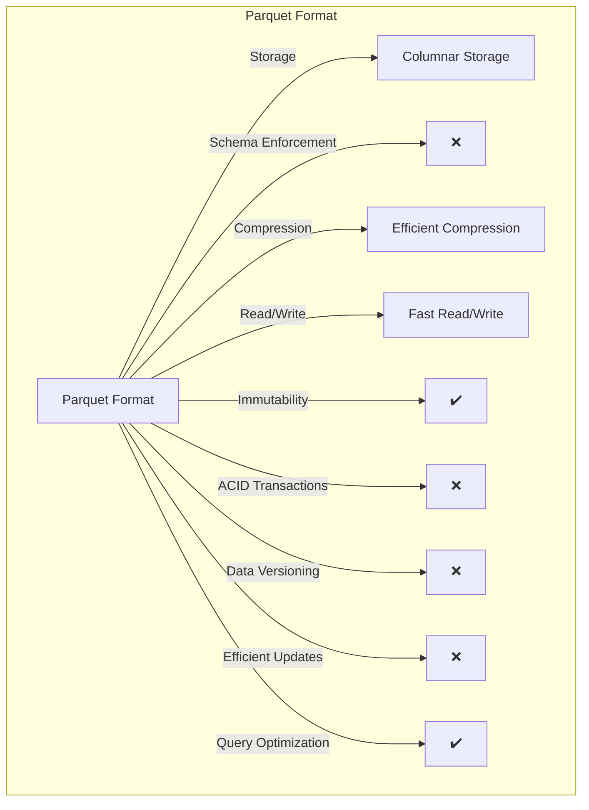
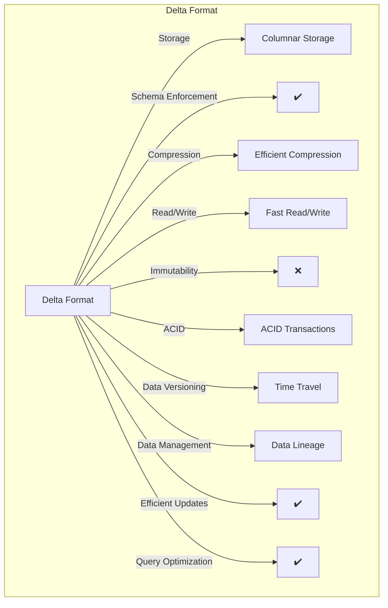

# Fabric Overview 

Costa Rica

[brown9804](https://github.com/brown9804)

Last updated: 2024-11-07

------------------------------------------

> Microsoft Fabric is a comprehensive analytics and data platform tailored for enterprise needs, offering a seamless solution
> by integrating `Software as a Service (SaaS)`. It merges both new and pre-existing elements from Power BI, Azure Synapse Analytics,
>  Azure Data Factory, among others, into one cohesive platform.    
> Microsoft Fabric encompasses both Azure Data and Azure Analytics:  
> - `Azure Data`: Incorporates tools for data engineering and management.  
> - `Azure Analytics`: Features business intelligence and analytics tools, notably through its Power BI integration.

## Wiki 

<b>Table of Contents</b> (Click to expand)

## Key Components

- **Data Engineering, Data Factory, Data Science, Real-Time Analytics, Data Warehouse, and Databases**: These are the key services offered by Microsoft Fabric.
- **OneLake**: This is the unification of lakehouses.
- **Real-Time hub**: This is the unification of data streams.

> Before Fabric

  
  

## Features

- **Unification with SaaS foundation**: Fabric integrates workloads such as Data Engineering, Data Factory, Data Science, Data Warehouse, Real-Time Intelligence, Industry solutions, and Power BI into a shared SaaS foundation.
- **AI Integration**: The entire Fabric stack has AI integration and it accelerates the data journey.
- **Unified Management and Governance**: Fabric seamlessly integrates data and services, enabling unified management, governance, and discovery.
- **Security**: It ensures security for items, data, and row-level access.

## Dataflow Gen2 & Data Pipelines

| **Feature** | **Dataflow Gen2** | **Data Pipelines** |
|-------------|-------------------|--------------------|
|**Hint** | `ETL/ELT` | `Pipeline/Orchestrator` |
| **Purpose** | Data transformation and preparation using a low-code interface. | Orchestration of data workflows and control flow of execution. |
| **Use Case** | Ideal for cleaning, prepping, and transforming data with over 300 data and AI-based transformations. | Best for creating complex data workflows that involve multiple steps and dependencies. |
| **Authoring Experience** | Shorter and simpler with auto-save and background publishing. | More detailed and flexible, allowing for complex orchestration. |
| **Data Destinations** | Supports multiple destinations like Fabric Lakehouse, Azure Data Explorer, Azure Synapse Analytics, and Azure SQL Database. | Can call Dataflows and other activities to move data to various destinations. |
| **Integration** | Can be integrated within Data Pipelines for more complex workflows. | Can include Dataflows as part of the pipeline activities. |
| **Flexibility** | Provides a low-code interface for easy data transformation. | Offers rich out-of-the-box orchestration capabilities for enterprise needs. |
| **Monitoring and Refresh History** | Improved monitoring and refresh history features. | Provides detailed monitoring and logging for all pipeline activities. |
| **Scalability** | High-scale compute capabilities for large data transformations. | Scalable orchestration for large and complex workflows. |
| **When to Use** | When you need to perform data transformations and preparations with a low-code interface. When you require a quick and easy way to clean and prep data. When you want to leverage AI-based transformations. | When you need to orchestrate complex data workflows with multiple steps and dependencies. When you require detailed control over the execution flow of your data processes. When you need to integrate various data activities, including Dataflows, into a single workflow. |
| **Important Information** | Designed to make data transformation easier and more efficient with features like auto-save, background publishing, and support for multiple data destinations. | Provides a robust framework for orchestrating data workflows, allowing you to create logical groupings of activities and manage dependencies effectively. |

## Shortcuts & Mirroring

| **Feature** | **Shortcuts** | **Mirroring** |
|-------------|---------------|---------------|
| **Definition** | Objects that point to other storage locations, either internal or external to OneLake. | A data replication solution that continuously replicates data from various sources into OneLake. |
| **Purpose** | To unify data across different domains, clouds, and accounts by creating a single virtual data lake. | To bring data from different systems together into a single analytics platform, ensuring data is up-to-date and readily available for analysis. |
| **Data Movement** | No data is copied or moved. Shortcuts link directly to the source data. | Data is copied and stored in OneLake, providing a low-latency and centralized data management solution. |
| **Usage** | Shortcuts appear as folders in OneLake and can be used by any service or workload that has access to OneLake. | Mirrored data can be accessed and analyzed using various tools within Microsoft Fabric, such as Power BI and Azure Synapse. |
| **Benefits** | - Reduces data duplication.   - Enhances accessibility by providing a unified view of data.   - Simplifies data management by abstracting the data retrieval process. | - Provides real-time data replication.   - Ensures data consistency and availability.   - Simplifies the process of keeping data synchronized across different systems. |
| **Key Differences** | - No data movement.   - Live access to external data sources.   - Ideal for accessing data across multiple locations without duplication. | - Data is physically replicated.   - Access to a centralized, up-to-date copy of data.   - Suitable for centralized analysis and ensuring data consistency. |
| **Compatible Products** | - Azure Data Lake Storage (ADLS) Gen2   - Amazon S3   - Google Cloud Storage   - Dataverse   - On-premises data sources via Fabric on-premises data gateway | - Azure SQL Database   - Azure Cosmos DB   - Snowflake |

## Parquet & Delta Data Formats

> OneLake allows storage of delta parquet files, which can be read and worked with throughout all workloads. It's a single, unified, logical data lake for the whole organization. Like OneDrive, OneLake comes automatically with every Microsoft Fabric tenant and is designed to be the single place for all your analytics data.

  
  

| Feature                | Parquet                                      | Delta                                      | Available in Parquet? | Available in Delta? |
|------------------------|----------------------------------------------|--------------------------------------------|-----------------------|---------------------|
| **Storage Type**       | Columnar storage format, ideal for analytical queries. | Columnar storage format built on Parquet, optimized for data lakes. | ✔️                    | ✔️                  |
| **Schema Information** | Schema included in metadata, simplifying data processing. | Schema included in metadata, ensuring consistency. | ✔️                    | ✔️                  |
| **Compression**        | Supports various compression algorithms (e.g., Snappy, Gzip) for efficient storage. | High compression, leveraging Parquet's capabilities. | ✔️                    | ✔️                  |
| **Row Groups**         | Data organized into row groups with min/max statistics for efficient querying. | Similar row group structure with min/max statistics, enhancing performance. | ✔️                    | ✔️                  |
| **Immutability**       | Immutable files, ensuring data integrity but limiting updates. | Supports updates and deletes, providing flexibility for data modifications. | ✔️                    |  ❌                    |
| **ACID Transactions**  | Not supported, making it less suitable for complex data operations. | Supports ACID transactions, ensuring reliable and consistent data operations. | ❌                    | ✔️                  |
| **Data Versioning**    | Not available, limiting the ability to track changes over time. | Provides data versioning, allowing for auditing and rollback scenarios. | ❌                    | ✔️                  |
| **Schema Enforcement** | No built-in schema enforcement, requiring external validation. | Enforces schema consistency, maintaining data quality. | ❌                    | ✔️                  |
| **Efficient Updates**  | Does not support efficient updates, making it less suitable for frequently changing data. | Allows for efficient updates and deletes, ideal for dynamic datasets. | ❌                    | ✔️                  |
| **Query Optimization** | Basic query optimization, relying on columnar storage benefits. | Advanced query optimization with features like data skipping and Z-order indexing. | ✔️                    | ✔️                  |
| **Use Case**           | Ideal for data warehousing, batch processing, and scenarios where data is primarily read and not frequently updated. | Best suited for data lakes, real-time analytics, and environments requiring strict data integrity and frequent updates. | ✔️                    | ✔️                  |
| **Additional Context** | Parquet is excellent for read-heavy workloads and large-scale data analytics. It's widely supported and highly efficient for scenarios where data doesn't change frequently. | Delta builds on Parquet by adding features like ACID transactions, data versioning, and efficient updates/deletes. It's designed for environments where data integrity, frequent updates, and complex data operations are crucial. | ✔️                    | ✔️                  |
