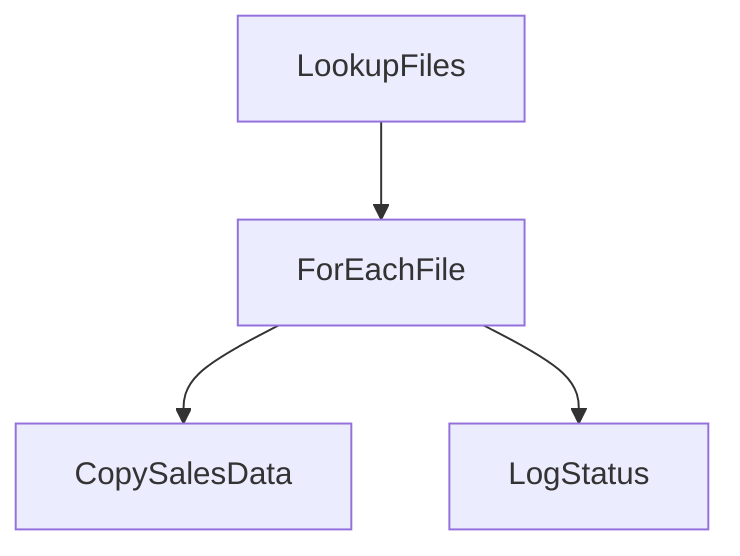

# Azure Data Factory (ADF) - Best Practices Overview 

Costa Rica

 

[brown9804](https://github.com/brown9804)

Last updated: 2024-12-23

----------

## Wiki 

<b>Table of Wiki </b> (Click to expand)

- [Automated enterprise BI](https://learn.microsoft.com/en-us/azure/architecture/reference-architectures/data/enterprise-bi-adf)
- [Data warehousing and analytics](https://learn.microsoft.com/en-us/azure/architecture/example-scenario/data/data-warehouse)
- [Pipeline Logic 1: Error Handling and Best Effort Step](https://techcommunity.microsoft.com/blog/azuredatafactoryblog/pipeline-logic-1-error-handling-and-best-effort-step/3712168)
  

## Content

<b>Table of Content </b> (Click to expand)

- [Wiki](#wiki)
- [Content](#content)
- [Architecture examples](#architecture-examples)
- [Best Practices for ADF Pipelines](#best-practices-for-adf-pipelines)
    - [Clear Pipeline Structure](#clear-pipeline-structure)
    - [Parameterization](#parameterization)
    - [Incremental Loading](#incremental-loading)
    - [Error Handling and Monitoring](#error-handling-and-monitoring)
    - [Security Measures](#security-measures)
    - [Use Azure Key Vault](#use-azure-key-vault)
    - [Resource Management](#resource-management)
    - [Testing and Validation](#testing-and-validation)
    - [Documentation](#documentation)
    - [Regular Updates](#regular-updates)
    - [Performance Tuning](#performance-tuning)
- [Recommended Training Modules on Microsoft Learn](#recommended-training-modules-on-microsoft-learn)

## Architecture examples 

## Best Practices for ADF Pipelines

### Clear Pipeline Structure

> Ensure your pipelines are well-organized and easy to understand.

| **Best Practice**             | **Description**                                                                 | **Example**                                                                                     |
|-------------------------------|---------------------------------------------------------------------------------|-------------------------------------------------------------------------------------------------|
| **Consistent Naming Conventions** | Use clear and descriptive names for pipelines, activities, datasets, and linked services. | - Instead of `Pipeline1`, use `CopySalesDataPipeline`.   - Name datasets like `SalesDataSource` and `SalesDataSink`.   - Use descriptive names for activities like `ExtractSalesData` and `LoadSalesData`. |
| **Modular Design**            | Break down complex workflows into smaller, reusable pipelines.                  | - Create separate pipelines for data extraction, transformation, and loading (ETL).   - Use a master pipeline to orchestrate the execution of these smaller pipelines. |
| **Annotations and Comments**  | Add descriptions and comments to activities and pipelines.                     | - Add an annotation to a Copy Data activity: `Copy sales data from SQL to Blob Storage`.   - Use comments to explain complex logic or business rules within the pipeline. |
| **Parameterization**          | Use parameters to make your pipelines more flexible and easier to manage.       | - Define parameters for source and destination paths, allowing the same pipeline for different datasets.   - Use parameters for file names, dates, and other dynamic values. |
| **Organized Layout**          | Arrange activities in a logical sequence and avoid overlapping lines.           | - Place activities in a left-to-right or top-to-bottom flow to visually represent the data flow.   - Group related activities together and use containers for better organization. |
| **Error Handling and Logging**| Include error handling and logging activities to capture and manage errors.     | - Add a Web Activity to log errors to a monitoring system.   - Use Try-Catch blocks to handle errors gracefully and ensure the pipeline continues running. |

#### Example Pipeline Structure

> Pipeline: CopySalesDataPipeline

**Activities**:

1. **Lookup Activity**: Fetch the list of files to be processed.
   - **Name**: `LookupFiles`
   - **Annotation**: `Fetch list of sales data files from source`

       

2. **ForEach Activity**: Iterate over the list of files.
   - **Name**: `ForEachFile`
   - **Annotation**: `Process each sales data file`

       

   - If needed, add parameters:

       
      
       
 
       

   - **Activities Inside ForEach**:
     - **Copy Data Activity**: Copy data from source to destination.
       - **Name**: `CopySalesData`
       - **Annotation**: `Copy sales data from SQL to Blob Storage`
       - **Parameters**: `SourcePath`, `DestinationPath`

           

           

           

     - **Set Variable Activity**: Log the status of the copy operation.
       - **Name**: `LogStatus`
       - **Annotation**: `Log the status of the copy operation`

           

           

     - **Validate, Save and Run**:

         

### Parameterization
> Use parameters to make your pipelines more flexible and easier to manage.

| **Best Practice**             | **Description**                                                                 | **Example**                                                                                     |
|-------------------------------|---------------------------------------------------------------------------------|-------------------------------------------------------------------------------------------------|
| **Use Parameters**            | Define parameters to make your pipelines more flexible and easier to manage.    | - Use parameters for source and destination paths, file names, and other configurable settings.   - Define a parameter for the date range to dynamically filter data in a query.   - Create a parameter for the environment (e.g., `Dev`, `Test`, `Prod`) to switch between different configurations. |
| **Dynamic Content**           | Utilize dynamic content expressions to reference parameters within activities.  | - `@pipeline().parameters.SourcePath` to dynamically set the source path in a Copy Data activity.   - Use `@concat('https://', pipeline().parameters.StorageAccountName, '.blob.core.windows.net/')` to dynamically construct a URL.   - Apply `@formatDateTime(pipeline().parameters.ExecutionDate, 'yyyy-MM-dd')` to format dates dynamically. |
| **Global Parameters**         | Use global parameters for values that are used across multiple pipelines.       | - Define a global parameter for a storage account name used in various pipelines.   - Create a global parameter for a common API key used across multiple pipelines.   - Use a global parameter for a base URL that is referenced in multiple activities. |
| **Parameterize Datasets**     | Parameterize datasets to handle different data sources or destinations.         | - Create a dataset with a parameterized file path to handle different file names dynamically.   - Use parameters in datasets to switch between different databases or tables.   - Define parameters for connection strings to dynamically connect to different data sources. |

### Incremental Loading
> Implement incremental data loading to improve efficiency.

| **Best Practice**             | **Description**                                                                 | **Example**                                                                                     |
|-------------------------------|---------------------------------------------------------------------------------|-------------------------------------------------------------------------------------------------|
| **Use Timestamps**            | Implement incremental loading using timestamps to load only new or changed data.| - Use a watermark table to track the last loaded timestamp and load data newer than this value.   - Add a column to your source table to store the last modified timestamp and use it in your queries. |
| **Change Data Capture (CDC)** | Utilize CDC to capture and load only the changes made to the source data.       | - Enable CDC on a SQL Server table to capture insert, update, and delete operations.   - Use the CDC functions to retrieve changes and apply them to your destination. |
| **Delta Loads**               | Perform delta loads to update only the changed data instead of full loads.      | - Use a query to fetch only the rows that have changed since the last load.   - Implement a mechanism to track changes, such as a version number or a change flag. |
| **Partitioning**              | Partition large datasets to improve performance and manageability.              | - Partition data by date or another logical key to facilitate incremental loading.   - Use partitioned tables in your data warehouse to improve query performance and manageability. |

### Error Handling and Monitoring
> Set up robust error handling and monitoring to quickly identify and resolve issues.

| **Best Practice**             | **Description**                                                                 | **Example**                                                                                     |
|-------------------------------|---------------------------------------------------------------------------------|-------------------------------------------------------------------------------------------------|
| **Try-Catch Activities**      | - Use Try-Catch blocks to handle errors gracefully within pipelines (ADF).  - If block (ADF in Fabric)         | - Use an If Condition activity to check for errors and handle them in a Catch block.   - Implement a Try activity to execute the main logic and a Catch activity to handle any errors that occur. (ADF)   - Add a Set Variable activity in the If block to log the error message. |
| **Retry Policies**            | Configure retry policies on activities to handle transient errors.              | - Set a retry policy with 3 retries and a 5-minute interval for a Copy Data activity.   - Configure a Lookup activity to retry twice with a 2-minute interval in case of failure.   - Use the retry policy on a Web Activity to handle intermittent network issues. |
| **Alerts and Notifications**  | Set up alerts and notifications to monitor pipeline runs and failures.          | - Use Azure Monitor to create alerts for failed pipeline runs and send email notifications.   - Configure alerts to trigger SMS notifications for critical pipeline failures.   - Set up a Logic App to send Slack notifications when a pipeline fails. |
| **Custom Logging**            | Implement custom logging to capture detailed error information.                 | - Use a Web Activity to log errors to an external logging service or database.   - Implement an Azure Function to log detailed error information and call it from the pipeline.   - Use a Set Variable activity to capture error details and write them to a log file in Azure Blob Storage. |

#### a. **Use If Condition Activity**
1. **Create a Pipeline**:
   - Open Microsoft Fabric and navigate to Azure Data Factory.

     

   - Create a new pipeline, click on `+ New item`, search for `pipeline`:

     

2. **Add If Condition Activity**:
   - In the Activities pane, search for `If Condition`.
   - Add your copy data activity or any other necessary activity. You may include an if condition for process success or failure if required. The standard approach is to check for failure, but sometimes both conditions are used for logging purposes. Click the `If conditions` icon, and connect each block to its respective status.

     

   - Configure the If Condition activity to check for specific conditions that indicate an error. For example, you can check the output of a previous activity.

     

3. **Define True and False Paths**:
   - Inside the If Condition activity, define the activities to execute if the condition is true (error handling logic) and if the condition is false (normal processing logic).
   - For the true path, add actions such as logging the error, sending notifications, or executing alternative logic.

     

#### b. **Configure Activity Fault Tolerance**
1. **Set Retry Policy**:
   - Select an activity within your pipeline.
   - In the activity settings, configure the retry policy by specifying the number of retries and the interval between retries.

     

2. **Enable Logging**: In the activity settings, enable the `Enable logging` option to ensure the pipeline proceeds even if the activity fails.

   

#### c. **Custom Error Handling**: Use Web Activity for error handling

- Add a Web Activity to your pipeline.

    

- Configure the Web Activity to call an external service or function to handle errors, such as sending an email notification or logging the error in a monitoring system.

    

#### d. **Pipeline Monitoring**: Monitor activity runs.

- In the ADF monitoring interface, navigate to the `Monitor` section, if you don't see it click on `...`.
- Check the status of individual activities within your pipelines for success, failure, and skipped activities. Or search for any specific pipeline.
- Click on the activity to see the `Details`, and click on the `Pipeline Run ID`:

    
    
    

### Security Measures
> Apply security best practices to protect your data.

| **Best Practice**             | **Description**                                                                 | **Example**                                                                                     |
|-------------------------------|---------------------------------------------------------------------------------|-------------------------------------------------------------------------------------------------|
| **Access Control**            | Implement role-based access control (RBAC) to manage permissions.               | - Assign specific roles to users and groups to control access to ADF resources.   - Use Azure Entra ID `formerly known as Active Directory (AAD)`, to manage user permissions and access levels.   - Create custom roles for specific tasks, such as `DataFactoryContributor` for pipeline authors. |
| **Data Encryption**           | Ensure data is encrypted at rest and in transit.                                | - Use Azure Storage encryption and HTTPS for data transfers.   - Enable Transparent Data Encryption (TDE) for SQL databases used in ADF.   - Use Azure Key Vault to manage encryption keys for data at rest. |
| **Network Security**          | Use virtual networks and private endpoints to secure data access.               | - Configure ADF to use a private endpoint for accessing data in a storage account.   - Set up a virtual network (VNet) to isolate and secure ADF resources.   - Use Network Security Groups (NSGs) to control inbound and outbound traffic to ADF. |
| **Audit Logs**                | Enable auditing to track access and changes to ADF resources.                   | - Use Azure Monitor to collect and analyze audit logs for ADF activities.   - Enable diagnostic settings to send logs to Azure Log Analytics, Event Hubs, or a storage account.   - Regularly review audit logs to detect and respond to unauthorized access or changes. |

### Use Azure Key Vault
> Store sensitive information such as connection strings, passwords, and API keys in Azure Key Vault to enhance security and manage secrets efficiently.

| **Best Practice**             | **Description**                                                                 | **Example**                                                                                     |
|-------------------------------|---------------------------------------------------------------------------------|-------------------------------------------------------------------------------------------------|
| **Store Secrets**             | Store sensitive information such as connection strings and passwords in Key Vault.| - Store a database connection string in Azure Key Vault and reference it in ADF.   - Save API keys and other credentials in Key Vault to avoid hardcoding them in pipelines.   - Use Key Vault to store SAS tokens for accessing Azure Storage. |
| **Access Policies**           | Configure access policies to control who can access secrets.                    | - Grant ADF managed identity access to specific secrets in Key Vault.   - Set up access policies to allow only specific users or applications to retrieve secrets.   - Use Key Vault access policies to restrict access based on roles and responsibilities. |
| **Secure Access**             | Use managed identities to securely access Key Vault secrets.                    | - Configure ADF to use its managed identity to retrieve secrets from Key Vault.   - Enable managed identity for ADF and grant it access to Key Vault secrets.   - Use managed identities to avoid storing credentials in code or configuration files. |
| **Rotate Secrets**            | Regularly rotate secrets to enhance security.                                   | - Update secrets in Key Vault periodically and update references in ADF.   - Implement a process to rotate secrets automatically using Azure Automation or Logic Apps.   - Notify relevant teams when secrets are rotated to ensure they update their configurations. |

### Resource Management
> Optimize resource usage to improve performance and reduce costs.

| **Best Practice**             | **Description**                                                                 | **Example**                                                                                     |
|-------------------------------|---------------------------------------------------------------------------------|-------------------------------------------------------------------------------------------------|
| **Optimize Resource Usage**   | Monitor and optimize resource usage to improve performance and reduce costs.    | - Use Azure Monitor to track resource usage and identify optimization opportunities.   - Analyze pipeline execution times to find and eliminate bottlenecks.   - Use cost analysis tools to identify and reduce unnecessary expenses. |
| **Scaling**                   | Scale ADF resources based on workload requirements.                             | - Use Azure Data Factory's scaling features to adjust resources during peak loads.   - Implement auto-scaling for data flows to handle varying data volumes.   - Adjust the number of Data Integration Units (DIUs) based on workload requirements. |
| **Cost Management**           | Implement cost management practices to control expenses.                        | - Use Azure Cost Management to monitor and manage ADF costs.   - Set budgets and alerts to avoid unexpected expenses.   - Review and optimize the use of Data Integration Units (DIUs) to balance cost and performance. |
| **Resource Tagging**          | Tag resources for better organization and cost tracking.                        | - Apply tags to ADF resources to categorize and track costs by project or department.   - Use tags to identify and manage resources associated with specific business units.   - Implement tagging policies to ensure consistent resource tagging across the organization. |

### Testing and Validation
> Regularly test and validate your pipelines to ensure they work as expected.

| **Best Practice**             | **Description**                                                                 | **Example**                                                                                     |
|-------------------------------|---------------------------------------------------------------------------------|-------------------------------------------------------------------------------------------------|
| **Unit Testing**              | Implement unit tests for individual pipeline components.                        | - Use Azure DevOps to create unit tests for ADF activities and datasets.   - Test individual activities like Copy Data or Lookup to ensure they function correctly.   - Validate parameter values and outputs for each activity. |
| **Integration Testing**       | Perform integration testing to ensure end-to-end functionality.                 | - Test the entire data pipeline from source to destination to validate data flow.   - Simulate real-world scenarios to ensure the pipeline handles data correctly.   - Verify data transformations and loading processes in an integrated environment. |
| **Validation Activities**     | Use validation activities to check data quality and integrity.                  | - Add a validation activity to verify the row count or data format after a Copy Data activity.   - Implement data quality checks to ensure data accuracy and completeness.   - Use custom scripts or functions to validate complex data transformations. |
| **Automated Testing**         | Automate testing processes to ensure consistency and reliability.               | - Use Azure DevOps pipelines to automate the testing of ADF pipelines.   - Schedule automated tests to run after each deployment or code change.   - Integrate automated testing with CI/CD pipelines to ensure continuous validation. |

### Documentation
> Maintain comprehensive documentation for your pipelines.

| **Best Practice**             | **Description**                                                                 | **Example**                                                                                     |
|-------------------------------|---------------------------------------------------------------------------------|-------------------------------------------------------------------------------------------------|
| **Comprehensive Documentation**| Maintain detailed documentation for all pipelines and activities.               | - Document the purpose, inputs, outputs, and dependencies of each pipeline.   - Include step-by-step instructions for setting up and running pipelines.   - Provide examples and use cases to illustrate pipeline functionality. |
| **Version Control**           | Use version control to manage documentation updates.                            | - Store documentation in a Git repository alongside the pipeline code.   - Track changes to documentation to maintain an accurate history.   - Use pull requests to review and approve documentation updates. |
| **Annotations**               | Use annotations within ADF to provide context and explanations.                 | - Add annotations to activities to describe their function and any important details.   - Use comments to explain complex logic or business rules within the pipeline.   - Highlight key parameters and settings with annotations for easy reference. |
| **Knowledge Sharing**         | Share documentation with the team to ensure everyone is informed.               | - Use a shared platform like SharePoint or Confluence to store and share documentation.   - Conduct regular training sessions to keep the team updated on best practices.   - Encourage team members to contribute to and update the documentation. |

### Regular Updates
> Keep your pipelines and ADF environment up to date.

| **Best Practice**             | **Description**                                                                 | **Example**                                                                                     |
|-------------------------------|---------------------------------------------------------------------------------|-------------------------------------------------------------------------------------------------|
| **Keep ADF Up to Date**       | Regularly update ADF to the latest version to benefit from new features and fixes.| - Monitor Azure updates and apply them to your ADF environment.   - Subscribe to Azure updates and announcements to stay informed.   - Test updates in a staging environment before applying them to production. |
| **Pipeline Maintenance**      | Regularly review and update pipelines to ensure they remain efficient and effective.| - Schedule periodic reviews of pipeline performance and make necessary adjustments.   - Optimize pipeline logic and activities to improve efficiency.   - Remove or update deprecated activities and datasets. |
| **Dependency Management**     | Keep dependencies up to date to avoid compatibility issues.                     | - Update linked services and datasets to use the latest versions of data sources.   - Regularly review and update external dependencies like libraries and APIs.   - Ensure compatibility between ADF and other integrated services. |
| **Security Patches**          | Apply security patches promptly to protect against vulnerabilities.             | - Monitor security advisories and apply patches to ADF and related services.   - Implement a patch management process to ensure timely updates.   - Conduct regular security assessments to identify and address vulnerabilities. |

### Performance Tuning
> Continuously monitor and tune performance.

| **Best Practice**             | **Description**                                                                 | **Example**                                                                                     |
|-------------------------------|---------------------------------------------------------------------------------|-------------------------------------------------------------------------------------------------|
| **Monitor Performance**       | Continuously monitor pipeline performance to identify bottlenecks.              | - Use Azure Monitor to track pipeline execution times and resource usage.   - Set up alerts for performance thresholds to detect issues early.   - Analyze performance metrics to identify and resolve bottlenecks. |
| **Optimize Queries**          | Optimize queries used in activities to improve performance.                     | - Rewrite SQL queries to reduce execution time and resource consumption.   - Use indexing and partitioning to improve query performance.   - Avoid complex joins and subqueries that can slow down data processing. |
| **Parallel Processing**       | Use parallel processing to speed up data processing tasks.                      | - Configure ForEach activities to run in parallel for faster execution.   - Use parallelism in data flows to process large datasets more efficiently.   - Balance parallel tasks to avoid overloading resources. |
| **Resource Allocation**       | Allocate resources efficiently to balance performance and cost.                 | - Adjust the number of Data Integration Units (DIUs) based on workload requirements.   - Use resource groups to manage and allocate resources effectively.   - Monitor resource usage and adjust allocations to optimize performance. |

## Recommended Training Modules on Microsoft Learn
- [Introductory training modules for Azure Data Factory](https://learn.microsoft.com/en-us/azure/data-factory/quickstart-learn-modules)
  - [Quickstart: Get started with Azure Data Factory](https://learn.microsoft.com/en-us/azure/data-factory/quickstart-get-started)
  - [Introduction to Azure Data Factory](https://learn.microsoft.com/en-us/training/modules/intro-to-azure-data-factory/): This module covers the basics of ADF and how it can help integrate your data sources
  - [Integrate data with Azure Data Factory or Azure Synapse Pipeline](https://learn.microsoft.com/en-us/training/modules/data-integration-azure-data-factory/): Learn about data integration patterns, setting up ADF, and creating pipelines
  - [Petabyte scale ingestion with Azure Data Factory or Azure Synapse Pipeline](https://learn.microsoft.com/en-us/training/modules/petabyte-scale-ingestion-azure-data-factory/): Explore the different methods for transferring data between various data stores using Azure Data Factory.
- [A categorized list of Azure Data Factory tutorials by scenarios](https://learn.microsoft.com/en-us/azure/data-factory/data-factory-tutorials)
- [Full list of Data Factory trainings](https://learn.microsoft.com/en-us/training/browse/?expanded=azure&products=azure-data-factory)

 

  <h3 style="color: #4CAF50;">Total Visitors</h3>
  

