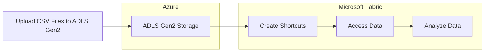

# Fabric: Data Virtualization Capabilities

Costa Rica

 

[brown9804](https://github.com/brown9804)

Last updated: 2024-12-31

----------

Data Virtualization can be leveraged either through a dedicated tool or an integrated approach:

> `Dedicated Tool`: Traditional data virtualization tools (e.g., Denodo, Informatica, etc) are specifically designed for data virtualization.  
> `Integrated Approach`: Microsoft Fabric provides data virtualization capabilities by integrating a range of services, each specializing in areas such as data integration (Azure Data Factory), storage (Data Lake Storage), querying (Azure Synapse Analytics), and visualization (Power Bi).

> Considerations:  
> - **Scalability**: Ensure your ingestion process can handle varying data volumes and can scale up or down as needed.  
> - **Latency**: Consider the acceptable latency for your use case. Real-time ingestion requires low latency, while batch ingestion can tolerate higher latency.  
> - **Data Quality**: Implement data validation and cleansing during the ingestion process to ensure the quality of the ingested data.  
> - **Security**: Secure data in transit and at rest using encryption and access control mechanisms.

## Wiki 

<b>Table of Wiki </b> (Click to expand)

- [What is Microsoft Fabric?](https://learn.microsoft.com/en-us/fabric/get-started/microsoft-fabric-overview)
- [Introducing Microsoft Fabric: Data analytics for the era of AI](https://azure.microsoft.com/en-us/blog/introducing-microsoft-fabric-data-analytics-for-the-era-of-ai/)
- [Step-by-Step Tutorial: Building ETLs with Microsoft Fabric](https://techcommunity.microsoft.com/blog/fasttrackforazureblog/step-by-step-tutorial-building-etls-with-microsoft-fabric/3885183)
- [What is Data Science in Microsoft Fabric?](https://learn.microsoft.com/en-us/fabric/data-science/data-science-overview)
- [Microsoft Fabric security white paper](https://learn.microsoft.com/en-us/fabric/security/white-paper-landing-page)
- [Microsoft Fabric security white paper - Git repo](https://github.com/MicrosoftDocs/fabric-docs/blob/main/docs/security/white-paper-landing-page.md)
- [Getting from Azure Data Factory to Data Factory in Microsoft Fabric](https://learn.microsoft.com/en-us/fabric/data-factory/compare-fabric-data-factory-and-azure-data-factory)
- [Data virtualization with Azure SQL Managed Instance](https://learn.microsoft.com/en-us/azure/azure-sql/managed-instance/data-virtualization-overview?view=azuresql&tabs=managed-identity)
- [Data virtualization now generally available in Azure SQL Managed Instance](https://techcommunity.microsoft.com/blog/azuresqlblog/data-virtualization-now-generally-available-in-azure-sql-managed-instance/3624292)
- [Announcing Data virtualization with Azure SQL Managed Instance – preview](https://techcommunity.microsoft.com/blog/azuresqlblog/announcing-data-virtualization-with-azure-sql-managed-instance-%E2%80%93-preview/3250347)
- [What are shortcuts?](https://learn.microsoft.com/en-us/fabric/onelake/onelake-shortcuts#what-are-shortcuts)
- [Create an Azure Data Lake Storage Gen2 shortcut](https://learn.microsoft.com/en-us/fabric/onelake/create-adls-shortcut)
- [Azure Data Lake Storage hierarchical namespace](https://learn.microsoft.com/en-us/azure/storage/blobs/data-lake-storage-namespace)
- [Overview of Copilot for Power BI](https://learn.microsoft.com/en-us/power-bi/create-reports/copilot-introduction#copilot-requirements)

## Content

<b>Table of Content </b> (Click to expand)

- [Wiki](#wiki)
- [Content](#content)
- [What is Data Virtualization?](#what-is-data-virtualization)
    - [Key Features & Fabric Components](#key-features--fabric-components)
    - [Benefits:](#benefits)
    - [Data Ingestion](#data-ingestion)
        - [Key Components of Data Ingestion](#key-components-of-data-ingestion)
        - [Examples of Data Ingestion](#examples-of-data-ingestion)
    - [Data Integration](#data-integration)
        - [Key Components of Data Integration](#key-components-of-data-integration)
        - [Examples of Data Integration](#examples-of-data-integration)
    - [Example of how DV looks in Azure SQL MI](#example-of-how-dv-looks-in-azure-sql-mi)
- [Demo](#demo)
    - [Step 1: Set Up Your Environment](#step-1-set-up-your-environment)
    - [Step 2: Ingest Data & Data Integration](#step-2-ingest-data--data-integration)
    - [Step 3: Query and Analyze Data](#step-3-query-and-analyze-data)

## What is Data Virtualization?

> Data virtualization is a data management approach that `allows applications to retrieve and manipulate data without needing to know the technical details about the data, such as its format or physical location`.
> Is `commonly used in business intelligence, service-oriented architecture, cloud computing, and master data management`. It helps organizations `make data-driven decisions by providing a comprehensive and up-to-date view of their data`.

###  Key Features & Fabric Components

| Key Features | Fabric Component |
| --- | --- |
| **Unified Data Access**: Provides a single access layer for data from multiple sources, such as databases, data warehouses, and cloud services | - **OneLake**: Acts as a unified data lake, enabling seamless access to data from various sources. Centralizes data storage, making it easier to access and manage data from different sources.   - **Azure Synapse Analytics**: Allows querying across different data sources without moving the data, providing a virtualized view. Offers a unified analytics platform that integrates big data and data warehousing, allowing for seamless data querying and analysis. |
| **Real-Time Data Integration**: Allows real-time access to data without moving it from its original location | - **Shortcuts and Mirroring (Data Factory)**: Facilitate real-time data integration and transformation, allowing you to work with data in its original location.   - **Real-Time Intelligence**: Supports real-time analytics and insights, enhancing decision-making processes.   - **Azure Stream Analytics**: Processes real-time data streams for immediate insights. Provides real-time data processing capabilities, enabling you to analyze data as it arrives. |
| **Flexibility and Efficiency**: Users can access and combine data quickly and cost-effectively, accelerating data delivery and decision-making | **Microsoft Fabric**: Provides a comprehensive data management and analytics solution.   - **Power BI**: Connects to various data sources to create interactive reports and dashboards, enhancing data-driven decision-making. Enhances data visualization and reporting, allowing users to create interactive and insightful dashboards.   - **Azure Data Factory**: Enables flexible data integration and transformation workflows. |

  

###  Benefits:
- **Reduced Data Movement**: Minimizes the need to move data, reducing the risk of errors and ensuring the most current data is used.
- **Simplified Data Integration**: Makes it easier to integrate data from various sources, providing a unified view of the data.
- **Enhanced Data Governance**: Centralizes data security and governance, making it easier to manage and enforce policies.

### Data Ingestion

**Data ingestion** is the process of `collecting and importing data` from various sources into a centralized storage system, such as a data warehouse or data lake. This process involves several steps and can be performed using different tools and techniques depending on the source and type of data.

#### Key Components of Data Ingestion

1. **Data Sources**:
   - **Structured Data**: Data from relational databases, CSV files, spreadsheets, etc.
   - **Semi-Structured Data**: Data from JSON, XML files, etc.
   - **Unstructured Data**: Data from text files, images, videos, etc.
   - **Streaming Data**: Real-time data from IoT devices, logs, social media feeds, etc.
2. **Ingestion Methods**:
   - **Batch Ingestion**: Collecting and processing data in large chunks at scheduled intervals. Suitable for scenarios where real-time processing is not required.
   - **Real-Time Ingestion**: Continuously collecting and processing data as it arrives. Suitable for scenarios requiring immediate data processing and analysis.
3. **Ingestion Tools**:
   - **Azure Data Factory (ADF)**: A cloud-based data integration service that allows you to create, schedule, and orchestrate data pipelines. It supports a wide range of data sources and destinations.
   - **Azure Stream Analytics**: A real-time analytics service designed to process and analyze streaming data from various sources.
   - **Azure Event Hubs**: A big data streaming platform and event ingestion service capable of receiving and processing millions of events per second.
   - **Azure IoT Hub**: A managed service that enables bi-directional communication between IoT applications and the devices it manages.

#### Examples of Data Ingestion

| Method | Steps |
|--------|-------|
| **Uploading CSV Files to Azure Data Lake Storage (ADLS)** | 1. Prepare your CSV files with the data you want to ingest. 2. Use Azure Storage Explorer or Azure portal to upload the CSV files to a designated container in ADLS. 3. Configure access control and permissions to ensure the data is secure and accessible to authorized users. |
| **Using Azure Data Factory to Copy Data from On-Premises Databases to a Cloud Data Warehouse** | 1. Set up a self-hosted integration runtime in Azure Data Factory to connect to your on-premises database. 2. Create a pipeline in Azure Data Factory with a copy activity to transfer data from the on-premises database to the cloud data warehouse. 3. Schedule the pipeline to run at regular intervals or trigger it based on specific events. |
| **Streaming Data from IoT Devices into a Data Lake** | 1. Set up an Azure IoT Hub to collect data from IoT devices. 2. Use Azure Stream Analytics to process the streaming data in real-time. 3. Output the processed data to Azure Data Lake Storage for further analysis and storage. |

### Data Integration

**Data integration** involves `combining data` from different sources and providing a unified view. This process often includes transforming, cleaning, and enriching the data to ensure consistency and usability. Data integration is crucial for creating a cohesive dataset that can be used for analysis, reporting, and decision-making.

#### Key Components of Data Integration

1. **Data Sources**:
   - **Structured Data**: Data from relational databases, CSV files, spreadsheets, etc.
   - **Semi-Structured Data**: Data from JSON, XML files, etc.
   - **Unstructured Data**: Data from text files, images, videos, etc.
   - **Streaming Data**: Real-time data from IoT devices, logs, social media feeds, etc.
2. **Integration Methods**:
   - **Batch Integration**: Combining data at scheduled intervals.
   - **Real-Time Integration**: Continuously combining and processing data as it arrives.
3. **Integration Tools**:
   - **Azure Data Factory (ADF)**: For batch and real-time data integration.
   - **Azure Synapse Analytics**: For data warehousing and big data analytics.
   - **Azure Stream Analytics**: For real-time data processing.
   - **Azure Data Lake Storage (ADLS)**: For storing integrated data.
   - **Power BI**: For data visualization and reporting.

#### Examples of Data Integration

| Method | Steps |
|--------|-------|
| **Combining Sales Data from Multiple Regions into a Single Dataset for Analysis** | 1. Use Azure Data Factory to create pipelines that extract sales data from different regional databases. 2. Transform the data to ensure consistency (e.g., currency conversion, date format standardization). 3. Load the transformed data into a central data warehouse or data lake for unified analysis. |
| **Using Shortcuts and Mirroring to Enable Real-Time Data Integration** | 1. Create shortcuts in Microsoft Fabric to link data from different sources (e.g., ADLS, S3, GCS). 2. Use mirroring to synchronize data between the source and the target in real-time. 3. Access and analyze the integrated data in real-time using tools like Azure Synapse Analytics. |
| **Setting Up Real-Time Intelligence to Process and Analyze Streaming Data from Various Sources** | 1. Set up Azure IoT Hub or Azure Event Hubs to collect streaming data from various sources. 2. Use Azure Stream Analytics to process the streaming data in real-time. 3. Output the processed data to Azure Data Lake Storage or Azure Synapse Analytics for further analysis and visualization. |

### Example of how DV looks in Azure SQL MI

> Querying Azure Data Lake Storage files from Azure SQL Managed Instance via T-SQL queries:

## Demo 

> This setup demo how to use Microsoft Fabric and its integrated services to provide a comprehensive data management and analytics solution, achieving data virtualization.

### Step 1: Set Up Your Environment

1. **Create a Microsoft Fabric Workspace**:
   - Sign in to the [Microsoft Fabric portal](https://app.fabric.microsoft.com/).
   - Navigate to `Workspaces` > `New Workspace`.

       

   - Fill out the workspace details and select `Apply`.

        

2. **Create a Data Warehouse and Lakehouse**: Click [here to see more information about these types of data architecture](https://github.com/brown9804/MicrosoftCloudEssentialsHub/blob/main/0_Azure/2_AzureAnalytics/0_Fabric/demos/17_Overview.md#lakehouse--data-warehouse)
   - In your workspace, select `New Item` > `Warehouse` to create a Data Warehouse `-> structured`.

     

     

     

   - Similarly, select `New Item` > `Lakehouse` to create a Lakehouse `-> both structured + unstructured`.
  
     

     

     

     

### Step 2: Ingest Data & Data Integration

> Data ingestion (getting data into your system):   
> - Uploading CSV files to Azure Data Lake Storage (ADLS).  
> - Using Azure Data Factory to copy data from on-premises databases to a cloud data warehouse.  
> - Streaming data from IoT devices into a data lake.  
> Data integration (combining and processing data from different sources in real-time):  
> - Combining sales data from multiple regions into a single dataset for analysis.  
> - Using shortcuts and mirroring to enable real-time data integration, allowing data from different sources to be accessed and analyzed together.  
> - Setting up real-time intelligence to process and analyze streaming data from various sources.

> Data ingestion by Shortcuts:

  

1. **Upload Data to Azure Data Lake Storage (ADLS)**:

   - Upload your sample datasets (e.g., Sale-SalesOrderHeader, Sales-SalesOrderDetail, health-samples) to ADLS Gen2.

     

> [!IMPORTANT]
> Use Shortcuts and Mirroring to enable real-time data integration. Click [here to see a quick guide](https://github.com/brown9804/MicrosoftCloudEssentialsHub/blob/main/0_Azure/2_AzureAnalytics/0_Fabric/demos/17_Overview.md#shortcuts--mirroring)

> [!NOTE]
> The ability to create shortcuts in Microsoft Fabric is available starting from the F64 SKU and higher. This feature allows you to create symbolic links to data stored in external storage systems like ADLS Gen 2, S3, or GCS, enabling in-place reads and writes without copying the data. Click [here for more information about it](https://learn.microsoft.com/en-us/fabric/enterprise/fabric-features).  
> Please ensure that Hierarchical Namespaces are enabled on your ADLS Gen 2 storage account.

> Once completed:

2. **Create Shortcuts in the Lakehouse**:

   - In the Lakehouse explorer, hover over the `Tables` folder and select `New Shortcut`.

     

   - Choose `ADLS Gen2` as the external source and provide the necessary details to link your data.

     

    - Use an existing connection or create one to your `ADLS Gen2`:

      

      

      

      

      

> Set Up Data Integration by Data Factory

1. **Create a Data Pipeline in Azure Data Factory**:
   - Please create a subfolder in the lakehouse to store the information extracted from the ADLS:
   
     

   - Navigate to **Data Factory** in your Microsoft Fabric workspace.
   - Create a new data pipeline and use the **Copy Data** tool to configure your data source and destination.
   - Select your sample dataset from ADLS as the source and your Data Warehouse as the destination.

     

     

     

     | Source | Destination |
     | --- | --- |
     |  |  | 

   - Remember to `Save`, and `Validate, Run`:

     

     

### Step 3: Query and Analyze Data

1. To generate reports, we need to build tables from the CSV files to create the semantic model. We can achieve this either through the shortcut or by using the extracted information. In this scenario, let's assume the shortcut represents the gold layer, meaning all the data in CSV format is ready for use. I will proceed to load that information into tables.

   

   

   

    > At this point, you will find the following objects in your workspace:
    
    

2. **Create Interactive Reports with Power BI**:
   - To create interactive dashboards and reports for data visualization, connect Power BI to your semantic model. Click on `...` on your semantic model.

       
   
   - We can leverage `Copilot` capabilities to automatically generate a report based on our semantic model and further edit it.

        

        

  <h3 style="color: #4CAF50;">Total Visitors</h3>
  

