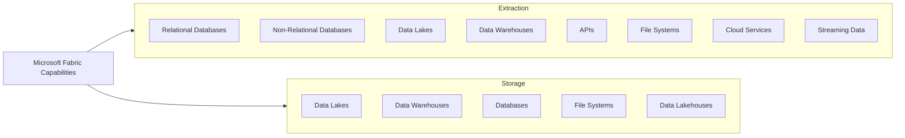

# Data Extraction & Storage

Costa Rica

[brown9804](https://github.com/brown9804)

Last updated: 2024-08-22

----------

| Feature                | Description                                    |
|------------------------|------------------------------------------------|
| Unified Data Integration | Combines citizen and professional data integration |
| Connectivity           | Supports over 100 different data sources       |
| Automation             | Uses AI and metadata for data enrichment       |
| Scalability            | Handles large-scale data operations efficiently|
| Security               | Ensures data security and compliance           |

## Data Extraction & Storage Capabilities

| Capability Type        | Source/Storage Type       | Examples                                      |
|------------------------|---------------------------|-----------------------------------------------|
| Extraction        | Relational Databases      | SQL Server, Oracle, MySQL, PostgreSQL         |
| Extraction        | Non-Relational Databases  | MongoDB, Cassandra                            |
| Extraction        | Data Lakes                | Azure Data Lake, Amazon S3                    |
| Extraction        | Data Warehouses           | Azure Synapse Analytics, Snowflake            |
| Extraction        | APIs                      | REST APIs, OData                              |
| Extraction        | File Systems              | CSV, JSON, XML files                          |
| Extraction        | Cloud Services            | Azure Blob Storage, Google Cloud Storage      |
| Extraction        | Streaming Data            | Kafka, Event Hubs                             |
| Storage           | Data Lakes                | Azure Data Lake Storage, Amazon S3            |
| Storage           | Data Warehouses           | Azure Synapse Analytics, Snowflake            |
| Storage           | Databases                 | SQL Server, PostgreSQL, MySQL                 |
| Storage           | File Systems              | Local and cloud-based file storage            |
| Storage           | Data Lakehouses           | Combining data lakes and data warehouses      |
