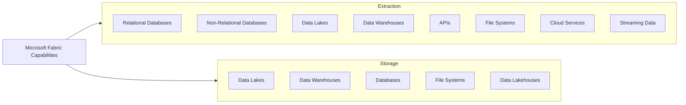

# Data Extraction & Storage

Costa Rica

[brown9804](https://github.com/brown9804)

Last updated: 2024-08-22

----------

## Wiki 

- [Security in Microsoft Fabric](https://learn.microsoft.com/en-us/fabric/security/security-overview)
- [Microsoft Fabric end-to-end security scenario](https://learn.microsoft.com/en-us/fabric/security/security-scenario)

| Feature                | Description                                    |
|------------------------|------------------------------------------------|
| Unified Data Integration | Combines citizen and professional data integration |
| Connectivity           | Supports over 100 different data sources       |
| Automation             | Uses AI and metadata for data enrichment       |
| Scalability            | Handles large-scale data operations efficiently|
| Security               | Ensures data security and compliance           |

## Data Extraction & Storage Capabilities

| Capability Type        | Source/Storage Type       | Examples                                      |
|------------------------|---------------------------|-----------------------------------------------|
| Extraction        | Relational Databases      | SQL Server, Oracle, MySQL, PostgreSQL         |
| Extraction        | Non-Relational Databases  | MongoDB, Cassandra                            |
| Extraction        | Data Lakes                | Azure Data Lake, Amazon S3                    |
| Extraction        | Data Warehouses           | Azure Synapse Analytics, Snowflake            |
| Extraction        | APIs                      | REST APIs, OData                              |
| Extraction        | File Systems              | CSV, JSON, XML files                          |
| Extraction        | Cloud Services            | Azure Blob Storage, Google Cloud Storage      |
| Extraction        | Streaming Data            | Kafka, Event Hubs                             |
| Storage           | Data Lakes                | Azure Data Lake Storage, Amazon S3            |
| Storage           | Data Warehouses           | Azure Synapse Analytics, Snowflake            |
| Storage           | Databases                 | SQL Server, PostgreSQL, MySQL                 |
| Storage           | File Systems              | Local and cloud-based file storage            |
| Storage           | Data Lakehouses           | Combining data lakes and data warehouses      |

## Secure Data Extraction

Some key aspects:

1. Authentication and Access Control
    - **Microsoft Entra ID**: All interactions with Fabric are authenticated using Microsoft Entra ID, ensuring secure access from any device and network.
    - **Role-Based Access Control (RBAC)**: Access to data is managed based on user roles, ensuring that only authorized personnel can access sensitive data.
2. Data Encryption
    - **Data in Transit**: All data transferred within Fabric is encrypted by default, protecting it from interception during extraction.
    - **Data at Rest**: Data stored in Fabric is automatically encrypted, ensuring it remains secure even when not in use.
3. Network Security
    - **Private Links and Conditional Access**: Fabric can use private links and conditional access policies to regulate and secure data access, especially for data behind firewalls or within private networks.
    - **Trusted Access**: Fabric can securely connect to data sources protected by firewalls or private networks, ensuring data is not exposed to the public internet.
4. Compliance and Governance
    - **Compliance Standards**: Fabric supports a wide range of compliance standards, ensuring data security and regulatory compliance.
    - **Governance Tools**: Features like data lineage, information protection labels, and data loss prevention help manage and secure data throughout its lifecycle.
5. Automation and Monitoring
    - **Automated Security Protocols**: Security protocols, including access controls and encryption, are automated to reduce human error and ensure consistent application.
    - **Threat Monitoring**: Continuous monitoring for vulnerabilities and threats helps maintain a secure environment.

