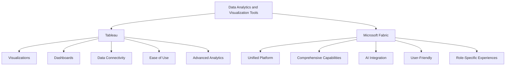

# From Tableau to Microsoft Fabric - Overview 

Costa Rica

[](https://github.com/)
[brown9804](https://github.com/brown9804)

Last updated: 2025-01-08

------------------------------------------

## Wiki 

<details>
<summary><b>Table of Wiki Contents</b> (Click to expand)</summary>

- [Time intelligence functions](https://learn.microsoft.com/en-us/dax/time-intelligence-functions-dax)
- [Time Intelligence: Calendar Table](https://community.fabric.microsoft.com/t5/Power-BI-Community-Blog/Time-Intelligence-Calendar-Table/ba-p/1000565)
- [Understand star schema and the importance for Power BI](https://learn.microsoft.com/en-us/power-bi/guidance/star-schema)
- [Use Show Me to Start a View - Tableau](https://help.tableau.com/current/pro/desktop/en-us/buildauto_showme.htm)
- [Shelves and Cards Reference  - Tableau](https://help.tableau.com/current/pro/desktop/en-us/buildmanual_shelves.htm)
- [Apply conditional formatting in tables and matrixes](htt)ps://learn.microsoft.com/en-us/power-bi/create-reports/desktop-conditional-table-formatting
- [Optimization guide for Power BI](https://learn.microsoft.com/en-us/power-bi/guidance/power-bi-optimization)
- [Use Performance Analyzer to examine report element performance in Power BI Desktop](https://learn.microsoft.com/en-us/power-bi/create-reports/desktop-performance-analyzer)

</details>

## Content 

<details>
<summary><b>Table of Contents</b> (Click to expand)</summary>


</details>


## Overview 



| Feature                | Tableau                                                                 | Microsoft Fabric                                                                 |
|------------------------|-------------------------------------------------------------------------|----------------------------------------------------------------------------------|
| **Data Visualization** | Create various visualizations like bar charts, line graphs, and maps    | Integrates with Power BI for comprehensive visualizations                        |
| **Dashboards**         | Build interactive dashboards combining multiple visualizations          | Unified platform for creating detailed reports and dashboards                    |
| **Data Connectivity**  | Connects to spreadsheets, databases, and cloud services                 | Integrates Azure Data Factory, Synapse Analytics, and more                       |
| **Ease of Use**        | User-friendly drag-and-drop interface                                   | Simplified SaaS model for a unified experience                                   |
| **Advanced Analytics** | Supports trend analysis, forecasting, and statistical analysis          | Incorporates AI capabilities for advanced analytics                              |
| **Unified Platform**   | Focused on visual analytics                                             | End-to-end platform covering data movement, processing, and real-time event routing |
| **Role-Specific**      | Suitable for both technical and non-technical users                     | Tailored experiences for data engineers, data scientists, and business users      |

## Migration Considerations

> Tableau -> Power BI Migration Considerations:

| Category               | Considerations                          |
|------------------------|-----------------------------------------|
| **Data Ingestion**     | - **Power Query Editor**: Used for data transformation and preparation. <br/> - **Datasets and Dataflows**: Manage and reuse data across multiple reports. <br/> - **Data connectors**: Connect to various data sources, including databases, cloud services, and files. <br/> - **Incremental Refresh**: Load only new or changed data to improve efficiency. <br/> - **Data Gateway**: Ensure secure data transfer between on-premises data sources and Power BI Service. |
| **Data Modelling**     | - **Star schema**: Organize data into fact and dimension tables for efficient querying. <br/> - **Calculated columns**: Create new data columns based on existing data. <br/> - **Measures**: Define calculations using DAX (Data Analysis Expressions) for dynamic data analysis. <br/> - **Organize and simplify**: Structure your model for clarity and performance. <br/> - **Relationships**: Define how tables relate to each other to enable accurate data analysis. |
| **Visualizations**     | - **Create visuals**: Build interactive charts, graphs, and dashboards. <br/> - **Perform analytics (AI)**: Use AI features like Q&A, insights, and forecasting to enhance data analysis. <br/> - **Custom Visuals**: Import and use custom visuals from the Power BI marketplace. <br/> - **Themes**: Apply consistent styling across reports using themes. |
| **Optimization**       | - **Optimize data load**: Improve performance by reducing data load times and managing data refresh schedules. <br/> - **Optimize visualizations**: Enhance the performance and responsiveness of your visuals. <br/> - **Aggregations**: Use aggregated tables to speed up query performance. <br/> - **Performance Analyzer**: Identify and resolve performance issues in your reports. |
| **Lifecycle**          | - **Connect to data**: Establish connections to your data sources. <br/> - **Shape your data**: Clean and transform data to fit your analysis needs. <br/> - **Build your reports**: Create comprehensive reports with visuals and insights. <br/> - **Share your work**: Distribute reports and dashboards to stakeholders. <br/> - **Version Control**: Track changes and manage versions of your reports. |
| **Sharing & Collaboration** | - **Power BI Service**: Share reports and collaborate with others through the Power BI cloud service. <br/> - **Workspaces**: Organize and manage content within collaborative workspaces. <br/> - **Apps**: Package and distribute collections of related reports and dashboards. |
| **Licensing**          | - **E5 Pro Licensing**: Advanced features and capabilities for enterprise users. <br/> - **Per user Licensing**: Flexible licensing options based on individual user needs. <br/> - **Premium Capacity tiers**: Scalable options for larger organizations with higher data and user demands. <br/> - **Embedded Licensing**: Integrate Power BI content into custom applications. |
| **Governance & Admin** | - **Admin Portal**: Manage and monitor Power BI usage and settings. <br/> - **Metrics App**: Track and analyze usage metrics and performance. <br/> - **Data Security**: Implement row-level security and data protection measures. <br/> - **Compliance**: Ensure adherence to data governance and compliance standards. |
| **End Users**          | - **Upskilling & training**: Provide training and resources to help users become proficient in Power BI. <br/> - **User Adoption**: Encourage and support the adoption of Power BI across the organization. <br/> - **Support Resources**: Offer access to documentation, tutorials, and community forums. |
| **Migration Approach** | - **Migration process & guidance**: Follow best practices and guidelines for a smooth transition from Tableau to Power BI. <br/> - **Assessment**: Evaluate current Tableau usage and identify migration requirements. <br/> - **Planning**: Develop a detailed migration plan, including timelines and resource allocation. <br/> - **Execution**: Carry out the migration process, including data transfer, model rebuilding, and report recreation. <br/> - **Validation**: Test and validate the migrated content to ensure accuracy and performance. |

## Lifecycle Comparison

| Stage                  | Prepare                                                                 | Explore                                                                 | Visualize                                                                 | Share and Collaborate                                                                 |
|------------------------|-------------------------------------------------------------------------|------------------------------------------------------------------------|---------------------------------------------------------------------------|---------------------------------------------------------------------------------------|
| **Power BI product**   | Power Query Editor: A powerful data transformation tool that allows users to clean, transform, and load data from various sources. It supports a wide range of data sources and provides a user-friendly interface for data shaping and transformation. | Power BI Desktop: A comprehensive tool for data modeling, exploration, and analysis.| Power BI Desktop/Web-Edit: Create interactive visuals and dashboards. | Power BI Service: A cloud-based service for sharing and collaborating on reports and dashboards. |
| **Definition**         | Connect to data sources. Clean and transform.                           | - **Define Relationships**: Establish connections between different data tables to create a cohesive data model. <br/> - **DAX Calculations**: Use Data Analysis Expressions (DAX) to create custom calculations and measures, enabling advanced data analysis and insights. <br/> - Look for patterns and insights in the cleaned data. | - **Custom Visuals**: Import and use custom visuals from the Power BI marketplace to enhance your reports. <br/> - **R/Python Integration**: Use R or Python scripts to create advanced visuals and perform statistical analysis, providing flexibility for complex data visualization needs.      | - **Permissions and Security**: Manage access and security settings for reports and datasets, ensuring data privacy and compliance. <br/> - **Embed Visuals**: Integrate Power BI visuals into other applications, such as websites, Microsoft Teams, SharePoint, etc. <br/> - **Subscriptions**: Set up email subscriptions for report updates, keeping stakeholders informed. <br/> - **Data Flows**: Create reusable data preparation workflows to streamline data management processes. |
| **Tableau equivalent** | - Tableau Prep: A tool for preparing and cleaning data before analysis. It allows users to combine, shape, and clean their data for analysis. <br/> - Alteryx: An advanced data preparation tool that integrates with Tableau, offering powerful data blending and transformation capabilities. | Tableau Desktop: A tool for data exploration and analysis, allowing users to create complex calculations and relationships. <br/> - **Data Blending**: Combine data from multiple sources to create a unified view. <br/> - **Calculated Fields**: Create custom calculations to derive new insights from your data. | Tableau Desktop: Create interactive and visually appealing dashboards and reports. <br/> - **Custom Visuals**: Use Tableau's extensive library of visualizations or create custom ones to meet specific needs. <br/> - **Storytelling**: Build data stories to guide users through insights and findings. | Tableau Online/Tableau Cloud: A cloud-based platform for sharing and collaborating on Tableau dashboards and reports. <br/> - **Permissions and Security**: Manage user access and security settings to protect sensitive data. <br/> - **Embed Visuals**: Integrate Tableau visuals into other applications, such as websites or intranet portals. <br/> - **Subscriptions**: Set up email subscriptions for report updates, ensuring users receive the latest information. |

## Data Ingestion

### Essentials for Developers

> Features `that makes Power BI a versatile and powerful tool for developers`, enabling them to create robust data models, perform advanced calculations, and share insights effectively.

| Feature                     | Description                                                                                       | Importance for Developers|
|-----------------------------|---------------------------------------------------------------------------------------------------|-------------------------------------------------------------------------------------------|
| **Power Query Editor**      | A powerful tool for data transformation and preparation. Allows users to clean, shape, and combine data from various sources. | Essential for preparing data before analysis, ensuring data quality and consistency.       |
| **DAX (Data Analysis Expressions)** | A formula language used for creating custom calculations and aggregations in Power BI. | Crucial for building sophisticated data models and performing complex calculations.|
| **Data Modeling**           | Tools for creating relationships between tables, defining calculated columns, and measures.      | Important for structuring data in a way that supports efficient analysis and reporting.|
| **Row-Level Security (RLS)**| Allows developers to create security roles to restrict data access based on user roles.          | Ensures data privacy and compliance by controlling who can see specific data.|
| **Power BI Service**        | A cloud-based platform for sharing and collaborating on reports and dashboards.                  | Enables collaboration and sharing of insights across the organization.|
| **Custom Visuals**          | Ability to import and use custom visuals from the Power BI marketplace.                          | Provides flexibility to create tailored visualizations that meet specific business needs.  |
| **R/Python Integration**    | Support for using R and Python scripts to create advanced visuals and perform statistical analysis. | Allows for advanced data analysis and visualization beyond the built-in capabilities.      |
| **Dataflows**               | Reusable data preparation workflows that can be shared across multiple reports and dashboards.   | Streamlines data management processes and ensures consistency across different projects.   |
| **AI Insights**             | Built-in AI features that help discover trends and make predictions based on data.               | Enhances data analysis with advanced machine learning capabilities. |

###   Data Connection Types

| Feature| Import Mode| Direct Query Mode|
|-----------------------------|--------------------------------------------------------------------------------------------------------------------------------------------------------------------------------------------------------------|------------------------------------------------------------------------------------------------------------------------------------------------------------------------------------------------------------------------------------------|
| **Definition**              | Delivers fast performance by importing the data, loading it into memory, and storing it to disk. Data is cached in Power BI, allowing for quick interactions and visualizations.| Allows analysts to query the data source on request to return results. Data is not stored in Power BI; instead, queries are sent to the data source in real-time, ensuring up-to-date information.|
| `Tableau Equivalent`     | `Extracts`. Tableau extracts data from the source and stores it locally for fast performance.| `Live connection`. Tableau connects directly to the data source, querying it in real-time without storing the data locally.|
| **Performance**             | Optimized with cached data for fast results. Suitable for datasets up to 1 GB (compressed).| Dependent on data source and query complexity. Performance can vary based on the data source's capabilities and network latency.|
| **Data Storage**            | Data is fully loaded into Power BI’s memory and stored on disk. This allows for offline access and quick data retrieval.| Data remains in the source; only the schema is stored in Power BI. This reduces storage requirements but requires a constant connection to the data source.|
| **Dataset Size**            | Up to 1 GB compressed (Power BI Pro). Larger datasets can be handled with Power BI Premium.| Unlimited (limited only by the source system). Suitable for very large datasets that exceed Power BI's import limits.|
| **Row Limit**               | No limit for in-memory models.| 1 million rows per query, per visual. This limitation can impact the ability to display large datasets in a single visual.|
| **Refresh Frequency**       | Scheduled refresh (hourly or daily). Data is refreshed at set intervals, ensuring the dataset is up-to-date.| Real-time querying on demand. Data is always current, as queries are executed against the live data source.|
| **Security**                | Fully supports Row-Level Security (RLS) within Power BI. Security roles can be defined to restrict data access based on user roles.| Relies on source-level RLS; complex to configure. Security must be managed at the data source level, which can be more challenging to implement.|
| **Unsupported Features**    | Fully supported. All Power BI features, including Data View, Calculated Tables, and advanced DAX functions, are available.| Limited; e.g., Data View, Calculated Tables, and some DAX functions are unavailable. Certain features and functions are restricted in Direct Query mode.                                                                                   |
| **Quick Insights**          | Fully available. Power BI can generate insights based on the imported data.| Unavailable in Direct Query mode. Quick Insights feature is not supported when using Direct Query.|
| **Data Transformations**    | All transformations supported. Users can perform complex data transformations within Power BI using Power Query Editor.| Limited; complex transformations must be performed at the source. Only basic transformations are supported within Power BI, requiring more advanced transformations to be handled at the data source.                                      |
| **Advanced DAX Functions**  | Fully supported, including row-level and time intelligence. Power BI's full range of DAX functions can be used for calculations and analysis.| Functions like PATH, DATEADD, and complex aggregations may be restricted. Some advanced DAX functions are not available in Direct Query mode, limiting the complexity of calculations that can be performed.                               |
| **Offline Access**          | Fully supported. Users can interact with the data and reports offline, as the data is stored locally in Power BI.| Not available; always requires a connection to the data source. Users must be online to access and interact with the data.|
| **Supported Data Sources**  | All supported. Power BI can import data from a wide range of sources, including Excel, CSV, databases, cloud services, and more.| Limited to Direct Query-compatible sources like SQL Server, Oracle, and SAP HANA. Only certain data sources support Direct Query mode, which can limit the flexibility of data connections.                                                |
| **Storage Space**           | Requires storage space for the imported data on Power BI Service.| Does not require storage space for data on Power BI Service, as data is not cached. This can reduce storage costs and improve performance for large datasets.|
| **File Size**               | Power BI Desktop files can be large due to the cached data.| Power BI Desktop files are smaller and easier to work with, as they do not contain cached data. This can result in faster saving and publishing times.|
| **Data Scheduling**         | Data is refreshed based on a schedule, ensuring periodic updates.| Data is queried from the data source in real-time, providing the most up-to-date information. This can be beneficial for scenarios requiring live data.|
| **Switching Modes**         | Users can switch from Import to Direct Query mode if needed, but it may require reconfiguring the data model and queries.| Users can switch from Direct Query to Import mode, which involves importing the data and potentially reconfiguring the data model.|

## Data Transformation

| Feature| Tableau Prep | Power Query Editor |
|-----------------------------|--------------------------------------------------------------------------------------------------------------------------------------------------------------------------------------------------------------|------------------------------------------------------------------------------------------------------------------------------------------------------------------------------------------------------------------------------------------|
| **Price**                   | $70/user/month for Creator bundle| Free|
| **Integration**             | Stand-alone (with preview in Tableau Desktop). Tableau Prep is a separate tool that integrates with Tableau Desktop for visualization and analysis.| Integrated with Power BI and Excel. Power Query Editor is built into Power BI and Excel, providing a seamless experience for data preparation and analysis within these environments.|
| **Prepackaged Connectors**  | Total as now 26, connects to a variety of data sources including databases, cloud services, and flat files.| Total as now 70, offers a wide range of connectors to databases, cloud services, web services, and more, providing extensive data connectivity options.|
| **Custom Connectors**       | No. Limited to prepackaged connectors.| Yes. Supports custom connectors through the Power Query SDK, allowing developers to create connectors for additional data sources.|
| **Row-level transformations** | Pivot, join, union. Allows users to reshape data at the row level, combining and transforming data as needed.| Keep rows, remove rows, remove duplicates, promote headers, group by, merge, append, pivot, transpose, combine files. Provides a comprehensive set of row-level transformations for data cleaning and preparation.|
| **Column-level transforms** | Copy, remove, duplicate, column from example, calculated column, remove, remove duplicates, remove errors, change type, rename, transform (lower, upper, trim, etc.), replace values, replace errors, split column, index column, group by, fill, pivot, move, format, extract, number column (statistics, standard, scientific, math), date and time column, R script. Extensive set of column-level transformations for data manipulation. | Filter (formula required), group and replace, clean (upper, lower, trim, remove characters), split, rename, remove, calculated field. Provides essential column-level transformations for data preparation, though less extensive than Power Query. |
| **Interactive graphical step flow** | Yes. Provides a visual interface to see and interact with the data preparation steps, making it easier to understand and modify the data flow.| No (static Query Dependencies diagram). Displays a static diagram of query dependencies, which helps visualize the data transformation steps but is not interactive.|
| **Parameters**              | No. Does not support parameterization of data preparation steps.| Yes. Allows users to create parameters to dynamically change values in queries, making data preparation more flexible and reusable.|
| **Use R for data prep**     | No. Does not support the use of R scripts for data preparation.| Yes. Supports the use of R scripts to perform advanced data transformations and statistical analysis.|
| **User-created tables**     | No. Does not allow users to create new tables within the data preparation process.| Yes. Allows users to create new tables from existing data, providing more flexibility in data modeling and preparation.|
| **Detect and expand relationships in data source** | No (one data source at a time). Limited to working with a single data source at a time, without automatic relationship detection.| Yes. Can detect and expand relationships between multiple data sources, enabling more complex data models and analyses.|
| **Functions (to centralize common logic)** | No. Does not support the creation of reusable functions for common data preparation logic.| Yes. Allows users to create functions to centralize and reuse common data preparation logic, improving efficiency and consistency.|
| **Script (all transformations in one place)** | No. Does not provide a single script view for all transformations.| Yes. Provides a script view where all transformations are listed in one place, making it easier to review and modify the data preparation process.|
| **Calculation language**    | Tableau calculation language. Uses a proprietary calculation language for creating calculated fields and transformations.| Power Query M language. Uses the M language for data transformations, which is powerful and flexible for complex data preparation tasks.|
| **Output destination**      | Save as TDE, Hyper, CSV, preview in Desktop. Outputs data to Tableau's proprietary formats or CSV, with the option to preview in Tableau Desktop.| Directly into PBI data model, Excel sheet (Power Query in Excel only). Outputs data directly into the Power BI data model or Excel, providing seamless integration with these tools.                                                                 |
| **Output options**          | One output from Tableau Prep file (Tableau model can’t handle multiple tables). Limited to a single output per Tableau Prep file, which can be a limitation for complex data models.| One table in the model per query (typically). Typically outputs one table per query, but allows for multiple queries to be combined in the Power BI data model, providing more flexibility for complex data models.|

## Data Modelling 

> The **Power BI** Data Modelling tab is where you can create relationships between your tables, appropriate relationships will automatically be detected, but you also have the flexibility to change the definition. This is very similar to the Relationships experience in **Tableau**.

### Data Modelling – Dataflows
> Dataflows in **Power BI** allows you to centralize your Extract, Transform, Load process, it is like building a **Tableau** flow, `but making it reusable and easily accessible to other users.` You build Dataflows on **Power BI Service** through a no code/low code Power Query experience. After your Dataflow is built, you can share it with other users so that they don’t have to go through all the data cleaning and transformation steps again, instead allow them to connect directly to the Dataflow.

### Data Modelling – Date Tables and Time Intelligence

>  Like **Tableau**, whenever you have a date field in **Power BI**, a Date hierarchy will automatically be created to allow drilling. It is recommended to create a separate date table with all dates from the earliest date in your data to the latest day, mark it as a date table, and then join all the date fields to the date table.

- **Creating a Date Table**: In Power BI, you can create a date table using DAX functions like `CALENDAR` or `CALENDARAUTO`. The `CALENDAR` function requires start and end dates, while `CALENDARAUTO` automatically generates a date range based on the data model.
- **Marking as Date Table**: Once the date table is created, you should mark it as a date table in Power BI. This ensures that time-intelligence functions work correctly.
- **Joining Date Fields**: After creating and marking the date table, join all date fields in your data model to this date table. This allows for consistent and accurate time-based analysis across different datasets.

> DAX provides many built-in time-intelligence and date functions, such as: Year to Date, Same Period Last Year, Total Year to Date (Quarter to Date, Month to Date). Whereas Tableau has only a few simple date calculation functions. These functions are essential for analyzing data over time.

- **Year to Date (YTD)**: The `DATESYTD` function returns a table containing the dates for the year to date, which can be used to calculate cumulative totals. From the beginning of the year to the current date.

    ```DAX
    Sales YTD = TOTALYTD(SUM(Sales[Amount]), 'Date'[Date])
    ```

- **Same Period Last Year (SPLY)**: The `SAMEPERIODLASTYEAR` function returns a table that contains a column of dates shifted one year back, useful for year-over-year comparisons. Compares the current period's data to the same period in the previous year.

    ```DAX
    Sales SPLY = CALCULATE(SUM(Sales[Amount]), SAMEPERIODLASTYEAR('Date'[Date]))
    ```

- **Quarter to Date (QTD)**: The `DATESQTD` function returns a table containing the dates for the quarter to date. Calculates the cumulative total from the beginning of the quarter to the current date.
    
    ```DAX
    Sales QTD = TOTALQTD(SUM(Sales[Amount]), 'Date'[Date])
    ```

- **Month to Date (MTD)**: The `DATESMTD` function returns a table containing the dates for the month to date. Calculates the cumulative total from the beginning of the month to the current date.

    ```DAX
    Sales MTD = TOTALMTD(SUM(Sales[Amount]), 'Date'[Date])
    ```
- **Custom Date Ranges**: Functions like `DATESBETWEEN` and `DATEADD` allow for custom date range calculations, providing flexibility for various time-based analyses.


### Data Modelling – Calculations

> **Calculated fields in Tableau** are the equivalent of **Calculated columns and measures in Power BI**. Power BI runs on **DAX (Data Analysis Expressions)** for all calculations. DAX is similar to the formulas you would write in Excel but is more powerful and flexible, allowing for complex data modeling and analysis.

#### Calculated Columns
Calculated columns are created in the data model and are computed during data refresh. They are stored in the model and can be used in slicers, filters, rows, and columns on visuals.

**Examples:**
- Creating a calculated column to sum up all values of the _Amount_ column in the _Sales_ table:

  ```DAX
  Total Sales Amount = SUM(Sales[Amount])
  ```

- Creating a new column in the Sales table called Sales Amount, where it is equal to the Quantity times the Unit Price:
  ```DAX
  Sales Amount = Sales[Quantity] * Sales[Unit Price]
  ```

#### Custom Calculations
DAX allows for custom calculations that can be tailored to specific business needs. These calculations can be simple or complex, depending on the requirements.

**Examples:**
- **Running Total**: Calculates the running total of sales.
  ```DAX
  Running Total Sales = CALCULATE(SUM(Sales[Amount]), FILTER(ALL('Date'), 'Date'[Date] <= MAX('Date'[Date])))
  ```

- **Percentage of Total**: Calculates the percentage of total sales for each product.
  ```DAX
  Sales Percentage = DIVIDE(SUM(Sales[Amount]), CALCULATE(SUM(Sales[Amount]), ALL(Sales)))
  ```

### Data Modelling – Measures

Measures are dynamic calculations that are computed on the fly, based on the context of the report. They are not stored in the model but are calculated as needed, making them more efficient for large datasets.

**Examples:**
- Creating a measure to calculate the total sales amount:
  ```DAX
  Total Sales = SUM(Sales[Amount])
  ```

- Creating a measure to calculate the average sales amount per transaction:
  ```DAX
  Average Sales = AVERAGE(Sales[Amount])
  ```
> [!IMPORTANT]
> - `Calculated columns` do increase your data model size because you are adding another physical column to your model. The alternative, or a better approach, is to use **Power BI measures**. You still write DAX formulas in your measures, but they don’t appear as another physical column and are calculated during run-time whenever they are referenced in your visual. <br/>
> - `Measures` can be referenced from other measures, allowing for complex calculations and aggregations.

| Calculated Columns | Measures |
|--------------------|----------|
| A new column is usually created as a function of other columns. | An aggregated value created with DAX functions. |
| Always associated with a table. | Not associated with a table. |
| Evaluated upon creation. | Evaluated when visual is built. |
| Computed at the row level of the table it's associated with. | Aggregate based on row and filter context: what is on your report page. |

#### Practical Use Cases

1. **Dynamic Calculations**: Measures are ideal for calculations that need to change based on user interactions with the report, such as filtering or slicing data.
   - **Example**: Calculating total sales for the selected region.
     ```DAX
     Total Sales by Region = SUM(Sales[Amount])
     ```

2. **Performance Optimization**: Since measures are calculated on the fly, they do not increase the size of the data model, making them more efficient for large datasets.
   - **Example**: Calculating the average sales amount without adding a new column to the data model.
     ```DAX
     Average Sales = AVERAGE(Sales[Amount])
     ```

3. **Time Intelligence**: Measures can leverage DAX's time intelligence functions to perform complex date and time calculations.
   - **Example**: Calculating year-to-date sales.
     ```DAX
     Sales YTD = TOTALYTD(SUM(Sales[Amount]), 'Date'[Date])
     ```

4. **Conditional Logic**: Measures can include conditional logic to create dynamic calculations based on specific criteria.
   - **Example**: Calculating sales amount with a discount applied if the sales amount exceeds a certain threshold.
     ```DAX
     Discounted Sales = IF(SUM(Sales[Amount]) > 1000, SUM(Sales[Amount]) * 0.9, SUM(Sales[Amount]))
     ```

5. **Referencing Other Measures**: Measures can reference other measures, allowing for layered calculations.
   - **Example**: Creating a measure for total sales and then using it in another measure to calculate the percentage of total sales.
     ```DAX
     Total Sales = SUM(Sales[Amount])
     Sales Percentage = DIVIDE([Total Sales], CALCULATE(SUM(Sales[Amount]), ALL(Sales)))
     ```

  
###  Data Modelling – Conditionals

> In Power BI, you can write logical functions using DAX (Data Analysis Expressions), such as **IF** and **SWITCH**. These functions allow you to create conditional logic in your data models, similar to how you would in Tableau.

#### IF Function

The `IF` function in DAX checks a condition and returns one value if the condition is TRUE, and another value if the condition is FALSE. The syntax for the IF function is:

```DAX
IF(<logical_test>, <value_if_true>[, <value_if_false>])
```

> [!NOTE]
> The `value_if_false` part is optional and can be omitted if not needed.

> **Example:**: Creating a calculated column to categorize products based on their list price. This example checks if the list price of a product is less than 500. If it is, the product is categorized as "Low"; otherwise, it is categorized as "High".

  ```DAX
  Price Group = IF('Product'[List Price] < 500, "Low", "High")
  ```

#### Nested IF Statements

You can also nest multiple IF statements to handle more complex conditions. 

> **Example:** Categorizing products into "Low", "Medium", and "High" price groups. This example first checks if the list price is less than 500. If true, it returns "Low". If false, it checks if the list price is less than 1500. If true, it returns "Medium". Otherwise, it returns "High".

  ```DAX
  Price Group = IF('Product'[List Price] < 500, "Low", 
                   IF('Product'[List Price] < 1500, "Medium", "High"))
  ```


#### SWITCH Function

The **SWITCH** function is an alternative to nested IF statements and provides a more readable way to handle multiple conditions. The syntax for the SWITCH function is:

```DAX
SWITCH(<expression>, <value1>, <result1>, <value2>, <result2>, ..., <else>)
```

> **Example:** Categorizing products based on their list price using `SWITCH`. In this example, the SWITCH function evaluates the conditions in order and returns the corresponding result for the first true condition. If none of the conditions are true, it returns the default value ("High").

  ```DAX
  Price Group = SWITCH(TRUE(),
                       'Product'[List Price] < 500, "Low",
                       'Product'[List Price] < 1500, "Medium",
                       "High")
  ```

#### Practical Use Cases
1. **Conditional Formatting**: Apply conditional formatting to visuals based on specific criteria.
   ```DAX
   Color Code = IF('Sales'[Amount] > 1000, "Green", "Red")
   ```

2. **Dynamic Titles**: Create dynamic titles for visuals based on user selections.
   ```DAX
   Title = IF(SELECTEDVALUE('Date'[Year]) = 2025, "Current Year Sales", "Historical Sales")
   ```

3. **Custom Aggregations**: Perform custom aggregations based on conditions.
   ```DAX
   Custom Total = IF('Sales'[Region] = "North", SUM('Sales'[Amount]), 0)
   ```
### Data Modelling – Star Schemas

Star Schemas are a way to organize your data, where there is one fact table that contains the transactional data, and smaller dimension tables that contain characteristics. The fact table and dimension tables are connected through one-to-many relationships via unique keys. This approach helps avoid data duplication by storing only the key in your fact table.

> The diagram illustrates the relationships between a central fact table ("Sales") and its surrounding dimension tables ("Product," "Sales Territory," "Employee," "Reseller," and "Date").

<p align="center">
  
</p>

#### Key Components of a Star Schema

1. **Fact Table**:
   - **Definition**: The central table in a star schema that contains quantitative data (measures) and foreign keys to dimension tables.
   - **Example**: A Sales fact table might include columns like `SalesID`, `DateKey`, `ProductKey`, `CustomerKey`, `SalesAmount`, and `Quantity`.
   - **Characteristics**: Fact tables typically have a large number of rows and grow over time as new transactions are recorded.

2. **Dimension Tables**:
   - **Definition**: Smaller tables that contain descriptive attributes (dimensions) related to the measures in the fact table.
   - **Example**: A Product dimension table might include columns like `ProductKey`, `ProductName`, `Category`, and `Price`.
   - **Characteristics**: Dimension tables usually have fewer rows compared to fact tables and contain attributes that describe the entities in the fact table.

3. **Relationships**:
   - **Definition**: One-to-many relationships between the fact table and dimension tables, established through unique keys.
   - **Example**: The `ProductKey` in the Sales fact table relates to the `ProductKey` in the Product dimension table, creating a one-to-many relationship.

#### Benefits of Using Star Schemas

> By designing a star schema for your dataset in Power BI, you can optimize performance and usability, especially when filtering and aggregating data. This approach is more efficient than storing all your data as flat files, which can lead to high data redundancy and slower performance.


1. **Performance Optimization**:
   - **Efficient Queries**: Star schemas simplify complex queries by reducing the number of joins needed, leading to faster query performance.
   - **Indexing**: Fact and dimension tables can be indexed separately, improving data retrieval speed.

2. **Data Redundancy Reduction**:
   - **Avoid Duplication**: By storing only the keys in the fact table, star schemas minimize data redundancy and reduce storage requirements.

3. **Improved Usability**:
   - **Simplified Data Model**: Star schemas provide a clear and intuitive data model that is easier to understand and navigate.
   - **Enhanced Filtering**: Dimension tables allow for more efficient filtering and grouping of data, improving the user experience when interacting with reports and dashboards.

#### Practical Example in Power BI

Consider a retail business that wants to analyze sales data. The star schema for this scenario might include the following tables:

- **Fact Table**: `Sales`
  - Columns: `SalesID`, `DateKey`, `ProductKey`, `CustomerKey`, `StoreKey`, `SalesAmount`, `Quantity`
- **Dimension Tables**:
  - **Date**: `DateKey`, `Date`, `Month`, `Quarter`, `Year`
  - **Product**: `ProductKey`, `ProductName`, `Category`, `Price`
  - **Customer**: `CustomerKey`, `CustomerName`, `Region`, `Segment`
  - **Store**: `StoreKey`, `StoreName`, `Location`, `Manager`

In Power BI, you would create relationships between the `Sales` fact table and each dimension table using the unique keys (e.g., `DateKey`, `ProductKey`). This setup allows you to perform detailed analysis and reporting, such as:

- **Total Sales by Product Category**:
  ```DAX
  Total Sales = SUM(Sales[SalesAmount])
  ```

- **Sales Trend Over Time**:
  ```DAX
  Sales YTD = TOTALYTD(SUM(Sales[SalesAmount]), 'Date'[Date])
  ```

- **Customer Segmentation Analysis**:
  ```DAX
  Sales by Segment = SUM(Sales[SalesAmount])
  ```

## How to create visualizations 

> `Think Dashboards`: In Power BI, you can create dashboards that combine multiple visuals on a single page. This allows you to tell a comprehensive data story by displaying related visuals together. For example, you can have a bar chart, line graph, and pie chart all on one page, and they can interact with each other. `When you select a data point in one visual, it can filter or highlight related data in the other visuals, providing a more dynamic and interactive experience.`

| Visualization Type | Tableau Tutorial | Power BI Tutorial |
|--------------------|------------------|-------------------|
| **Waterfall Chart** | - [How to Create a Waterfall Chart in Tableau](https://www.youtube.com/watch?v=5ArPAZYxUVk) <br/> - [Creating a Tableau Waterfall Chart](https://hevodata.com/learn/tableau-waterfall-chart/) | - [How to Create and Format Power BI Waterfall Chart](https://www.youtube.com/watch?v=KMJKyaSnEwc) <br/> - [Waterfall charts in Power BI](https://learn.microsoft.com/en-us/power-bi/visuals/power-bi-visualization-waterfall-charts) |
| **Doughnut Chart** | - [How to Create a Doughnut Chart in Tableau](https://www.youtube.com/watch?v=rADPwnGU2BQ) <br/> - [Creating Doughnut Charts](https://kb.tableau.com/articles/Issue/creating-donut-charts) | - [How to Create a Donut Chart in Power BI](https://www.youtube.com/watch?v=zXSJqit7s5w) <br/> - [Doughnut charts in Power BI](https://learn.microsoft.com/en-us/power-bi/visuals/power-bi-visualization-doughnut-charts) |
| **Combination Chart** | - [How to Create a Combination Chart in Tableau](https://www.youtube.com/watch?v=Kfwy9sAk_zY) <br/> - [Quick Start: Combination Charts](https://help.tableau.com/current/pro/desktop/en-us/qs_combo_charts.htm) | - [Combination (Combo) Charts in Power BI](https://www.youtube.com/watch?v=Zac4Y0pQnhM) <br/> - [Combo chart in Power BI](https://learn.microsoft.com/en-us/power-bi/visuals/power-bi-visualization-combo-chart) |
| **Sankey Diagram** | - [How to Create a Sankey Diagram in Tableau](https://www.youtube.com/watch?v=1HwCzlA9hI4) <br/> - [How to Build a Sankey Chart in Tableau](https://www.thedataschool.co.uk/alfred-chan/how-to-build-a-sankey-chart-in-tableau/) | - [How to Create a Sankey Diagram in Power BI](https://www.youtube.com/watch?v=T7lVEk9pWY8) <br/> - [How to create a Sankey Chart in Power BI Desktop](https://www.mssqltips.com/sqlservertip/7558/build-sankey-chart-using-power-bi-with-step-by-step-instructions/) |

### Recreate Simple Visuals
When migrating from Tableau to Power BI, you can use Power BI's features to recreate your existing visuals. Power BI has similar functionalities to Tableau's `Show Me`, `Rows/Columns Shelf`, and `Marks Card`. You can drag and drop fields to create visuals, customize them with different chart types, and apply filters and formatting to match your original designs.

| Functionality | Tableau | Power Bi | 
| --- | --- | --- |
| - Show Me (Tableau) <br/> - Visualizations (PBi) |  |  |
| Rows/Columns Shelf |  |  |
| Marks Card | |  | 

### Explore Custom Visuals
If Power BI's built-in visuals don't meet your needs, you can explore the extensive library of custom visuals available in the Power BI marketplace. These custom visuals are created by the community and third-party developers, offering a wide range of options to enhance your reports. You can find visuals for advanced charts, maps, and other specialized visualizations that might not be available out-of-the-box.

### Learn New Tools
Power BI offers several unique tools that can enhance your visualizations. For example:
- **Bookmarks:** Bookmarks allow you to capture the current state of a report page, including filters, slicers, and visual settings. You can use bookmarks to create interactive reports with different views and navigation options.
- **Drillthrough:** This feature lets you create detailed drillthrough pages that provide more in-depth information about a specific data point. Users can right-click on a data point and navigate to a detailed report page focused on that data.
- **Tooltips:** Custom tooltips can be designed to show additional information when users hover over a data point. This can include charts, images, and text to provide more context without cluttering the main visual.
Certainly! Here's the expanded table with more information:

| Power BI Terminology | Slicer | ↓ (drill) | Tooltips | Insights | Q&A | Theme |
|---|---|---|---|---|---|---|
| **Definition** | Add a filter on a visual or page that the report user can toggle. | Drill down into the hierarchy on a visual. | Adding in more fields as additional information on a visual when hovering. | Provides analysis of why the data is the way it is. | Use natural language to ask questions on your data. | Customize colors to use in your visuals. |
| **Tableau equivalent** | Filter | + (drill) | Tooltips | Explain Data | Ask Data | Custom color palettes |
| **Purpose** | Allow users to interactively filter data on reports and dashboards. | Enable users to explore data at different levels of detail. | Provide additional context and information without cluttering the visual. | Automatically generate insights and explanations for data trends. | Allow users to query data using natural language. | Ensure visual consistency and branding across reports. |
| **Usage** | Used to create interactive reports where users can filter data by categories, dates, etc. | Used to navigate through data hierarchies, such as year to month to day. | Used to show detailed information when hovering over data points. | Used to understand the underlying reasons for data patterns and anomalies. | Used to quickly find answers and insights by typing questions. | Used to apply consistent color schemes and styles to all visuals. |
| **Customization** | Can be customized with different types of slicers (e.g., dropdown, list, date). | Can be customized with different drill levels and paths. | Can be customized with various fields and formatting options. | Can be customized with different types of insights and explanations. | Can be customized with synonyms and phrasings for better query results. | Can be customized with specific color codes and themes. |

### Conditional Formatting

Below you will see some examples, click [here to see more from Microsoft documentation](https://learn.microsoft.com/en-us/power-bi/create-reports/desktop-conditional-table-formatting)

| Color by rules for percentages | Add icons | 
| --- | --- |
|  |  | 

### Visualization Terminology

| Power BI Terminology | Page | Visualization | Report | Dashboard |
|---|---|---|---|---|
| **Definition** | Blank canvas for your visualizations and reports | A single graph, chart, or table; selected from the Visualization pane | Collection of visualizations in a single Power BI file | Collection of Power BI visualizations that are pinned onto a single view on Power BI service |
| **Purpose** | Organize and structure your visualizations | Display specific data insights | Provide detailed analysis and insights | Offer a high-level overview of key metrics |
| **Interaction** | Can contain multiple visualizations that interact with each other | Individual visual elements | Interactive with filters, slicers, and drillthroughs | Interactive with live data and real-time updates |
| **Usage** | Used to create and design reports | Used to visualize data in various formats | Used for in-depth data analysis and storytelling | Used for monitoring and quick access to important metrics |
| **Customization** | Can be customized with themes, backgrounds, and layouts | Can be customized with different chart types, colors, and labels | Can include custom visuals, calculated fields, and measures | Can be customized with tiles, widgets, and live data feeds |
| `Tableau equivalent` | Sheet | Visualization | Tableau Workbook/Dashboard | No Tableau equivalent |

### Parameters 

> `Parameters` in Power BI are versatile tools that allow you to add interactivity and flexibility to your reports. They can be used to create dynamic filters, control visual elements, and enable users to interact with the data in meaningful ways. Here’s a more detailed look at how you can use parameters in Power BI:

#### Types of Parameters

1. **Numeric Parameters**: These allow you to create parameters with numeric values. For example, you can create a parameter to adjust a discount rate or a threshold value. Users can interact with these parameters using sliders or input boxes to see how changes in the parameter affect the data.
2. **Field Parameters**: These parameters allow you to switch between different fields or dimensions in your data. For example, you can create a parameter to toggle between different metrics like sales, profit, or quantity, allowing users to dynamically change the visualized data.

#### Creating and Using Parameters

1. **Creating a Numeric Parameter**:
   - Go to the `Modeling` tab in Power BI Desktop.
   - Select `New Parameter` and choose `Numeric Range`.
   - Configure the parameter by setting its name, data type, minimum and maximum values, and increment steps.
   - Once created, the parameter can be added to your report as a slicer, allowing users to adjust its value interactively.
2. **Creating a Field Parameter**:
   - Similar to numeric parameters, you can create field parameters by selecting `New Parameter` and choosing `Fields`.
   - Define the fields you want to include in the parameter.
   - Users can then switch between these fields in the report, providing a dynamic way to explore different dimensions of the data.

#### Using Parameters in Calculations: 

In Power BI, parameters can be referenced in DAX (Data Analysis Expressions) calculations to create dynamic measures and calculated columns. For example, you can create a measure that adjusts based on the value of a numeric parameter. For example, this measure will dynamically update based on the value selected in the discount parameter, allowing users to see the impact of different discount rates on sales.

```DAX
SalesAfterDiscount = SUM(Sales[SalesAmount]) - (SUM(Sales[SalesAmount]) * 'Discount Parameter'[Discount Value])
```

> [!IMPORTANT]
> - **Single Value Parameters**: Unlike Tableau, Power BI does not support single value parameters directly. However, you can achieve similar functionality using measures. For instance, you can create a measure that holds a single value and use it in your calculations. <br/>
> - **Dynamic Filtering**: Parameters can be used to create dynamic filters that adjust the data displayed in visuals. This is particularly useful for creating interactive reports where users can explore different scenarios and what-if analyses. 

#### Practical Applications: 

1. **Scenario Analysis**: Use parameters to create what-if scenarios, such as adjusting sales targets or budget allocations, and see how these changes impact your key metrics.
2. **Dynamic Reporting**: Allow users to switch between different metrics or dimensions, providing a more flexible and interactive reporting experience.
3. **Customizable Visuals**: Enable users to customize visuals by selecting different parameters, such as changing the time period, geographic region, or product category.

### Bookmarks 

> `Bookmarks` in Power BI are powerful tools that allow you to capture and save the current state of a report page, including filters, slicers, sort order, and the visibility of visuals. This feature is similar to **Tableau** actions and the concept of parameterizing sheets, enabling users to switch between different views or states within a report.

#### Key Features and Uses of Bookmarks

1. **Navigation and Interactivity**:
   - **Navigation**: Bookmarks can be used to create a navigation experience within your report. By linking bookmarks to buttons or images, you can guide users through different sections or pages of your report, creating an app-like experience.
   - **Interactivity**: Bookmarks allow users to toggle between different states of a report. For example, you can create bookmarks to switch between different visualizations, such as a bar chart and a line graph, or to show and hide specific visuals based on user interaction.
2. **Swapping Visuals**: One of the most common uses of bookmarks is to swap out visuals in a report. This can be particularly useful when you want to provide different perspectives on the same data. For instance, you can create bookmarks to switch between a detailed view and a summary view of your data, or to compare different metrics side by side.
3. **Capturing Report States**: Bookmarks capture the entire state of a report page, including the current filters, slicers, and visual settings. This means you can create bookmarks for different scenarios or analysis points, allowing users to quickly switch between them without having to manually adjust filters or settings each time.
4. **Creating Interactive Reports**: By using bookmarks in combination with buttons, you can create highly interactive reports. For example, you can set up buttons to apply specific filters, reset filters, or navigate to different report pages. This enhances the user experience by making the report more dynamic and user-friendly.

#### How to Create and Use Bookmarks

1. **Creating a Bookmark**:
   - In Power BI Desktop, go to the **View** tab and enable the **Bookmarks Pane**.
   - Configure your report page as you want it to appear in the bookmark (e.g., apply filters, adjust visuals).
   - In the Bookmarks Pane, click **Add** to create a new bookmark. You can rename the bookmark for easy reference.
2. **Using Bookmarks with Buttons**:
   - You can assign bookmarks to buttons or images to create interactive elements in your report.
   - In the **Insert** tab, add a button or image to your report.
   - In the **Format** pane, go to the **Action** settings, enable **Action**, and select **Bookmark**. Choose the bookmark you want to link to the button.
3. **Managing Bookmarks**: You can update, rename, delete, and reorder bookmarks in the Bookmarks Pane. This allows you to keep your bookmarks organized and make adjustments as needed.
4. **Advanced Bookmark Features**:
   - **Grouping Bookmarks**: You can group bookmarks to create a sequence of views or steps. This is useful for presentations or guided analysis.
   - **Data, Display, and Current Page Options**: When creating or updating a bookmark, you can choose which aspects of the report state to capture (e.g., data filters, visual display settings, or the current page).

        

#### Practical Applications

1. **Storytelling**: Use bookmarks to create a narrative flow in your report, guiding users through different insights and analysis points.
2. **Interactive Dashboards**: Enhance dashboards with interactive elements that allow users to switch views, apply filters, and navigate between pages seamlessly.
3. **Scenario Analysis**: Create bookmarks for different scenarios or what-if analyses, enabling users to explore various outcomes and impacts.

## Optimization 

> Click here to read more about [Power BI: Incremental Refresh](https://github.com/brown9804/MicrosoftCloudEssentialsHub/blob/main/0_Azure/2_AzureAnalytics/0_Fabric/demos/11_PBi_IncreRefresh.md), or [Strategies to Prevent Capacity Spikes - Overview](https://github.com/brown9804/MicrosoftCloudEssentialsHub/blob/main/0_Azure/2_AzureAnalytics/0_Fabric/demos/21_FabricPreventCapacitySpikes.md)

| **Optimization Area** | **Technique** | **Details** |
|---|---|---|
| **Optimization – Data Load** | - Utilize query folding<br/>- Use a star schema<br/>- Avoid row-by-row calculations<br/>- Avoid high cardinality columns<br/>- Optimize column data types<br/>- Create custom columns in Power Query | Power BI utilizes the column-based Vertipaq Engine to enhance the performance of data load and executing your DAX code. To optimize your data model for faster loading, consider the following:<br/>- Push queries to the source to reduce load on Power BI.<br/>- Organize data into fact and dimension tables to avoid redundancy.<br/>- Perform calculations on columns rather than rows.<br/>- Exclude unnecessary columns with high cardinality, such as UUID fields.<br/>- Use appropriate data types, like Date instead of DateTime when time is not needed.<br/>- Perform data transformations in Power Query rather than in the Power BI data tab. |
| **Optimization – Performance Analyzer** | - Turn on Performance Analyzer<br/>- Analyze DAX query time<br/>- Analyze visual display time<br/>- Analyze other processing time | If your reports are running slow and you want to debug, you can turn on Performance Analyzer in Power BI Desktop. This tool helps you identify bottlenecks and optimize report elements by examining:<br/>- **DAX query**: Time taken for Analysis Services to return results for a DAX query.<br/>- **Visual display**: Time required for visuals to render on the screen, including retrieving web images or geocoding.<br/>- **Other**: Time spent on preparing queries, waiting for other visuals, or background processing. |


<div align="center">
  <h3 style="color: #4CAF50;">Total Visitors</h3>
  
</div>
