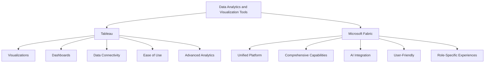

# From Tableau to Microsoft Fabric - Overview 

Costa Rica

[brown9804](https://github.com/brown9804)

Last updated: 2024-11-19

------------------------------------------

| Feature                | Tableau                                                                 | Microsoft Fabric                                                                 |
|------------------------|-------------------------------------------------------------------------|----------------------------------------------------------------------------------|
| **Data Visualization** | Create various visualizations like bar charts, line graphs, and maps    | Integrates with Power BI for comprehensive visualizations                        |
| **Dashboards**         | Build interactive dashboards combining multiple visualizations          | Unified platform for creating detailed reports and dashboards                    |
| **Data Connectivity**  | Connects to spreadsheets, databases, and cloud services                 | Integrates Azure Data Factory, Synapse Analytics, and more                       |
| **Ease of Use**        | User-friendly drag-and-drop interface                                   | Simplified SaaS model for a unified experience                                   |
| **Advanced Analytics** | Supports trend analysis, forecasting, and statistical analysis          | Incorporates AI capabilities for advanced analytics                              |
| **Unified Platform**   | Focused on visual analytics                                             | End-to-end platform covering data movement, processing, and real-time event routing |
| **Role-Specific**      | Suitable for both technical and non-technical users                     | Tailored experiences for data engineers, data scientists, and business users      |

## How to create visualizations 

| Visualization Type | Tableau Tutorial | Power BI Tutorial |
|--------------------|------------------|-------------------|
| **Waterfall Chart** | - [How to Create a Waterfall Chart in Tableau](https://www.youtube.com/watch?v=5ArPAZYxUVk)   - [Creating a Tableau Waterfall Chart](https://hevodata.com/learn/tableau-waterfall-chart/) | - [How to Create and Format Power BI Waterfall Chart](https://www.youtube.com/watch?v=KMJKyaSnEwc)   - [Waterfall charts in Power BI](https://learn.microsoft.com/en-us/power-bi/visuals/power-bi-visualization-waterfall-charts) |
| **Doughnut Chart** | - [How to Create a Doughnut Chart in Tableau](https://www.youtube.com/watch?v=rADPwnGU2BQ)   - [Creating Doughnut Charts](https://kb.tableau.com/articles/Issue/creating-donut-charts) | - [How to Create a Donut Chart in Power BI](https://www.youtube.com/watch?v=zXSJqit7s5w)   - [Doughnut charts in Power BI](https://learn.microsoft.com/en-us/power-bi/visuals/power-bi-visualization-doughnut-charts) |
| **Combination Chart** | - [How to Create a Combination Chart in Tableau](https://www.youtube.com/watch?v=Kfwy9sAk_zY)   - [Quick Start: Combination Charts](https://help.tableau.com/current/pro/desktop/en-us/qs_combo_charts.htm) | - [Combination (Combo) Charts in Power BI](https://www.youtube.com/watch?v=Zac4Y0pQnhM)   - [Combo chart in Power BI](https://learn.microsoft.com/en-us/power-bi/visuals/power-bi-visualization-combo-chart) |
| **Sankey Diagram** | - [How to Create a Sankey Diagram in Tableau](https://www.youtube.com/watch?v=1HwCzlA9hI4)   - [How to Build a Sankey Chart in Tableau](https://www.thedataschool.co.uk/alfred-chan/how-to-build-a-sankey-chart-in-tableau/) | - [How to Create a Sankey Diagram in Power BI](https://www.youtube.com/watch?v=T7lVEk9pWY8)   - [How to create a Sankey Chart in Power BI Desktop](https://www.mssqltips.com/sqlservertip/7558/build-sankey-chart-using-power-bi-with-step-by-step-instructions/) |

  <h3 style="color: #4CAF50;">Total Visitors</h3>
  

