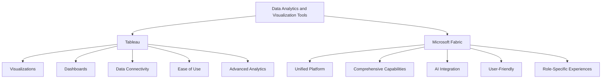

# From Tableau to Microsoft Fabric - Overview 

Costa Rica

[brown9804](https://github.com/brown9804)

Last updated: 2025-01-08

------------------------------------------

## Wiki 

<b>Table of Wiki Contents</b> (Click to expand)

- [Time intelligence functions](https://learn.microsoft.com/en-us/dax/time-intelligence-functions-dax)
- [Time Intelligence: Calendar Table](https://community.fabric.microsoft.com/t5/Power-BI-Community-Blog/Time-Intelligence-Calendar-Table/ba-p/1000565)

## Content 

<b>Table of Contents</b> (Click to expand)

## Overview 

| Feature                | Tableau                                                                 | Microsoft Fabric                                                                 |
|------------------------|-------------------------------------------------------------------------|----------------------------------------------------------------------------------|
| **Data Visualization** | Create various visualizations like bar charts, line graphs, and maps    | Integrates with Power BI for comprehensive visualizations                        |
| **Dashboards**         | Build interactive dashboards combining multiple visualizations          | Unified platform for creating detailed reports and dashboards                    |
| **Data Connectivity**  | Connects to spreadsheets, databases, and cloud services                 | Integrates Azure Data Factory, Synapse Analytics, and more                       |
| **Ease of Use**        | User-friendly drag-and-drop interface                                   | Simplified SaaS model for a unified experience                                   |
| **Advanced Analytics** | Supports trend analysis, forecasting, and statistical analysis          | Incorporates AI capabilities for advanced analytics                              |
| **Unified Platform**   | Focused on visual analytics                                             | End-to-end platform covering data movement, processing, and real-time event routing |
| **Role-Specific**      | Suitable for both technical and non-technical users                     | Tailored experiences for data engineers, data scientists, and business users      |

## Migration Considerations

> Tableau -> Power BI Migration Considerations:

| Category               | Considerations                          |
|------------------------|-----------------------------------------|
| **Data Ingestion**     | - **Power Query Editor**: Used for data transformation and preparation.   - **Datasets and Dataflows**: Manage and reuse data across multiple reports.   - **Data connectors**: Connect to various data sources, including databases, cloud services, and files.   - **Incremental Refresh**: Load only new or changed data to improve efficiency.   - **Data Gateway**: Ensure secure data transfer between on-premises data sources and Power BI Service. |
| **Data Modelling**     | - **Star schema**: Organize data into fact and dimension tables for efficient querying.   - **Calculated columns**: Create new data columns based on existing data.   - **Measures**: Define calculations using DAX (Data Analysis Expressions) for dynamic data analysis.   - **Organize and simplify**: Structure your model for clarity and performance.   - **Relationships**: Define how tables relate to each other to enable accurate data analysis. |
| **Visualizations**     | - **Create visuals**: Build interactive charts, graphs, and dashboards.   - **Perform analytics (AI)**: Use AI features like Q&A, insights, and forecasting to enhance data analysis.   - **Custom Visuals**: Import and use custom visuals from the Power BI marketplace.   - **Themes**: Apply consistent styling across reports using themes. |
| **Optimization**       | - **Optimize data load**: Improve performance by reducing data load times and managing data refresh schedules.   - **Optimize visualizations**: Enhance the performance and responsiveness of your visuals.   - **Aggregations**: Use aggregated tables to speed up query performance.   - **Performance Analyzer**: Identify and resolve performance issues in your reports. |
| **Lifecycle**          | - **Connect to data**: Establish connections to your data sources.   - **Shape your data**: Clean and transform data to fit your analysis needs.   - **Build your reports**: Create comprehensive reports with visuals and insights.   - **Share your work**: Distribute reports and dashboards to stakeholders.   - **Version Control**: Track changes and manage versions of your reports. |
| **Sharing & Collaboration** | - **Power BI Service**: Share reports and collaborate with others through the Power BI cloud service.   - **Workspaces**: Organize and manage content within collaborative workspaces.   - **Apps**: Package and distribute collections of related reports and dashboards. |
| **Licensing**          | - **E5 Pro Licensing**: Advanced features and capabilities for enterprise users.   - **Per user Licensing**: Flexible licensing options based on individual user needs.   - **Premium Capacity tiers**: Scalable options for larger organizations with higher data and user demands.   - **Embedded Licensing**: Integrate Power BI content into custom applications. |
| **Governance & Admin** | - **Admin Portal**: Manage and monitor Power BI usage and settings.   - **Metrics App**: Track and analyze usage metrics and performance.   - **Data Security**: Implement row-level security and data protection measures.   - **Compliance**: Ensure adherence to data governance and compliance standards. |
| **End Users**          | - **Upskilling & training**: Provide training and resources to help users become proficient in Power BI.   - **User Adoption**: Encourage and support the adoption of Power BI across the organization.   - **Support Resources**: Offer access to documentation, tutorials, and community forums. |
| **Migration Approach** | - **Migration process & guidance**: Follow best practices and guidelines for a smooth transition from Tableau to Power BI.   - **Assessment**: Evaluate current Tableau usage and identify migration requirements.   - **Planning**: Develop a detailed migration plan, including timelines and resource allocation.   - **Execution**: Carry out the migration process, including data transfer, model rebuilding, and report recreation.   - **Validation**: Test and validate the migrated content to ensure accuracy and performance. |

## Lifecycle Comparison

| Stage                  | Prepare                                                                 | Explore                                                                 | Visualize                                                                 | Share and Collaborate                                                                 |
|------------------------|-------------------------------------------------------------------------|------------------------------------------------------------------------|---------------------------------------------------------------------------|---------------------------------------------------------------------------------------|
| **Power BI product**   | Power Query Editor: A powerful data transformation tool that allows users to clean, transform, and load data from various sources. It supports a wide range of data sources and provides a user-friendly interface for data shaping and transformation. | Power BI Desktop: A comprehensive tool for data modeling, exploration, and analysis.| Power BI Desktop/Web-Edit: Create interactive visuals and dashboards. | Power BI Service: A cloud-based service for sharing and collaborating on reports and dashboards. |
| **Definition**         | Connect to data sources. Clean and transform.                           | - **Define Relationships**: Establish connections between different data tables to create a cohesive data model.   - **DAX Calculations**: Use Data Analysis Expressions (DAX) to create custom calculations and measures, enabling advanced data analysis and insights.   - Look for patterns and insights in the cleaned data. | - **Custom Visuals**: Import and use custom visuals from the Power BI marketplace to enhance your reports.   - **R/Python Integration**: Use R or Python scripts to create advanced visuals and perform statistical analysis, providing flexibility for complex data visualization needs.      | - **Permissions and Security**: Manage access and security settings for reports and datasets, ensuring data privacy and compliance.   - **Embed Visuals**: Integrate Power BI visuals into other applications, such as websites, Microsoft Teams, SharePoint, etc.   - **Subscriptions**: Set up email subscriptions for report updates, keeping stakeholders informed.   - **Data Flows**: Create reusable data preparation workflows to streamline data management processes. |
| **Tableau equivalent** | - Tableau Prep: A tool for preparing and cleaning data before analysis. It allows users to combine, shape, and clean their data for analysis.   - Alteryx: An advanced data preparation tool that integrates with Tableau, offering powerful data blending and transformation capabilities. | Tableau Desktop: A tool for data exploration and analysis, allowing users to create complex calculations and relationships.   - **Data Blending**: Combine data from multiple sources to create a unified view.   - **Calculated Fields**: Create custom calculations to derive new insights from your data. | Tableau Desktop: Create interactive and visually appealing dashboards and reports.   - **Custom Visuals**: Use Tableau's extensive library of visualizations or create custom ones to meet specific needs.   - **Storytelling**: Build data stories to guide users through insights and findings. | Tableau Online/Tableau Cloud: A cloud-based platform for sharing and collaborating on Tableau dashboards and reports.   - **Permissions and Security**: Manage user access and security settings to protect sensitive data.   - **Embed Visuals**: Integrate Tableau visuals into other applications, such as websites or intranet portals.   - **Subscriptions**: Set up email subscriptions for report updates, ensuring users receive the latest information. |

## Data Ingestion

### Essentials for Developers

> Features `that makes Power BI a versatile and powerful tool for developers`, enabling them to create robust data models, perform advanced calculations, and share insights effectively.

| Feature                     | Description                                                                                       | Importance for Developers                                                                 |
|-----------------------------|---------------------------------------------------------------------------------------------------|-------------------------------------------------------------------------------------------|
| **Power Query Editor**      | A powerful tool for data transformation and preparation. Allows users to clean, shape, and combine data from various sources. | Essential for preparing data before analysis, ensuring data quality and consistency.       |
| **DAX (Data Analysis Expressions)** | A formula language used for creating custom calculations and aggregations in Power BI. | Crucial for building sophisticated data models and performing complex calculations.        |
| **Data Modeling**           | Tools for creating relationships between tables, defining calculated columns, and measures.      | Important for structuring data in a way that supports efficient analysis and reporting.    |
| **Row-Level Security (RLS)**| Allows developers to create security roles to restrict data access based on user roles.          | Ensures data privacy and compliance by controlling who can see specific data.              |
| **Power BI Service**        | A cloud-based platform for sharing and collaborating on reports and dashboards.                  | Enables collaboration and sharing of insights across the organization.                     |
| **Custom Visuals**          | Ability to import and use custom visuals from the Power BI marketplace.                          | Provides flexibility to create tailored visualizations that meet specific business needs.  |
| **R/Python Integration**    | Support for using R and Python scripts to create advanced visuals and perform statistical analysis. | Allows for advanced data analysis and visualization beyond the built-in capabilities.      |
| **Dataflows**               | Reusable data preparation workflows that can be shared across multiple reports and dashboards.   | Streamlines data management processes and ensures consistency across different projects.   |
| **AI Insights**             | Built-in AI features that help discover trends and make predictions based on data.               | Enhances data analysis with advanced machine learning capabilities. |

###   Data Connection Types
| Power Bi | Import mode | Direct Query mode |
|---|---|---|
| **Definition** | Delivers fast performance by importing the data, loading it into memory, and storing it to disk. | Allows analysts to query the data source on request to return results. |
| **Tableau equivalent** | Extracts | Live connection |

## Data Transformation

| Feature| Tableau Prep | Power Query Editor |
|-----------------------------|--------------------------------------------------------------------------------------------------------------------------------------------------------------------------------------------------------------|------------------------------------------------------------------------------------------------------------------------------------------------------------------------------------------------------------------------------------------|
| **Price**                   | $70/user/month for Creator bundle| Free|
| **Integration**             | Stand-alone (with preview in Tableau Desktop). Tableau Prep is a separate tool that integrates with Tableau Desktop for visualization and analysis.| Integrated with Power BI and Excel. Power Query Editor is built into Power BI and Excel, providing a seamless experience for data preparation and analysis within these environments.|
| **Prepackaged Connectors**  | Total as now 26, connects to a variety of data sources including databases, cloud services, and flat files.| Total as now 70, offers a wide range of connectors to databases, cloud services, web services, and more, providing extensive data connectivity options.|
| **Custom Connectors**       | No. Limited to prepackaged connectors.| Yes. Supports custom connectors through the Power Query SDK, allowing developers to create connectors for additional data sources.|
| **Row-level transformations** | Pivot, join, union. Allows users to reshape data at the row level, combining and transforming data as needed.| Keep rows, remove rows, remove duplicates, promote headers, group by, merge, append, pivot, transpose, combine files. Provides a comprehensive set of row-level transformations for data cleaning and preparation.|
| **Column-level transforms** | Copy, remove, duplicate, column from example, calculated column, remove, remove duplicates, remove errors, change type, rename, transform (lower, upper, trim, etc.), replace values, replace errors, split column, index column, group by, fill, pivot, move, format, extract, number column (statistics, standard, scientific, math), date and time column, R script. Extensive set of column-level transformations for data manipulation. | Filter (formula required), group and replace, clean (upper, lower, trim, remove characters), split, rename, remove, calculated field. Provides essential column-level transformations for data preparation, though less extensive than Power Query. |
| **Interactive graphical step flow** | Yes. Provides a visual interface to see and interact with the data preparation steps, making it easier to understand and modify the data flow.| No (static Query Dependencies diagram). Displays a static diagram of query dependencies, which helps visualize the data transformation steps but is not interactive.|
| **Parameters**              | No. Does not support parameterization of data preparation steps.| Yes. Allows users to create parameters to dynamically change values in queries, making data preparation more flexible and reusable.|
| **Use R for data prep**     | No. Does not support the use of R scripts for data preparation.| Yes. Supports the use of R scripts to perform advanced data transformations and statistical analysis.|
| **User-created tables**     | No. Does not allow users to create new tables within the data preparation process.| Yes. Allows users to create new tables from existing data, providing more flexibility in data modeling and preparation.|
| **Detect and expand relationships in data source** | No (one data source at a time). Limited to working with a single data source at a time, without automatic relationship detection.| Yes. Can detect and expand relationships between multiple data sources, enabling more complex data models and analyses.|
| **Functions (to centralize common logic)** | No. Does not support the creation of reusable functions for common data preparation logic.| Yes. Allows users to create functions to centralize and reuse common data preparation logic, improving efficiency and consistency.|
| **Script (all transformations in one place)** | No. Does not provide a single script view for all transformations.| Yes. Provides a script view where all transformations are listed in one place, making it easier to review and modify the data preparation process.|
| **Calculation language**    | Tableau calculation language. Uses a proprietary calculation language for creating calculated fields and transformations.| Power Query M language. Uses the M language for data transformations, which is powerful and flexible for complex data preparation tasks.|
| **Output destination**      | Save as TDE, Hyper, CSV, preview in Desktop. Outputs data to Tableau's proprietary formats or CSV, with the option to preview in Tableau Desktop.| Directly into PBI data model, Excel sheet (Power Query in Excel only). Outputs data directly into the Power BI data model or Excel, providing seamless integration with these tools.                                                                 |
| **Output options**          | One output from Tableau Prep file (Tableau model can’t handle multiple tables). Limited to a single output per Tableau Prep file, which can be a limitation for complex data models.| One table in the model per query (typically). Typically outputs one table per query, but allows for multiple queries to be combined in the Power BI data model, providing more flexibility for complex data models.|

### Data Modelling 

> The **Power BI** Data Modelling tab is where you can create relationships between your tables, appropriate relationships will automatically be detected, but you also have the flexibility to change the definition. This is very similar to the Relationships experience in **Tableau**.

### Dataflows
> Dataflows in **Power BI** allows you to centralize your Extract, Transform, Load process, it is like building a **Tableau** flow, `but making it reusable and easily accessible to other users.` You build Dataflows on **Power BI Service** through a no code/low code Power Query experience. After your Dataflow is built, you can share it with other users so that they don’t have to go through all the data cleaning and transformation steps again, instead allow them to connect directly to the Dataflow.

### Date Tables and Time Intelligence

>  Like **Tableau**, whenever you have a date field in **Power BI**, a Date hierarchy will automatically be created to allow drilling. It is recommended to create a separate date table with all dates from the earliest date in your data to the latest day, mark it as a date table, and then join all the date fields to the date table.

- **Creating a Date Table**: In Power BI, you can create a date table using DAX functions like `CALENDAR` or `CALENDARAUTO`. The `CALENDAR` function requires start and end dates, while `CALENDARAUTO` automatically generates a date range based on the data model.
- **Marking as Date Table**: Once the date table is created, you should mark it as a date table in Power BI. This ensures that time-intelligence functions work correctly.
- **Joining Date Fields**: After creating and marking the date table, join all date fields in your data model to this date table. This allows for consistent and accurate time-based analysis across different datasets.

> DAX provides many built-in time-intelligence and date functions, such as: Year to Date, Same Period Last Year, Total Year to Date (Quarter to Date, Month to Date). Whereas Tableau has only a few simple date calculation functions.
- **Year to Date (YTD)**: The `DATESYTD` function returns a table containing the dates for the year to date, which can be used to calculate cumulative totals.
- **Same Period Last Year (SPLY)**: The `SAMEPERIODLASTYEAR` function returns a table that contains a column of dates shifted one year back, useful for year-over-year comparisons.
- **Quarter to Date (QTD)**: The `DATESQTD` function returns a table containing the dates for the quarter to date.
- **Month to Date (MTD)**: The `DATESMTD` function returns a table containing the dates for the month to date.
- **Custom Date Ranges**: Functions like `DATESBETWEEN` and `DATEADD` allow for custom date range calculations, providing flexibility for various time-based analyses.

## How to create visualizations 

| Visualization Type | Tableau Tutorial | Power BI Tutorial |
|--------------------|------------------|-------------------|
| **Waterfall Chart** | - [How to Create a Waterfall Chart in Tableau](https://www.youtube.com/watch?v=5ArPAZYxUVk)   - [Creating a Tableau Waterfall Chart](https://hevodata.com/learn/tableau-waterfall-chart/) | - [How to Create and Format Power BI Waterfall Chart](https://www.youtube.com/watch?v=KMJKyaSnEwc)   - [Waterfall charts in Power BI](https://learn.microsoft.com/en-us/power-bi/visuals/power-bi-visualization-waterfall-charts) |
| **Doughnut Chart** | - [How to Create a Doughnut Chart in Tableau](https://www.youtube.com/watch?v=rADPwnGU2BQ)   - [Creating Doughnut Charts](https://kb.tableau.com/articles/Issue/creating-donut-charts) | - [How to Create a Donut Chart in Power BI](https://www.youtube.com/watch?v=zXSJqit7s5w)   - [Doughnut charts in Power BI](https://learn.microsoft.com/en-us/power-bi/visuals/power-bi-visualization-doughnut-charts) |
| **Combination Chart** | - [How to Create a Combination Chart in Tableau](https://www.youtube.com/watch?v=Kfwy9sAk_zY)   - [Quick Start: Combination Charts](https://help.tableau.com/current/pro/desktop/en-us/qs_combo_charts.htm) | - [Combination (Combo) Charts in Power BI](https://www.youtube.com/watch?v=Zac4Y0pQnhM)   - [Combo chart in Power BI](https://learn.microsoft.com/en-us/power-bi/visuals/power-bi-visualization-combo-chart) |
| **Sankey Diagram** | - [How to Create a Sankey Diagram in Tableau](https://www.youtube.com/watch?v=1HwCzlA9hI4)   - [How to Build a Sankey Chart in Tableau](https://www.thedataschool.co.uk/alfred-chan/how-to-build-a-sankey-chart-in-tableau/) | - [How to Create a Sankey Diagram in Power BI](https://www.youtube.com/watch?v=T7lVEk9pWY8)   - [How to create a Sankey Chart in Power BI Desktop](https://www.mssqltips.com/sqlservertip/7558/build-sankey-chart-using-power-bi-with-step-by-step-instructions/) |

  <h3 style="color: #4CAF50;">Total Visitors</h3>
  

