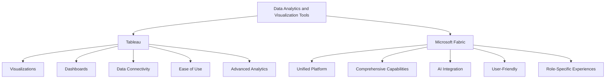

# From Tableau to Microsoft Fabric - Overview 

Costa Rica

[brown9804](https://github.com/brown9804)

Last updated: 2024-08-27

------------------------------------------

| Feature                | Tableau                                                                 | Microsoft Fabric                                                                 |
|------------------------|-------------------------------------------------------------------------|----------------------------------------------------------------------------------|
| **Data Visualization** | Create various visualizations like bar charts, line graphs, and maps    | Integrates with Power BI for comprehensive visualizations                        |
| **Dashboards**         | Build interactive dashboards combining multiple visualizations          | Unified platform for creating detailed reports and dashboards                    |
| **Data Connectivity**  | Connects to spreadsheets, databases, and cloud services                 | Integrates Azure Data Factory, Synapse Analytics, and more                       |
| **Ease of Use**        | User-friendly drag-and-drop interface                                   | Simplified SaaS model for a unified experience                                   |
| **Advanced Analytics** | Supports trend analysis, forecasting, and statistical analysis          | Incorporates AI capabilities for advanced analytics                              |
| **Unified Platform**   | Focused on visual analytics                                             | End-to-end platform covering data movement, processing, and real-time event routing |
| **Role-Specific**      | Suitable for both technical and non-technical users                     | Tailored experiences for data engineers, data scientists, and business users      |

