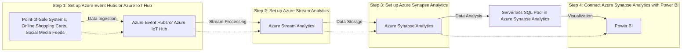
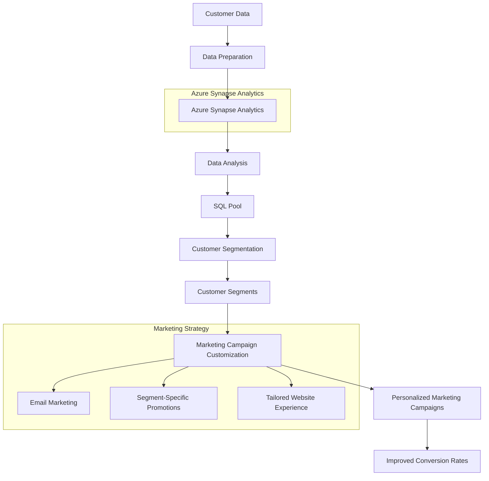
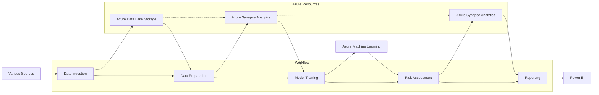
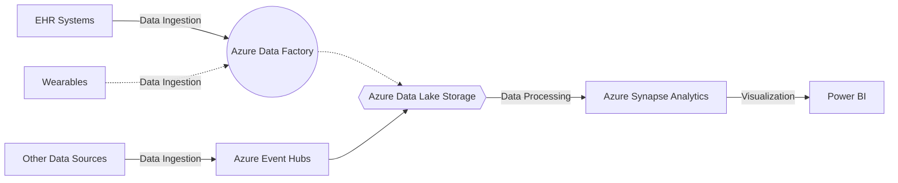

# Azure Synapse Analytics

Costa Rica

[](https://github.com/)
[brown9804](https://github.com/brown9804)

Last updated: 2024-08-06

------------------------------------------

Key Features: 
- Accelerates time to insight across data warehouses and big data systems.
- Offers limitless scale, security, privacy.
- Provides a unified experience for data engineering, data science, and business analysis.
- Enables data warehousing and data virtualization scenarios.
- Extends T-SQL to address streaming and machine learning scenarios.
- Integrates AI with SQL by using machine learning models to score data.
- Allows data engineers to use a code-free visual environment for managing data pipelines.
- Automates query optimization.
- Seamlessly integrates with Power BI, CosmosDB, and AzureML.
  
Creating a new Azure Synapse Analytics account:
- You can create and manage Azure resources for Azure Synapse Analytics via the Azure portal. 

## Content

<!-- TOC -->

- [Azure Synapse Analytics](#azure-synapse-analytics)
    - [Content](#content)
    - [Example of Use Cases](#example-of-use-cases)
        - [Real-Time Analytics in Retail - Azure Synapse Analytics:](#real-time-analytics-in-retail---azure-synapse-analytics)
        - [Predictive Maintenance in Manufacturing - Azure Synapse Analytics:](#predictive-maintenance-in-manufacturing---azure-synapse-analytics)
        - [Customer Segmentation in Marketing - Azure Synapse Analytics:](#customer-segmentation-in-marketing---azure-synapse-analytics)
        - [Risk Assessment in Finance - Azure Synapse Analytics:](#risk-assessment-in-finance---azure-synapse-analytics)
        - [Healthcare Analytics - Azure Synapse Analytics:](#healthcare-analytics---azure-synapse-analytics)

<!-- /TOC -->

## Example of Use Cases

> [!NOTE]
> Here are some use cases:

### Real-Time Analytics in Retail - Azure Synapse Analytics:
[return to Content](#content)

Azure Synapse Analytics can be used to analyze real-time data from point-of-sale systems, online shopping carts, and social media feeds to understand customer behavior and preferences. This can help retailers optimize their inventory, pricing, and promotional strategies.

> [!IMPORTANT]
> Here’s an example of an end-to-end solution using Azure resources and Azure Synapse Analytics: This solution leverages **Azure Synapse Analytics** to analyze real-time data from point-of-sale systems, online shopping carts, and social media feeds to understand customer behavior and preferences. This can help retailers optimize their inventory, pricing, and promotional strategies.

> Architecture
> 1. **Data Ingestion**: Real-time data from point-of-sale systems, online shopping carts, and social media feeds is ingested into the system. This can be achieved using **Azure Event Hubs** or **Azure IoT Hub**.
> 2. **Stream Processing**: The real-time data is then processed using **Azure Stream Analytics**. This service can handle high volumes of data streaming in real-time and can also integrate with Azure Synapse Analytics.
> 3. **Data Storage**: The processed data is stored in **Azure Synapse Analytics**. It provides big data analytics capabilities and can handle both on-demand and provisioned resources.
> 4. **Data Analysis and Visualization**: Data analysts and business users can use the serverless SQL pool in Azure Synapse Analytics to analyze the data. They can create and run T-SQL queries, build reports, and perform analytics. The results can be visualized using **Power BI**.
> 
> Implementation Steps
> 1. Set up Azure Event Hubs or Azure IoT Hub for data ingestion.
> 2. Set up Azure Stream Analytics to process the incoming real-time data.
> 3. Set up Azure Synapse Analytics to store and analyze the processed data.
> 4. Connect Azure Synapse Analytics with Power BI to create visualizations and reports.
>



### Predictive Maintenance in Manufacturing - Azure Synapse Analytics:
[return to Content](#content)

By analyzing sensor data from machinery and equipment, Azure Synapse Analytics can help predict when a machine is likely to fail. This allows for proactive maintenance, reducing downtime and saving costs.

> [!IMPORTANT]
> Here’s an example of an end-to-end solution using Azure resources and Azure Synapse Analytics: This solution aims to predict machinery failure by analyzing sensor data from equipment using Azure Synapse Analytics. This allows for proactive maintenance, reducing downtime, and saving costs.

> Architecture
> 1. **Data Collection**: IoT devices collect data from machinery and send it to Azure IoT Hub.
> 2. **Data Processing**: Stream Analytics job processes the data from IoT Hub and stores it in Azure Synapse Analytics.
> 3. **Data Analysis**: Azure Synapse Analytics is used to analyze the sensor data.
> 4. **Machine Learning**: Azure Machine Learning is used to create and train a predictive model based on the sensor data.
> 5. **Prediction**: The predictive model is used to predict machinery failure.
> 
> Implementation Steps
> - Step 1: Set up Azure IoT Hub: Set up an Azure IoT Hub to receive data from your IoT devices.
> - Step 2: Stream Analytics Job: Create a Stream Analytics job that takes the input from IoT Hub and outputs to Azure Synapse Analytics.
> - Step 3: Azure Synapse Analytics: Use Azure Synapse Analytics to store and analyze the sensor data. You can create views and stored procedures based on your analysis needs.
> - Step 4: Azure Machine Learning: Use Azure Machine Learning to create a predictive model. You can use the Automated Machine Learning capability to identify the best model.
> - Step 5: Prediction: Use the trained model to predict when a machine is likely to fail. This prediction can be used to schedule maintenance activities proactively.
>



```mermaid
graph LR
    A[IoT Devices] -->|Data Collection| B[Azure IoT Hub]
    B -->|Data Processing| C[Stream Analytics Job]
    C -->|Store Data| D[Azure Synapse Analytics]
    D -->|Data Analysis| E[Azure Machine Learning]
    E -->|Train Model| F[Predictive Model]
    F -->|Prediction| G[Machinery Failure]
    subgraph "Step 1: Set up Azure IoT Hub"
    A -.-> B
    end
    subgraph "Step 2: Stream Analytics Job"
    B -.-> C
    end
    subgraph "Step 3: Azure Synapse Analytics"
    C -.-> D
    end
    subgraph "Step 4: Azure Machine Learning"
    D -.-> E
    end
    subgraph "Step 5: Prediction"
    E -.-> F
    end
```

### Customer Segmentation in Marketing - Azure Synapse Analytics:
[return to Content](#content)

Azure Synapse Analytics can analyze customer data to identify distinct segments based on purchasing behavior, demographics, and other factors. This can help marketers tailor their campaigns to specific customer groups, improving conversion rates.

> [!IMPORTANT]
> Here’s an example of an end-to-end solution using Azure resources and Azure Synapse Analytics: 

> Step 1 - Data Preparation: First, we need to ensure that our customer data is stored in Azure Synapse Analytics. This data might include:
> - Customer demographics (age, gender, location, etc.)
> - Purchasing behavior (purchase history, frequency, volume, etc.)
> - Other relevant factors (website activity, customer feedback, etc.)
> 
> Step 2 - Data Analysis: Next, we can use SQL pool in Azure Synapse Analytics to analyze our data. We might run queries to identify patterns in purchasing behavior, demographics, and other factors. For example:
> 
> ```sql
> SELECT 
>     CustomerID, 
>     COUNT(OrderID) as PurchaseFrequency, 
>     AVG(OrderAmount) as AveragePurchaseAmount,
>     MIN(Age) as Age,
>     MIN(Gender) as Gender
> FROM 
>     SalesDatabase
> GROUP BY 
>     CustomerID;
> ```
> 
> Step 3 - Customer Segmentation: Based on the results of our analysis, we can segment our customers into distinct groups. We might create segments based on:
> 
> - Purchase frequency and volume (e.g., high-volume customers, infrequent customers)
> - Demographics (e.g., millennials, retirees)
> - Other factors (e.g., customers who frequently leave feedback)
> 
> Step 4 - Marketing Campaign Customization: Finally, we can tailor our marketing campaigns to each customer segment to improve conversion rates. This might involve:
> 
> - Personalizing email marketing content
> - Offering segment-specific promotions
> - Tailoring our website experience based on the segment
> By using Azure Synapse Analytics for customer segmentation, we can ensure that our marketing efforts are data-driven and tailored to our customers’ unique behaviors and preferences.
> 



### Risk Assessment in Finance - Azure Synapse Analytics:
[return to Content](#content)

Azure Synapse Analytics can analyze financial data to assess the risk of loan defaults, fraudulent transactions, and other financial risks. This can help financial institutions make informed decisions and mitigate risks.

> [!IMPORTANT]
> Here’s an example of an end-to-end solution using Azure resources and Azure Synapse Analytics: Azure Synapse Analytics can analyze financial data to assess the risk of loan defaults, fraudulent transactions, and other financial risks. This can help financial institutions make informed decisions and mitigate risks. By leveraging Azure Synapse Analytics, financial institutions can effectively assess risk and make informed decisions. This end-to-end solution provides a robust framework for risk assessment in finance.

> Architecture
> The following Azure resources are used in this solution:
> 1. **Azure Synapse Analytics**: For big data analytics and exploration.
> 2. **Azure Data Lake Storage**: For storing large amounts of structured and unstructured data.
> 3. **Azure Machine Learning**: For building, training, and deploying machine learning models.
> 4. **Power BI**: For visualizing data and sharing insights.
> 
> Workflow
> 1. **Data Ingestion**: Financial data is ingested into Azure Data Lake Storage from various sources.
> 2. **Data Preparation**: The data is cleaned, transformed, and prepared for analysis using Azure Synapse Analytics.
> 3. **Model Training**: Machine learning models are trained using Azure Machine Learning. These models can predict the likelihood of loan defaults, detect fraudulent transactions, and assess other financial risks.
> 4. **Risk Assessment**: The trained models are applied to the data in Azure Synapse Analytics to assess risk.
> 5. **Reporting**: The results are visualized in Power BI, providing actionable insights for decision-makers.
> 



### Healthcare Analytics - Azure Synapse Analytics:
[return to Content](#content)

Azure Synapse Analytics can analyze patient data to identify trends and patterns, helping healthcare providers improve patient outcomes, reduce costs, and enhance operational efficiency.

> [!IMPORTANT]
> Here’s an example of an end-to-end solution using Azure resources and Azure Synapse Analytics: This solution leverages Azure Synapse Analytics to analyze patient data, identify trends and patterns, and help healthcare providers improve patient outcomes, reduce costs, and enhance operational efficiency. By leveraging Azure Synapse Analytics, healthcare providers can gain valuable insights from their patient data, leading to improved patient outcomes and operational efficiency.

> Architecture
> 
> 1. **Data Ingestion**: Data from various sources (EHR systems, wearables, etc.) is ingested into Azure using services like Azure Data Factory or Azure Event Hubs.
> 2. **Data Lake Storage**: The ingested data is stored in Azure Data Lake Storage, which provides a scalable and secure data lake that can handle large volumes of data.
> 3. **Azure Synapse Analytics**: This is the core of our solution. It provides the analytics capabilities, allowing us to analyze the data in the Data Lake.
> 4. **Power BI**: The results of the analysis are visualized using Power BI, providing actionable insights to healthcare providers.
> 
> Implementation Steps
> 1. **Set up Azure Data Lake Storage**: Create an Azure Data Lake Storage account and configure it to store the incoming patient data.
> 2. **Ingest Data**: Use Azure Data Factory or Azure Event Hubs to ingest patient data into the Data Lake.
> 3. **Set up Azure Synapse Analytics**: Create an Azure Synapse workspace and link it to the Data Lake Storage account.
> 4. **Analyze Data**: Write SQL scripts or use Synapse Studio to analyze the data and identify trends and patterns.
> 5. **Visualize Results**: Connect Power BI to Azure Synapse and create reports and dashboards to visualize the results of the analysis.
> 


