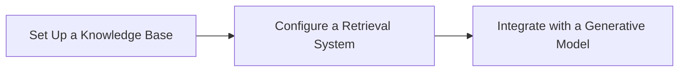

# Retrieval-Augmented Generation (RAG) pattern

Costa Rica

[brown9804](https://github.com/brown9804)

Last updated: 2024-11-14

------------------------------------------

## Wiki 

<b>Table of Wiki </b> (Click to expand)

   

## Overview 

| **Step**       | **Description**                                                                                                                                                                                                 |
|----------------|-----------------------------------------------------------------------------------------------------------------------------------------------------------------------------------------------------------------|
| **Retrieval**  | The system retrieves relevant documents or pieces of information from a knowledge base or external data source based on the input query. This step ensures that the model has access to up-to-date and specific information that can enhance the response. |
| **Augmentation** | The retrieved information is then used to augment the input query. This augmented input provides additional context and details that the generative model can use to produce a more informed response.                                                   |
| **Generation** | A generative model (such as GPT-4) processes the augmented input to generate a coherent and contextually relevant response. The output is a combination of the model's language generation capabilities and the retrieved factual information.               |

> Applications of RAG Pattern:
- **Question Answering**: Providing accurate answers by retrieving relevant documents and generating responses based on them.
- **Document Summarization**: Summarizing documents by retrieving key sections and generating concise summaries.
- **Conversational AI**: Enhancing chatbot responses with up-to-date information from external sources.

> Implementing RAG Pattern with Azure AI:

1. **Set Up a Knowledge Base**: Store your documents in Azure Storage Blob Containers or another accessible data source.
2. **Configure a Retrieval System**: Use Azure AI Search to index and retrieve relevant documents based on user queries.
3. **Integrate with a Generative Model**: Use a generative model like GPT-4 to process the retrieved documents and generate responses.

> Traditional methods and the `Retrieval-Augmented Generation (RAG)` pattern:

| **Aspect**                | **Traditional Methods**                                                                 | **RAG Pattern**                                                                                   |
|---------------------------|-----------------------------------------------------------------------------------------|---------------------------------------------------------------------------------------------------|
| **Model Type**            | Static, pre-trained models that rely on historical data. These models do not update dynamically and can become outdated. | Dynamic integration of retrieval and generative models, allowing for real-time data updates, keeping responses current and relevant. |
| **Data Freshness**        | Relies on pre-trained data, which may not reflect the latest information.                | Retrieves the most recent data from external sources, ensuring up-to-date information.            |
| **Context Understanding** | Often lacks the ability to fully understand the context of a query, leading to less accurate results. | Enhances context understanding by incorporating real-time information retrieval, providing richer context for responses. |
| **Retrieval Techniques**  | Uses keyword matching techniques like BM25 and TF-IDF, which may not capture the semantic meaning of queries. | Employs advanced semantic search techniques that better understand the intent behind queries, leading to more relevant results. |
| **Accuracy**              | May struggle with understanding context and semantic meaning, resulting in less accurate responses. | Improves accuracy by grounding responses in verified external knowledge, reducing the likelihood of errors. |
| **Risk of Hallucinations**| Higher risk of generating incorrect information as responses are based solely on training data. | Reduces this risk by grounding responses in real-time, verified information from external sources. |
| **Flexibility**           | Limited to specific data types and formats, which can restrict their applicability.      | Capable of handling various data types, including text, images, and videos, making it more versatile. |
| **Adaptability**          | Requires extensive retraining to incorporate new information, which can be time-consuming and costly. | More adaptable as it integrates real-time data without the need for frequent retraining.           |
| **Cost Efficiency**       | Can be resource-intensive due to the need for frequent retraining and large labeled datasets. | More cost-effective as it minimizes the need for extensive retraining and leverages existing data sources. |
| **Applications**          | Suitable for basic search and static content generation.                                | Ideal for complex applications such as healthcare, customer support, and content creation, where up-to-date and contextually relevant information is crucial. |

