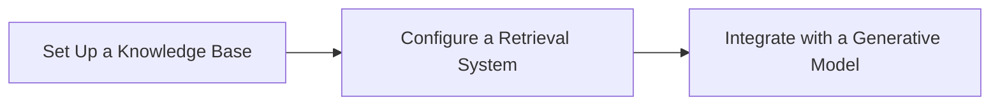

# Retrieval-Augmented Generation (RAG) pattern

Costa Rica

[brown9804](https://github.com/brown9804)

Last updated: 2024-11-14

------------------------------------------

## Wiki 

<b>Table of Wiki </b> (Click to expand)

   
- [What's Azure AI Search?](https://learn.microsoft.com/en-us/azure/search/search-what-is-azure-search)
- [Indexer overview - Azure AI Search](https://learn.microsoft.com/en-us/azure/search/search-indexer-overview)
- [Field mappings and transformations using Azure AI Search indexers](https://learn.microsoft.com/en-us/azure/search/search-indexer-field-mappings)
- [Azure AI Search Sample Data](https://github.com/Azure-Samples/azure-search-sample-data/tree/main)
  

## Overview 

| **Step**       | **Description**                                                                                                                                                                                                 |
|----------------|-----------------------------------------------------------------------------------------------------------------------------------------------------------------------------------------------------------------|
| **Retrieval**  | The system retrieves relevant documents or pieces of information from a knowledge base or external data source based on the input query. This step ensures that the model has access to up-to-date and specific information that can enhance the response. |
| **Augmentation** | The retrieved information is then used to augment the input query. This augmented input provides additional context and details that the generative model can use to produce a more informed response.                                                   |
| **Generation** | A generative model (such as GPT-4) processes the augmented input to generate a coherent and contextually relevant response. The output is a combination of the model's language generation capabilities and the retrieved factual information.               |

> Applications of RAG Pattern:
- **Question Answering**: Providing accurate answers by retrieving relevant documents and generating responses based on them.
- **Document Summarization**: Summarizing documents by retrieving key sections and generating concise summaries.
- **Conversational AI**: Enhancing chatbot responses with up-to-date information from external sources.

> Implementing RAG Pattern with Azure AI:

1. **Set Up a Knowledge Base**: Store your documents in Azure Storage Blob Containers or another accessible data source.
2. **Configure a Retrieval System**: Use Azure AI Search to index and retrieve relevant documents based on user queries.
3. **Integrate with a Generative Model**: Use a generative model like GPT-4 to process the retrieved documents and generate responses.

> Traditional methods and the `Retrieval-Augmented Generation (RAG)` pattern:

| **Aspect**                | **Traditional Methods**                                                                 | **RAG Pattern**                                                                                   |
|---------------------------|-----------------------------------------------------------------------------------------|---------------------------------------------------------------------------------------------------|
| **Model Type**            | Static, pre-trained models that rely on historical data. These models do not update dynamically and can become outdated. | Dynamic integration of retrieval and generative models, allowing for real-time data updates, keeping responses current and relevant. |
| **Data Freshness**        | Relies on pre-trained data, which may not reflect the latest information.                | Retrieves the most recent data from external sources, ensuring up-to-date information.            |
| **Context Understanding** | Often lacks the ability to fully understand the context of a query, leading to less accurate results. | Enhances context understanding by incorporating real-time information retrieval, providing richer context for responses. |
| **Retrieval Techniques**  | Uses keyword matching techniques like BM25 and TF-IDF, which may not capture the semantic meaning of queries. | Employs advanced semantic search techniques that better understand the intent behind queries, leading to more relevant results. |
| **Accuracy**              | May struggle with understanding context and semantic meaning, resulting in less accurate responses. | Improves accuracy by grounding responses in verified external knowledge, reducing the likelihood of errors. |
| **Risk of Hallucinations**| Higher risk of generating incorrect information as responses are based solely on training data. | Reduces this risk by grounding responses in real-time, verified information from external sources. |
| **Flexibility**           | Limited to specific data types and formats, which can restrict their applicability.      | Capable of handling various data types, including text, images, and videos, making it more versatile. |
| **Adaptability**          | Requires extensive retraining to incorporate new information, which can be time-consuming and costly. | More adaptable as it integrates real-time data without the need for frequent retraining.           |
| **Cost Efficiency**       | Can be resource-intensive due to the need for frequent retraining and large labeled datasets. | More cost-effective as it minimizes the need for extensive retraining and leverages existing data sources. |
| **Applications**          | Suitable for basic search and static content generation.                                | Ideal for complex applications such as healthcare, customer support, and content creation, where up-to-date and contextually relevant information is crucial. |

## Demo 

> Components:
- Search Service: The core component for querying and indexing.
- Indexer: Automates data ingestion from Azure Storage Blob Containers.
- Skillsets: Enhance indexing with AI capabilities like OCR for scanned documents and image analysis1.
- Vision: For processing images within documents
- Zero Trust Architecture: Security model that assumes no part of the network is inherently secure 

### Search Service 

> Azure AI Search (formerly known as Azure Cognitive Search) is a powerful, enterprise-ready search and retrieval system designed for high-performance applications. It integrates advanced search technologies to support both traditional and generative AI scenarios

| **Category**        | **Details**                                                                 |
|---------------------|-----------------------------------------------------------------------------|
| **Key Features**    | - `Full-Text Search`: Rich query syntax, fuzzy search, autocomplete, geo-search   - `Vector Search`: Similarity searches using vector embeddings   - `Hybrid Search`: Combines full-text and vector search |
| **Core Components** | - `Indexing`: Data ingestion, text tokenization, vectorization, AI skills   - `Querying`: Executes traditional and vector queries, semantic ranking |

> Steps:
- Create a AI Search Resource, click on `Create a resource`
- Search for `ai search`, you can check `Azure Services only` for a faster search.

   

- Configure Search Service: Provide the necessary details
    - Name: Enter a name for your search service.
    - Resource Group: Use the same resource group as your Azure OpenAI resource.
    - Location: Use the same region for reduced latency.
    - Pricing Tier: Select a pricing tier based on your needs.
      
        

### Indexer 

Indexers can be scheduled to run at regular intervals or triggered on-demand, making them flexible for various data ingestion needs

> Key Functions of Indexers: 
1. **Data Extraction**: Indexers pull data from supported data sources like Azure Blob Storage, Azure SQL Database, and Azure Cosmos DB. This process is often referred to as a "pull model" because the search service pulls data into the index without requiring custom code.
2. **Field Mapping**: They map fields from the source data to the search index. This includes both implicit mappings (where field names and types match) and explicit mappings (where you define how fields should be mapped).
3. **Skillset Execution**: Indexers can apply AI skills to enrich the data during indexing. This includes tasks like optical character recognition (OCR), text translation, and key phrase extraction.

> Stages of Indexing:
1. **Document Cracking**: Extracts text and metadata from documents.
2. **Field Mappings**: Maps source fields to index fields.
3. **Skillset Execution**: Applies AI skills for data enrichment.
4. **Output Field Mappings**: Maps enriched data to the final index fields.

> Usage Scenarios:
- **Single Data Source**: Indexing content from one data source.
- **Multiple Data Sources**: Combining content from various sources into a single index.
- **Content Transformation**: Using AI skills to transform and enrich data during indexing.

> Steps:

- Add `Overview`, click on `Import Data`:
  
     

- 

