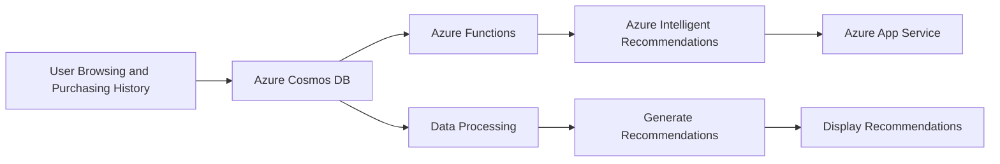
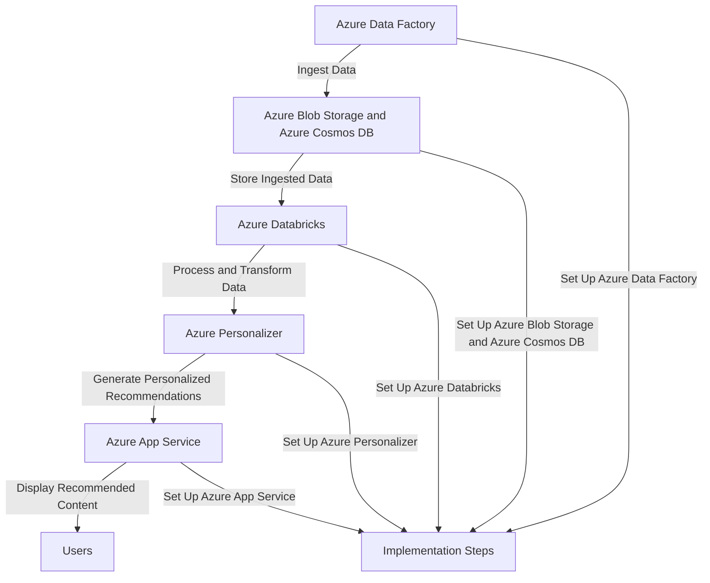
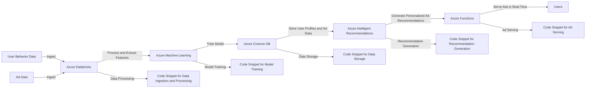

```mermaid
graph LR
    A[User Learning History and Career Goals] -->|Data Collection| B[Azure Cosmos DB]
    B -->|Data Processing| C[Azure Databricks]
    C -->|Model Training| D[Azure Machine Learning]
    D -->|Recommendation Generation| E[Azure Intelligent Recommendations]
    E -->|Presentation of Recommendations| F[Educational Platform's User Interface]
    subgraph "Data Collection"
    A -.-> B
    end
    subgraph "Data Processing"
    B -.-> C
    end
    subgraph "Model Training"
    C -.-> D
    end
    subgraph "Recommendation Generation"
    D -.-> E
    end
    subgraph "Presentation of Recommendations"
    E -.-> F
    end
```

# Intelligent Recommendations Accounts

Costa Rica

[](https://github.com) 
[](https://github.com/)
[brown9804](https://github.com/brown9804)

Last updated: 2024-11-19

----------

Key Features: 
- Provides personalized product recommendations and telemetry insights using modern machine-learning algorithms.
- Helps improve catalog navigation and item discovery.
- Creates upsell and cross-sell opportunities.
- Improves shoppers' experiences and product usability.
- Supports various outcomes such as “shop similar looks,” “shop by description,” “real time,” “session based”, Item based recommendations that can combine User interactions and Item Metadata.
- Can promote and personalize any content type, such as sellable products, consumable media, documents, videos, and more.

Capabilities: 
- Built-in world-class AI-ML delivers personalized results within minutes.
- Easy to integrate and extend in any ecosystem and experience.
- Trustworthy software service at scale.
- Highly adaptable to custom business scenarios and logic, based on input data and algorithm choice.

Creating a new Intelligent Recommendations account: 
- You can create and manage Azure resources for Intelligent Recommendations via the Intelligent Recommendations Azure Resource Manager (ARM) portal. You'll create three resources: Account (Parent resource), Serving (Child resource), and Modeling (Child resource).

## Content

<!-- TOC -->

- [Intelligent Recommendations Accounts](#intelligent-recommendations-accounts)
    - [Content](#content)
    - [Example of Use Cases](#example-of-use-cases)
        - [E-commerce Personalization - Intelligent Recommendations Accounts:](#e-commerce-personalization---intelligent-recommendations-accounts)
        - [Content Discovery - Intelligent Recommendations Accounts:](#content-discovery---intelligent-recommendations-accounts)
        - [Ad Targeting - Intelligent Recommendations Accounts:](#ad-targeting---intelligent-recommendations-accounts)
        - [Learning Path Suggestions - Intelligent Recommendations Accounts:](#learning-path-suggestions---intelligent-recommendations-accounts)

<!-- /TOC -->

## Example of Use Cases

> [!NOTE]
> Here are some use cases:

### E-commerce Personalization - Intelligent Recommendations Accounts:
[return to Content](#content)

Azure Intelligent Recommendations can be used to provide personalized product recommendations to users based on their browsing and purchasing history. This can significantly improve the user experience and increase sales.

> [!IMPORTANT]
> Here’s an example of an end-to-end solution using Azure resources and Azure Intelligent Recommendations Accounts: This solution leverages Azure Intelligent Recommendations to provide personalized product recommendations to users based on their browsing and purchasing history. This can significantly improve the user experience and increase sales.

> Architecture: The following Azure services are used in this solution
> - **Azure Intelligent Recommendations**: For generating personalized product recommendations.
> - **Azure Cosmos DB**: For storing user browsing and purchasing history.
> - **Azure Functions**: For processing user data and interacting with Azure Intelligent Recommendations.
> - **Azure App Service**: For hosting the e-commerce website.
> 
> Workflow
> 1. **User Browsing and Purchasing History**: User interactions with the e-commerce website are tracked and stored in Azure Cosmos DB.
> 2. **Data Processing**: An Azure Function is triggered on a regular basis (or in response to changes in the Cosmos DB) to process the user data and generate a batch of recommendation requests.
> 3. **Generate Recommendations**: The batch of recommendation requests is sent to Azure Intelligent Recommendations, which returns a set of personalized product recommendations for each user.
> 4. **Display Recommendations**: The product recommendations are displayed to the user on the e-commerce website hosted on Azure App Service.
> 
> Code Samples: Here are some code snippets to illustrate how these components might interact. Note that these are simplified examples and may need to be adapted for a real-world application.
> 
> - Storing User Data in Cosmos DB:
> 
> ```python
> # Python code for storing user data in Cosmos DB
> from azure.cosmos import CosmosClient
> 
> # Initialize Cosmos Client
> cosmos_client = CosmosClient("<Your Cosmos DB Connection String>")
> 
> # Select database
> database = cosmos_client.get_database_client("<Your Database Name>")
> 
> # Select container
> container = database.get_container_client("<Your Container Name>")
> 
> # Insert user data
> user_data = {"id": "1", "browsing_history": [...], "purchase_history": [...]}
> container.upsert_item(user_data)
> ```
> 
> - Generating Recommendations with Azure Intelligent Recommendations:
> ```python 
> # Python code for generating recommendations with Azure Intelligent Recommendations
> import requests
> 
> # Define the API endpoint
> api_endpoint = "https://westus.api.cognitive.microsoft.com/recommendations/v4.0/models/<Your Model Name>/recommend/item"
> 
> # Define the headers
> headers = {
>     "Ocp-Apim-Subscription-Key": "<Your Azure Intelligent Recommendations Key>",
>     "Content-Type": "application/json"
> }
> 
> # Define the payload
> payload = {
>     "itemIds": ["<Item ID 1>", "<Item ID 2>", ...],
>     "numberOfResults": 10,
>     "minimalScore": 0.0
> }
> 
> # Send the POST request
> response = requests.post(api_endpoint, headers=headers, json=payload)
> 
> # Print the recommendations
> print(response.json())
> ```
> 



### Content Discovery - Intelligent Recommendations Accounts:
[return to Content](#content)

In media or news platforms, Azure Intelligent Recommendations can suggest articles, videos, or other content that might interest the user, enhancing user engagement and time spent on the platform.

> [!IMPORTANT]
> Here’s an example of an end-to-end solution using Azure resources and Azure Intelligent Recommendations Accounts: This solution aims to enhance user engagement and time spent on media or news platforms by suggesting articles, videos, or other content that might interest the user.

> Architecture
> 1. **Data Ingestion**: Use **Azure Data Factory** to ingest data from various sources into Azure.
> 2. **Data Storage**: Store the ingested data in **Azure Blob Storage** for unstructured data (like videos, images) and **Azure Cosmos DB** for structured or semi-structured data (like user profiles, article metadata).
> 3. **Data Processing**: Use **Azure Databricks** to process and transform the data into a suitable format for the recommendation engine.
> 4. **Recommendation Engine**: Use **Azure Personalizer**, part of Azure Cognitive Services, to generate personalized recommendations based on the processed data.
> 5. **User Interface**: Display the recommended content to the user through a web or mobile application hosted on **Azure App Service**.
> 
> Implementation Steps
> 1. **Set up Azure Data Factory**: Create pipelines to ingest data from various sources into Azure.
> 2. **Set up Azure Blob Storage and Azure Cosmos DB**: Store the ingested data.
> 3. **Set up Azure Databricks**: Write Spark jobs to process and transform the data.
> 4. **Set up Azure Personalizer**: Train a model with the processed data to generate personalized recommendations.
> 5. **Set up Azure App Service**: Develop and deploy your web or mobile application.
> 




### Ad Targeting - Intelligent Recommendations Accounts:
[return to Content](#content)

Advertisers can use Azure Intelligent Recommendations to target users with ads that are relevant to their interests and online behavior, increasing the effectiveness of ad campaigns.

> [!IMPORTANT]
> Here’s an example of an end-to-end solution using Azure resources and Azure Intelligent Recommendations Accounts: This solution leverages Azure Intelligent Recommendations to target users with ads that are relevant to their interests and online behavior, thereby increasing the effectiveness of ad campaigns.

> Architecture: The following Azure services are used in this solution
> 
> 1. **Azure Databricks**: For data processing and feature extraction.
> 2. **Azure Machine Learning**: For model training and deployment.
> 3. **Azure Cosmos DB**: For storing user profiles and ad data.
> 4. **Azure Intelligent Recommendations**: For generating personalized ad recommendations.
> 5. **Azure Functions**: For real-time ad serving.
> 
> Workflow
> 1. **Data Ingestion and Processing**: User behavior data and ad data are ingested into Azure Databricks, where they are processed and features are extracted.
> 
>     ```python
>     # Code snippet for data ingestion and processing
>     ```
> 
> 2. **Model Training**: The processed data is used to train a recommendation model in Azure Machine Learning.
> 
>     ```python
>     # Code snippet for model training
>     ```
> 
> 3. **Data Storage**: The user profiles and ad data are stored in Azure Cosmos DB.
> 
>     ```python
>     # Code snippet for data storage
>     ```
> 
> 4. **Recommendation Generation**: Azure Intelligent Recommendations is used to generate personalized ad recommendations based on the user profiles and ad data.
> 
>     ```python
>     # Code snippet for recommendation generation
>     ```
> 
> 5. **Ad Serving**: Azure Functions is used to serve the recommended ads to the users in real-time.
> 
>     ```python
>     # Code snippet for ad serving
>     ```



### Learning Path Suggestions - Intelligent Recommendations Accounts:
[return to Content](#content)

In educational platforms, Azure Intelligent Recommendations can suggest courses or learning paths to users based on their learning history and career goals, helping them to achieve their learning objectives more efficiently.

> [!IMPORTANT]
> Here’s an example of an end-to-end solution using Azure resources and Azure Intelligent Recommendations Accounts: In educational platforms, Azure Intelligent Recommendations can suggest courses or learning paths to users based on their learning history and career goals, helping them to achieve their learning objectives more efficiently.

> Architecture: The following Azure services are used in this solution
> - **Azure Cosmos DB**: Stores user profiles, including learning history and career goals.
> - **Azure Databricks**: Processes the data from Cosmos DB and prepares it for the recommendation engine.
> - **Azure Machine Learning**: Trains a model using the processed data to provide course recommendations.
> - **Azure Intelligent Recommendations**: Uses the trained model to suggest learning paths to users.
> 
> Workflow
> 1. **Data Collection**: User learning history and career goals are collected and stored in Azure Cosmos DB.
> 2. **Data Processing**: Azure Databricks processes the data from Cosmos DB. This includes cleaning the data and transforming it into a suitable format for the recommendation engine.
> 3. **Model Training**: Azure Machine Learning trains a recommendation model using the processed data.
> 4. **Recommendation Generation**: Azure Intelligent Recommendations uses the trained model to generate course or learning path suggestions for users.
> 5. **Presentation of Recommendations**: The recommended courses or learning paths are presented to the user through the educational platform's user interface.
>



<div align="center">
  <h3 style="color: #4CAF50;">Total Visitors</h3>
  
</div>