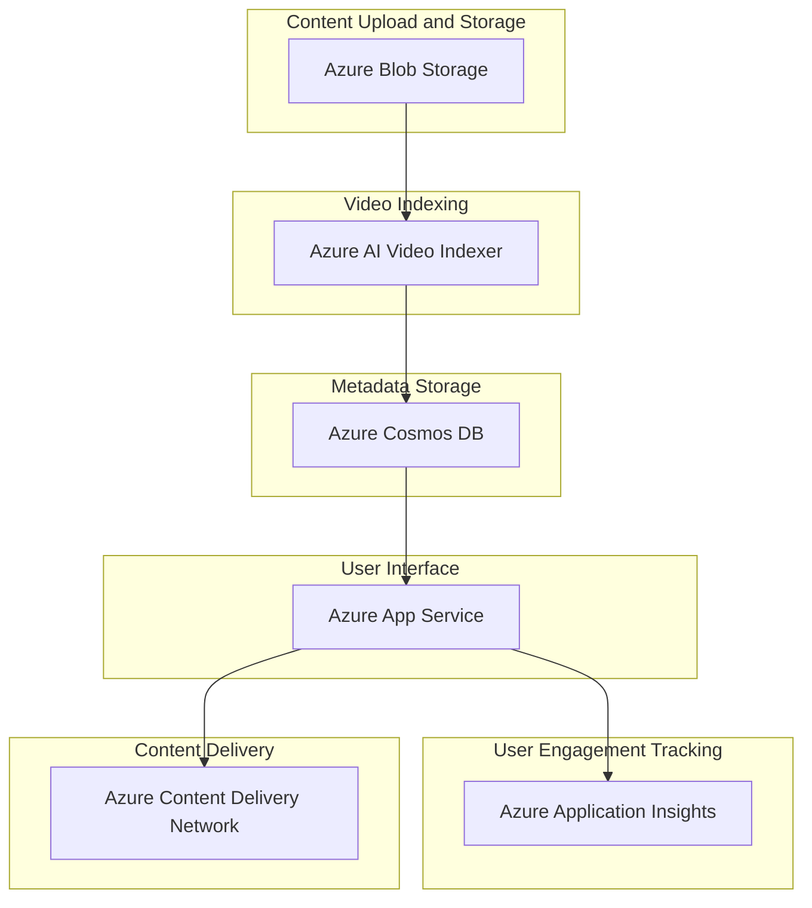
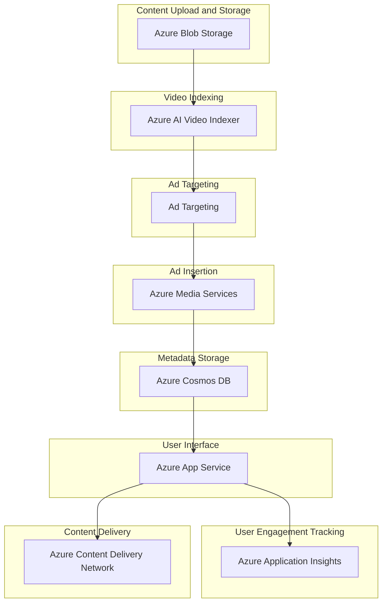
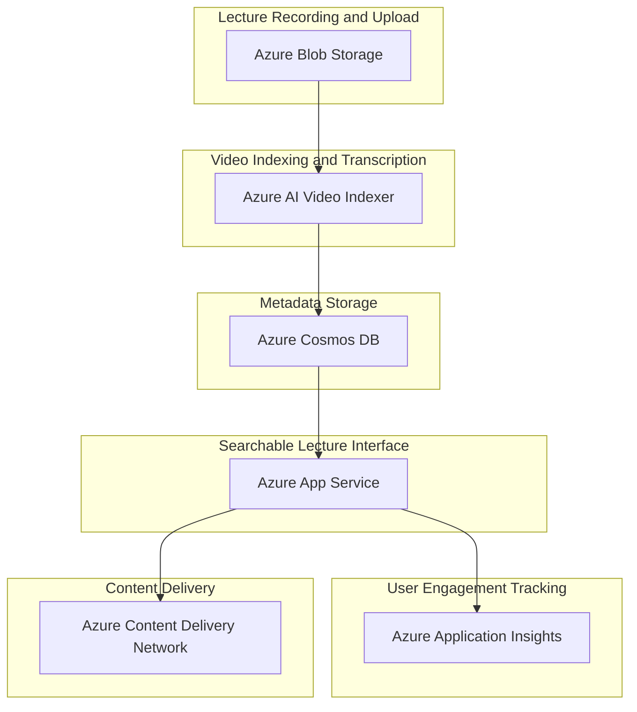
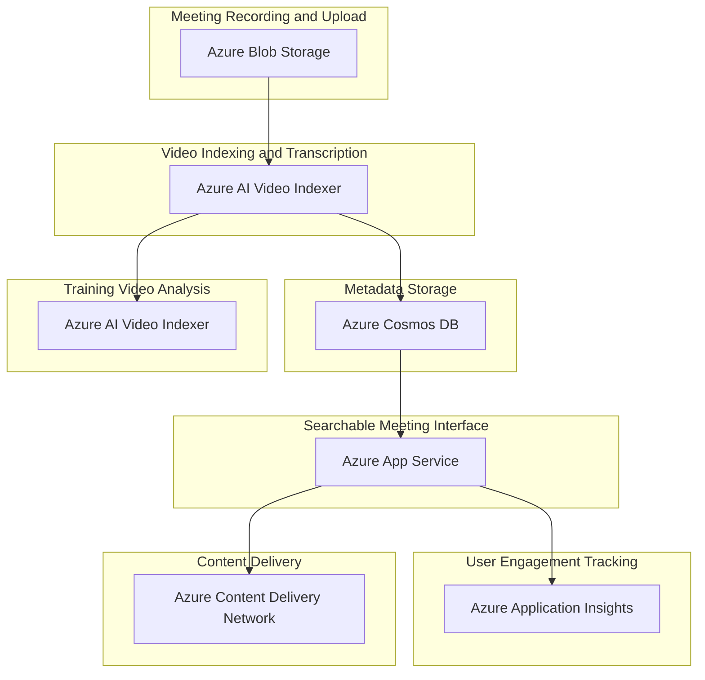
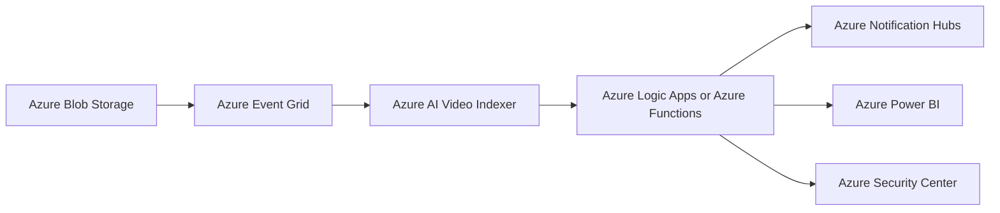
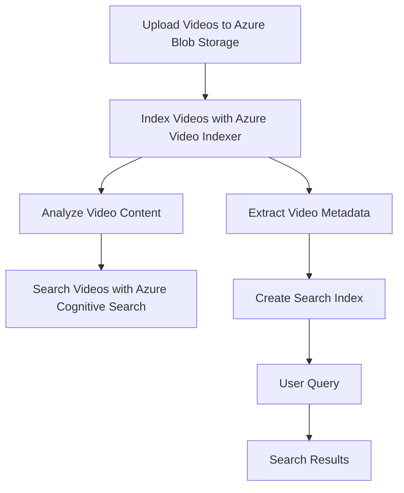

# AI Video Indexer
 
Costa Rica

[](https://github.com) [](https://github.com/Naereen/badges/)

[](https://github.com/)
[brown9804](https://github.com/brown9804)

Last updated: 2024-11-15

----------

<div align="center">
  <h3 style="color: #4CAF50;">Total Visitors</h3>
  
</div>

> Azure AI Video Indexer is a powerful tool that uses AI to extract actionable insights from stored videos, and no machine learning expertise is necessary. It provides the integration of multiple machine learning models into one pipeline. It's easy to evaluate and integrate, and available via web portal, web widget, and REST API. It can identify and extract speech, on-screen text, detect objects, identify brands, detect and recognize faces, extract topics discussed, and create closed captions or subtitles from the audio track. [1](https://vi.microsoft.com/en-us/learn), [2](https://azure.microsoft.com/en-us/products/ai-video-indexer/), [3](https://learn.microsoft.com/en-us/azure/azure-video-indexer/faq), [4](https://techcommunity.microsoft.com/t5/ai-machine-learning-blog/empower-azure-video-indexer-insights-with-your-own-models/ba-p/4023243)

## Content 

<!-- TOC -->

- [AI Video Indexer](#ai-video-indexer)
    - [Content](#content)
        - [Advertising - AI Video Indexer:](#advertising---ai-video-indexer)
        - [Education - AI Video Indexer:](#education---ai-video-indexer)
        - [Corporate - AI Video Indexer:](#corporate---ai-video-indexer)
        - [Security and Surveillance - AI Video Indexer:](#security-and-surveillance---ai-video-indexer)
        - [Healthcare - AI Video Indexer:](#healthcare---ai-video-indexer)

<!-- /TOC -->
> 1. **Content Upload and Storage**: The first step in the process is to upload the media content. This can be done using **Azure Blob Storage**, which provides a scalable and secure place to store the media files.
> 
> 2. **Video Indexing**: Once the media content is stored, you can use **Azure AI Video Indexer** to analyze the content. This service extracts insights from the videos, such as spoken words, written text, faces, speakers, celebrities, emotions, topics, brands, scenes, keyframes, and sentiment.
> 
> 3. **Metadata Storage**: The metadata generated by the Video Indexer can be stored in an **Azure Cosmos DB**. This allows for quick retrieval and querying of the data.
> 
> 4. **User Interface**: You can create a web application using **Azure App Service** to provide an interface for users to interact with the media library. The application can use the metadata from Cosmos DB to position relevant video moments to users.
> 
> 5. **User Engagement Tracking**: User interactions with the media content can be tracked using **Azure Application Insights**. This data can be used to further refine and personalize the user experience.
> 
> 6. **Content Delivery**: Finally, **Azure Content Delivery Network (CDN)** can be used to deliver the media content to users. This ensures high-bandwidth, low-latency access to the media content, regardless of where the users are located.



### Advertising - AI Video Indexer:
[return to Content](#content)

It can enhance ad insertion by analyzing the content of videos and targeting ads based on the extracted insights.

> [!IMPORTANT]
> Here’s an example of an end-to-end solution using Azure resources and Azure AI Video Indexer: This solution leverages several Azure services to create a comprehensive advertising solution. It not only manages and analyzes video content but also improves ad targeting and user engagement by positioning relevant ads based on the content of the videos. Please note that this is a high-level overview and the actual implementation may require additional considerations based on specific requirements.

> 1. **Content Upload and Storage**: Media content is uploaded and stored in **Azure Blob Storage**, providing a secure and scalable solution for media file storage.
> 
> 2. **Video Indexing**: The media content is analyzed using **Azure AI Video Indexer**. This service extracts insights from the videos, such as spoken words, written text, faces, speakers, celebrities, emotions, topics, brands, scenes, keyframes, and sentiment.
> 
> 3. **Ad Targeting**: Based on the insights extracted from the Video Indexer, ads can be targeted to specific content. For example, if the Video Indexer identifies a scene in a video where a particular brand is mentioned or shown, an ad related to that brand could be inserted at that moment.
> 
> 4. **Ad Insertion**: **Azure Media Services** is used for dynamic ad insertion. This service allows you to insert ads into your video content programmatically, based on the insights gained from the Video Indexer.
> 
> 5. **Metadata Storage**: The metadata generated by the Video Indexer, along with ad targeting and insertion data, can be stored in an **Azure Cosmos DB** for quick retrieval and querying.
> 
> 6. **User Interface**: An application hosted on **Azure App Service** provides an interface for users to interact with the video content and view targeted ads.
> 
> 7. **User Engagement Tracking**: User interactions with the ads and video content can be tracked using **Azure Application Insights**. This data can be used to further refine ad targeting and improve user engagement.
> 
> 8. **Content Delivery**: **Azure Content Delivery Network (CDN)** is used to deliver the video content and ads to users, ensuring high-bandwidth, low-latency access to the content, regardless of where the users are located.



### Education - AI Video Indexer:
[return to Content](#content)

In educational institutions, it can be used to transcribe lectures and make them searchable. This can help students find relevant sections of lectures quickly.

> [!IMPORTANT]
> Here’s an example of an end-to-end solution using Azure resources and Azure AI Video Indexer: This solution leverages several Azure services to create a comprehensive educational solution. It not only manages and transcribes lecture content but also improves student engagement by making the lectures searchable and easily accessible. Please note that this is a high-level overview and the actual implementation may require additional considerations based on specific requirements.

> 1. **Lecture Recording and Upload**: Lectures are recorded and uploaded to **Azure Blob Storage**, which provides a secure and scalable solution for storing media files.
> 
> 2. **Video Indexing and Transcription**: The lecture videos are then processed by **Azure AI Video Indexer**. This service transcribes the spoken words in the lectures, making them searchable. It can also identify key topics, extract text from slides shown in the video, and even identify the speakers.
> 
> 3. **Metadata Storage**: The metadata generated by the Video Indexer, including the transcriptions and identified topics, can be stored in an **Azure Cosmos DB**. This allows for quick retrieval and querying of the data.
> 
> 4. **Searchable Lecture Interface**: A web application hosted on **Azure App Service** can provide an interface for students to search through the transcriptions and find relevant sections of the lectures. The application can use the metadata from Cosmos DB to provide search results.
> 
> 5. **User Engagement Tracking**: User interactions with the lecture content can be tracked using **Azure Application Insights**. This data can be used to further refine the search functionality and improve the student experience.
> 
> 6. **Content Delivery**: Finally, **Azure Content Delivery Network (CDN)** can be used to deliver the lecture videos to students. This ensures high-bandwidth, low-latency access to the lecture content, regardless of where the students are located.
>



### Corporate - AI Video Indexer:
[return to Content](#content)

In a corporate setting, it can be used for transcribing meetings and making them searchable. It can also be used for training purposes, where videos can be analyzed to extract key points.

> [!IMPORTANT]
> Here’s an example of an end-to-end solution using Azure resources and Azure AI Video Indexer:
> This solution leverages several Azure services to create a comprehensive corporate solution. It not only manages and transcribes meeting content but also improves employee engagement by making the meetings searchable and easily accessible. It also enhances training by analyzing videos to extract key points. Please note that this is a high-level overview and the actual implementation may require additional considerations based on specific requirements.

> 1. **Meeting Recording and Upload**: Corporate meetings are recorded and uploaded to **Azure Blob Storage**, which provides a secure and scalable solution for storing media files.
> 
> 2. **Video Indexing and Transcription**: The meeting videos are then processed by **Azure AI Video Indexer**. This service transcribes the spoken words in the meetings, making them searchable. It can also identify key topics, extract text from slides shown in the video, and even identify the speakers.
> 
> 3. **Metadata Storage**: The metadata generated by the Video Indexer, including the transcriptions and identified topics, can be stored in an **Azure Cosmos DB**. This allows for quick retrieval and querying of the data.
> 
> 4. **Searchable Meeting Interface**: A web application hosted on **Azure App Service** can provide an interface for employees to search through the transcriptions and find relevant sections of the meetings. The application can use the metadata from Cosmos DB to provide search results.
> 
> 5. **Training Video Analysis**: For training purposes, the Video Indexer can analyze training videos to extract key points, which can then be highlighted in the interface for easy reference.
> 
> 6. **User Engagement Tracking**: User interactions with the meeting and training content can be tracked using **Azure Application Insights**. This data can be used to further refine the search functionality and improve the employee experience.
> 
> 7. **Content Delivery**: Finally, **Azure Content Delivery Network (CDN)** can be used to deliver the meeting and training videos to employees. This ensures high-bandwidth, low-latency access to the content, regardless of where the employees are located.
> 



### Security and Surveillance - AI Video Indexer:
[return to Content](#content)

In security and surveillance, it can be used to analyze surveillance footage for object detection and recognition.

> [!IMPORTANT]
> Here’s an example of an end-to-end solution using Azure resources and Azure AI Video Indexer:

> 1. **Azure Blob Storage**: This is where you can store all your surveillance footage. It provides a cost-effective solution to store any type of data in its native format.
> 
> 2. **Azure Event Grid**: This service can be used to automatically trigger a process whenever a new video is added to the Blob Storage. The process can be a Azure Function or Logic App that sends the video to the Video Indexer.
> 
> 3. **Azure AI Video Indexer**: This service can be used to analyze the videos. It can extract insights from the videos using AI technologies. It can detect and track objects, recognize faces, and extract key frames from the videos.
> 
> 4. **Azure Logic Apps or Azure Functions**: These can be used to handle the output from the Video Indexer. For example, if a certain object or person is detected in the video, an alert can be sent to the security team.
> 
> 5. **Azure Notification Hubs**: This service can be used to send push notifications to mobile devices. So, if an alert is triggered, the security team can be immediately notified.
> 
> 6. **Azure Power BI**: This tool can be used to visualize the data and insights extracted from the videos. It can help in identifying patterns and trends in the surveillance data.
> 
> 7. **Azure Security Center**: This provides unified security management and advanced threat protection. It can be used to monitor the security of all the Azure resources used in this solution.



### Healthcare - AI Video Indexer:
[return to Content](#content)

In healthcare, it can be used to analyze medical instructional videos and make them searchable for medical professionals and students.

> [!IMPORTANT]
> Here’s an example of an end-to-end solution using Azure resources and Azure AI Video Indexer: This is a simplified example and might need to be adjusted based on your specific requirements and the structure of your Azure environment. Always refer to the official Azure documentation for the most accurate information.

> Step 1: Upload Videos to Azure Blob Storage
First, you'll need to upload your medical instructional videos to Azure Blob Storage. This will serve as the central repository for your videos.

```python
from azure.storage.blob import BlobServiceClient

blob_service_client = BlobServiceClient.from_connection_string("your_connection_string")
blob_client = blob_service_client.get_blob_client("your_container_name", "your_blob_name")

with open("your_video.mp4", "rb") as data:
    blob_client.upload_blob(data)
```
> Step 2: Index Videos with Azure Video Indexer
> Next, you’ll use Azure Video Indexer to analyze the videos and extract insights.

```python
import requests
import json

# Replace 'your_video_indexer_region', 'your_video_indexer_subscription_key' and 'your_video_indexer_account_id' with your actual Video Indexer region, subscription key and account ID
headers = {
    'Ocp-Apim-Subscription-Key': 'your_video_indexer_subscription_key',
}

params = {
    'location': 'your_video_indexer_region',
    'accountId': 'your_video_indexer_account_id',
    'name': 'your_video_name',
    'description': 'description_for_your_video',
    'privacy': 'Private',
    'videoUrl': 'url_of_your_video_in_blob_storage',
    'language': 'English',
}

response = requests.post('https://api.videoindexer.ai/auth/{location}/Accounts/{accountId}/Videos', headers=headers, params=params)
result = response.json()

print(json.dumps(result, indent=4))
```

> Step 3: Search Videos with Azure Cognitive Search
> Finally, you’ll use Azure Cognitive Search to make the video insights searchable.
```python
from azure.core.credentials import AzureKeyCredential
from azure.search.documents import SearchClient

search_client = SearchClient("<your_search_service_endpoint>", "<your_index_name>", AzureKeyCredential("<your_search_service_key>"))

results = search_client.search(search_text="your_search_query")

for result in results:
    print("{}: {}".format(result["metadata_storage_name"], result["content"]))
```

> Please replace the placeholders like `"your_connection_string"`, `"your_container_name"`, `"your_blob_name"`, `"your_video_indexer_region"`, `"your_video_indexer_subscription_key"`, `"your_video_indexer_account_id"`, `"your_video_name"`, `"url_of_your_video_in_blob_storage"`, `"<your_search_service_endpoint>"`, `"<your_index_name>"`, and `"<your_search_service_key>"` with your actual values.


