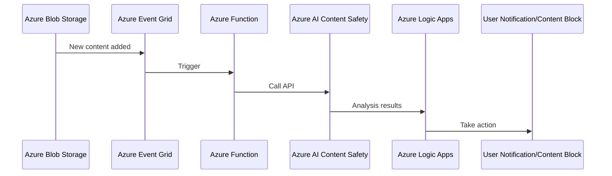
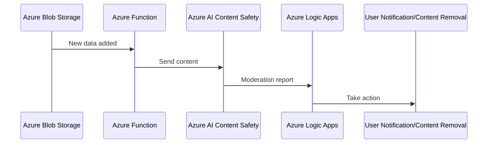
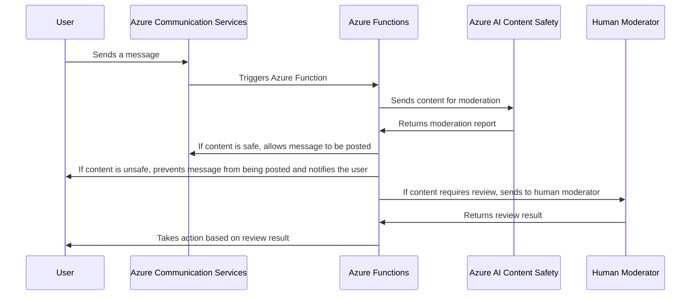
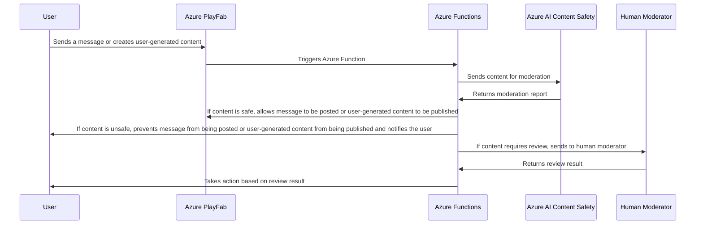
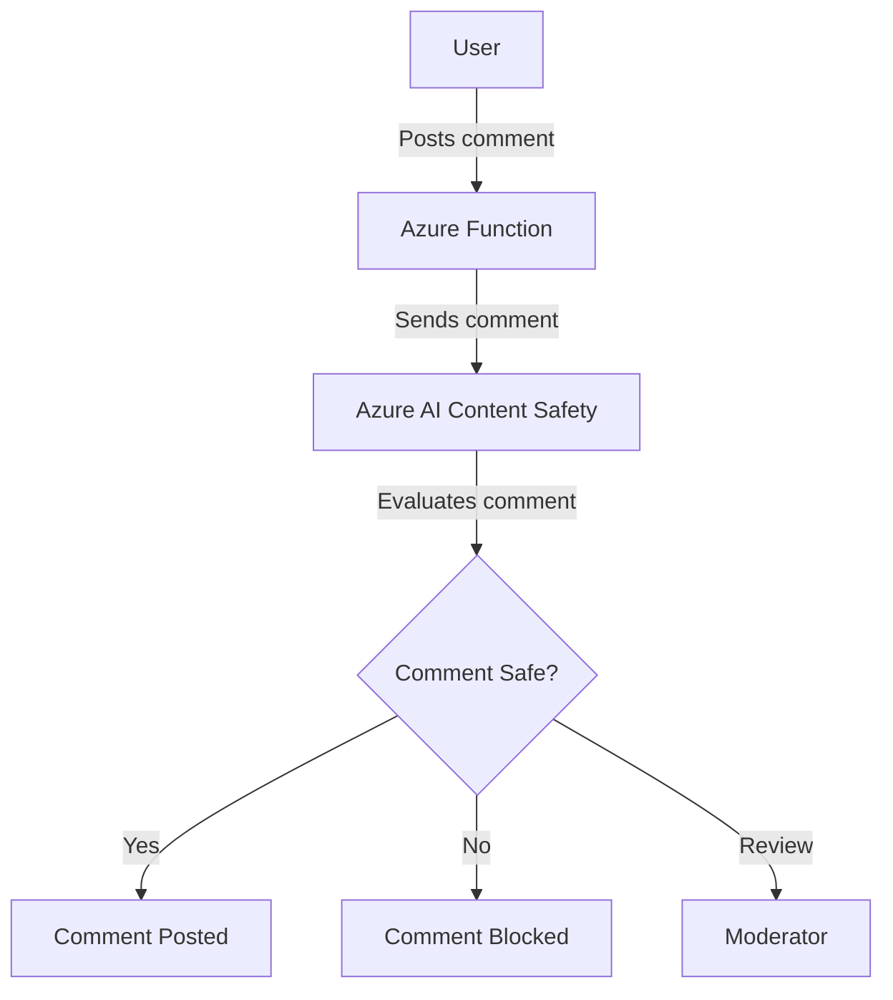

# AI Content Safety	

----------

Costa Rica

[](https://github.com/)
[brown9804](https://github.com/brown9804)

----------

> AI Content Safety is a safety system for monitoring content generated by both foundation models and humans. It can detect and block potential risks, threats, and quality problems. It can detect and filter violence, hate, sexual and self-harm content. It can monitor text, images, and multimodal content. It can analyze human and AI-generated content. It provides advanced capabilities to uphold safety and security of foundation models. It allows you to configure your content filters to reflect standards and policies. It provides seamless integration and deployment. [1](https://fair.rackspace.com/insights/ai-use-cases-whats-next/), [2](https://azure.microsoft.com/en-us/products/ai-services/ai-content-safety/), [3](https://www.ibm.com/blog/artificial-intelligence-use-cases/), [4](https://expertbeacon.com/ai-usecases/), [5](https://www.datamation.com/artificial-intelligence/artificial-intelligence-use-cases/)

The service offered several APIs:  
- Image Moderation API: This API scanned images and detected potential adult and racy content.
- Text Moderation API: This API scanned text content and returned profanity terms and personal data.
- Video Moderation API: This API scanned videos and detected potential adult and racy content.
- List Management API: This API allowed users to create and manage custom exclusion or inclusion lists of images and text.

## Content

<!-- TOC -->

- [AI Content Safety](#ai-content-safety)
    - [Content](#content)
    - [Example of Use Cases](#example-of-use-cases)
        - [Social Media Platforms - AI Content Safety:](#social-media-platforms---ai-content-safety)
        - [E-commerce Platforms - AI Content Safety:](#e-commerce-platforms---ai-content-safety)
        - [Education - AI Content Safety:](#education---ai-content-safety)
        - [Gaming - AI Content Safety:](#gaming---ai-content-safety)
        - [News and Media - AI Content Safety:](#news-and-media---ai-content-safety)

<!-- /TOC -->

## Example of Use Cases

> [!NOTE]
> Here are some use cases:

### Social Media Platforms - AI Content Safety:
[return to Content](#content)

> [!IMPORTANT]
> Here’s an example of an end-to-end solution using Azure resources and Azure AI Content Safety: Please note that this is a high-level overview and the actual implementation may vary based on specific requirements and constraints. Always refer to the official Azure documentation and best practices when implementing your solution. Also, ensure that all actions comply with the terms of service of the social media platform and respect user privacy.

> Architecture
> 
> 1. **Azure Blob Storage**: Stores user-generated content.
> 2. **Azure Event Grid**: Triggers Azure Function whenever new content is added to Blob Storage.
> 3. **Azure Function**: Calls Azure AI Content Safety API to analyze the content.
> 4. **Azure AI Content Safety**: Analyzes the content and returns the analysis results.
> 5. **Azure Logic Apps**: Takes action based on the analysis results (e.g., block content, notify user, etc.).
> 
> Implementation Steps
> 1. **Set up Azure Blob Storage**: Create a Blob Storage account in Azure to store user-generated content.
> 2. **Set up Azure Event Grid**: Create an Event Grid subscription that triggers an Azure Function whenever new content is added to Blob Storage.
> 3. **Set up Azure Function**: Write an Azure Function that gets triggered by Event Grid. This function should call the Azure AI Content Safety API to analyze the content.
> 4. **Set up Azure AI Content Safety**: Use the Azure AI Content Safety API to analyze the content. This API can detect potential risks, threats, and quality problems in the content.
> 5. **Set up Azure Logic Apps**: Create a Logic App that takes action based on the analysis results from Azure AI Content Safety. For example, if the content is flagged as unsafe, the Logic App could block the content and notify the user.
> 
>  Conclusion
> 
> By implementing this solution, social media platforms can effectively monitor and filter user-generated content, helping to maintain a safe and respectful community environment.
> 



### E-commerce Platforms - AI Content Safety:
[return to Content](#content)

It can be used to review product listings and reviews, ensuring they adhere to platform guidelines and regulations.

> [!IMPORTANT]
> Here’s an example of an end-to-end solution using Azure resources and Azure AI Content Safety: This is a high-level overview and code snippet. You’ll need to fill in the details based on your specific requirements and Azure environment.

> Architecture
> 1. **Azure Blob Storage**: Stores the product listings and reviews data.
> 2. **Azure Function**: Triggered when new data is added to the Blob Storage. It sends the content to Azure AI Content Safety for moderation.
> 3. **Azure AI Content Safety**: Reviews the content and returns a moderation report.
> 4. **Azure Logic Apps**: Receives the moderation report from Azure AI Content Safety and takes appropriate action based on the report (e.g., remove content, notify the user, etc.).
> 
> Steps
> 1. Store the product listings and reviews data in Azure Blob Storage.
> 2. Set up an Azure Function that is triggered when new data is added to the Blob Storage.
> 3. In the Azure Function, send the content to Azure AI Content Safety for moderation.
> 4. Set up Azure Logic Apps to receive the moderation report from Azure AI Content Safety.
> 5. In Azure Logic Apps, define the actions to be taken based on the moderation report.
> 
> Code Snippet
> Here's a code snippet for the Azure Function:
> 
> ```python
> import azure.functions as func
> from azure.ai.contentsafety import ContentSafetyClient
> 
> def main(myblob: func.InputStream):
>     client = ContentSafetyClient("<endpoint>", "<api_key>")
>     response = client.text_moderation(myblob.read().decode())
> 
>     # Send moderation report to Logic Apps
>     # ...
> ```
> Please replace <endpoint> and <api_key> with your Azure AI Content Safety endpoint and API key.



### Education - AI Content Safety:
[return to Content](#content)

In educational institutions, it can be used to monitor and moderate content shared in digital classrooms, forums, and chats.

> [!IMPORTANT]
> Here’s an example of an end-to-end solution using Azure resources and Azure AI Content Safety: Please note that this is a simplified representation. In a real-world application, you would need to handle various edge cases, implement authentication and error handling, and possibly integrate with other services depending on your specific requirements.

> Architecture
> 1. **Azure Communication Services**: This is used to facilitate the digital classrooms, forums, and chats. It provides robust APIs for chat services.
> 2. **Azure AI Content Safety**: This service is used to evaluate the content shared in the classrooms, forums, and chats for any inappropriate or harmful content.
> 3. **Azure Functions**: These are used to create serverless applications that can handle incoming chat messages, send them to the Content Safety API, and take appropriate action based on the response.
> 
> Workflow
> 1. A message is sent in a digital classroom, forum, or chat.
> 2. An Azure Function is triggered by this event, which sends the content of the message to the Azure AI Content Safety API.
> 3. The Content Safety API evaluates the content and returns a response indicating whether the content is safe, unsafe, or requires review.
> 4. The Azure Function processes this response. If the content is safe, it allows the message to be posted. If the content is unsafe, it prevents the message from being posted and notifies the user. If the content requires review, it can be sent to a human moderator for further evaluation.
> 
> Code
> Here's a high-level pseudocode representation of the Azure Function:
> 
> ```python
> def process_message(event):
>     # Extract the message content from the event
>     message_content = event.get_message_content()
> 
>     # Send the content to the Content Safety API
>     response = content_safety_api.evaluate_content(message_content)
> 
>     # Take action based on the response
>     if response.is_safe():
>         event.post_message()
>     elif response.is_unsafe():
>         event.prevent_posting()
>         event.notify_user("Your message was found to be inappropriate.")
>     elif response.requires_review():
>         send_to_moderator(message_content)
> ```



### Gaming - AI Content Safety:
[return to Content](#content)

In the gaming industry, it can be used to monitor in-game chats and user-generated content, helping to create a safe gaming environment.

> [!IMPORTANT]
> Here’s an example of an end-to-end solution using Azure resources and Azure AI Content Safety: Please note that this is a simplified representation. In a real-world application, you would need to handle various edge cases, implement authentication and error handling, and possibly integrate with other services depending on your specific requirements.

> Architecture
> 1. **Azure PlayFab**: This is used to manage user-generated content and in-game chats. It provides robust APIs for multiplayer gaming services.
> 2. **Azure AI Content Safety**: This service is used to evaluate the content shared in the game for any inappropriate or harmful content.
> 3. **Azure Functions**: These are used to create serverless applications that can handle incoming chat messages, send them to the Content Safety API, and take appropriate action based on the response.
> 
> Workflow
> 1. A message is sent in an in-game chat or a piece of user-generated content is created.
> 2. An Azure Function is triggered by this event, which sends the content of the message or user-generated content to the Azure AI Content Safety API.
> 3. The Content Safety API evaluates the content and returns a response indicating whether the content is safe, unsafe, or requires review.
> 4. The Azure Function processes this response. If the content is safe, it allows the message to be posted or the user-generated content to be published. If the content is unsafe, it prevents the message from being posted or the user-generated content from being published and notifies the user. If the content requires review, it can be sent to a human moderator for further evaluation.
> 
> Code
> Here's a high-level pseudocode representation of the Azure Function:
> 
> ```python
> def process_content(event):
>     # Extract the content from the event
>     content = event.get_content()
> 
>     # Send the content to the Content Safety API
>     response = content_safety_api.evaluate_content(content)
> 
>     # Take action based on the response
>     if response.is_safe():
>         event.post_content()
>     elif response.is_unsafe():
>         event.prevent_posting()
>         event.notify_user("Your content was found to be inappropriate.")
>     elif response.requires_review():
>         send_to_moderator(content)
> ````



### News and Media - AI Content Safety:
[return to Content](#content)

It can be used to moderate comments and discussions on news articles, ensuring they adhere to community guidelines.

> [!IMPORTANT]
> Here’s an example of an end-to-end solution using Azure resources and Azure AI Content Safety:

> Architecture
> 1. **Azure App Service**: This is used to host the news website where users can read articles and post comments.
> 2. **Azure AI Content Safety**: This service is used to evaluate the comments posted by users for any inappropriate or harmful content.
> 3. **Azure Functions**: These are used to create serverless applications that can handle incoming comments, send them to the Content Safety API, and take appropriate action based on the response.
> 
> Workflow
> 1. A user posts a comment on a news article.
> 2. An Azure Function is triggered by this event, which sends the content of the comment to the Azure AI Content Safety API.
> 3. The Content Safety API evaluates the comment and returns a response indicating whether the comment is safe, unsafe, or requires review.
> 4. The Azure Function processes this response. If the comment is safe, it allows the comment to be posted. If the comment is unsafe, it prevents the comment from being posted and notifies the user. If the comment requires review, it can be sent to a human moderator for further evaluation.
> 
> Code
> Here's a high-level pseudocode representation of the Azure Function:
> 
> ```python
> def process_comment(event):
>     # Extract the comment content from the event
>     comment_content = event.get_comment_content()
> 
>     # Send the content to the Content Safety API
>     response = content_safety_api.evaluate_content(comment_content)
> 
>     # Take action based on the response
>     if response.is_safe():
>         event.post_comment()
>     elif response.is_unsafe():
>         event.prevent_posting()
>         event.notify_user("Your comment was found to be inappropriate.")
>     elif response.requires_review():
>         send_to_moderator(comment_content)
> ```


