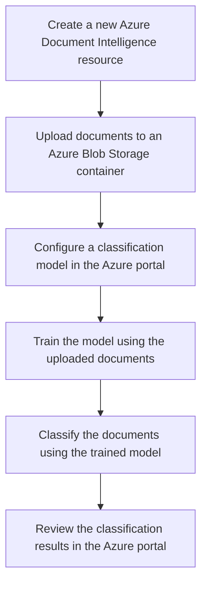
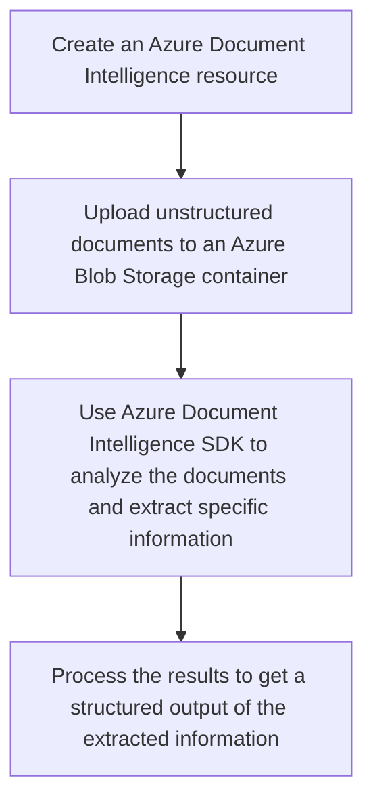
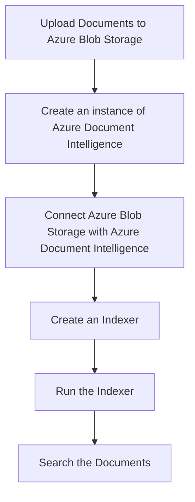
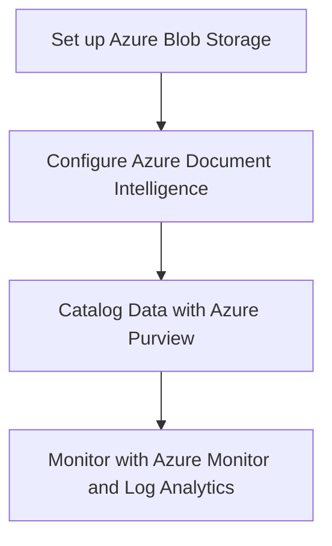
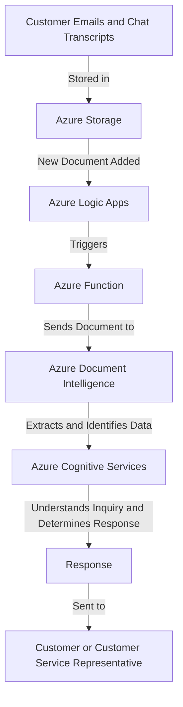

# Document Intelligences

----------

Costa Rica

[](https://github.com/)
[brown9804](https://github.com/brown9804)

----------

Key Features:
- **Text Extraction**: Easily pull data and organize information with prebuilt and custom features.
- **Customized Results**: Get output tailored to your layouts with automatic custom extraction and improve it with human feedback.
- **Flexible Deployment**: Ingest data from the cloud or at the edge and apply to search indexes, business automation workflows, and more.
- **Built-in Security**: Rely on enterprise-grade security and privacy applied to both your data and any trained models.

Capabilities: 
- **Document Analysis**: Detects and extracts text and layout of documents, like tables, check boxes, and objects.
- **Prebuilt Models**: These are pretrained models for common scenarios such as IDs, receipts, and invoices, that extract text, key-value pairs, and line items from documents.
- **Custom Models**: This custom form service lets you train on your own data to learn the structure of your documents in an intelligent way.

Applications: 
- Azure AI Document Intelligence can be used to automate your data processing in applications and workflows, enhance data-driven strategies, and enrich document search capabilities. 

## Content

<!-- TOC -->

- [Document intelligences](#document-intelligences)
    - [Content](#content)
    - [Examples of Use Cases](#examples-of-use-cases)
        - [Document Classification - Document Intelligence:](#document-classification---document-intelligence)
        - [Information Extraction - Document Intelligence:](#information-extraction---document-intelligence)
        - [Content Search - Document Intelligence:](#content-search---document-intelligence)
        - [Compliance and Risk Management - Document Intelligence:](#compliance-and-risk-management---document-intelligence)
        - [Customer Service - Document Intelligence:](#customer-service---document-intelligence)

<!-- /TOC -->

## Examples of Use Cases

> [!NOTE]
> Here are some use cases:

### Document Classification - Document Intelligence:
[return to Content](#content)

Azure Document Intelligence can be used to automatically classify documents into predefined categories. This can be particularly useful in industries like legal, finance, and healthcare where large volumes of documents need to be categorized.

> [!IMPORTANT]
> Here’s an example of an end-to-end solution using Azure resources and Azure Document Intelligence: Azure Document Intelligence can be used to automatically classify documents into predefined categories. This can be particularly useful in industries like legal, finance, and healthcare where large volumes of documents need to be categorized.

> Prerequisites
> - An Azure account with an active subscription.
> - Azure Document Intelligence resource.
> 
> Steps
> 1. Create a new Azure Document Intelligence resource: 
> - Create a new resource in the Azure portal. You'll need to provide details such as your subscription, resource group, region, and the name of your resource.
> 2. Upload your documents: 
> - Upload the documents you want to classify to an Azure Blob Storage container. Make sure the documents are in a format that Azure Document Intelligence can process (such as .pdf, .docx, .pptx, .xlsx, .jpg, .png, .tiff).
> 3. Configure your classification model: 
> - In the Azure portal, navigate to your Document Intelligence resource. Under "Model Management", create a new classification model. You'll need to specify the categories you want your documents to be classified into.
> 4. Train your model: 
> - Once your model is configured, you can train it using your uploaded documents. The training process involves the model learning from your documents and their associated categories.
> 5. Classify your documents: 
> - After your model is trained, you can use it to classify your documents. The classification process involves the model predicting the category of each document.
> 6. Review your results: 
> - After your documents have been classified, you can review the results in the Azure portal. You'll be able to see the predicted category for each document, along with a confidence score.
> 




### Information Extraction - Document Intelligence:
[return to Content](#content)

Azure Document Intelligence can extract key information from unstructured documents. This can automate data entry tasks and improve data accuracy.

> [!IMPORTANT]
> Here’s an example of an end-to-end solution using Azure resources and Azure Document Intelligence: Azure Document Intelligence can extract key information from unstructured documents. For example, it can pull out specific details like dates, names, and financial figures from contracts or invoices. This can automate data entry tasks and improve data accuracy.

> Prerequisites
> - An Azure account
> - Azure Document Intelligence resource
> 
> Steps
> 1. Create an Azure Document Intelligence resource: First, you need to create an Azure Document Intelligence resource in the Azure portal.
> 2. Upload the documents: Upload the unstructured documents (like contracts or invoices) to a blob storage in Azure.
> 3. Use Azure Document Intelligence to analyze the documents: Use the Azure Document Intelligence SDK to analyze the documents. You can specify what kind of information you want to extract (like dates, names, and financial figures).
> 
> ```python
> from azure.ai.formrecognizer import FormRecognizerClient
> from azure.core.credentials import AzureKeyCredential
> 
> endpoint = "<your-resource-endpoint>"
> key = "<your-resource-key>"
> 
> form_recognizer_client = FormRecognizerClient(endpoint, AzureKeyCredential(key))
> 
> with open("<your-document-path>", "rb") as fd:
>     form = fd.read()
> 
> poller = form_recognizer_client.begin_recognize_content(form)
> result = poller.result()
> 
> for page in result:
>     for line in page.lines:
>         print(line.text)
> ```
> 
> 4. Process the results: The result will be a structured output of the information extracted from the documents. You can then use this data as needed, for example, to automate data entry tasks.



### Content Search - Document Intelligence:
[return to Content](#content)

Azure Document Intelligence can enable full text search across millions of documents. This can help users find specific documents or information within documents quickly and accurately.

> [!IMPORTANT]
> Here’s an example of an end-to-end solution using Azure resources and Azure Document Intelligence:

> Steps
> 1. **Upload Documents to Azure Blob Storage**: First, you need to upload your documents to Azure Blob Storage. This can be done using the Azure portal, Azure Storage Explorer, or programmatically using Azure SDKs.
> 2. **Create an instance of Azure Document Intelligence**: Navigate to the Azure portal and create a new instance of Azure Document Intelligence. You will need to provide necessary details such as subscription, resource group, region, and name.
> 3. **Connect Azure Blob Storage with Azure Document Intelligence**: In the Azure Document Intelligence instance, create a new data source connection. Select Azure Blob Storage and provide the connection string of the Blob Storage where your documents are stored.
> 4. **Create an Indexer**: An indexer is a crawler that extracts searchable data and metadata from the documents in your data source. In the Azure Document Intelligence instance, create a new indexer that targets the data source connection you created.
> 5. **Run the Indexer**: Run the indexer to populate Azure Document Intelligence with searchable data. The time it takes will depend on the number of documents and their complexity.
> 6. **Search the Documents**: Now you can use the search explorer in Azure Document Intelligence to search the documents. You can also integrate the search functionality into your applications using the Azure Search APIs.



### Compliance and Risk Management - Document Intelligence:
[return to Content](#content)

Azure Document Intelligence can help organizations maintain compliance and manage risk by identifying sensitive information in documents. It can detect and redact information like social security numbers, credit card numbers, and other personally identifiable information (PII).

> [!IMPORTANT]
> Here’s an example of an end-to-end solution using Azure resources and Azure Document Intelligence:

> Architecture
> 1. **Data Storage**: Store your documents in **Azure Blob Storage**. This provides a scalable and secure place for all your files.
> 2. **Document Processing**: Use **Azure Document Intelligence** to process the documents stored in Blob Storage. This service can identify and redact sensitive information.
> 3. **Data Cataloging**: Catalog processed data using **Azure Purview**. This allows you to keep track of what data you have and where it is.
> 4. **Monitoring**: Monitor the health of your services and the processing of your data using **Azure Monitor** and **Log Analytics**.
> 
> Implementation Steps
> 1. **Set up Azure Blob Storage**: Create a new storage account in Azure and upload your documents.
> 2. **Configure Azure Document Intelligence**: Set up a new Document Intelligence resource in Azure. Configure it to redact sensitive information from the documents in your Blob Storage.
> 3. **Catalog Data with Azure Purview**: Set up Azure Purview to catalog your data. This will help you keep track of your data and its lineage.
> 4. **Monitor with Azure Monitor and Log Analytics**: Set up monitoring for your services using Azure Monitor and Log Analytics. This will help you keep track of the health of your services and the processing of your data.
>



### Customer Service - Document Intelligence:
[return to Content](#content)

Azure Document Intelligence can be used to improve customer service by providing quick and accurate responses to customer inquiries. By analyzing customer emails, chat transcripts, and other documents, it can provide relevant information to customer service representatives or even automate responses.

> [!IMPORTANT]
> Here’s an example of an end-to-end solution using Azure resources and Azure Document Intelligence: This solution aims to improve customer service by providing quick and accurate responses to customer inquiries. By analyzing customer emails, chat transcripts, and other documents, it can provide relevant information to customer service representatives or even automate responses.

> Architecture: The following Azure services are used in this solution
> 1. **Azure Document Intelligence**: To extract, identify, and understand data from customer emails, chat transcripts, and other documents.
> 2. **Azure Logic Apps**: To automate workflows and coordinate with other services.
> 3. **Azure Functions**: To run code snippets in response to triggers.
> 4. **Azure Storage**: To store customer emails, chat transcripts, and other documents.
> 5. **Azure Cognitive Services (Language Understanding)**: To understand customer inquiries and determine the best responses.
> 
> Workflow
> 1. Customer emails and chat transcripts are stored in Azure Storage.
> 2. Azure Logic Apps triggers an Azure Function when a new document is added.
> 3. The Azure Function sends the document to Azure Document Intelligence for analysis.
> 4. Azure Document Intelligence extracts and identifies data from the document.
> 5. The extracted data is sent to Azure Cognitive Services to understand the customer inquiry and determine the best response.
> 6. The response is either sent directly to the customer or provided to a customer service representative for further action.


