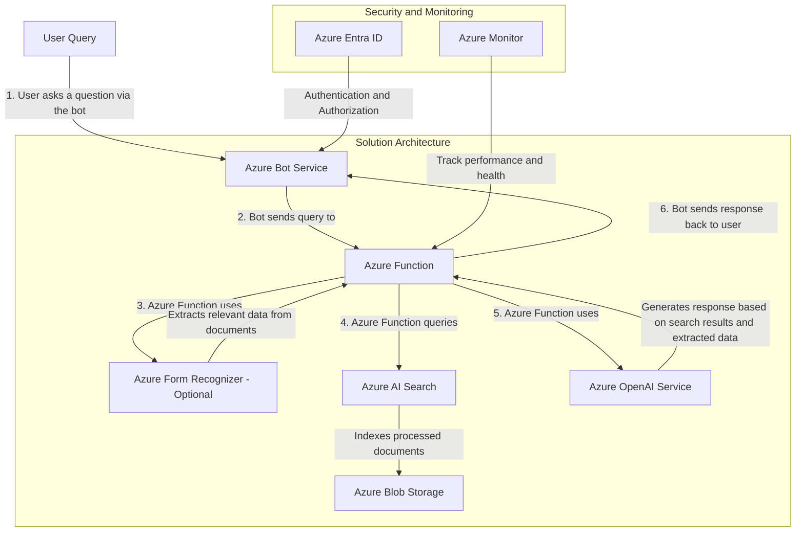

# Q&A Bot Using Azure - Document Based 

Costa Rica

[brown9804](https://github.com/brown9804)

Last updated: 2024-08-06

------------------------------------------

## Example of use case with Documment Intelligence

> [!NOTE]
> Azure Form Recognizer helps to extract more data from documents but might increase the price. It is optional and can be used based on specific needs.

### Solution Architecture 

1. Document Storage
    - **Azure Blob Storage**: Store your documents in Azure Blob Storage. This service is scalable and cost-effective for storing large amounts of unstructured data. Ensure that all data stored in Azure Blob Storage is encrypted at rest and in transit.
3. Document Processing:
    - **Azure Form Recognizer** (Optional): Use Azure Form Recognizer to extract structured data from your documents. This service can handle various document types, including invoices, receipts, and more, converting them into usable data.
    - **Azure AI Search**: Index the processed documents using Azure AI Search (formerly known as Azure Cognitive Search) to make them searchable.
4. Natural Language Processing:
    - **Azure OpenAI Service**: Use the Azure OpenAI Service to leverage models like GPT-4 for understanding and generating human-like text. This can be used to interpret user queries and generate responses based on the indexed documents.
5. Bot Framework:
    - **Azure Bot Service**: Create the bot using Azure Bot Service. This service provides the tools to build, test, and deploy intelligent bots that can interact with users through various channels (e.g., web, Teams, Slack).
6. Integration:
    - **Azure Functions**: Use Azure Functions to integrate the different components. For example, when a user asks a question, an Azure Function can query the AI Search index and use the OpenAI model to generate a response.
7. Security and Monitoring
    - **Azure Entra ID**: Secure your solution with Azure Entra ID for authentication and authorization.
    - **Azure Monitor**: Use Azure Monitor to track the performance and health of your solution.
8. Scalability: Consider how the architecture can scale to handle increased loads or additional document types. For example:
    - Azure Blob Storage and Azure AI Search are designed to scale automatically to handle large volumes of data.
    - Azure Functions can scale out to handle more requests as needed.
    
### Example Workflow 
1. **User Query**: The user asks a question via the bot.
2. **Query Processing**: The bot sends the query to an Azure Function.
3. **Document Intelligence**: The Azure Function uses Form Recognizer to extract relevant data from the documents.
4. **Search**: The Azure Function queries the AI Search index.
5. **Response Generation**: The Azure Function uses the OpenAI model to generate a response based on the search results and extracted data.
6. **Reply**: The bot sends the response back to the user.

