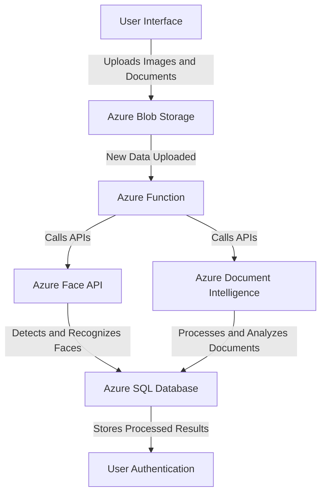
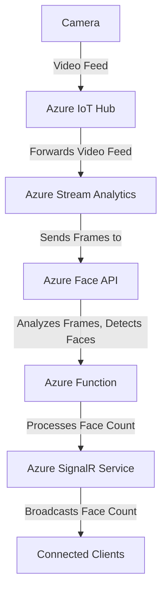
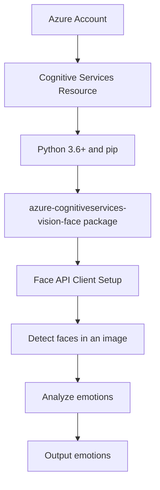
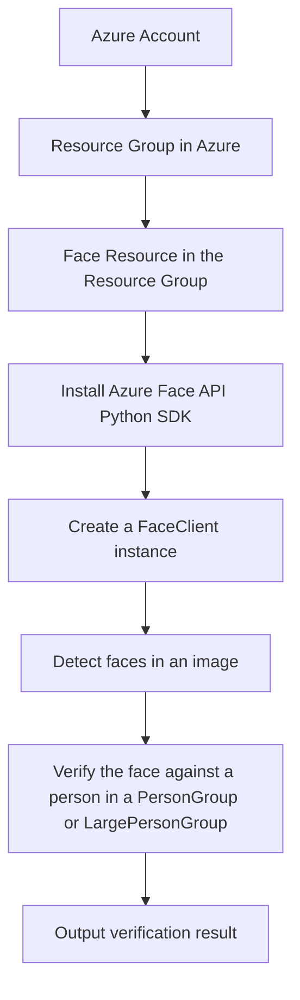

# Face APIs

Costa Rica

[](https://github.com/)
[brown9804](https://github.com/brown9804)

Last updated: 2024-11-19

----------

Key Features: 
- **Face Detection and Recognition**: The service provides AI algorithms that detect, recognize, and analyze human faces in images.
- **Facial Recognition Software**: This software is important in many different scenarios, such as security, natural user interface, image content analysis and management, mobile apps, and robotics.
- **API Categories**: The Face APIs comprise the following categories: Face Algorithm APIs, DetectLiveness session APIs, FaceList APIs, LargePersonGroup Person APIs, LargePersonGroup APIs, LargeFaceList APIs, PersonGroup Person APIs, PersonGroup APIs, PersonDirectory Person APIs, PersonDirectory DynamicPersonGroup APIs, Liveness Session APIs and Liveness-With-Verify Session APIs.

## Content 

<!-- TOC -->

- [Face APIs](#face-apis)
    - [Content](#content)
    - [Examples of Use Cases](#examples-of-use-cases)
        - [Facial Recognition for Security Systems - Face APIs:](#facial-recognition-for-security-systems---face-apis)
        - [Personalized User Experience - Face APIs:](#personalized-user-experience---face-apis)
        - [People Counting - Face APIs:](#people-counting---face-apis)
        - [Emotion Analysis for Market Research - Face APIs:](#emotion-analysis-for-market-research---face-apis)
        - [Identity Verification - Face APIs:](#identity-verification---face-apis)

<!-- /TOC -->

## Examples of Use Cases

> [!NOTE]
> Here are some use cases:
### Facial Recognition for Security Systems - Face APIs:
[return to Content](#content)

Azure Face API can be used to build security systems that use facial recognition. The API can detect, recognize, and analyze human faces in images. This can be used to authenticate users based on their facial features.

> [!IMPORTANT]
> Here’s an example of an end-to-end solution using Azure resources and Azure Face APIs: This solution uses Azure Face API for facial recognition and Azure Document Intelligence for document processing. The system can detect, recognize, and analyze human faces in images for user authentication.

> Architecture
> 1. **User Interface (UI)**: A web or mobile application where users can upload their face images and documents.
> 2. **Azure Blob Storage**: Stores the uploaded images and documents.
> 3. **Azure Function**: Triggered when new data is uploaded to Blob Storage. It calls the Face API and Document Intelligence API.
> 4. **Azure Face API**: Used to detect and recognize faces in the uploaded images.
> 5. **Azure Document Intelligence**: Used to process and analyze the uploaded documents.
> 6. **Azure SQL Database**: Stores the processed results from Face API and Document Intelligence.
> 
> Implementation Steps
> 1. **Set up Azure Services**: Create and configure the Azure Blob Storage, Azure Function, Azure Face API, Azure Document Intelligence, and Azure SQL Database.
> 2. **Develop the User Interface**: Implement a web or mobile application where users can upload their face images and documents. The application should upload these files to the Azure Blob Storage.
> 3. **Implement Azure Function**: Develop an Azure Function that is triggered when new data is uploaded to Blob Storage. This function should call the Face API with the image data and the Document Intelligence API with the document data.
> 4. **Process with Face API**: The Face API will detect and recognize faces in the uploaded images. The results are then stored in the Azure SQL Database.
> 5. **Process with Document Intelligence**: The Document Intelligence API will process and analyze the uploaded documents. The results are then stored in the Azure SQL Database.
> 6. **User Authentication**: Implement a user authentication mechanism in the application. This can use the facial recognition data from the Face API and the document data from Document Intelligence to authenticate users.



### Personalized User Experience - Face APIs:
[return to Content](#content)

Azure Face API can be used to create personalized user experiences in applications. For example, a digital billboard can change its content based on the age, gender, or emotion of the person looking at it.

> [!IMPORTANT]
> Here’s an example of an end-to-end solution using Azure resources and Azure Face APIs: This solution uses the Azure Face API to detect and analyze faces in real-time. The data gathered (age, gender, emotion) is then used to personalize the content displayed on a digital billboard.

> Architecture
> 
> 1. **Azure Face API**: This service detects human faces in an image and returns face locations, face landmarks, and optional attributes including age, gender, and emotion.
> 2. **Azure Function**: This serverless function is triggered by the Face API's output. It processes the data and decides what content to display based on the detected attributes.
> 3. **Azure Digital Twins**: This IoT service helps model the relationships and interactions between people, places, and devices. In this case, it models the digital billboard and updates its state based on the data received from the Azure Function.
> 
> Implementation Steps
> 1. **Set up the Face API**: Create a Face API instance in the Azure portal. You'll need to configure it with your specific requirements, such as enabling detection of age, gender, and emotion.
> 2. **Create an Azure Function**: This function will take the output from the Face API, process it, and decide what content to display. You'll need to write code that can interpret the Face API's output and make decisions based on it.
> 3. **Model the Digital Billboard in Azure Digital Twins**: Create a Digital Twin for your billboard. This will allow you to easily update the billboard's state based on the data from the Azure Function.
> 4. **Connect the services**: Finally, you'll need to connect these services together. The Face API should trigger the Azure Function whenever it detects a face, and the Azure Function should update the Digital Twin whenever it decides to change the content.
> 


### People Counting - Face APIs:
[return to Content](#content)

Azure Face API can be used to count the number of people in a room or area by analyzing the video feed from a camera. This can be useful in scenarios like crowd management or occupancy monitoring in smart buildings.

> [!IMPORTANT]
> Here’s an example of an end-to-end solution using Azure resources and Azure Face APIs: This solution uses the Azure Face API to count the number of people in a room or area by analyzing the video feed from a camera. This can be useful in scenarios like crowd management or occupancy monitoring in smart buildings.

> Architecture
> 
> 1. **Camera**: A camera is set up in the room or area. The video feed from the camera is sent to an Azure IoT Hub.
> 2. **Azure IoT Hub**: The IoT Hub receives the video feed and forwards it to an Azure Stream Analytics job.
> 3. **Azure Stream Analytics**: The Stream Analytics job processes the video feed in real-time and sends frames to the Azure Face API for analysis.
> 4. **Azure Face API**: The Face API analyzes the frames, detects faces, and returns the count of detected faces.
> 5. **Azure Function**: An Azure Function is triggered by the output of the Face API, processes the face count, and sends it to an Azure SignalR Service.
> 6. **Azure SignalR Service**: The SignalR Service broadcasts the face count to connected clients in real-time.
> 
> Code: This is a high-level solution and the actual implementation will depend on the specific requirements of your project. Here is a pseudo-code example of how the Azure Function might look:
> 
> ```python
> import os
> from azure.cognitiveservices.vision.face import FaceClient
> from msrest.authentication import CognitiveServicesCredentials
> 
> # Set up the FaceClient
> face_client = FaceClient(os.environ['FACE_ENDPOINT'], CognitiveServicesCredentials(os.environ['FACE_KEY']))
> 
> def process_frame(frame):
>     # Use the Face API to detect faces in the frame
>     face_ids = [face.face_id for face in face_client.face.detect_with_stream(frame)]
>     
>     # Return the count of detected faces
>     return len(face_ids)
> ```
> 
> Next Steps: To implement this solution, you would need to.
> 
> 1. Set up the camera and connect it to the Azure IoT Hub.
> 2. Create the Azure Stream Analytics job and configure it to send frames to the Face API.
> 3. Implement the Azure Function to process the face count and send it to the SignalR Service.
> 4. Connect your clients to the SignalR Service to receive the face count in real-time.



### Emotion Analysis for Market Research - Face APIs:
[return to Content](#content)

Azure Face API can analyze emotions expressed by people's faces. This can be used in market research to understand how customers react to a product or advertisement.

> [!IMPORTANT]
> Here’s an example of an end-to-end solution using Azure resources and Azure Face APIs: how you might use Azure Face API for emotion analysis in market research. This example is written in Python and uses the azure-cognitiveservices-vision-face package.

> Prerequisites
> 
> - An Azure account
> - A Cognitive Services resource created in the Azure portal
> - Python 3.6+ and pip (which comes with Python)
> - The azure-cognitiveservices-vision-face package, which you can install with pip:
> 
> ```bash
> pip install --upgrade azure-cognitiveservices-vision-face
> ```
> 
> Code: First, import the necessary modules and set up your Face API client
> 
> ```python
> from azure.cognitiveservices.vision.face import FaceClient
> from msrest.authentication import CognitiveServicesCredentials
> 
> # Replace with your own subscription key and endpoint
> SUBSCRIPTION_KEY = "your_subscription_key"
> ENDPOINT = "your_endpoint"
> 
> # Create an authenticated FaceClient.
> face_client = FaceClient(ENDPOINT, CognitiveServicesCredentials(SUBSCRIPTION_KEY))
> 
> # Next, detect faces in an image and analyze their emotions:
> # Replace with the URL of an image that you want to analyze.
> IMAGE_URL = "https://example.com/image.jpg"
> 
> # Detect faces in the image
> detected_faces = face_client.face.detect_with_url(IMAGE_URL, return_face_attributes=['emotion'])
> 
> # Print the emotions detected in each face
> for face in detected_faces:
>     print(face.face_attributes.emotion)
> ```
> 
> This will output the emotions detected in each face, such as happiness, sadness, surprise, and so on. You can use this information to understand how customers react to a product or advertisement. Please replace `"your_subscription_key"` and `"your_endpoint"` with your actual subscription key and endpoint. Also, replace `"https://example.com/image.jpg"` with the URL of the image you want to analyze. Remember to handle exceptions in your code. You can find more details in the Azure Face API documentation.
> 



### Identity Verification - Face APIs:
[return to Content](#content)

Azure Face API can be used for identity verification in applications. For example, it can be used to verify a person's identity during a remote exam or online banking transaction.

> [!IMPORTANT]
> Here’s an example of an end-to-end solution using Azure resources and Azure Face APIs: how you might use Azure Face API for identity verification in a remote exam or online banking transaction. This example is written in Python.

> Prerequisites: 
> - An Azure account
> - A resource group in Azure
> - A Face resource in the resource group
> 
> Steps
> 1. **Install the Azure Face API Python SDK**:
> 
> ```python
> pip install azure-cognitiveservices-vision-face
> ```
> 
> 2. Import the necessary modules and create a FaceClient instance:
> ```python 
> from azure.cognitiveservices.vision.face import FaceClient
> from msrest.authentication import CognitiveServicesCredentials
> 
> # Replace with your Face resource's endpoint and key
> face_client = FaceClient('<your-face-resource-endpoint>', CognitiveServicesCredentials('<your-face-resource-key>'))
> ```
> 
> 3. Detect faces in an image:
> ```python 
> # Replace with the URL of an image or a path to a local image file
> image_url = '<image-url-or-path>'
> 
> detected_faces = face_client.face.detect_with_url(image_url) if image_url.startswith('http') else face_client.face.detect_with_stream(open(image_url, 'r+b'))
> 
> if not detected_faces:
>     raise Exception('No face detected in image')
> 
> # Assume the first face is the one we're interested in
> face_id = detected_faces[0].face_id
> ```
> 
> 4. Verify the face against a person in a PersonGroup or LargePersonGroup:
> ```python 
> # Replace with the ID of a PersonGroup or LargePersonGroup and a person in the group
> person_group_id = '<person-group-id>'
> person_id = '<person-id>'
> 
> verify_result = face_client.face.verify_face_to_person(face_id, person_id, person_group_id)
> 
> if verify_result.is_identical:
>     print('The face in the image is verified to be the same as the one in the group')
> else:
>     print('The face in the image is not the same as the one in the group')
> ```
> 
> Please replace `<your-face-resource-endpoint>`, `<your-face-resource-key>`, `<image-url-or-path>`, `<person-group-id>`, and `<person-id>` with your actual values. Also, please note that this is a simplified example and might need to be adjusted based on your specific use case. For more information, you can refer to the Azure Face API documentation.
> 



<div align="center">
  <h3 style="color: #4CAF50;">Total Visitors</h3>
  
</div>