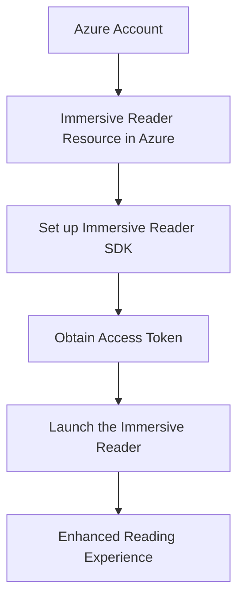
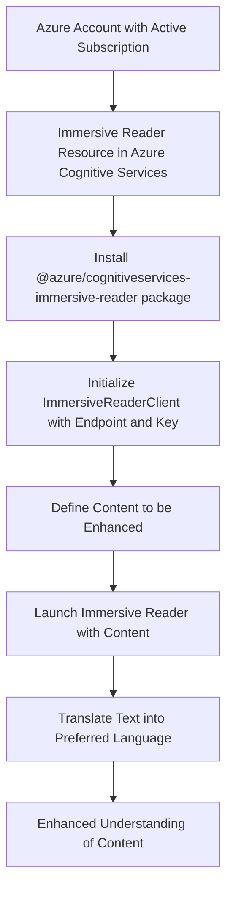
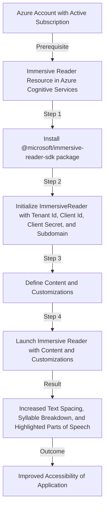

# Immersive readers

Costa Rica

[](https://github.com/)
[brown9804](https://github.com/brown9804)

Last updated: 2024-11-15

----------

Key Features: 
- **Reading and Comprehension**: The service provides AI algorithms that help users of any age and reading ability with reader tools and features like reading aloud, translating languages, and focusing attention through highlighting and other design elements.
- **Translation**: Translation is available in more than 100 languages.
-  **Accessibility**: Immersive Reader is designed to make reading easier and more accessible for everyone. It can isolate content for improved readability, display pictures for common words, highlight parts of speech, read content aloud, translate content in real-time, and split words into syllables.
-  **Data Privacy**: Immersive reader doesn't store any customer data. 

## Content 

<!-- TOC -->

- [Immersive readers](#immersive-readers)
    - [Content](#content)
    - [Example of Use Cases](#example-of-use-cases)
        - [Enhancing Reading Comprehension - Immersive readers:](#enhancing-reading-comprehension---immersive-readers)
        - [Multilingual Support - Immersive readers:](#multilingual-support---immersive-readers)
        - [Accessibility - Immersive readers:](#accessibility---immersive-readers)
        - [Education - Immersive readers:](#education---immersive-readers)

<!-- /TOC -->

## Example of Use Cases 

> [!NOTE]
> Here are some use cases:

### Enhancing Reading Comprehension - Immersive readers:
[return to Content](#content)

Azure Immersive Reader can be used to enhance reading comprehension for users. It provides features like Read Aloud, Line Focus, and Picture Dictionary that can help users, especially those with learning difficulties, to better understand the content.

> [!IMPORTANT]
> Here’s an example of an end-to-end solution using Azure resources and Azure Immersive readers: Azure Immersive Reader is a tool that can be used to enhance reading comprehension for users. It provides features like Read Aloud, Line Focus, and Picture Dictionary that can help users, especially those with learning difficulties, to better understand the content.

> Prerequisites
> 
> - An Azure account
> - An Immersive Reader resource in Azure
> 
> Steps
> 1. **Set up the Immersive Reader SDK**: The Immersive Reader SDK is available as a JavaScript package that can be included in your web application.
> 
>     ```html
>     <script src="https://contentstorage.onenote.office.net/onenoteltir/immersivereadersdk/immersive-reader-sdk.0.0.1.js"></script>
>     ```
> 
> 2. **Obtain an Access Token**: You'll need to set up a server-side component to obtain an access token from your Immersive Reader resource. This token is used to authenticate your application with the Immersive Reader.
> 
>     ```javascript
>     var options = {
>         method: 'POST',
>         url: '<Your Azure Function URL>',
>         headers: {
>             'content-type': 'application/x-www-form-urlencoded'
>         },
>         form: {
>             subdomain: '<Your Immersive Reader resource subdomain>',
>             secret: '<Your Immersive Reader resource secret>'
>         }
>     };
> 
>     request(options, function (error, response, body) {
>         if (error) throw new Error(error);
>         console.log(body);
>     });
>     ```
> 
> 3. **Launch the Immersive Reader**: Once you have an access token, you can launch the Immersive Reader to enhance the reading comprehension of your content.
> 
>     ```javascript
>     ImmersiveReader.launchAsync(token, subdomain, content, options)
>         .catch(function (error) {
>             console.log('Error on launch:', error);
>         });
>     ```
> 
>     Where `content` is a JavaScript object that represents the content you want to enhance, and `options` is an optional JavaScript object that can be used to customize the behavior of the Immersive Reader.
> 
> By integrating Azure Immersive Reader into your application, you can provide a more accessible and inclusive reading experience for your users.
> 



### Multilingual Support - Immersive readers:
[return to Content](#content)

Azure Immersive Reader supports text translation in over 70 languages. This can be used in applications that have a diverse user base, allowing users to translate and understand content in their preferred language.

> [!IMPORTANT]
> Here’s an example of an end-to-end solution using Azure resources and Azure Immersive readers: 

> Prerequisites
> 
> - An Azure account with an active subscription.
> - An Immersive Reader resource under Azure Cognitive Services.
> 
> Setup: First, install the `@azure/cognitiveservices-immersive-reader` package
> 
> ```bash
> npm install @azure/cognitiveservices-immersive-reader
> ```
> 
> Usage: Here’s a basic example of how to use the Immersive Reader SDK
> 
> ```javascript
> const { ImmersiveReaderClient } = require('@azure/cognitiveservices-immersive-reader');
> 
> // Replace with your Immersive Reader resource information
> const immersiveReaderEndpoint = '<Your Immersive Reader Endpoint>';
> const immersiveReaderKey = '<Your Immersive Reader Key>';
> 
> const client = new ImmersiveReaderClient(immersiveReaderKey, immersiveReaderEndpoint);
> 
> const content = {
>     title: 'Hello, world!',
>     chunks: [{
>         content: 'Welcome to our application. We support over 70 languages.',
>         mimeType: 'text/plain'
>     }]
> };
> 
> client.launchAsync(content)
>     .then(() => console.log('Immersive Reader launched!'))
>     .catch(err => console.error(err));
> 
> ```
> 
> This will launch the Immersive Reader with the provided content. Users can then use the built-in tools to translate the text into their preferred language. Please replace `<Your Immersive Reader Endpoint>` and `<Your Immersive Reader Key>` with your actual Immersive Reader resource information. You can find these in the Azure portal, under the 'Keys and Endpoint' section of your Immersive Reader resource.



### Accessibility - Immersive readers:
[return to Content](#content)

Azure Immersive Reader improves the accessibility of applications by providing features that make content more accessible to people with disabilities. For example, it can increase text spacing, break words into syllables, and highlight parts of speech to make text easier to read.

> [!IMPORTANT]
> Here’s an example of an end-to-end solution using Azure resources and Azure Immersive readers: 

> Prerequisites:
> - An Azure account with an active subscription.
> - An Immersive Reader resource under Azure Cognitive Services.
> 
> Steps:
> 1. **Install the SDK**
> 
>     You can install the Azure Cognitive Services Immersive Reader SDK using npm:
> 
>     ```bash
>     npm install @microsoft/immersive-reader-sdk
>     ```
> 
> 2. **Initialize the SDK**
> 
>     In your JavaScript file, import the SDK and initialize it with your Immersive Reader resource details:
> 
>     ```javascript
>     import * as immersiveReader from '@microsoft/immersive-reader-sdk';
> 
>     const tenantId = '<Your_Tenant_Id>';
>     const clientId = '<Your_Client_Id>';
>     const clientSecret = '<Your_Client_Secret>';
>     const subdomain = '<Your_Resource_Subdomain>'; // Do not include standard domain (cognitiveservices.azure.com)
>     ```
> 
> 3. **Launch the Immersive Reader**
> 
>     You can now launch the Immersive Reader. In this example, we'll increase text spacing, break words into syllables, and highlight parts of speech:
> 
>     ```javascript
>     const content = {
>         title: 'Sample Text',
>         chunks: [{
>             content: 'This is a sample text for the Azure Immersive Reader.'
>         }]
>     };
> 
>     const options = {
>         uiZIndex: 1000,
>         timeout: 15000,
>         customizations: {
>             textSize: 200,
>             textSpacing: 200,
>             partsOfSpeech: {
>                 verbs: { color: 'blue', highlight: 'underline' },
>                 nouns: { color: 'green', highlight: 'underline' }
>             }
>         }
>     };
> 
>     immersiveReader.launchAsync(tenantId, clientId, clientSecret, subdomain, content, options)
>         .catch((error) => {
>             console.log('Error launching Immersive Reader:', error);
>         });
>     ```
> 
> Please replace <Your_Tenant_Id>, <Your_Client_Id>, <Your_Client_Secret>, and <Your_Resource_Subdomain> with your actual Azure Immersive Reader resource details. This code will launch the Azure Immersive Reader with the specified customizations when run.



### Education - Immersive readers:
[return to Content](#content)

In the education sector, Azure Immersive Reader can be used to create more inclusive classrooms. It can help students with dyslexia, ADHD, emerging readers, and non-native speakers to improve their reading skills.

> [!IMPORTANT]
> Here’s an example of an end-to-end solution using Azure resources and Azure Immersive readers:

> Solution Architecture: The following Azure resources will be used in this solution
> 1. **Azure Immersive Reader**: This is the core service that will be used to improve reading skills of students.
> 2. **Azure App Service**: This will host the web application where students will interact with the content.
> 3. **Azure Cognitive Services**: These services will be used to further enhance the learning experience, such as text analytics for understanding the content better.
> 
> Implementation Steps
> 1. **Set up Azure Immersive Reader**
>    - Create an Azure resource for Immersive Reader.
>    - Obtain the necessary keys and endpoints.
> 2. **Develop the Web Application**
>    - Develop a web application using your preferred language and framework.
>    - Integrate the Azure Immersive Reader into the web application using the SDK.
> 3. **Deploy the Web Application on Azure App Service**
>    - Create an Azure App Service Plan and a Web App.
>    - Deploy the web application to the Azure Web App.
> 4. **Integrate Azure Cognitive Services (Optional)**
>    - Depending on the requirements, integrate relevant Azure Cognitive Services to enhance the learning experience.
> 

 ```mermaid
graph TD
    A[Azure Immersive Reader]
    B[Azure App Service]
    C[Azure Cognitive Services]
    D[Web Application]
    E[Azure App Service Plan and Web App]
    F[Azure Cognitive Services Integration - Optional]
    A -->|1. Set up| D
    D -->|2. Develop| E
    E -->|3. Deploy| B
    B -->|4. Host| D
    C -->|5. Enhance - Optional| D
```

<div align="center">
  <h3 style="color: #4CAF50;">Total Visitors</h3>
  
</div>