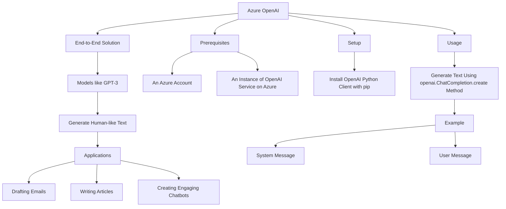
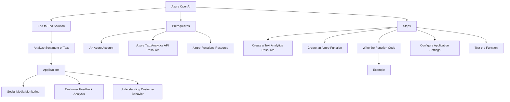
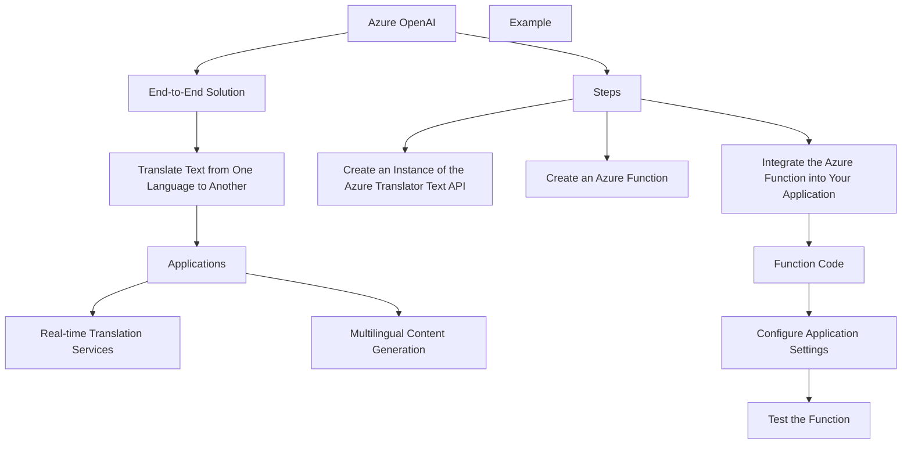
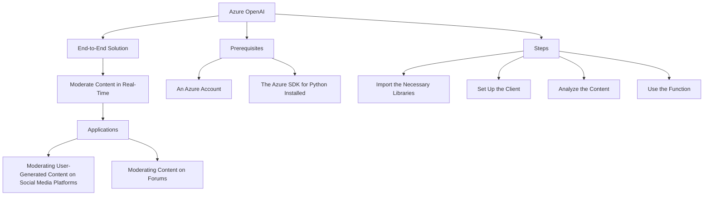
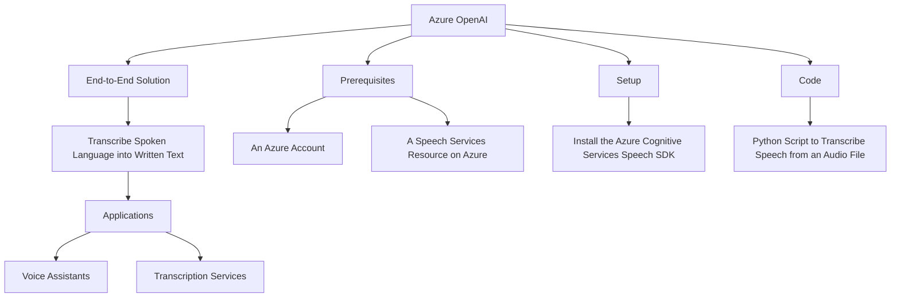

# Azure OpenAI

Costa Rica

[](https://github.com) [](https://github.com/Naereen/badges/)

[](https://github.com/)
[brown9804](https://github.com/brown9804)

Last updated: 2024-11-15

----------

Key Features: 
- **Advanced AI Models**: The service provides access to advanced AI models for conversational, content creation, and data grounding use cases.
- **Fine-tuning**: You can fine-tune the models, apply generative AI, and integrate with other Azure AI services.
- **Models Available**: The models available through Azure OpenAI Service include GPT-4, GPT-3.5-Turbo, and Embeddings.
-  **Security and Compliance**: Azure OpenAI Service offers the security and enterprise promise of Azure.

## Content 

<!-- TOC -->

- [Azure OpenAI](#azure-openai)
    - [Content](#content)
    - [Example of Use Cases](#example-of-use-cases)
        - [Text Generation - Azure OpenAI:](#text-generation---azure-openai)
        - [Sentiment Analysis - Azure OpenAI:](#sentiment-analysis---azure-openai)
        - [Language Translation - Azure OpenAI:](#language-translation---azure-openai)
        - [Content Moderation - Azure OpenAI:](#content-moderation---azure-openai)
        - [Speech Recognition - Azure OpenAI:](#speech-recognition---azure-openai)
    - [Demos & Tech Talks](./demos/)
        - [Optimizing Chatbot Efficiency](./demos/1_OptimizingChatbotEfficiency.md)
<!-- /TOC -->

## Example of Use Cases

> [!NOTE]
> Here are some use cases:

### Text Generation - Azure OpenAI:
[return to Content](#content)

Azure OpenAI can be used to generate human-like text. This can be useful in a variety of applications such as drafting emails, writing articles, creating engaging chatbots, and more.

> [!IMPORTANT]
> Here’s an example of an end-to-end solution using Azure resources and Azure OpenAI: Azure OpenAI provides access to powerful models like GPT-3 for generating human-like text. This can be used in a variety of applications such as drafting emails, writing articles, creating engaging chatbots, and more.

> Prerequisites
> - An Azure account
> - An instance of the OpenAI service on Azure
> 
> Setup: First, install the OpenAI Python client with pip:
> 
> ```bash
> pip install openai
> ```
> 
> Usage: You can generate text using the openai.ChatCompletion.create() method. Here’s an example.
> ```python 
> import openai
> 
> openai.api_key = 'your-api-key'
> 
> response = openai.ChatCompletion.create(
>   model="gpt-3.5-turbo",
>   messages=[
>         {"role": "system", "content": "You are a helpful assistant."},
>         {"role": "user", "content": "Who won the world series in 2020?"},
>     ]
> )
> 
> print(response['choices'][0]['message']['content'])
> ```
> 
> In this example, the system message is used to set the behavior of the assistant, and the user message is what you want the model to respond to. Replace 'your-api-key' with your actual OpenAI API key.
> 



### Sentiment Analysis - Azure OpenAI:
[return to Content](#content)

Azure OpenAI can analyze the sentiment of a piece of text. This can be used in social media monitoring, customer feedback analysis, and understanding customer behavior.

> [!IMPORTANT]
> Here’s an example of an end-to-end solution using Azure resources and Azure OpenAI:

> Prerequisites
> 
> - An Azure account
> - Azure Text Analytics API resource
> - Azure Functions resource
> 
> Steps
> 1. Create a Text Analytics Resource
> - In the Azure portal, create a new Text Analytics resource. After creation, note down the `key1` and `endpoint` from the resource's 'Keys and Endpoint' tab.
> 2. Create an Azure Function
> - Create a new Azure Function App in the portal. You can use an HTTP trigger for this function.
> 3. Write the Function Code
> - In your function code, you'll need to call the Text Analytics API to perform sentiment analysis. Here's an example in JavaScript:
> 
> ```javascript
> const axios = require('axios');
> 
> module.exports = async function (context, req) {
>     const textToAnalyze = req.body.text;
> 
>     const sentimentAnalysisUrl = `${process.env.TEXT_ANALYTICS_ENDPOINT}/text/analytics/v3.1-preview.5/sentiment`;
>     const sentimentAnalysisResponse = await axios.post(sentimentAnalysisUrl, {
>         documents: [
>             { id: '1', text: textToAnalyze }
>         ]
>     }, {
>         headers: {
>             'Ocp-Apim-Subscription-Key': process.env.TEXT_ANALYTICS_KEY
>         }
>     });
> 
>     const sentiment = sentimentAnalysisResponse.data.documents[0].sentiment;
> 
>     context.res = {
>         body: { sentiment }
>     };
> };
> ```
> 
> This function takes in a piece of text as input, sends it to the Text Analytics API for sentiment analysis, and returns the sentiment of the text.
> 
> 4. Configure Application Settings
> - In your function app settings, add two new application settings: TEXT_ANALYTICS_KEY and TEXT_ANALYTICS_ENDPOINT. Set their values to the key1 and endpoint of your Text Analytics resource, respectively.
> 5. Test the Function
> - You can now test your function by sending a POST request to the function’s URL with a JSON body containing the text to analyze. The function should return the sentiment of the text.



### Language Translation - Azure OpenAI:
[return to Content](#content)

Azure OpenAI can translate text from one language to another. This can be used in applications such as real-time translation services, multilingual content generation, and more.

> [!IMPORTANT]
> Here’s an example of an end-to-end solution using Azure resources and Azure OpenAI:

> Steps:
> - Create an instance of the Azure Translator Text API: This service provides real-time translation between multiple languages.
> - Create an Azure Function: This will act as the interface between your application and the Translator Text API. The function will receive text and a target language as input, and return the translated text as output.
> - Integrate the Azure Function into your application: Your application will send requests to the Azure Function whenever it needs to translate text.
> Here’s a simple example of what the Azure Function code might look like in Node.js:
> 
> ```javascript
> const axios = require('axios');
> 
> module.exports = async function (context, req) {
>     context.log('JavaScript HTTP trigger function processed a request.');
> 
>     const textToTranslate = req.query.text || (req.body && req.body.text);
>     const targetLanguage = req.query.to || (req.body && req.body.to);
> 
>     if (textToTranslate && targetLanguage) {
>         const subscriptionKey = process.env['TRANSLATOR_TEXT_SUBSCRIPTION_KEY'];
>         const endpoint = process.env['TRANSLATOR_TEXT_ENDPOINT'] + '/translate?api-version=3.0';
> 
>         const options = {
>             headers: {
>                 'Ocp-Apim-Subscription-Key': subscriptionKey,
>                 'Content-type': 'application/json',
>                 'X-ClientTraceId': uuidv4().toString()
>             },
>             params: {
>                 'to': targetLanguage
>             },
>             data: [{
>                 'text': textToTranslate
>             }],
>             method: 'post',
>             url: endpoint
>         };
> 
>         try {
>             const response = await axios(options);
>             context.res = {
>                 // status: 200, /* Defaults to 200 */
>                 body: response.data[0].translations[0].text
>             };
>         } catch (error) {
>             context.res = {
>                 status: 500,
>                 body: "Error: " + error
>             };
>         }
>     }
>     else {
>         context.res = {
>             status: 400,
>             body: "Please pass text and a target language in the request"
>         };
>     }
> };
> ```
> 
> 
> Please replace `process.env['TRANSLATOR_TEXT_SUBSCRIPTION_KEY']` and `process.env['TRANSLATOR_TEXT_ENDPOINT']` with your actual Translator Text API subscription key and endpoint. This is a basic example and might need to be adjusted based on the specific requirements of your application. For instance, you might want to add error handling for cases where the translation service is not able to translate the provided text, or where the requested target language is not supported. You might also want to implement caching of translations to improve performance and reduce costs. Remember to secure your keys and endpoints, and do not expose them in your client-side code. Always keep them server-side, or use secure methods like Azure Key Vault for storing sensitive information. 
>



### Content Moderation - Azure OpenAI:
[return to Content](#content)

Azure OpenAI can be used to moderate content in real-time. This can be useful in applications such as moderating user-generated content on social media platforms, forums, and more.

> [!IMPORTANT]
> Here’s an example of an end-to-end solution using Azure resources and Azure OpenAI: This can be useful for moderating user-generated content on social media platforms, forums, and more.

> Prerequisites
> 
> - An Azure account
> - The Azure SDK for Python installed
> 
> Steps
> 
> 1. **Import the necessary libraries**
> 
> ```python
> from azure.ai.textanalytics import TextAnalyticsClient
> from azure.core.credentials import AzureKeyCredential
> ```
> 
> 2. Set up the client
> ```python 
> key = "your-text-analytics-key"
> endpoint = "your-text-analytics-endpoint"
> 
> def authenticate_client():
>     ta_credential = AzureKeyCredential(key)
>     text_analytics_client = TextAnalyticsClient(
>             endpoint=endpoint, 
>             credential=ta_credential)
>     return text_analytics_client
> 
> client = authenticate_client()
> ```
> 
> 3. Analyze the content
> ```python 
> def moderate_content(client, documents):
>     response = client.analyze_sentiment(documents=documents)[0]
>     print("Document Sentiment: {}".format(response.sentiment))
>     print("Overall scores: positive={0:.2f}; neutral={1:.2f}; negative={2:.2f} \n".format(
>         response.confidence_scores.positive,
>         response.confidence_scores.neutral,
>         response.confidence_scores.negative,
>     ))
> ```
> 
> 4. Use the function
> ```python 
> documents = ["Add your text here"]
> moderate_content(client, documents)
> ```
> 
> This will give you the sentiment of the text, which you can use to moderate content. For example, you might decide to block or flag content that has a negative sentiment score. Please replace `"your-text-analytics-key"` and `"your-text-analytics-endpoint"` with your actual Text Analytics key and endpoint. Also, replace `"Add your text here"` with the content you want to moderate.
>



### Speech Recognition - Azure OpenAI:
[return to Content](#content)

Azure OpenAI can transcribe spoken language into written text. This can be used in applications such as voice assistants, transcription services, and more.

> [!IMPORTANT]
> Here’s an example of an end-to-end solution using Azure resources and Azure OpenAI:

> Prerequisites
> 
> - An Azure account
> - A Speech Services resource on Azure
> 
> Setup
> 
> First, install the Azure Cognitive Services Speech SDK:
> 
> ```bash
> pip install azure-cognitiveservices-speech
> ```
> 
> Code: Here’s a simple Python script that uses the SDK to transcribe speech from an audio file
> 
> ```python 
> import azure.cognitiveservices.speech as speechsdk
> 
> def transcribe_speech(speech_key, service_region, audio_file):
>     speech_config = speechsdk.SpeechConfig(subscription=speech_key, region=service_region)
>     audio_input = speechsdk.AudioConfig(filename=audio_file)
>     speech_recognizer = speechsdk.SpeechRecognizer(speech_config=speech_config, audio_config=audio_input)
> 
>     result = speech_recognizer.recognize_once()
> 
>     if result.reason == speechsdk.ResultReason.RecognizedSpeech:
>         print("Recognized: {}".format(result.text))
>     elif result.reason == speechsdk.ResultReason.NoMatch:
>         print("No speech could be recognized")
>     elif result.reason == speechsdk.ResultReason.Canceled:
>         cancellation_details = result.cancellation_details
>         print("Speech Recognition canceled: {}".format(cancellation_details.reason))
>         if cancellation_details.reason == speechsdk.CancellationReason.Error:
>             print("Error details: {}".format(cancellation_details.error_details))
> 
> # Replace with your own subscription key, service region, and audio file
> speech_key = "your-speech-key"
> service_region = "your-service-region"
> audio_file = "path-to-your-audio-file.wav"
> 
> transcribe_speech(speech_key, service_region, audio_file)
> ```
> 
> This script will transcribe speech from the provided audio file using Azure Cognitive Services and print the transcription. Please replace `"your-speech-key"`, `"your-service-region"`, and `"path-to-your-audio-file.wav"` with your actual Speech Services subscription key, service region, and path to your audio file, respectively.
>




<div align="center">
  <h3 style="color: #4CAF50;">Total Visitors</h3>
  
</div>
