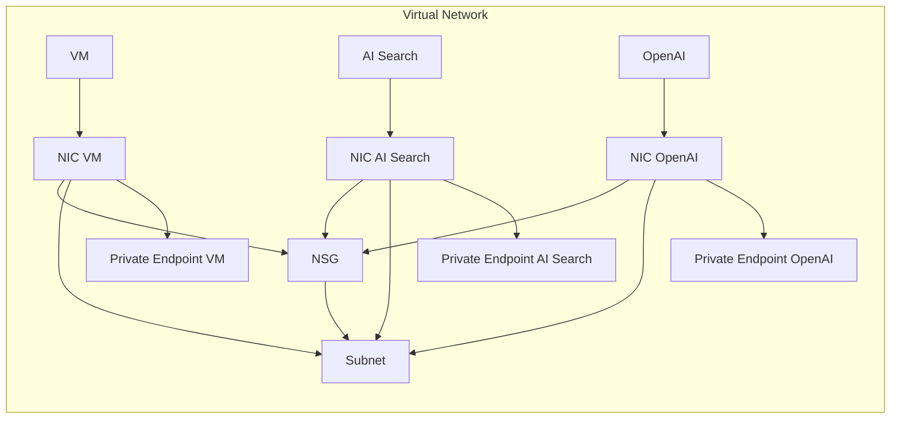

# Building a Private ChatGPT with Azure OpenAI

Costa Rica

[brown9804](https://github.com/brown9804)

Last updated: 2024-10-10

------------------------------------------

> This demo is about how to setup secure document searches within a designated network, ensuring that your data remains protected while leveraging the capabilities of Azure OpenAI.

## Wiki 

<b>Table of Contents</b> (Click to expand)

  
- [Create a private endpoint for a secure connection to Azure AI Search](https://learn.microsoft.com/en-us/azure/search/service-create-private-endpoint#use-the-azure-portal-to-access-a-private-search-service)
 

## How to 

> `same/different vent` -> `shared access` can be used  
> `same vnet` -> `private endpoint`  
> `different vnet` -> needs `vnet peering`

### Create an Azure OpenAI Resource:

- Sign in to the Azure portal.
- Navigate to `Create a resource` and search for `Azure OpenAI`.
- Configure the Resource: Follow the prompts to configure the resource
  - Subscription: Choose your subscription.
  - Resource Group: Create a new resource group or select an existing one.
  - Region: Choose the region closest to your users.
  - Name: Provide a unique name for your Azure OpenAI resource.
- Review and Create: Review your configuration and select `Create`.

 

 

### Set Up Azure AI Search:

 - Create Azure AI Search Resource: In the Azure portal, create a new Azure AI Search resource.
 - Configure Search Service: Provide the necessary details
    - Name: Enter a name for your search service.
    - Resource Group: Use the same resource group as your Azure OpenAI resource.
    - Location: Use the same region for reduced latency.
    - Pricing Tier: Select a pricing tier based on your needs.

    

    
    
- Establish the network connection by choosing to either set up the resource with a public configuration and adjust the network settings later, or integrate the network configuration during the resource creation process.

  

> [!NOTE]  
> About the exception checkmark `Allow Azure services on the trusted services list to access this search service`:  
> This setting `allows trusted Azure services to bypass the network rules` and access your resource directly.
> These include services `like Azure Backup, Azure Site Recovery`, and others that are part of the trusted services list.
> Even with this setting enabled, `proper authentication is still required` to access the resource, such as Managed Identity or Service Principal.
> `Only resources within the specified IP address ranges or virtual networks will have access`.
> Resources from other tenants or subscriptions will not have access `unless they are explicitly granted access through the whitelist or fall under the allowed exceptions`.
> This setting is particularly useful for scenarios where you want to allow Azure Site Recovery to access your search service for disaster recovery purposes without needing to configure additional network rules.

### Integrate with Virtual Network (VNet)

>  Deploy your VMs, Azure AI Search, and Azure OpenAI within the VNet.

1. **Navigate to VNet**: In the Azure portal, go to`Virtual networks` and select your VNet.
2. **Subnets**: Ensure that your subnets are correctly configured and have the necessary address space.
3. **Service Endpoints**: Add service endpoints for Azure OpenAI and Azure AI Search.

    
    
    
  
    

### Configure Private Endpoints for Azure AI Search

1. **Navigate to Private Endpoint**: In the Azure portal, go to your Azure AI Search resource and select `Networking` > `Private endpoint connections`.
2. **Add Private Endpoint**: Click on `+ Private endpoint` to add a new private endpoint.
3. **Configure Private Endpoint**: Follow the prompts to configure the private endpoint
   - **Name**: Provide a name for the private endpoint.
   - **Virtual Network**: Select the same virtual network and subnet as used for Azure OpenAI.
   - **Integration**: Integrate with your DNS for name resolution.
4. **Approve Connection**: Once the private endpoint is created, approve the connection. 

  | **Network Configuration**            | **Use Case**                                                                                                                                   | **Considerations**                                                                                                                                                                                                 |
  |------------------------|-----------------------------------------------------------------------------------------------------------------------------------------------|--------------------------------------------------------------------------------------------------------------------------------------------------------------------------------------------------------------------|
  | **Shared Private Access** | - Simplifies the configuration by allowing you to create a private endpoint connection from Azure AI Search to Azure OpenAI without manually setting up private endpoints. - Suitable when you want to establish a secure connection between resources in the same or different VNets. - The connection must be approved by the owner of the target resource, adding an extra layer of security. | - VNet Peering or VPN Gateway is required if Azure AI Search and Azure OpenAI are in different VNets. - Network Security Groups (NSGs) should be configured to allow traffic between the VNets if they are peered. |
  | **Private Endpoint Connection** | - Provides a network interface that connects you privately and securely to a service powered by Azure Private Link. - Ideal for securing the connection between Azure AI Search and Azure OpenAI within the same Virtual Network. - Offers a higher level of security by ensuring that the connection remains within the VNet. - Can offer better performance as the traffic remains within the Azure backbone network. | - Requires manual setup of private endpoints for both Azure AI Search and Azure OpenAI. - DNS settings must be correctly configured to resolve the private endpoints.                                                |
  | **VNet Peering**       | - Enables resources in different VNets to communicate with low latency and high bandwidth, as if they were within the same network. - Useful when Azure AI Search and Azure OpenAI are in different VNets. - Allows full connectivity between VNets, making it suitable for scenarios where multiple resources need to communicate across VNets. | - Peering links must be created in both VNets. - NSGs should be configured to allow traffic from the peered VNet. - Additional costs may be incurred for data transfer between VNets.                            |

  - Search for the resource ID of the Azure OpenAI service:

    

 - Create the shared private link or the `private endpoint` as needed:

   > Shared private access:
   
    

    > Private Endpoint:

    

    

    - While doing this you can also setup the Network Security Group (NSG) if it's not already set up.

      

### Configure Private Endpoints for Azure OpenAI

1. **Navigate to Private Endpoint**: In the Azure portal, go to your Azure OpenAI resource and select `Networking` > `Private endpoint connections`.
2. **Add Private Endpoint**: Click on `+ Private endpoint` to add a new private endpoint.
3. **Configure Private Endpoint**: Follow the prompts to configure the private endpoint:
   - **Name**: Provide a name for the private endpoint.
   - **Virtual Network**: Select the virtual network and subnet where the endpoint will be deployed.
   - **Integration**: Integrate with your DNS for name resolution.
4. **Approve Connection**: Once the private endpoint is created, approve the connection.

  

  

### Set Up Network Security Groups (NSGs)

1. **Create NSG**: In the Azure portal, create a new Network Security Group.
2. **Associate NSG with Subnet**: Associate the NSG with the subnet where your private endpoints are deployed.
3. **Configure Security Rules**: Add inbound and outbound security rules to allow traffic only from your specific network.

   

### Create index/Upload Documents 

> Since now we are in a private network, Azure AI Search only admits requests from clients in a virtual network instead of over a public internet. So we need to create a VM, and set that VM in a VNET. Click [here for a more detailed guide on how to Create a private endpoint for a secure connection to Azure AI Search](https://learn.microsoft.com/en-us/azure/search/service-create-private-endpoint#use-the-azure-portal-to-access-a-private-search-service)

> Connect the Azure AI Search service with the VNET:

- Create a virtual machine:

    

  - Provide the necessary details:

      

- Create Index: Once the search service is created, set up an index to store your documents.

   

- Upload Documents: Use the data import wizard to upload your documents and configure the indexer to parse the content.
     
