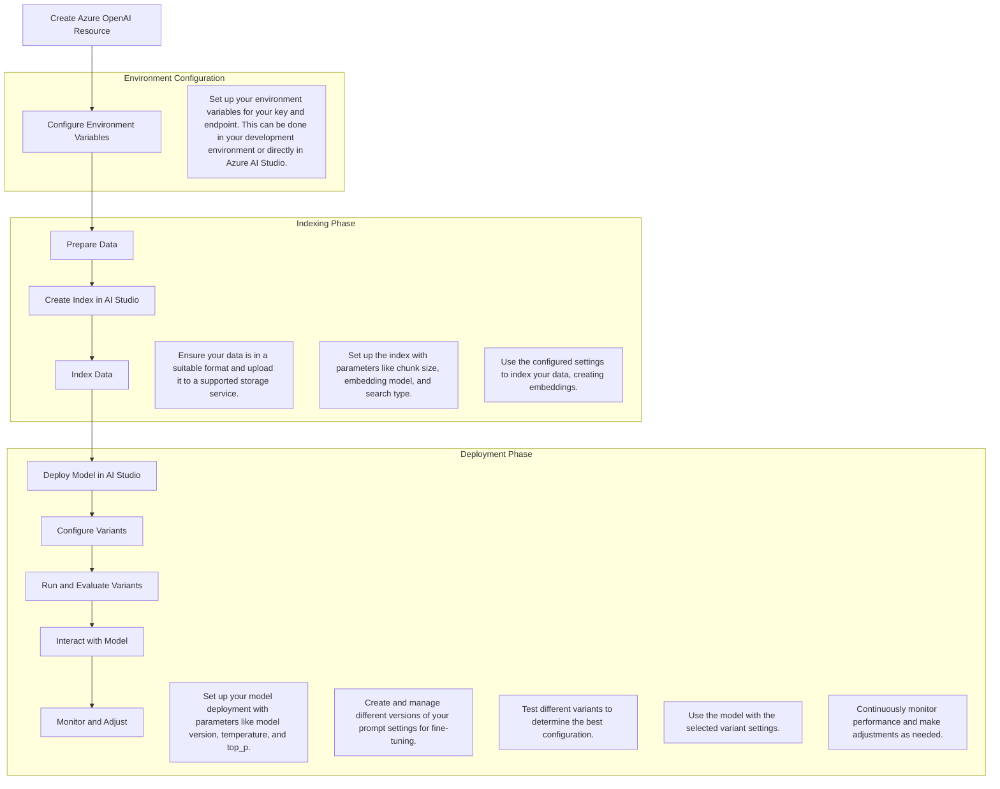

# How to Save and Reuse Parameter Settings in Azure OpenAI with AI Studio Variants

Costa Rica

[](https://github.com/)
[brown9804](https://github.com/brown9804)

Last updated: 2024-10-29

------------------------------------------


## Wiki 

<details>
<summary><b>Table of Contents</b> (Click to expand)</summary>

- [Tune prompts using variants in Azure AI Studio](https://learn.microsoft.com/en-us/azure/ai-studio/how-to/flow-tune-prompts-using-variants)
- [Prompt tool for flows in Azure AI Studio](https://learn.microsoft.com/en-us/azure/ai-studio/how-to/prompt-flow-tools/prompt-tool)
  
</details>

## Overview 



- 1. **Set Up Your Azure OpenAI Environment**
    1. **Create an Azure OpenAI Resource**:
       - Go to the Azure portal.
       - Navigate to `Create a resource` and search for `Azure OpenAI`.
       - Follow the prompts to create your resource.

          

          

    2. **Configure Your Environment**:
       - Set up your environment variables for your key and endpoint. This can be done in your `development environment` or `directly in Azure AI Studio`.

         > Using the approach of AI Studio

          1. **Navigate to Azure AI Studio**: Go to the Azure AI Studio and open your project.
             
              

          2. Create a project:
             
              

          4. **Set Environment Variables**: In Azure AI Studio, you can set environment variables for your project. This is typically done in the settings or configuration section of your project.
          5. **Use Environment Variables in Your Project**: When configuring your project or writing code in Azure AI Studio, you can reference these environment variables directly.
          


#### 2. **Indexing Your Data**

1. **Prepare Your Data**:
   - Ensure your data is in a suitable format (e.g., text, PDF).
   - Upload your data to Azure Blob Storage or another supported storage service.

2. **Create an Index**:
   - In Azure AI Studio, navigate to the "Data" section.
   - Select "Create Index" and configure the parameters such as chunk size, embedding model, and search type.
   - Save these settings for future use.

3. **Index Your Data**:
   - Use the configured settings to index your data.
   - This process will break down your documents into smaller chunks and create embeddings.

#### 3. **Deploying Your Model**

1. **Deploy a Model**:
   - In Azure AI Studio, go to the "Deployments" section.
   - Select "Create Deployment" and choose your model (e.g., GPT-4).
   - Configure deployment parameters like model version, temperature, and top_p.
   - Save these deployment settings.

2. **Configure Variants**:
   - Use the Variants feature to create different versions of your prompt settings.
   - This allows you to fine-tune and test different configurations.
   - Save these variants for reuse.

#### 4. **Using the Model**

1. **Interact with Your Model**:
   - Use Azure AI Studio or API calls to interact with your deployed model.
   - Apply the saved parameter settings and variants to ensure consistent performance.

2. **Monitor and Adjust**:
   - Continuously monitor the performance of your model.
   - Use the saved settings and variants to make adjustments as needed.

### Example Code Snippet

Here’s a simple example of how you might set up and use these settings programmatically:

```python
import openai

# Set up your environment variables
openai.api_key = "your-api-key"
endpoint = "https://your-endpoint.openai.azure.com/"

# Define your index settings
index_settings = {
    "chunk_size": 1024,
    "embedding_model": "text-embedding-ada-002",
    "search_type": "semantic"
}

# Define your deployment settings
deployment_settings = {
    "model": "gpt-4",
    "temperature": 0.7,
    "top_p": 0.9
}

# Save these settings for reuse
def save_settings(settings, filename):
    with open(filename, 'w') as file:
        json.dump(settings, file)

save_settings(index_settings, 'index_settings.json')
save_settings(deployment_settings, 'deployment_settings.json')

# Load and use the settings
def load_settings(filename):
    with open(filename, 'r') as file:
        return json.load(file)

index_settings = load_settings('index_settings.json')
deployment_settings = load_settings('deployment_settings.json')

# Use the settings in your API calls
response = openai.Completion.create(
    engine=deployment_settings["model"],
    prompt="Your prompt here",
    temperature=deployment_settings["temperature"],
    top_p=deployment_settings["top_p"]
)

print(response.choices[0].text)
```
