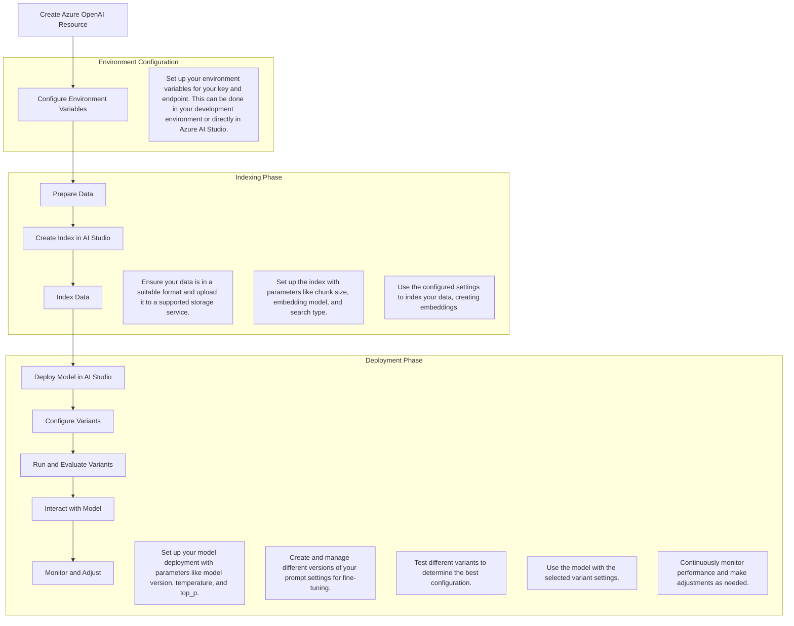

# How to Save and Reuse Parameter Settings in Azure OpenAI & AI Studio Variants

Costa Rica

[](https://github.com/)
[brown9804](https://github.com/brown9804)

Last updated: 2024-10-30

------------------------------------------


## Wiki 

<details>
<summary><b>Table of Wiki Contents</b> (Click to expand)</summary>

- [Tune prompts using variants in Azure AI Studio](https://learn.microsoft.com/en-us/azure/ai-studio/how-to/flow-tune-prompts-using-variants)
- [Prompt tool for flows in Azure AI Studio](https://learn.microsoft.com/en-us/azure/ai-studio/how-to/prompt-flow-tools/prompt-tool)
  
</details>

## Content 

<details>
<summary><b>Table of Contents</b> (Click to expand)</summary>

- [How to Save and Reuse Parameter Settings in Azure OpenAI & AI Studio Variants](#how-to-save-and-reuse-parameter-settings-in-azure-openai--ai-studio-variants)
    - [Wiki](#wiki)
    - [Content](#content)
    - [GUI approach over Azure OpenAI](#gui-approach-over-azure-openai)
    - [Variants Approach over Azure OpenAI](#variants-approach-over-azure-openai)
        - [Create an Azure OpenAI Resource](#create-an-azure-openai-resource)
        - [Setup your project](#setup-your-project)
        - [Indexing Your Data](#indexing-your-data)
        - [Deploy a Model](#deploy-a-model)
        - [Configure the prompt flow:](#configure-the-prompt-flow)
        - [Add an LLM Node](#add-an-llm-node)
        - [Configuring Variants in Azure AI Studio](#configuring-variants-in-azure-ai-studio)
            - [Create Variants](#create-variants)
            - [Configure Parameters for Each Variant](#configure-parameters-for-each-variant)
        - [Run and Evaluate Variants](#run-and-evaluate-variants)
        - [Monitor and Adjust](#monitor-and-adjust)
        - [Example Code Snippet](#example-code-snippet)

</details>

## GUI approach over Azure OpenAI 

> You can use the export option:


> Which will look like this:

```json
{
    "systemPrompt": "You are an AI assistant that helps people find information.",
    "fewShotExamples": [],
    "chatParameters": {
        "deploymentName": "gpt-4o-mini",
        "maxResponseLength": 800,
        "temperature": 0.7,
        "topProbablities": 0.95,
        "stopSequences": [],
        "pastMessagesToInclude": 10,
        "frequencyPenalty": 0,
        "presencePenalty": 0
    }
}
```

> Import the configuration:


## Variants Approach over Azure OpenAI



### Create an Azure OpenAI Resource
 - Go to the Azure portal.
 - Navigate to `Create a resource` and search for `Azure OpenAI`.
 - Follow the prompts to create your resource.

    

    

### Setup your project
 
- **Navigate to Azure AI Studio**: Go to the Azure AI Studio and open your project.
   
    

- Create a project:
   
    

### Indexing Your Data

- **Prepare Your Data**:
   - Ensure your data is in a suitable format (e.g., text, PDF).
   - Upload your data to Azure Blob Storage or another supported storage service.

   > If you don't have any yet see steps below:

   

   

   

- **Index Your Data**:
   - Use the configured settings to index your data.
   - This process will break down your documents into smaller chunks and create embeddings.

    > Use AI Search directly:

    

    

    > Create a new connection if it's required, for e.g you can use Access key or SAS (Shared Access Signature):
            
    

   > Follow the process:

   

   > In Azure AI Studio:

   - Navigate to the `Indexes` section.
   - Select `Create Index` and configure the parameters such as chunk size, embedding model, and search type.
   - Save these settings for future use.

    

    

### Deploy a Model
- In Azure AI Studio, go to the `Deployments` section.
- Select `Create Deployment` and choose your model (e.g., GPT-4).

  

- Configure deployment parameters like model version, temperature, and top_p.
- Save these deployment settings.

  

- Add your index data to the model:

  

### Configure the prompt flow

> From the chat playground

  

> Or you can:

 - Go to the `Prompt flow` section within your project.
 - Click on `Create` to start a new flow.

    

### Add an LLM Node

> [!NOTE]
> If you used `Prompt flow` section within your project, you need to add the LLM model but if you add the prompt flow from the chat playground you will see the LLM added, and other required elements as base for you.

> How to add the LLM:
 - In the flow creation wizard, add an LLM (Large Language Model) node.
 - Configure the initial settings for this node, such as the prompt and connection settings.

    

    

> How it looks from giving starting point:


### Configuring Variants in Azure AI Studio

> [!Note]
> Set up your environment variables for your key and endpoint. This can be done in your `development environment` or `directly in Azure AI Studio`.

> Using the approach of AI Studio

- **Show Variants**: Once your LLM node is set up, click on the `Show variants` button at the top right of the node. This will allow you to create and manage different variants of your prompt.
  
    

#### Create Variants

> This allows you to fine-tune and test different configurations.

 - The existing LLM node will be labeled as `variant_0` by default.
 - Click on the `Clone` button on `variant_0` to generate `variant_1`.

   

 - Configure `variant_1` with different parameters or update the prompt as needed.
 - Repeat this step to create additional variants (e.g., `variant_2`, `variant_3`, etc.).

   

#### Configure Parameters for Each Variant
   - For each variant, you can adjust parameters such as temperature, top_p, and the prompt content.
   - Example configurations:
     - **Variant 0**: `Temperature = 1`, `Prompt: "Summarize the following text: {{input_text}}"`
     - **Variant 1**: `Temperature = 0.7`, `Prompt: "Summarize the following text: {{input_text}}"`
     - **Variant 2**: `Temperature = 1`, `Prompt: "What is the main point of this article? {{input_text}}"`
     - **Variant 3**: `Temperature = 0.7`, `Prompt: "What is the main point of this article? {{input_text}}"`


### Run and Evaluate Variants

 - After configuring your variants, use Azure AI Studio or API calls to interact with your deployed model. You can run the flow with different inputs to test how each variant performs.
 - Use the "Run" button to execute the flow and select the LLM node with variants to test.
 - Evaluate the outputs to determine which variant produces the best results for your use case.

### Monitor and Adjust

 - Continuously monitor the performance of each variant.
 - Make adjustments as needed based on the results to optimize your prompt configurations.


### Example Code Snippet

Here’s a simple example of how you might set up and use these settings programmatically:

```python
import openai

# Set up your environment variables
openai.api_key = "your-api-key"
endpoint = "https://your-endpoint.openai.azure.com/"

# Define your index settings
index_settings = {
    "chunk_size": 1024,
    "embedding_model": "text-embedding-ada-002",
    "search_type": "semantic"
}

# Define your deployment settings
deployment_settings = {
    "model": "gpt-4",
    "temperature": 0.7,
    "top_p": 0.9
}

# Save these settings for reuse
def save_settings(settings, filename):
    with open(filename, 'w') as file:
        json.dump(settings, file)

save_settings(index_settings, 'index_settings.json')
save_settings(deployment_settings, 'deployment_settings.json')

# Load and use the settings
def load_settings(filename):
    with open(filename, 'r') as file:
        return json.load(file)

index_settings = load_settings('index_settings.json')
deployment_settings = load_settings('deployment_settings.json')

# Use the settings in your API calls
response = openai.Completion.create(
    engine=deployment_settings["model"],
    prompt="Your prompt here",
    temperature=deployment_settings["temperature"],
    top_p=deployment_settings["top_p"]
)

print(response.choices[0].text)
```

<div align="center">
  <h3 style="color: #4CAF50;">Total Visitors</h3>
  
</div>