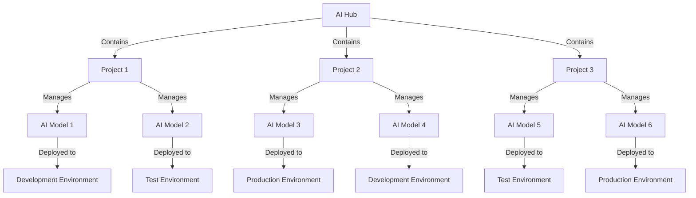

# AI Foundry: Software Development Life Cycle (SDLC) Strategy Overview

Costa Rica

 

[brown9804](https://github.com/brown9804)

Last updated: 2025-01-02

----------

> [!NOTE]
> If you require additional information on Cloud and the SDLC process, please visit this [repository](https://github.com/brown9804/CloudDevOps_LPath?tab=readme-ov-file#cloud-devops---learning-path). It contains content not only on SDLC but also on DevOps practices.

## Wiki 

<b>Table of Wiki </b> (Click to expand)

- [Create a project in Azure AI Foundry portal](https://learn.microsoft.com/en-us/azure/ai-studio/how-to/create-projects)
- [Overview: Deploy AI models in Azure AI Foundry portal](https://learn.microsoft.com/en-us/azure/ai-studio/concepts/deployments-overview)

## Content

<b>Table of Content </b> (Click to expand)

## Overview 

1. **AI Hub**:
   - The AI Hub serves as the `central repository for all AI-related resources and activities`.
   - It provides a unified interface for managing AI models, deployments, and related services.
2. **Project-Based Structure**:
   - AI Foundry works by organizing resources into projects.
   - `Each project can contain multiple AI models, deployments, and configurations`.
   - Projects help in `segregating different AI initiatives, making it easier to manage and track progress`.
3. **Model Deployment**:
   - Users can choose from existing models for deployment, eliminating the need for manual uploads.
   - The platform supports deploying base models, fine-tuned models, and custom models.
   - Deployment configurations can be tailored to specific environments such as development, testing, and production.
4. **Management and Monitoring**:
   - AI Foundry provides tools for managing model versions, ensuring that updates and changes are tracked effectively.
   - Integrated monitoring and analytics help in tracking the performance and usage of deployed models.
5. **User Flexibility**:
   - The platform caters to both technical and non-technical users.
   - Technical users can leverage advanced features for model customization and fine-tuning.
   - Non-technical users can easily deploy and use pre-configured models through a user-friendly interface.

> Delivering your AI models via API, catering to different levels of flexibility for users.

| Approach                  | Description                                                                                       | Components                                                                                           |
|---------------------------|---------------------------------------------------------------------------------------------------|------------------------------------------------------------------------------------------------------|
| **Flexible Model Modification** | This approach allows customers to modify and fine-tune the AI models according to their specific needs. | 1. **AI Foundry**: Use AI Foundry to host and manage your AI models. This platform provides tools for customers to modify and fine-tune models. 2. **Azure API Management**: Expose the models as APIs, allowing customers to integrate them into their systems. 3. **Self-Service Portal**: Create a self-service portal where customers can access the models, make modifications, and deploy their customized versions. 4. **Monitoring and Analytics**: Use Azure Monitor and Application Insights to track usage, performance, and modifications made by customers. |
| **Ready-to-Use API**      | This approach provides customers with a ready-to-use API, requiring no modifications.              | 1. **AI Foundry**: Host the pre-trained models on AI Foundry. 2. **Azure API Management**: Expose these models as APIs, ensuring they are easy to integrate into customer systems. 3. **Documentation and Support**: Provide comprehensive documentation and support to help customers integrate the API into their systems without needing to modify the models. 4. **Monitoring and Analytics**: Use Azure Monitor and Application Insights to track API usage and performance. |

## Demo 

> Please follow the general setup for both approaches. You will then notice a distinction between these approaches in the subsequent subsections.

### Create a Resource Group

1. **Navigate to Azure Portal**: Go to the [Azure Portal](https://portal.azure.com/#create/Microsoft.ResourceGroup).
2. **Create Resource Group**:
   - Click on `Resource groups` in the left-hand menu.
   - Click `Create`.
   - Enter a name for your resource group (e.g., `RG-AI-Models`).
   - Select your subscription and region.
   - Click `Review + create` and then `Create`.

       

### Set Up AI Foundry

1. **Deploy AI Foundry**:
   - Search for `AI Foundry` in the Azure Marketplace.

       

   - Click `Create` and fill in the required details (e.g., name, resource group).
   - Configure the settings as needed and click `Review + create` and then `Create`.

       

       

2. Create a project: AI Hub with AI Foundry is a powerful platform designed to streamline the deployment and management of AI models. `It operates on a project-based structure`, allowing for organized and efficient handling of AI initiatives.
  
    - Navigate to your `AI Foundry` instance.
    
        
    
    > If you don't have a hub, you'll need to create one.
    
    - Click `+ Create project`.
    
        
    
    - Enter a name for your project (e.g., `AIModelProject-Dev`).
    - Select your hub from the dropdown. If you don't have one, create a new hub as described above.
    - Click `Create`.
    
        
    
        

### Deploy AI Models on AI Foundry

> [!NOTE]
> If you are not sure about which model is required, you can compare them by going to the `Model catalog`, and `Compare models`:

1. **Choose Models for Deployment**:
   - Navigate to your project, under `My assets`, `Models+ endpoints`.
   - Click on `Deploy model`, `Deploy base model`, or `Deploy fine-tuned model`.

       

   - Select the model you want to deploy from the available options.

       

2. **Configure Deployment**:
   - Follow the prompts to configure your deployment settings.
   - Click `Deploy` to initiate the deployment process.

       

   - Specify the version, deployment environment (e.g., dev, test, prod), and any other necessary parameters.

       

       

> [!IMPORTANT]
> Please perform all necessary tuning and evaluation as required. This serves as an end-to-end example of how to integrate AI into multiple services using two approaches: one that is more flexible for those familiar with model configuration and tuning, and another that provides ready-to-use APIs for users needing a secure API for their applications.

### Set Up Azure API Management

> **Azure API Management** will be used to expose your AI models as APIs. This allows your customers to integrate the AI models into their systems seamlessly. Here are the key roles it plays:   
> 1. **API Exposure**: It helps in creating and managing APIs for your AI models, making them accessible to your customers.  
> 2. **Security**: It provides robust security features to protect your APIs, including authentication, authorization, and rate limiting.  
> 3. **Scalability**: It ensures that your APIs can handle varying levels of traffic, scaling up or down as needed.  
> 4. **Monitoring and Analytics**: It offers tools to monitor API usage, performance, and health, providing valuable insights for optimization.  
> 5. **Documentation**: It allows you to create and publish comprehensive documentation for your APIs, helping customers understand how to use them effectively.

1. **Create API Management Service**:
   - Search for `API Management` in the Azure Marketplace.

       

   - Click `Create` and fill in the required details (e.g., name, resource group).
   - Configure the settings and click `Review + create` and then `Create`.

       

2. **Expose AI Models as APIs**:
   - Navigate to your `API Management` instance.

       

   - In the API Management instance, click on `APIs` in the left-hand menu.
   - **Define the API**:

       - **HTTP**: Choose this option if you want to expose your AI model as an HTTP API.
       - **WebSocket**: Select this for full-duplex communication over a single TCP connection.
       - **GraphQL**: Use this if you want to expose your API using GraphQL.
       - If you have an existing API definition, you can use options like `OpenAPI`, `WADL`, `WSDL`, or `GraphQL Schema` to import the API definition.

           

           

   - Configure the endpoints and security settings.

### Flexible Model Modification (for Approach 1)

###  Ready-to-Use API (for Approach 2)

  <h3 style="color: #4CAF50;">Total Visitors</h3>
  

