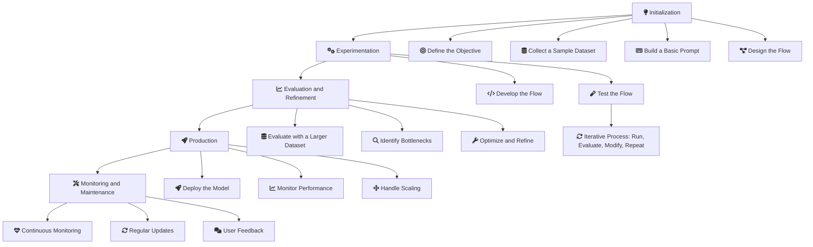
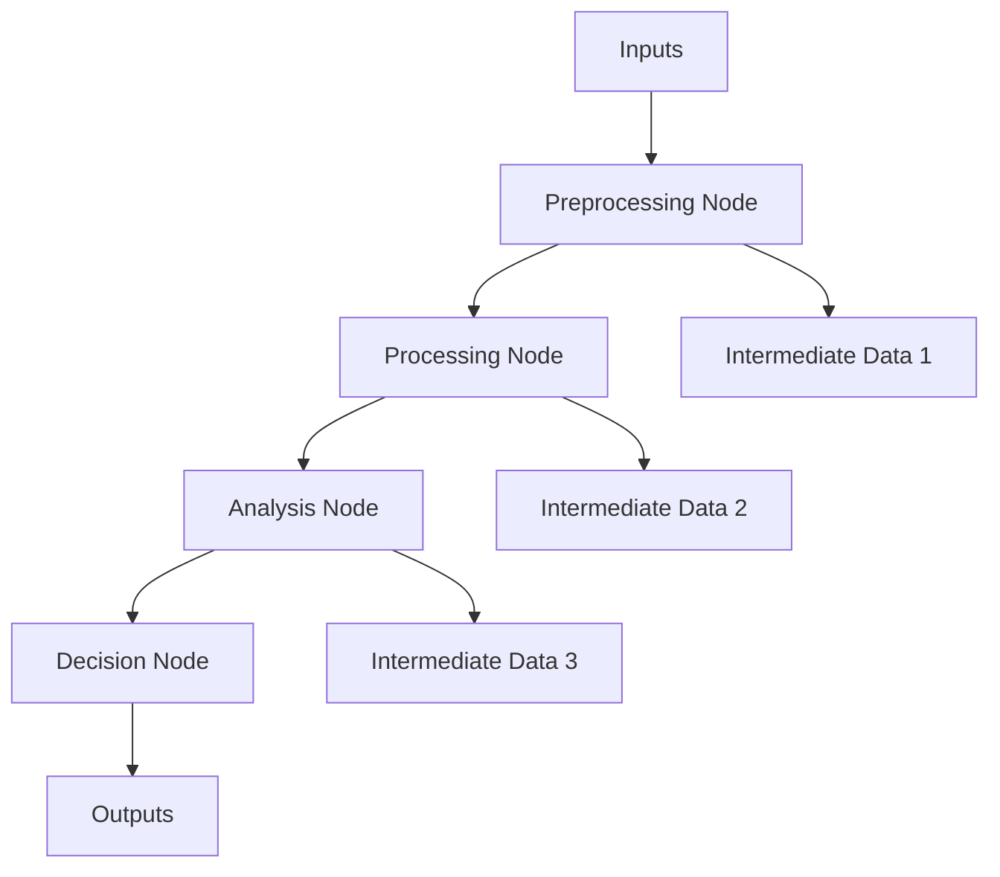

# AI Foundry: Develop generative AI apps - Overview 

Costa Rica

[brown9804](https://github.com/brown9804)

Last updated: 2025-01-13

------------------------------------------

## Wiki 

<b>Table of Wiki Contents</b> (Click to expand)

- [Microsoft Azure AI Fundamentals: AI Overview](https://learn.microsoft.com/en-us/training/paths/get-started-with-artificial-intelligence-on-azure/)
- [Develop generative AI apps in Azure AI Foundry portal](https://learn.microsoft.com/en-us/training/paths/create-custom-copilots-ai-studio/)
- [The Azure AI Foundry SDK](https://learn.microsoft.com/en-us/azure/ai-studio/how-to/develop/sdk-overview?tabs=sync&pivots=programming-language-python)
- [NLP Transformers paper](https://arxiv.org/abs/1706.03762)
- [Model summary table and region availability](https://learn.microsoft.com/en-us/azure/ai-services/openai/concepts/models?tabs=global-standard%2Cstandard-chat-completions#model-summary-table-and-region-availability)
- [Create and Use Custom Tool Package - Prompt Flow](https://microsoft.github.io/promptflow/how-to-guides/develop-a-tool/create-and-use-tool-package.html)

## Content 

<b>Table of Contents</b> (Click to expand)

## Overview 

<strong>Artificial Intelligence (AI)</strong>

<ul>
    <li>Definition: The simulation of human intelligence in machines that are programmed to think and learn.</li>
    <li>Key Components:
        <ul>
            <li>Machine Learning (ML)</li>
            <li>Natural Language Processing (NLP)</li>
            <li>Computer Vision (CV)</li>
            <li>Robotics</li>
            <li>Expert Systems</li>
        </ul>
    </li>
    <li>
        

        
<strong>Machine Learning (ML)</strong>

        <ul>
            <li>Definition: A subset of AI that involves the use of algorithms and statistical models to enable machines to improve their performance on a task through experience.</li>
            <li>Key Components:
                <ul>
                    <li>Supervised Learning</li>
                    <li>Unsupervised Learning</li>
                    <li>Reinforcement Learning (RL)</li>
                </ul>
            </li>
            <li>
                

                
<strong>Supervised Learning</strong>

                <ul>
                    <li>Definition: A type of ML where the model is trained on labeled data.</li>
                    <li>Examples: Regression, Classification</li>
                    <li>Applications:
                        <ul>
                            <li>Spam Detection</li>
                            <li>Image Classification</li>
                            <li>Medical Diagnosis</li>
                        </ul>
                    </li>
                </ul>
                

            </li>
            <li>
                

                
<strong>Unsupervised Learning</strong>

                <ul>
                    <li>Definition: A type of ML where the model is trained on unlabeled data.</li>
                    <li>Examples: Clustering, Dimensionality Reduction</li>
                    <li>Applications:
                        <ul>
                            <li>Customer Segmentation</li>
                            <li>Anomaly Detection</li>
                            <li>Market Basket Analysis</li>
                        </ul>
                    </li>
                </ul>
                

            </li>
            <li>
                

                
<strong>Reinforcement Learning (RL)</strong>

                <ul>
                    <li>Definition: A type of ML where an agent learns to make decisions by taking actions in an environment to maximize cumulative reward.</li>
                    <li>Examples: Q-Learning, Deep Q-Networks (DQN)</li>
                    <li>Applications:
                        <ul>
                            <li>Robotics</li>
                            <li>Game Playing</li>
                            <li>Recommendation Systems</li>
                        </ul>
                    </li>
                </ul>
                

            </li>
        </ul>
        

    </li>
    <li>
        

        
<strong>Deep Learning (DL)</strong>

        <ul>
            <li>Definition: A subset of ML that involves neural networks with many layers (deep neural networks) to model complex patterns in data.</li>
            <li>Examples: Convolutional Neural Networks (CNNs), Recurrent Neural Networks (RNNs)</li>
            <li>Applications:
                <ul>
                    <li>Image Recognition</li>
                    <li>Natural Language Processing</li>
                    <li>Speech Recognition</li>
                    <li>Autonomous Vehicles</li>
                </ul>
            </li>
        </ul>
        

    </li>
</ul>

<strong>Natural Language Processing (NLP)</strong>

<ul>
    <li>Definition: A field of AI focused on the interaction between computers and human language.</li>
    <li>Key Components:
        <ul>
            <li>Text Preprocessing: Tokenization, stemming, lemmatization, and stop words removal.</li>
            <li>Part-of-Speech Tagging: Identifying grammatical parts of speech.</li>
            <li>Named Entity Recognition (NER): Extracting entities like names, dates, and locations.</li>
            <li>Sentiment Analysis: Determining the emotional tone of text.</li>
            <li>Machine Translation: Translating text between languages.</li>
            <li>Topic Modeling: Identifying main themes within text.</li>
        </ul>
    </li>
    <li>
        

        
<strong>Large Language Models (LLMs)</strong>

        <ul>
            <li>Definition: Large-scale neural networks trained on vast amounts of text data to generate human-like text.</li>
            <li>Key Features:
                <ul>
                    <li>Pre-training and Fine-tuning: Training on large corpora and then fine-tuning for specific tasks.</li>
                    <li>Transformer Architecture: Handling sequential data and capturing long-range dependencies.</li>
                    <li>Contextual Understanding: Generating text based on context.</li>
                    <li>High Scalability</li>
                </ul>
            </li>
            <li>Applications:
                <ul>
                    <li>Text Generation</li>
                    <li>Question Answering</li>
                    <li>Conversational Agents</li>
                    <li>Content Creation</li>
                    <li>Code Generation</li>
                </ul>
            </li>
        </ul>
        

    </li>
    <li>
        

        
<strong>Retrieval-Augmented Generation (RAG)</strong>

        <ul>
            <li>Definition: Enhances language models by retrieving external knowledge in real-time. This allows the model to access up-to-date information while generating responses.</li>
            <li>Key Features:
                <ul>
                    <li>Real-time Data Retrieval</li>
                    <li>Dynamic Knowledge Access</li>
                    <li>Flexible and Up-to-date Responses</li>
                    <li>Integration with External Databases or APIs</li>
                </ul>
            </li>
            <li>Applications:
                <ul>
                    <li>Real-time Information Retrieval</li>
                    <li>Dynamic Content Generation</li>
                    <li>Complex Query Handling</li>
                    <li>Customer Support</li>
                </ul>
            </li>
        </ul>
        

    </li>
    <li>
        

        
<strong>Cache-Augmented Generation (CAG)</strong>

        <ul>
            <li>Definition: Uses preloaded knowledge stored within the model for faster and more precise responses. This approach is ideal for scenarios where the information is stable and doesn't change frequently.</li>
            <li>Key Features:
                <ul>
                    <li>Preloaded Knowledge</li>
                    <li>Precomputed Memory (Key-Value Cache)</li>
                    <li>Fast and Error-free Responses</li>
                    <li>Efficient Context Management</li>
                </ul>
            </li>
            <li>Applications:
                <ul>
                    <li>Static Knowledge Retrieval</li>
                    <li>Efficient Response Generation</li>
                    <li>Scenarios with Stable Information</li>
                    <li>Offline Applications</li>
                </ul>
            </li>
        </ul>
        

    </li>
</ul>

<strong>Computer Vision (CV)</strong>

<ul>
    <li>Definition: A field of AI that enables computers to interpret and make decisions based on visual data. It involves techniques for processing and analyzing images and videos.</li>
    <li>Key Features:
        <ul>
            <li>Image Recognition</li>
            <li>Object Detection</li>
            <li>Image Segmentation</li>
            <li>Facial Recognition</li>
            <li>Optical Character Recognition (OCR)</li>
        </ul>
    </li>
    <li>Applications:
        <ul>
            <li>Autonomous Vehicles</li>
            <li>Medical Imaging</li>
            <li>Surveillance</li>
            <li>Augmented Reality</li>
            <li>Image and Video Analysis</li>
        </ul>
    </li>
</ul>

<strong>Reinforcement Learning (RL)</strong>

<ul>
    <li>Definition: A type of machine learning where an agent learns to make decisions by taking actions in an environment to maximize cumulative reward. The agent learns through trial and error, receiving feedback from its actions.</li>
    <li>Key Features:
        <ul>
            <li>Trial and Error Learning</li>
            <li>Reward-based Feedback</li>
            <li>Policy Optimization</li>
            <li>Exploration and Exploitation</li>
        </ul>
    </li>
    <li>Applications:
        <ul>
            <li>Robotics</li>
            <li>Game Playing</li>
            <li>Recommendation Systems</li>
            <li>Autonomous Systems</li>
            <li>Financial Trading</li>
        </ul>
    </li>
</ul>

<strong>Generative Adversarial Network (GAN)</strong>

<ul>
    <li>Definition: A class of machine learning frameworks where two neural networks contest with each other to generate new, synthetic data. One network generates data (generator) while the other evaluates it (discriminator).</li>
    <li>Key Features:
        <ul>
            <li>Generator and Discriminator Networks</li>
            <li>Adversarial Training</li>
            <li>Realistic Data Generation</li>
            <li>Data Augmentation</li>
        </ul>
    </li>
    <li>Applications:
        <ul>
            <li>Image Synthesis</li>
            <li>Data Augmentation</li>
            <li>Style Transfer</li>
            <li>Deepfake Creation</li>
            <li>Art Generation</li>
        </ul>
    </li>
</ul>

| **Acronym** | **Full Name** | **Category** | **Description** | **Key Features** | **Applications** |
|-------------|----------------|--------------|-----------------|------------------|------------------|
| **NLP**     | Natural Language Processing | AI Field | A field of AI focused on the interaction between computers and human language. It involves enabling computers to understand, interpret, and generate human language in a meaningful way. | - Text preprocessing (tokenization, stemming, lemmatization, stop words removal) - Part-of-speech tagging - Named entity recognition (NER) - Sentiment analysis - Machine translation - Topic modeling | - Chatbots - Sentiment analysis - Language translation - Text summarization - Information retrieval |
| **CV**      | Computer Vision | AI Field | A field of AI that enables computers to interpret and make decisions based on visual data. It involves techniques for processing and analyzing images and videos. | - Image recognition - Object detection - Image segmentation - Facial recognition - Optical character recognition (OCR) | - Autonomous vehicles - Medical imaging - Surveillance - Augmented reality - Image and video analysis |
| **RL**      | Reinforcement Learning | AI Field | A type of machine learning where an agent learns to make decisions by taking actions in an environment to maximize cumulative reward. The agent learns through trial and error, receiving feedback from its actions. | - Trial and error learning - Reward-based feedback - Policy optimization - Exploration and exploitation | - Robotics - Game playing - Recommendation systems - Autonomous systems - Financial trading |
| **LLM**     | Large Language Model | Model | Large-scale neural networks trained on vast amounts of text data to generate human-like text. These models can perform a wide range of language tasks, from answering questions to writing essays. | - Pre-training and fine-tuning - Transformer architecture - Contextual understanding - High scalability | - Text generation - Question answering - Conversational agents - Content creation - Code generation |
| **GAN**     | Generative Adversarial Network | Model | A class of machine learning frameworks where two neural networks contest with each other to generate new, synthetic data. One network generates data (generator) while the other evaluates it (discriminator). | - Generator and discriminator networks - Adversarial training - Realistic data generation - Data augmentation | - Image synthesis - Data augmentation - Style transfer - Deepfake creation - Art generation |
| **RAG**     | Retrieval-Augmented Generation | Technique | Enhances language models by retrieving external knowledge in real-time. This allows the model to access up-to-date information while generating responses. | - Real-time data retrieval - Dynamic knowledge access - Flexible and up-to-date responses - Integration with external databases or APIs | - Real-time information retrieval - Dynamic content generation - Complex query handling - Customer support |
| **CAG**     | Cache-Augmented Generation | Technique | Uses preloaded knowledge stored within the model for faster and more precise responses. This approach is ideal for scenarios where the information is stable and doesn't change frequently. | - Preloaded knowledge - Precomputed memory (key-value cache) - Fast and error-free responses - Efficient context management | - Static knowledge retrieval - Efficient response generation - Scenarios with stable information - Offline applications |

## Deploy a language model with Azure AI Foundry

| **Activity**        | **Azure OpenAI models**                                                             | **Models deployed as Serverless APIs (pay-as-you-go)**                          | **Models deployed with user-managed compute**                                  |
|---------------------|-------------------------------------------------------------------------------------|---------------------------------------------------------------------------------|--------------------------------------------------------------------------------|
| **Deploy the model**| No, you aren’t billed for deploying an Azure OpenAI model to your project.          | Yes, you’re billed minimally per the infrastructure of the endpoint.            | Yes, you’re billed for the infrastructure hosting the model per minute.        |
| **Call the endpoint**| Yes, you’re billed based on your token usage.                                       | Yes, you’re billed based on your token usage.                                   | None.                                                                          |
| **Setup Complexity**| Low - Managed by Azure, minimal setup required.                                      | Medium - Requires setting up serverless functions and endpoints.                | High - Requires setting up and managing infrastructure.                        |
| **Scalability**     | High - Automatically scales with demand.                                            | Medium - Scales with serverless infrastructure, but may have limits.            | High - Can be scaled based on infrastructure capacity.                         |
| **Maintenance**     | Low - Managed by Azure, minimal maintenance required.                               | Medium - Requires monitoring and maintaining serverless functions.              | High - Requires ongoing maintenance of infrastructure and updates.             |
| **Cost Efficiency** | Variable - Costs based on token usage, can be cost-effective for low to moderate usage. | Variable - Costs based on token usage and infrastructure, can be cost-effective for moderate usage. | Variable - Costs based on infrastructure usage, can be cost-effective for high usage. |
| **Flexibility**     | Medium - Limited to Azure OpenAI models and configurations.                         | High - Can deploy custom models and configurations.                             | High - Full control over model deployment and configurations.                  |
| **Security**        | High - Managed by Azure with built-in security features.                            | Medium - Security depends on serverless infrastructure and configurations.      | High - Full control over security configurations and compliance.               |
| **Performance**     | High - Optimized by Azure for performance and reliability.                          | Medium - Performance depends on serverless infrastructure and configurations.   | High - Performance can be optimized based on infrastructure specifications.    |
| **Integration**     | High - Seamless integration with other Azure services.                              | Medium - Can integrate with other services, but may require additional setup.   | High - Full control over integration with other services and systems.          |
| **Customization**   | Low - Limited customization options.                                                | High - Can customize models and endpoints as needed.                            | High - Full customization of models, infrastructure, and endpoints.            |
| **Support**         | High - Azure provides extensive support and documentation.                          | Medium - Support depends on the serverless platform and configurations.         | High - Full control over support and troubleshooting.                          |

## Understand the development lifecycle of a large language model (LLM) app

1. Initialization: Define the use case and design the solution:
    - **Define the Objective**: Clearly outline the purpose of the LLM application. For example, if the goal is to classify news articles, specify the categories and the desired output.
    - **Collect a Sample Dataset**: Gather a representative subset of data that the LLM will process. Ensure diversity in the data to cover various scenarios and edge cases. Remove any sensitive information to avoid vulnerabilities.
    - **Build a Basic Prompt**: Create an initial prompt that will be used to interact with the LLM.
    - **Design the Flow**: Plan the overall architecture and workflow of the application, including data input, processing, and output.
2. Experimentation: Develop a flow and test with a small dataset.
    - **Develop the Flow**: Implement the initial design using the sample dataset. This involves coding the data preprocessing steps, integrating the LLM, and defining the output format.
    - **Test the Flow**: Run the flow against the sample dataset to evaluate its performance. This is an iterative process where you:
        1. Run the flow.
        2. Evaluate the prompt's performance.
        3. Modify the flow or prompt based on the results.
        4. Repeat until satisfied with the performance.
3. Evaluation and Refinement: Assess the flow with a larger dataset and refine the model.
      - **Evaluate with a Larger Dataset**: Test the flow on a larger, more diverse dataset to evaluate how well the LLM generalizes to new data.
      - **Identify Bottlenecks**: Look for areas where the model's performance can be improved, such as processing speed, accuracy, or handling of edge cases.
      - **Optimize and Refine**: Make necessary adjustments to the model, prompt, or workflow to enhance performance. This may involve fine-tuning the model, adjusting hyperparameters, or improving data preprocessing steps.
4. Production: Deploy and monitor the flow and application.
      - **Deploy the Model**: Move the refined model to a production environment. This involves setting up the necessary infrastructure, such as servers, databases, and APIs.
      - **Monitor Performance**: Continuously monitor the application's performance in the production environment. Use metrics like response time, accuracy, and user feedback to assess performance.
      - **Handle Scaling**: Ensure the application can scale to handle increased demand. This may involve load balancing, auto-scaling, and optimizing resource usage.
5. Monitoring and Maintenance: Ensure the application remains performant and up-to-date.
      - **Continuous Monitoring**: Keep track of the application's performance and health. Use monitoring tools to detect issues early and respond quickly.
      - **Regular Updates**: Update the model and application as needed to incorporate new data, improve performance, and address any issues.
      - **User Feedback**: Collect and analyze user feedback to identify areas for improvement and ensure the application meets user needs.

## Large Language Model (LLM) application with prompt flow

> `Prompt flow is a feature within Azure AI Foundry that allows you to create and manage executable workflows`.

These workflows typically consist of three main components: 
- Inputs: These are the data elements that are fed into the flow. Inputs can be of various types, such as strings, integers, or boolean values. They represent the initial data required to start the flow. 
- Nodes: These are the core components of the flow that perform data processing, task execution, or algorithmic operations. Nodes can represent different tools or functions that manipulate the input data to produce intermediate or final results. 
- Outputs: These are the results or data produced by the flow after processing the inputs through the nodes. Outputs represent the final outcome of the flow, which can be used for further analysis or actions.

| **Flow Type**      | **Purpose**                                                                 | **Features**                                                                                       | **Use Cases**                                                                                     |
|--------------------|-----------------------------------------------------------------------------|----------------------------------------------------------------------------------------------------|---------------------------------------------------------------------------------------------------|
| **Standard Flow**  | General LLM-based application development                                   | - Versatile tools for various tasks - Data processing, analysis, and transformation - Handles large datasets - Cleans and prepares data for analysis - Enables complex workflows | - Building robust and flexible applications - General-purpose LLM workflows                    |
| **Chat Flow**      | Conversational applications                                                 | - Enhanced support for chat functionalities - Natural language understanding - Dialogue management - Response generation - Advanced NLP capabilities - Manages conversation flow - Generates context-aware responses | - Creating chatbots and virtual assistants - Interactive conversational agents|
| **Evaluation Flow**| Performance evaluation                                                      | - Tools for measuring performance metrics - Comparing results - Identifying areas for improvement - Measures accuracy, precision, recall, and F1 score - Compares results from different runs - Pinpoints areas for enhancement | - Iterative development and optimization - Ensuring applications meet performance standards|

  <h3 style="color: #4CAF50;">Total Visitors</h3>
  

