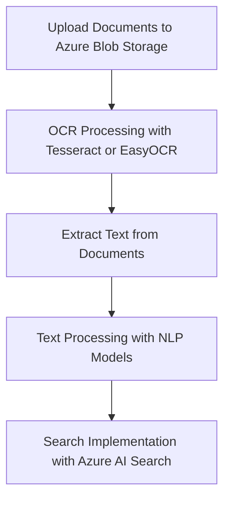

# Open-Source Models for OCR and Document Processing in Azure

Costa Rica

[](https://github.com) 
[](https://github.com/)
[brown9804](https://github.com/brown9804)

Last updated: 2024-11-15

----------

> **Optical Character Recognition `(OCR)`** is a technology that converts different types of documents, such as scanned paper documents, PDFs, or images captured by a digital camera, into editable and searchable data. OCR is widely used to digitize printed texts so that they can be electronically edited, searched, and stored more compactly.

## Wiki 

- [How to use Open Source foundation models curated by Azure Machine](https://learn.microsoft.com/en-us/azure/machine-learning/how-to-use-foundation-models?view=azureml-api-2)
- [Model Catalog and Collections](https://learn.microsoft.com/en-us/azure/machine-learning/concept-model-catalog?view=azureml-api-2)
- [Open Source on Azure](https://azure.microsoft.com/en-us/solutions/open-source/)
- [Introducing the Azure AI Model Inference API](https://techcommunity.microsoft.com/t5/ai-machine-learning-blog/introducing-the-azure-ai-model-inference-api/ba-p/4144292)
- [Journey Series for Generative AI Application Architecture](https://techcommunity.microsoft.com/t5/educator-developer-blog/journey-series-for-generative-ai-application-architecture/ba-p/4065564)
- [Automate document processing with AI Document Intelligence](https://learn.microsoft.com/en-us/azure/architecture/ai-ml/architecture/automate-document-processing-azure-form-recognizer)

## OSS Models 

| **Model** | **Provider** | **Capabilities** |
|-----------|--------------|------------------|
| **LayoutLMv3** | Hugging Face | Document layout analysis, OCR, information extraction from documents |
| **DiT (Document Image Transformer)** | Hugging Face | Document image analysis, OCR, object detection in documents |
| **BERT** | Hugging Face | Natural language understanding, text classification, sentiment analysis |
| **GPT-3** | OpenAI | Text generation, summarization, translation, question answering |
| **Tesseract** | Open Source | OCR, text extraction from images and PDFs |
| **EasyOCR** | Open Source | OCR, text extraction from images and PDFs |
| **DocTR** | Hugging Face | OCR, text extraction from images and PDFs |

## Models for Image and PDF Ingestion

Models like **LayoutLMv3** and **DiT** from Hugging Face, which are designed for document layout analysis and OCR. These models can ingest images or PDFs, perform OCR to extract text, and then process that text for various tasks.

## Building an OCR Solution in Azure

To build an OCR solution in Azure, you can use the following steps:



1. **Data Ingestion**: Use Azure Blob Storage to store your images or PDFs.
2. **OCR Processing**: Use Azure AI Document Intelligence or deploy open-source OCR models like Tesseract or EasyOCR on Azure Machine Learning.
3. **Data Extraction**: Extract text from the documents using the OCR models.
4. **Data Processing**: Use natural language processing (NLP) models to analyze and process the extracted text.
5. **Search and Query**: Implement search functionality using Azure AI Search or other search frameworks to perform searches like a leucine search.

## Step-by-step guide to setting up Tesseract in Azure ML Studio:

### Step 1: Create an Azure Machine Learning Workspace

- **Sign in to the Azure portal**.
- **Create a new resource** and search for `Machine Learning`.
- **Create a new Machine Learning workspace** by filling in the required details like subscription, resource group, workspace name, and region.

### Step 2: Set Up a Compute Instance

- In your Machine Learning workspace, go to the **Compute** section.
- **Create a new compute instance** by selecting the appropriate virtual machine type and size (CPU or GPU).

    

### Step 3: Install Tesseract

- **Open a terminal** in your compute instance.

    

- **Install Tesseract** using the following commands:
    
    ```bash
    sudo apt-get update
    sudo apt-get install tesseract-ocr
    sudo apt-get install libtesseract-dev
    ```
    
       
### Step 4: Set Up Your Python Environment

-  **Create a new Python environment** or use an existing one.

    

- **Install the required Python packages**:

    

    ```bash
    pip install pytesseract
    pip install opencv-python
    ```

    

### Step 5: Write Your OCR Script
- **Create a new Python script** and import the necessary libraries:

    ```bash
        !pip install opencv-python
    ```
    


    ```python
        import cv2
        import pytesseract
    
        # Path to the Tesseract executable
        pytesseract.pytesseract.tesseract_cmd = r'/usr/bin/tesseract'
    
        # Load an image
        image = cv2.imread('path_to_your_image')
    
        # Perform OCR
        text = pytesseract.image_to_string(image)
    
        print(text)
    ```

    


    
    
## Recommended Trainings 

- **[OCR - Optical Character Recognition](https://learn.microsoft.com/en-us/azure/ai-services/computer-vision/overview-ocr)**:
   - Learn how to use OCR services to extract printed and handwritten text from images and documents.
   - Understand the different OCR engines and how to implement them in your applications.
-  **[Quickstart: Optical character recognition (OCR)](https://learn.microsoft.com/en-us/azure/ai-services/computer-vision/quickstarts-sdk/client-library)**:
   - A step-by-step guide to getting started with OCR using Azure AI Vision.
   - Includes code examples and instructions for setting up your environment.
- **[Implement open-source software - Training](https://learn.microsoft.com/en-us/training/modules/implement-open-source-software-azure/)**:
   - Explore how to implement open-source software in Azure.
   - Understand common open-source licenses and their implications.

<div align="center">
  <h3 style="color: #4CAF50;">Total Visitors</h3>
  
</div>