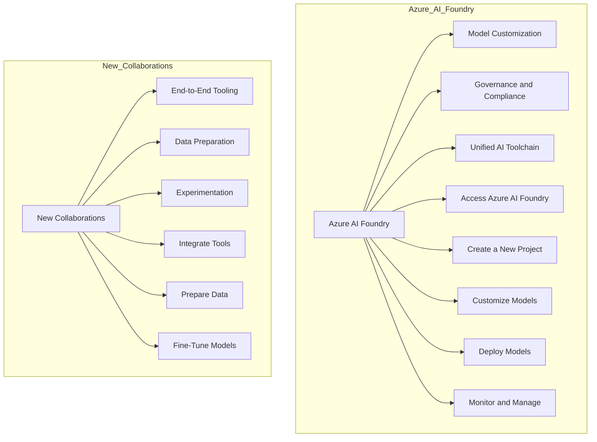

# Microsoft Ignite 2024: Overview of AI Innovations

Costa Rica

[brown9804](https://github.com/brown9804)

Last updated: 2024-12-19

----------

> The 2024 Microsoft Ignite conference announced a series of groundbreaking updates and features across data and AI products. This document provides an overview of the key announcements

## Wiki 

<b>Table of Wiki</b> (Click to expand)

- [Book of news Nov19-21,2024](https://news.microsoft.com/ignite-2024-book-of-news/)
- [Introducing Copilot Actions, new agents, and tools to empower IT teams](https://www.microsoft.com/en-us/microsoft-365/blog/2024/11/19/introducing-copilot-actions-new-agents-and-tools-to-empower-it-teams/#empowering-every-employee)
- [Unveiling Copilot agents built with Microsoft Copilot Studio to supercharge your business](https://www.microsoft.com/en-us/microsoft-copilot/blog/copilot-studio/unveiling-copilot-agents-built-with-microsoft-copilot-studio-to-supercharge-your-business/)
- [In case you missed it, recent Azure AI innovation announcements](https://techcommunity.microsoft.com/discussions/marketplace-forum/in-case-you-missed-it-recent-azure-ai-innovation-announcements/4358964)
- [Announcing Model Fine-Tuning Collaborations: Weights & Biases, Scale AI, Gretel and Statsig](https://techcommunity.microsoft.com/blog/aiplatformblog/announcing-model-fine-tuning-collaborations-weights--biases-scale-ai-gretel-and-/4289514)
- [Customize a model with fine-tuning](https://learn.microsoft.com/en-us/azure/ai-services/openai/how-to/fine-tuning?tabs=azure-openai%2Cturbo%2Cpython-new&pivots=programming-language-studio)
- [The next wave of Azure innovation: Azure AI Foundry, intelligent data, and more](https://azure.microsoft.com/en-us/blog/the-next-wave-of-azure-innovation-azure-ai-foundry-intelligent-data-and-more/)
- [Announcing comprehensive guidance for AI adoption and architecture](https://techcommunity.microsoft.com/blog/azurearchitectureblog/announcing-comprehensive-guidance-for-ai-adoption-and-architecture/4298569)
- [Azure AI model catalog](https://azure.microsoft.com/en-us/products/ai-model-catalog)
- [GitHub Models: Retrieval Augmented Generation (RAG)](https://techcommunity.microsoft.com/blog/azure-ai-services-blog/github-models-retrieval-augmented-generation-rag/4302518)
- [Azure AI Content Understanding PREVIEW](https://azure.microsoft.com/en-us/products/ai-services/ai-content-understanding)

## Azure AI Foundry and Collaborations

| Feature | Description | Key Features | Configuration Steps |
|---------|--------------|--------------|---------------------|
| **Azure AI Foundry** | Helps organizations design, customize, and manage AI apps | - `Model Customization`: Tools for end-to-end model customization - `Governance and Compliance`: Enhanced tools for governance, risk, and compliance workflows - `Unified AI Toolchain`: Accessible from familiar tools like GitHub, Visual Studio, and Copilot Studio | 1. `Access Azure AI Foundry`: Sign in to the Azure portal and navigate to Azure AI Foundry 2. `Create a New Project`: Start a new project and select the type of AI application you want to build 3. `Customize Models`: Use the provided tools to customize pre-built models or create new ones 4. `Deploy Models`: Deploy your models to the desired environment 5. `Monitor and Manage`: Use the governance and compliance tools to monitor and manage your AI applications |
| **New Collaborations** | Accelerate end-to-end model customization | - `End-to-End Tooling`: Comprehensive tools for model customization - `Data Preparation`: Advanced tools for data preparation and generation - `Experimentation`: Enhanced tools for ongoing experimentation and evaluation | 1. `Integrate Tools`: Use the integrated tools from partners like Weights & Biases for experiment tracking and model management 2. `Prepare Data`: Utilize synthetic data and specialized expertise for data preparation 3. `Fine-Tune Models`: Customize models using the provided tools and infrastructure |

## AI Search, Content Understanding, and Fine-Tuning

| Feature | Description | Key Features | Configuration Steps |
|---------|--------------|--------------|---------------------|
| **Azure AI Search** | Adds generative query engine and GitHub Models integration | - `Generative Query Engine`: Enhances search relevance and recall - `GitHub Integration`: Simplifies model experimentation and selection | 1. `Enable Azure AI Search`: Ensure Azure AI Search is enabled in your environment 2. `Integrate with GitHub`: Use GitHub Models for retrieval-augmented generation (RAG) 3. `Configure Search`: Set up the generative query engine for enhanced search capabilities |
| **Azure AI Content Understanding** | Helps developers build multimodal AI apps | - `Multimodal Data Ingestion`: Ingest and process text, audio, images, and video - `Customizable Output`: Tailor output schemas to meet specific needs | 1. `Ingest Data`: Use Azure AI Content Understanding to ingest various data types 2. `Customize Output`: Define schemas for the extracted results 3. `Integrate with Applications`: Use the structured output in downstream applications |
| **Fine-Tuning in Azure OpenAI Service** | Helps developers customize models for AI innovation | - `Model Customization`: Fine-tune models using your own datasets - `Efficiency`: Lower latency and token savings | 1. `Prepare Data`: Gather and prepare your training and validation data 2. `Fine-Tune Models`: Use the Azure OpenAI Service to fine-tune models 3. `Deploy and Monitor`: Deploy the fine-tuned models and monitor their performance |

## Copilot Agents and Generative AI

| Feature | Description | Key Features | Configuration Steps |
|---------|--------------|--------------|---------------------|
| **Copilot Agents** | Specialized AI assistants for Microsoft 365 Copilot | - `Task Automation`: Automate repetitive tasks and provide intelligent insights - `Integration`: Connect to data sources like SharePoint, Microsoft Dynamics 365, and other line-of-business systems - `Customization`: Create and manage agents using Copilot Studio, allowing for tailored solutions to specific business needs | 1. `Access Copilot Studio`: Sign in to the Microsoft 365 portal and navigate to Copilot Studio 2. `Create an Agent`: Use the tools in Copilot Studio to design and customize your agent 3. `Integrate Data Sources`: Connect the agent to your organization’s data sources 4. `Deploy and Monitor`: Deploy the agent and use the monitoring tools to track its performance and make adjustments as needed |
| **Generative AI (GenAI)** | Uses generative models to produce content | - `Content Creation`: Generate new content such as text, images, and videos - `Enhanced Creativity`: Boost creativity and innovation by automating content generation - `Industry Applications`: Used across various industries including software development, healthcare, finance, and entertainment | 1. `Select a GenAI Model`: Choose a generative AI model that fits your needs, such as those available in Azure OpenAI Service 2. `Prepare Training Data`: Gather and prepare the data needed to train the model 3. `Fine-Tune the Model`: Customize the model using your specific datasets to improve its performance for your use case 4. `Deploy and Use`: Deploy the model and integrate it into your applications to start generating content |

## Governance, Essentials, and Model Catalog

| Feature | Description | Key Features | Configuration Steps |
|---------|--------------|--------------|---------------------|
| **Governance, Risk, and Compliance** | Assist in governance, risk, and compliance workflows | - `AI Reports`: Create impact assessments and AI reports for governance - `Risk Evaluations`: Perform risk and safety evaluations for AI-generated content | 1. `Create AI Reports`: Use the Azure AI Foundry portal to assemble key project details into AI reports 2. `Perform Evaluations`: Use the risk and safety evaluation tools to assess AI-generated content |
| **Azure Essentials** | Resources to help customers adopt AI at scale | - `Comprehensive Guidance`: Detailed guidance for AI adoption and architectural design - `Resource Kit`: Includes tools, skilling, and reference architectures | 1. `Access Azure Essentials`: Navigate to Azure Essentials in the Azure portal 2. `Utilize Resources`: Use the provided tools and guidance to adopt AI at scale 3. `Implement Best Practices`: Follow the best practices and reference architectures for AI workloads |
| **Azure AI Model Catalog** | Adds partner models for more options | - `Partner Models`: Models from partners like OpenAI, Meta, and Hugging Face - `Model Customization`: Tools for evaluating, customizing, and deploying models | 1. `Browse Catalog`: Explore the model catalog in the Azure AI Foundry portal 2. `Select Models`: Choose models that fit your requirements 3. `Customize and Deploy`: Customize and deploy the selected models |

