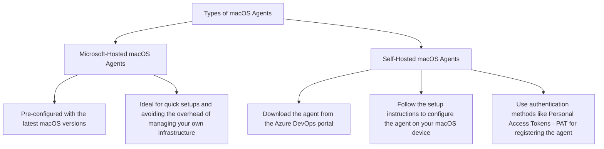

# Azure DevOps Agents

Costa Rica

[](https://github.com)
[](https://github.com/)
[brown9804](https://github.com/brown9804)

Last updated: 2024-12-18

----------

> To build your code or deploy your software using Azure Pipelines

## Wiki 

- [Azure Pipelines Agents - Azure Pipelines](https://learn.microsoft.com/en-us/azure/devops/pipelines/agents/agents?view=azure-devops)
- [Pipeline runs - Azure Pipelines](https://learn.microsoft.com/en-us/azure/devops/pipelines/process/runs?view=azure-devops)
- [Create and manage agent pools](https://learn.microsoft.com/en-us/azure/devops/pipelines/agents/pools-queues?view=azure-devops)
- [Deploy an Azure Pipelines agent on Windows](https://learn.microsoft.com/en-us/azure/devops/pipelines/agents/windows-agent?view=azure-devops)
- [Self-hosted macOS agents](https://learn.microsoft.com/en-us/azure/devops/pipelines/agents/osx-agent?view=azure-devops)
- [Microsoft-hosted agents](https://learn.microsoft.com/en-us/azure/devops/pipelines/agents/hosted?view=azure-devops&tabs=yaml)
- [Self-hosted agent authentication options](https://learn.microsoft.com/en-us/azure/devops/pipelines/agents/agent-authentication-options?view=azure-devops)

> `Agents` are the workers that run your build and deployment jobs. 

There are two main types of agents:

| Type of Agent            | Description                                                                                                                                                                                                 |
|--------------------------|-------------------------------------------------------------------------------------------------------------------------------------------------------------------------------------------------------------|
| **Microsoft-Hosted Agents** | - These are managed by Microsoft and come pre-configured with the latest software and tools.<br/>- Each time you run a pipeline, you get a fresh virtual machine for each job, which is discarded after the job completes. |
| **Self-Hosted Agents**    | - These are managed by you and can be installed on your own machines or virtual machines.<br/>- They provide more control over the environment and can be customized with specific software and configurations. |


> `Pipelines` are workflows that define how your code is built, tested, and deployed.

They consist of several components:

| Pipeline Component               | Description                                                                                                                                                                                                 |
|-------------------------|-------------------------------------------------------------------------------------------------------------------------------------------------------------------------------------------------------------|
| **Pipeline Definition** | - Written in YAML or defined through the classic editor.<br/>- Specifies the steps and tasks to be executed.                                                                                                 |
| **Jobs**                | - A pipeline can have multiple jobs, each running on an agent.<br/>- Jobs can run sequentially or in parallel.                                                                                               |
| **Steps**               | Each job consists of multiple steps, which are individual tasks like building code, running tests, or deploying applications.                                                                              |

## Process Overview

1. **Pipeline Execution**: When you trigger a pipeline, Azure Pipelines processes the pipeline definition and requests one or more agents to run the jobs.
2. **Job Execution**: The agent prepares for the job, runs each step, and reports the results back to Azure Pipelines.
3. **Agent Pools**:
   - Agents are organized into pools. When you configure an agent, it is registered with a pool.
   - When you create a pipeline, you specify the pool in which the pipeline runs.

## Setting Up macOS Agents

For `macOS`, you can use both Microsoft-hosted and self-hosted agents. 



### 1. Microsoft-Hosted macOS Agents

If you prefer not to manage your own agents, you can use  Microsoft-hosted agents which is straightforward as they come pre-configured with the latest macOS versions.

1. **Create a Pipeline**:
   - Navigate to your Azure DevOps project.
   - Go to Pipelines > Create Pipeline.
   - Select your repository and configure your pipeline using YAML or the classic editor.

2. **Specify the Agent Pool**: In your pipeline YAML file, specify the `vmImage` for macOS. For example:
     ```yaml
     pool:
       vmImage: 'macos-latest'
     ```

3. **Run the Pipeline**: Save and run your pipeline. Azure DevOps will automatically use a Microsoft-hosted macOS agent to execute your jobs.

### 2. Self-Hosted macOS Agents

Setting up a self-hosted macOS agent involves a few more steps but gives you more control over the environment.

1. **Check Prerequisites**:
   - Ensure your macOS version is supported (e.g., macOS Sonoma).
   - Install Git (version 2.9.0 or higher) using Homebrew:
     ```sh
     brew install git
     ```

2. **Download the Agent**:
   - Go to your Azure DevOps organization.
   - Navigate to Pipelines > Agent pools.
   - Select the pool you want to use or create a new one.
   - Click on `New agent` and select macOS.
   - Download the agent package.

   

3. **Configure the Agent**:
   - Extract the downloaded agent package:

     ```sh
     mkdir myagent && cd myagent
     tar zxvf ~/Downloads/vsts-agent-osx-x64-3.x.x.tar.gz
     ```

   - Run the configuration script:

     ```sh
     ./config.sh
     ```

   - Install and Start the Agent:

     ```sh
      ./run.sh
     ```

     

      | LastWriteTime         | Length | Name          |
      |-----------------------|--------|---------------|
      | 8/20/2024  8:11 AM    |        | bin           |
      | 8/20/2024  8:02 AM    |        | externals     |
      | 8/20/2024  8:00 AM    |  3173  | config.sh     |
      | 8/20/2024  8:00 AM    |   726  | env.sh        |
      | 8/20/2024  8:00 AM    |  9465  | license.html  |
      | 8/20/2024  8:00 AM    |  2753  | run-docker.sh |
      | 8/20/2024  8:00 AM    |  2014  | run.sh        |

   - Follow the prompts to configure the agent. You’ll need:
     - Your Azure DevOps organization URL.
     - A Personal Access Token (PAT) for authentication, Service Principals, or Device Code Flow (Entra ID) for registering the agent.

4. **Verify the Agent**:
   - Go back to your Azure DevOps organization.
   - Navigate to Pipelines > Agent pools.
   - Ensure your new agent appears in the list and is online.

5. **Use the Self-Hosted Agent in Your Pipeline**: In your pipeline YAML file, specify the agent pool and the agent name.

     ```yaml
     pool:
       name: 'Default'
       demands:
         - agent.name -equals myagent
     ```

<div align="center">
  <h3 style="color: #4CAF50;">Total Visitors</h3>
  
</div>
