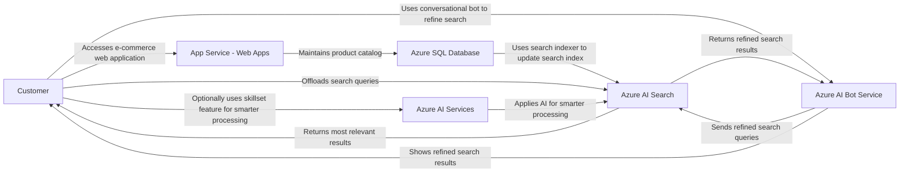
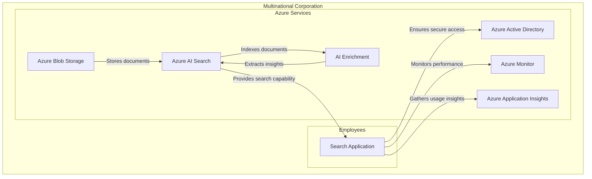
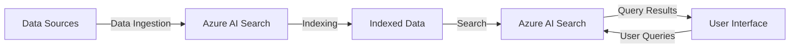
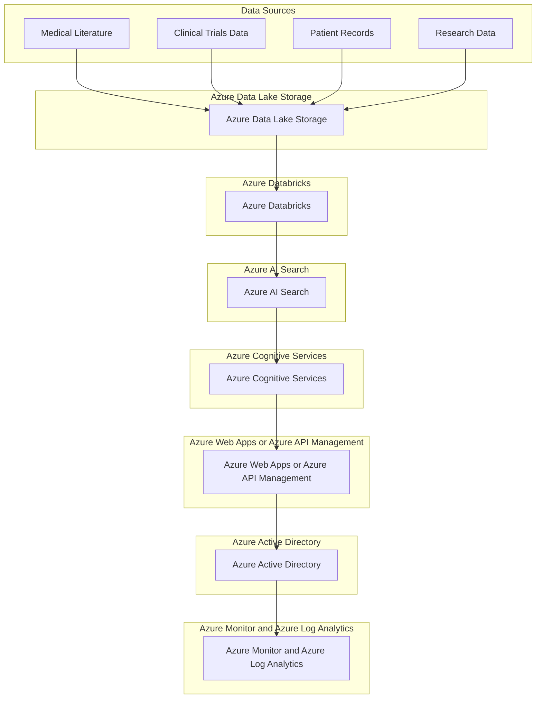
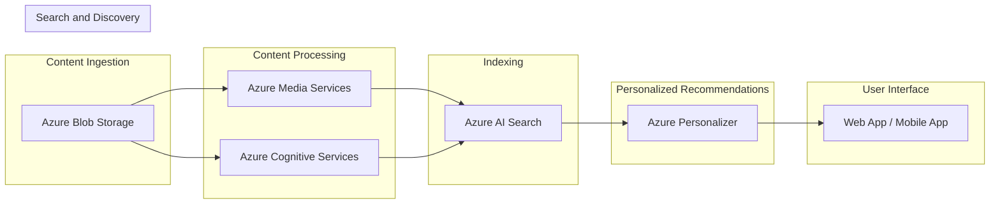
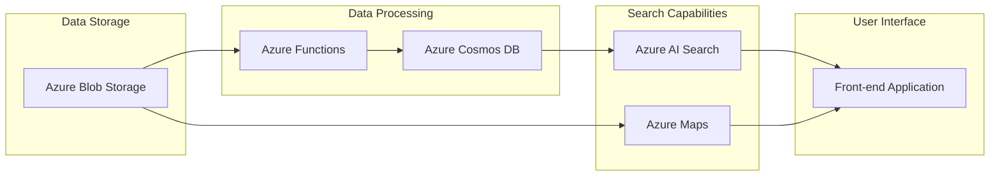
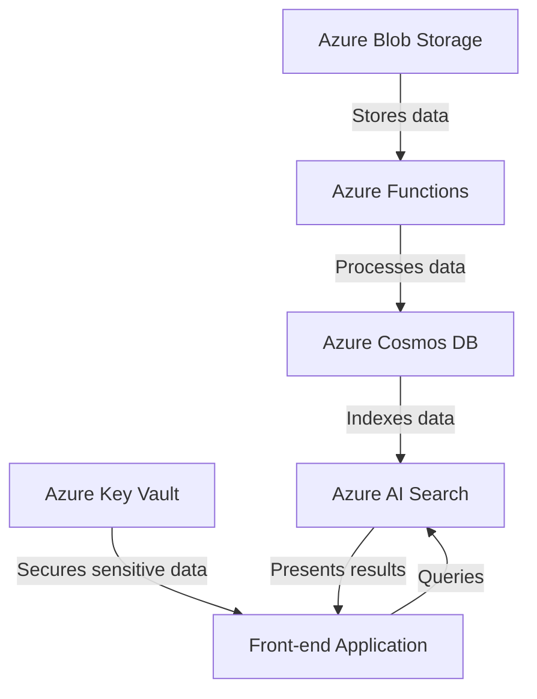

# AI Search 

> Built-in indexers are available for `Azure Cosmos DB, Azure SQL Database, Azure Blob Storage, and Microsoft SQL Server hosted in Azure Virtual Machines`. Use Azure `Data Factory`, with more than 80 connectors, or `Azure Logic Apps` to connect to your data source. Alternatively, push data into an Azure AI Search index, which has no restrictions on data source type.


## Content 

<!-- TOC -->

- [AI Search](#ai-search)
    - [Content](#content)
    - [Examples of Use Cases](#examples-of-use-cases)
        - [E-commerce and Retail - Azure AI Search:](#e-commerce-and-retail---azure-ai-search)
        - [Content and Document Management - Azure AI Search:](#content-and-document-management---azure-ai-search)
        - [Enterprise Search - Azure AI Search:](#enterprise-search---azure-ai-search)
        - [Healthcare and Life Sciences - Azure AI Search:](#healthcare-and-life-sciences---azure-ai-search)
        - [Media and Entertainment - Azure AI Search:](#media-and-entertainment---azure-ai-search)
        - [Travel and Hospitality - Azure AI Search:](#travel-and-hospitality---azure-ai-search)
        - [Financial Services - Azure AI Search:](#financial-services---azure-ai-search)

<!-- /TOC -->

## Examples of Use Cases 

> [!NOTE]
> Use Cases for Azure AI Search:

### E-commerce and Retail - Azure AI Search:
[return to Content](#content)

   - Enhance product search experiences on e-commerce websites by providing relevant results, filters, and facets.
   - Implement personalized recommendations based on user behavior and preferences.
   - Enable faceted navigation for efficient product discovery.

> [!IMPORTANT]
> Here's an general architecture example of how Azure AI Search can be used in an e-commerce solution: <br/>

> Azure AI Search is an AI-powered information retrieval platform that helps developers build rich search experiences and generative AI apps that combine large language models with enterprise data. It can implement search functionality for any mobile or search application within your organization or as part of software as a service (SaaS) apps. <br/>

> 1. **Customers** go to the e-commerce web application from any device. <br/>
> 2. The **product catalog** is maintained in an **Azure SQL database** for transactional processing. <br/>
> 3. **Azure AI Search** uses a search indexer to automatically keep its search index up to date through integrated change tracking. <br/>
> 4. Customer's search queries are offloaded to the AI Search service, which processes the query and returns the most relevant results. <br/>
> 5. As an alternative to a web-based search experience, customers can also use a conversational bot in social media or straight from digital assistants to search for products and incrementally refine their search query and results. <br/>
> 6. Optionally, customers can use the skillset feature to apply artificial intelligence for even smarter processing. <br/>

> Key Azure services involved in this architecture include: <br/>
> - **Azure App Service - Web Apps**: Hosts web applications allowing autoscale and high availability without having to manage infrastructure. <br/>
> - **Azure SQL Database**: A general-purpose relational database-managed service in Microsoft Azure that supports structures such as relational data, JSON, spatial, and XML. <br/>
> - **Azure AI Search**: A cloud solution that provides a rich search experience over private, heterogeneous content in web, mobile, and enterprise applications. <br/>
> - **Azure AI Bot Service**: Provides tools to build, test, deploy, and manage intelligent bots. <br/>
> - **Azure AI services**: Lets you use intelligent algorithms to see, hear, speak, understand, and interpret your user needs through natural methods of communication. <br/>



### Content and Document Management - Azure AI Search:
[return to Content](#content)

   - Index and search through large document repositories, intranets, and knowledge bases.
   - Implement full-text search, highlighting, and document previews.
   - Facilitate content discovery and retrieval for employees and customers.

> [!IMPORTANT]
> An example of **Use Case: Employee Knowledge Base Search**  <br/>

> **Scenario:** A multinational corporation has a vast internal knowledge base for its employees. This knowledge base includes a variety of documents such as policy documents, training materials, project reports, and more. The company wants to make it easier for employees to find relevant information quickly and efficiently. <br/>

> **Solution with Azure AI Search:** <br/>
> 1. **Azure Blob Storage:** All the documents are stored in Azure Blob Storage. This provides a scalable and secure place for storing all the company's documents. <br/>
> 2. **Azure AI Search:** This is the core service that enables the search functionality. It creates an index of all the documents stored in the Blob Storage. <br/>
> 3. **AI Enrichment:** Azure AI Search uses built-in AI capabilities to extract more insights from the documents. It can extract key phrases, recognize entities, and more. This enriched data is also stored in the search index. <br/>
> 4. **Search Application:** The company builds a search application that uses the Azure AI Search service. Employees can use this application to search the knowledge base. They can perform full-text search, get highlighted results, and even see document previews. <br/>
> 5. **Azure Active Directory:** To ensure secure access to the documents, the search application integrates with Azure Active Directory. This way, only authorized employees can search and view the documents. <br/>
> 6. **Azure Monitor and Azure Application Insights:** These services are used to monitor the performance of the search application and to get insights about its usage. This helps the company to continuously improve the search experience for its employees. <br/>

> This setup allows the company to facilitate content discovery and retrieval for its employees, enhancing productivity and efficiency. It's a great example of how Azure AI Search can be used in the context of content and document management. <br/>



In this diagram:

- The **Multinational Corporation** is divided into **Employees** and **Azure Services**.
- **Azure Blob Storage** stores all the company’s documents.
- **Azure AI Search** creates an index of all the documents stored in the Blob Storage.
- **AI Enrichment** uses built-in AI capabilities to extract more insights from the documents.
- **Search Application** is built by the company and uses the Azure AI Search service. Employees use this application to search the knowledge base.
- **Azure Active Directory** ensures secure access to the documents, so only authorized employees can search and view the documents.
- **Azure Monitor** and **Azure Application Insights** are used to monitor the performance of the search application and to get insights about its usage.

### Enterprise Search - Azure AI Search:
[return to Content](#content)

   - Create a unified search experience across various enterprise data sources (files, databases, APIs).
   - Enable users to find information quickly within their organization.
   - Support natural language queries and relevance tuning.

> [!IMPORTANT]
>  An example of how you can create a unified search experience across various enterprise data sources using Azure resources and Azure AI Search.

> 1. **Data Ingestion**: The first step is to ingest data from various sources. Azure provides several connectors for popular data sources such as Azure SQL Database, Azure Cosmos DB, Azure Blob Storage, and more. You can also use Azure Functions or Logic Apps to pull data from APIs and other sources not directly supported by Azure AI Search.
```python
# Example of using Azure Function to pull data from an API
import requests
import azure.functions as func

def main(mytimer: func.TimerRequest) -> None:
    response = requests.get('https://api.example.com/data')
    data = response.json()
    # Code to push data to Azure AI Search
```
> 2. **Indexing**: Once the data is ingested, it needs to be indexed. Azure AI Search provides powerful capabilities to define custom indexes.
```json
// Example of creating an index in Azure AI Search 
{
  "name": "my-index",
  "fields": [
    {"name": "id", "type": "Edm.String", "key": true},
    {"name": "description", "type": "Edm.String", "searchable": true},
    // Other fields...
  ]
}
```
> 3. **Search**: With the data indexed, you can now implement the search experience. Azure AI Search provides a robust REST API and SDKs for popular programming languages.
```python
# Example of using the Python SDK to search
from azure.search.documents import SearchClient

client = SearchClient("<endpoint>", "<index name>", "<api key>")
results = client.search(search_text="example query")
```
> 4. **User Interface**: Finally, you need a user interface for users to interact with. This could be a web application, a mobile app, or even a chatbot. The UI sends queries to Azure AI Search and displays the results. <br/> 
> This is a simplified example, and a real-world implementation would likely involve additional considerations such as security, scalability, and performance optimization. 



### Healthcare and Life Sciences - Azure AI Search:
[return to Content](#content)

   - Build medical knowledge bases for clinicians and researchers.
   - Enable semantic search for medical literature, clinical trials, and patient records.
   - Facilitate drug discovery and research.

> [!IMPORTANT]
> Here’s a general example of a high-level architecture for a solution in the Healthcare and Life Sciences domain using Azure resources, specifically Azure AI Search.

> 1. Data Sources:
>    - Medical Literature
>    - Clinical Trials Data
>    - Patient Records
>    - Research Data
> 
> 2. Azure Data Lake Storage:
>    - Store all the raw data in Azure Data Lake Storage which is a secure, scalable and cost-effective storage.
> 
> 3. Azure Databricks:
>    - Use Azure Databricks for data preparation and transformation. It can handle large amounts of data and perform operations like cleaning, normalization, and aggregation.
> 
> 4. Azure AI Search:
>    - Index the transformed data from Azure Databricks into Azure AI Search. Azure AI Search provides capabilities for advanced content understanding through AI that can help in semantic search.
> 
> 5. Azure Cognitive Services:
>    - Use Azure Cognitive Services for additional AI capabilities like entity recognition, sentiment analysis, etc. This can enhance the search experience by providing more context.
> 
> 6. Azure Web Apps or Azure API Management:
>    - Expose the search capabilities through a Web App or API for clinicians, researchers, and other users to use.
> 
> 7. Azure Active Directory:
>    - Use Azure Active Directory for identity management and securing access to the data and services.
> 
> 8. Azure Monitor and Azure Log Analytics:
>    - Use these services for monitoring the health of the system, diagnosing issues and understanding usage patterns.
>
> This architecture allows you to build a robust medical knowledge base and enables semantic search for medical literature, clinical trials, and patient records. It also facilitates drug discovery and research by providing easy access to relevant information. Please note that this is a high-level architecture and the actual implementation may require additional components or steps based on specific requirements. Always follow data privacy and compliance requirements when dealing with sensitive data like patient records. <br/>
> Remember, Azure AI Search was formerly known as “Cognitive Search”, but the functionality remains the same, providing powerful search capabilities over your data using AI.



### Media and Entertainment - Azure AI Search:
[return to Content](#content)

   - Enhance video and audio content discovery by indexing metadata and transcripts.
   - Implement search for news articles, blogs, podcasts, and multimedia content.
   - Enable personalized recommendations for movies, music, and TV shows.
     
> [!IMPORTANT]
> A high-level example of a solution architecture using Azure AI Search (formerly known as Cognitive Search) for the Media and Entertainment industry. This solution can enhance content discovery, implement search for various types of content, and enable personalized recommendations.

> Solution Architecture for Media and Entertainment using Azure AI Search
> 
> 1. Content Ingestion
> - **Azure Blob Storage**: Store raw multimedia content such as videos, audio files, news articles, blogs, and podcasts.
> 
> 2. Content Processing
> - **Azure Media Services**: Extract metadata and transcripts from video and audio files.
> - **Azure Cognitive Services**: Extract key phrases, entities, and sentiment from news articles and blogs.
> 
> 3. Indexing
> - **Azure AI Search**: Index the metadata and transcripts for efficient search.
> 
> 4. Search and Discovery
> - **Azure AI Search**: Implement full-text search over the indexed content. It supports faceted navigation, filters, and sorting to enhance content discovery.
> 
> 5. Personalized Recommendations
> - **Azure Personalizer**: Use reinforcement learning to provide personalized recommendations for movies, music, and TV shows based on user behavior.
> 
> 6. User Interface
> - **Web App / Mobile App**: A user-friendly interface where users can search for and discover content, and receive personalized recommendations.
>
> Please note that this is a high-level architecture and the actual implementation may vary based on specific requirements and constraints. You might need to consider additional aspects such as security, scalability, and cost optimization when designing the solution.



### Travel and Hospitality - Azure AI Search:
[return to Content](#content)

   - Power hotel booking platforms with efficient search capabilities.
   - Enable location-based search for restaurants, attractions, and events.
   - Implement geospatial search for travel planning.

> [!IMPORTANT]
> An example of an architecture using Azure resources, specifically with Azure AI Search (formerly known as “Cognitive Search”) for the Travel and Hospitality industry. This architecture powers hotel booking platforms with efficient search capabilities, enables location-based search for restaurants, attractions, and events, and implements geospatial search for travel planning.

> Azure Architecture for Travel and Hospitality <br/>
>
> Components:
> 1. **Azure AI Search**: This is the core component that powers the search capabilities. It indexes data from various sources and provides powerful search capabilities.
> 2. **Azure Maps**: This service is used to implement geospatial search for travel planning. It provides location-based services like maps, search, routing, traffic, and time zones.
> 3. **Azure Cosmos DB**: This is the globally distributed, multi-model database service used for managing data at scale.
> 4. **Azure Functions**: This is used for running event-driven serverless compute that can scale on demand.
> 5. **Azure Blob Storage**: This is used for storing unstructured data like images, videos, etc.
> 
> Workflow:
> 1. Data from various sources like hotel details, restaurant details, event details, etc., are stored in Azure Blob Storage.
> 2. Azure Functions are triggered whenever there is new data in Blob Storage. These functions process the data and store it in Cosmos DB.
> 3. Azure AI Search indexes the data from Cosmos DB. It uses cognitive skills for extracting more information from the data.
> 4. Users interact with a front-end application. Whenever they perform a search, the application queries Azure AI Search and presents the results to the user.
> 5. If the user performs a location-based search, the application uses Azure Maps to provide geospatial search capabilities.
> 
> This architecture provides a robust and scalable solution for travel and hospitality platforms.



### Financial Services - Azure AI Search:
[return to Content](#content)

   - Create powerful search interfaces for financial data, stock market information, and investment research.
   - Enable users to find relevant financial documents, reports, and news articles.
   - Implement secure search for sensitive data.
     
> [!IMPORTANT]
> An example of an architecture using Azure resources, specifically with Azure AI Search (formerly known as “Cognitive Search”) for the Financial Services industry. This architecture creates powerful search interfaces for financial data, stock market information, and investment research, enables users to find relevant financial documents, reports, and news articles, and implements secure search for sensitive data.

> Azure Architecture for Financial Services
>
> Components:
>
> 1. **Azure AI Search**: This is the core component that powers the search capabilities. It indexes data from various sources and provides powerful search capabilities.
> 2. **Azure Cosmos DB**: This is the globally distributed, multi-model database service used for managing data at scale.
> 3. **Azure Functions**: This is used for running event-driven serverless compute that can scale on demand.
> 4. **Azure Blob Storage**: This is used for storing unstructured data like financial documents, reports, etc.
> 5. **Azure Key Vault**: This is used for safeguarding cryptographic keys and other secrets used by cloud apps and services.
> 
> Workflow:
> 
> 1. Data from various sources like financial data, stock market information, investment research, etc., are stored in Azure Blob Storage.
> 2. Azure Functions are triggered whenever there is new data in Blob Storage. These functions process the data and store it in Cosmos DB.
> 3. Azure AI Search indexes the data from Cosmos DB. It uses cognitive skills for extracting more information from the data.
> 4. Users interact with a front-end application. Whenever they perform a search, the application queries Azure AI Search and presents the results to the user.
> 5. If the user performs a search for sensitive data, the application uses Azure Key Vault to ensure the search is secure.
>
> This architecture provides a robust and scalable solution for financial services platforms.


