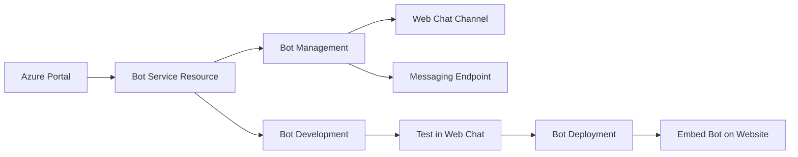
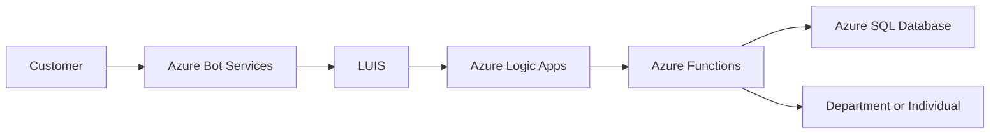
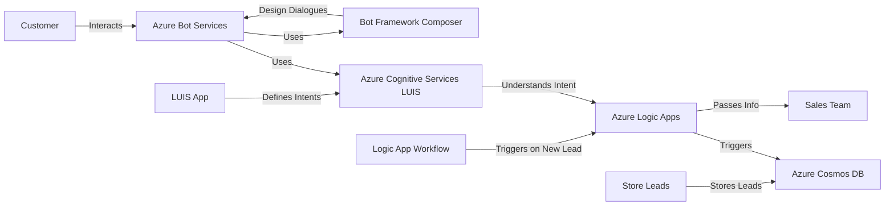
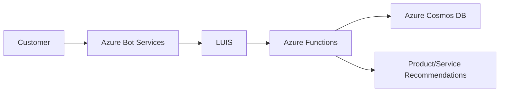
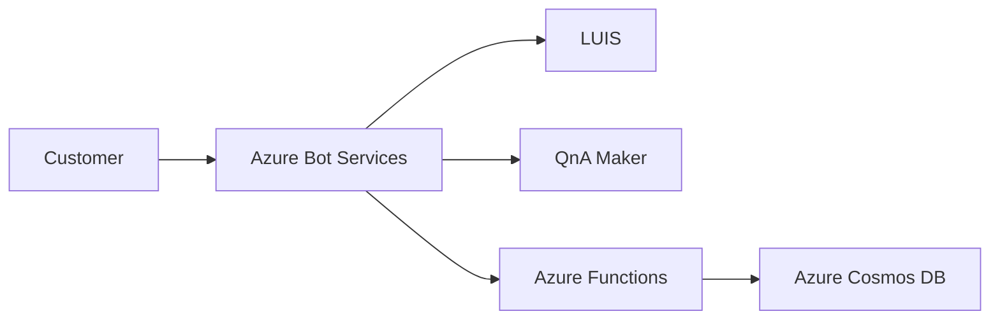
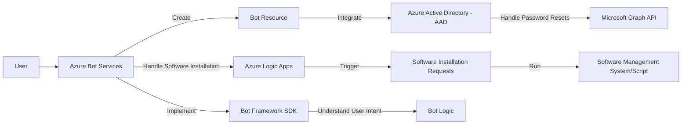
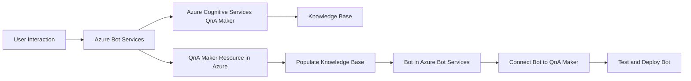
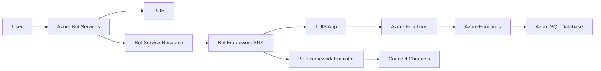
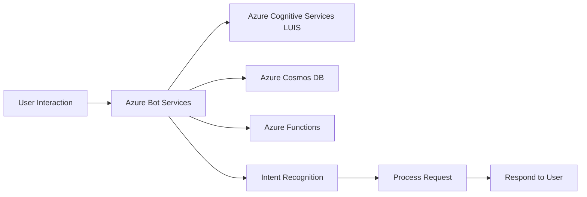

# Bot Services

> Azure Bot Service is a cloud-based platform provided by Microsoft Azure that enables businesses to build, deploy, and manage AI-powered chatbots[2](https://studioteck.com/azure-bot-service/). These chatbots can interact with users through text or voice and can be integrated into websites, messaging platforms, or mobile apps[2](https://studioteck.com/azure-bot-service/). Azure Bot Service simplifies creating and managing chatbots, making them accessible for businesses with varying technical expertise[2](https://studioteck.com/azure-bot-service/). In addition, Azure Bot Service offers the scalability and performance needed to handle varying workloads[2](https://studioteck.com/azure-bot-service/). Businesses can quickly scale their chatbot infrastructure up or down based on demand, ensuring optimal performance and cost efficiency[2](https://studioteck.com/azure-bot-service/).

Here are some of the key features of the Azure AI Bot Service: 
1. **Integrated Development Environment**: Azure AI Bot Service provided an integrated development environment for bot building. Its integration with Power Virtual Agents, a fully hosted low-code platform, enabled developers of all technical abilities to build conversational AI bots.
2. **Build Bots Quickly**: Users could make, test, and publish bots using a low-code graphical interface. They could also improve their bot applications over time.
3. **Real-Time Notification**: Whenever anomalies were detected, Azure AI Bot Service was able to send real-time notifications through multiple channels using hooks.
4. **Smart Diagnostic Insights**: Azure AI Bot Service combined anomalies detected on the same multi-dimensional metric into a diagnostic tree to help users analyze root cause into specific dimensions.

## Content 

<!-- TOC -->

- [Bot Services](#bot-services)
    - [Content](#content)
    - [Example of Use Cases](#example-of-use-cases)
        - [Customer Service - Bot Services:](#customer-service---bot-services)
        - [Sales and Marketing - Bot Services:](#sales-and-marketing---bot-services)
        - [Human Resources - Bot Services:](#human-resources---bot-services)
        - [IT Help Desk - Bot Services:](#it-help-desk---bot-services)
        - [E-commerce - Bot Services:](#e-commerce---bot-services)

<!-- /TOC -->

## Example of Use Cases

> [!NOTE]
> Here are some use cases:

### Customer Service - Bot Services:
[return to Content](#content)

- **Automated Support**: Azure Bot Services can be used to create chatbots that provide automated responses to common customer inquiries, reducing the workload on human customer service representatives.

> [!IMPORTANT]
> Here’s an example of an end-to-end solution using Azure resources and Azure Bot Services: Please note that this is a very basic example and a real-world bot would likely be much more complex. You might use the Azure Bot Framework SDK for more advanced features, and you might integrate your bot with a natural language processing (NLP) service like LUIS (Language Understanding Intelligent Service) to better understand user inquiries. You might also integrate your bot with a database to store and retrieve information, and you might use Azure’s QnA Maker service to easily handle frequently asked questions. Finally, you would likely want to add authentication and error handling to your bot.

> Step 1: Create a Bot Service on Azure
> 
> - Navigate to the Azure portal and create a new Bot Service resource.
> - Choose a name, subscription, resource group, and location for your bot.
> - Select the F0 (free) pricing tier for testing purposes.
> 
> Step 2: Configure the Bot Service
> 
> - Once the Bot Service is deployed, go to the resource and navigate to the "Bot Management" section.
> - Click on "Channels" and enable the "Web Chat" channel. This will allow you to embed the bot on a website.
> - Navigate to "Settings" and configure the messaging endpoint, which will be used to handle messages from users.
> 
> Step 3: Develop the Bot
> 
> - You can develop the bot directly in the Azure portal using the online code editor, or you can download the bot's source code and develop it locally.
> - The bot's logic will be implemented in a file called `index.js` (for JavaScript bots) or `echoBot.cs` (for C# bots).
> - Implement the logic to handle common customer inquiries. For example, you could use a switch statement to handle different types of inquiries.
> 
> Here's a simple example of what the bot's logic might look like in JavaScript:
> 
> ```javascript
> module.exports = function(context, req) {
>     context.log('JavaScript HTTP trigger function processed a request.');
> 
>     const inquiry = (req.query.inquiry || (req.body && req.body.inquiry));
>     let response;
> 
>     switch(inquiry) {
>         case 'hours':
>             response = 'Our hours are 9am-5pm, Monday-Friday.';
>             break;
>         case 'location':
>             response = 'We are located at 123 Main St.';
>             break;
>         default:
>             response = 'Sorry, I did not understand your inquiry.';
>     }
> 
>     context.res = {
>         // status: 200, /* Defaults to 200 */
>         body: response
>     };
> }
> ```
> Step 4: Test the Bot
> - After implementing the bot’s logic, you can test the bot directly in the Azure portal using the “Test in Web Chat” feature.
> Step 5: Deploy the Bot
> - If you developed the bot locally, you’ll need to deploy the bot to Azure. You can do this using the Azure CLI or the Azure portal.
> - After deploying the bot, you can embed it on your website using the embed code provided in the “Channels” section of the Bot Service resource.



- **Ticket Routing**: Bots can be used to gather initial information and then route the customer to the appropriate department or individual based on their needs.

> [!IMPORTANT]
> Here’s an example of an end-to-end solution using Azure resources and Azure Bot Services: Please note that this is a high-level example and the actual implementation may require additional steps and considerations based on the specific requirements of your use case.

> Architecture
> 
> 1. **Azure Bot Services**: Handles interactions with the user to gather initial information.
> 2. **Language Understanding (LUIS)**: Used to understand the user's intent and extract relevant information.
> 3. **Azure Logic Apps**: Orchestrates the process of routing the ticket based on the information gathered.
> 4. **Azure Functions**: Used to run code that determines the appropriate department or individual for ticket routing.
> 5. **Azure SQL Database**: Stores information about tickets, departments, and individuals for routing purposes.
> 
> Workflow
> 
> 1. The customer interacts with the bot created with Azure Bot Services.
> 2. The bot uses LUIS to understand the customer's intent and extract relevant information.
> 3. This information is passed to an Azure Logic App, which triggers an Azure Function.
> 4. The Azure Function uses the information to determine the appropriate department or individual.
> 5. The Logic App then routes the ticket to the determined department or individual.
> 6. Information about the ticket and its routing is stored in an Azure SQL Database.
> 
> Implementation Steps
> 
> 1. Create a bot using Azure Bot Services and set it up to interact with customers.
> 2. Set up LUIS to understand customer intents and extract information.
> 3. Create an Azure Logic App that is triggered by the bot passing it information.
> 4. Within the Logic App, set up an Azure Function that determines the appropriate department or individual based on the information.
> 5. Set up the Logic App to route the ticket based on the output of the Azure Function.
> 6. Set up an Azure SQL Database to store ticket and routing information.



### Sales and Marketing - Bot Services:
[return to Content](#content)

- **Lead Generation**: Bots can engage with potential customers on a website or social media platform, ask qualifying questions, and generate leads for the sales team.

> [!IMPORTANT]
> Here’s an example of an end-to-end solution using Azure resources and Azure Bot Services:

> Architecture
> 
> 1. **Azure Bot Services**: This is the core service that will be used to create, deploy, and manage the bot. The bot will be programmed to ask qualifying questions to potential customers.
> 2. **Azure Cognitive Services (Language Understanding - LUIS)**: This service can be used to enable the bot to understand the intent of the customer's responses to the qualifying questions.
> 3. **Azure Logic Apps**: This service can be used to create workflows that take the qualified leads from the bot and pass them to the sales team.
> 4. **Azure Cosmos DB**: This service can be used to store the leads generated by the bot.
> 
> Steps
> 
> 1. **Create the Bot**: Use the Azure Bot Services to create a new bot. You can use the Bot Framework Composer to design the bot's dialogues and questions.
> 2. **Integrate LUIS**: Integrate the bot with LUIS to enable it to understand the intent of the customer's responses.
> 3. **Create Logic App Workflow**: Create a workflow in Azure Logic Apps that triggers whenever a new lead is generated by the bot. The workflow should take the lead information and pass it to the sales team.
> 4. **Store Leads in Cosmos DB**: Configure the bot to store the generated leads in Azure Cosmos DB.
>



- **Product Recommendations**: Based on customer input, bots can suggest products or services that meet their needs.

> [!IMPORTANT]
> Here’s an example of an end-to-end solution using Azure resources and Azure Bot Services:

> Architecture
> 
> 1. **Azure Bot Service**: Handles the interaction with the user.
> 2. **LUIS (Language Understanding Intelligent Service)**: Processes the user's input to understand their needs.
> 3. **Azure Functions**: Hosts the logic of the bot.
> 4. **Azure Cosmos DB**: Stores the product or service data.
> 
> Steps
> 
> 1. **Set up Azure Bot Service**:
>     - Create a new Bot Channels Registration in the Azure portal.
>     - Enable the channels (like Teams, Web Chat, etc.) where you want your bot to interact with users.
> 
> 2. **Set up LUIS**:
>     - Create a new LUIS app in the LUIS portal.
>     - Define intents that represent the different needs that users might express.
>     - Train and publish your LUIS app.
> 
> 3. **Set up Azure Functions**:
>     - Create a new Function App in the Azure portal.
>     - Add a new function that will be triggered by HTTP requests from your bot.
>     - In this function, use the LUIS SDK to send the user's input to your LUIS app and get the top-scoring intent.
>     - Based on the intent, select relevant products or services from your database.
> 
> 4. **Set up Azure Cosmos DB**:
>     - Create a new Cosmos DB account in the Azure portal.
>     - Add a new database and a container to store your product or service data.
>     - Populate your container with data about your products or services.
> 
> 5. **Connect everything**:
>     - In your bot's code, add the logic to send user input to your Azure function, receive the product or service recommendations, and send them back to the user.
>     - Test your bot in the Azure portal and deploy it to your desired channels.
> 



### Human Resources - Bot Services:
[return to Content](#content)

- **Employee Onboarding**: Bots can guide new hires through the onboarding process, answering common questions and providing information about company policies and procedures.
- **Benefits Inquiries**: Bots can provide employees with information about their benefits and direct them to the appropriate resources for further assistance.

> [!IMPORTANT]
> Here’s an example of an end-to-end solution using Azure resources and Azure Bot Services:

> Architecture
> 1. **Azure Bot Services**: The core of the solution, responsible for interacting with the user.
> 2. **LUIS (Language Understanding Intelligent Service)**: To understand the user's natural language input.
> 3. **QnA Maker**: To answer frequently asked questions.
> 4. **Azure Functions**: To handle complex queries and perform actions.
> 5. **Azure Cosmos DB**: To store and retrieve user and onboarding data.
> 
> Steps
> 1. **Create a Bot Service on Azure**: This will be the main interface for the bot.
> 2. **Integrate LUIS with the Bot Service**: Train a LUIS model to understand intents from the user's input.
> 3. **Integrate QnA Maker with the Bot Service**: Populate the QnA Maker with FAQs about the onboarding process.
> 4. **Create Azure Functions**: Write functions to handle complex queries that can't be answered by the QnA Maker.
> 5. **Set up Azure Cosmos DB**: Store user data and onboarding progress.
> 
> Code Snippets: Below are some example code snippets for the Azure Functions and the Bot Service.
> 
> Azure Functions:
> ```csharp
> public static class OnboardingFunction
> {
>     [FunctionName("OnboardingFunction")]
>     public static async Task<IActionResult> Run(
>         [HttpTrigger(AuthorizationLevel.Function, "get", "post", Route = null)] HttpRequest req,
>         ILogger log)
>     {
>         // Your code here
>     }
> }
> ```
> 
> Bot Service: 
> ```csharp
> public class OnboardingBot : ActivityHandler
> {
>     protected override async Task OnMessageActivityAsync(ITurnContext<IMessageActivity> turnContext, CancellationToken cancellationToken)
>     {
>         // Your code here
>     }
> }
> ```



### IT Help Desk - Bot Services:
[return to Content](#content)

- **Troubleshooting**: Bots can assist with common IT issues, such as password resets or software installation, freeing up IT staff for more complex tasks.

> [!IMPORTANT]
> Here’s a high-level example of how you might structure an IT Help Desk bot using Azure Bot Services and other Azure resources. This bot could handle common tasks like password resets and software installation.

> Architecture
> 1. **Azure Bot Services**: Handles user interactions and routes requests to the appropriate services.
> 2. **Azure Active Directory (AAD)**: Manages user identities and handles password reset requests.
> 3. **Azure Logic Apps**: Orchestrates the software installation process.
> 
> Implementation
> - Step 1: Set Up Azure Bot Services: Create a new Bot Resource in the Azure portal. This will be the interface for users to interact with.
> - Step 2: Integrate with Azure Active Directory: Integrate the bot with Azure Active Directory to handle password reset requests. You can use the Microsoft Graph API to interact with AAD.
> - Step 3: Set Up Azure Logic Apps: Create a new Logic App to handle software installation requests. This could involve sending a request to a software management system, or it could involve running a script on the user's machine.
> - Step 4: Implement the Bot Logic: Implement the bot's logic using the Bot Framework SDK. The bot should be able to understand the user's intent (e.g., reset password, install software) and call the appropriate service.



- **Knowledge Base**: Bots can search a knowledge base to provide users with relevant articles or solutions based on their issue.
  
> [!IMPORTANT]
> Here’s an example of an end-to-end solution using Azure resources and Azure Bot Services:

> Architecture
> 1. **User Interaction**: Users interact with the bot through a user interface, which could be a web chat, Teams, or another channel supported by Azure Bot Services.
> 2. **Azure Bot Service**: The bot built with Azure Bot Services receives the user's query and sends it to the QnA Maker service.
> 3. **Azure Cognitive Services (QnA Maker)**: QnA Maker processes the query and returns the most relevant articles or solutions from the knowledge base.
> 4. **Knowledge Base**: The knowledge base is a set of question-and-answer pairs that are added manually, or imported from existing content (like FAQ URLs, product manuals, etc.).
> 
> Implementation Steps
> 1. **Create a QnA Maker resource in Azure**: This will host your knowledge base.
> 2. **Populate the Knowledge Base**: Add question-and-answer pairs to the QnA Maker manually, or by importing from existing content.
> 3. **Create a Bot in Azure Bot Services**: This will be the interface between the users and the knowledge base.
> 4. **Connect the Bot to the QnA Maker**: Use the QnA Maker SDK in your bot's code to connect the bot to the QnA Maker service.
> 5. **Test and Deploy the Bot**: Test the bot in the Azure portal, then deploy it to your desired channels.
> 
> Code Snippets: Here's an example of how you might use the QnA Maker SDK in your bot's code:
> ```csharp
> var qnaMaker = new QnAMaker(new QnAMakerEndpoint
> {
>     KnowledgeBaseId = "<Your-Knowledge-Base-ID>",
>     EndpointKey = "<Your-Endpoint-Key>",
>     Host = "<Your-Host-URL>"
> });
> 
> var options = new QnAMakerOptions { Top = 1 };
> var response = await qnaMaker.GetAnswersAsync(turnContext, options);
> ```
> 
> This code creates a new instance of the QnAMaker class using your knowledge base ID, endpoint key, and host URL. It then sends the user’s query to the QnA Maker service and gets the top answer. Please replace <Your-Knowledge-Base-ID>, <Your-Endpoint-Key>, and <Your-Host-URL> with your actual QnA Maker service details.



### E-commerce - Bot Services:
[return to Content](#content)

- **Order Tracking**: Bots can provide customers with updates on their order status and estimated delivery times.

> [!IMPORTANT]
> Here’s an example of an end-to-end solution using Azure resources and Azure Bot Services:

>  Architecture
> 1. **Azure Bot Service**: This is the core service that will host the chatbot. It provides the direct line of communication between the users and the bot.
> 2. **LUIS (Language Understanding Intelligent Service)**: This Azure cognitive service is used to understand the user's natural language inputs and convert them into structured data that the bot can process.
> 3. **Azure Functions**: Serverless functions can be used to handle specific events or triggers in the bot's workflow, such as fetching order details from the database.
> 4. **Azure SQL Database**: This is where the order details are stored. The bot fetches data from this database to provide order status and delivery updates.
> 
>  Implementation Steps
> 1. **Create the Bot Service**: Use the Azure portal to create a new Bot Service resource. Choose the SDK v4 and the appropriate language for your bot (e.g., C#, JavaScript).
> 2. **Develop the Bot**: Use the Bot Framework SDK to develop the bot. Implement dialogs for handling different types of user queries, such as "What's the status of my order?" or "When will my order be delivered?".
> 3. **Integrate LUIS**: Train a LUIS app to understand these queries and return structured data. Integrate this LUIS app with your bot to handle natural language processing.
> 4. **Implement Azure Functions**: Write serverless functions that fetch order details from the Azure SQL Database based on the structured data from LUIS.
> 5. **Test the Bot**: Use the Bot Framework Emulator to test the bot locally. Once you're satisfied with its performance, publish it to the Azure Bot Service.
> 6. **Connect Channels**: Finally, connect your bot to various channels like your e-commerce website, Facebook Messenger, etc., through the Azure Bot Service.



- **Shopping Assistance**: Bots can help customers find products, answer questions about items, and guide them through the checkout process.

> [!IMPORTANT]
> Here’s an example of an end-to-end solution using Azure resources and Azure Bot Services:

> Architecture: The solution leverages several Azure services
> - **Azure Bot Services**: For bot framework and bot connector service.
> - **Azure Cognitive Services (LUIS)**: For natural language understanding.
> - **Azure Cosmos DB**: For storing product information and user shopping data.
> - **Azure Functions**: For serverless compute to process user requests.
> 
> Workflow
> 1. **User Interaction**: The user interacts with the bot through a supported channel (e.g., website, Teams, etc.).
> 2. **Intent Recognition**: The bot uses LUIS to understand the user's intent and entities from the user's message.
> 3. **Process Request**: Depending on the intent, the bot processes the request. This could involve querying Cosmos DB for product information or guiding the user through the checkout process using dialog flows.
> 4. **Respond to User**: The bot sends a response back to the user, providing the requested information or asking for more details if necessary.
> 
> Code
> The actual implementation would involve creating a bot using the Azure Bot Framework SDK, setting up LUIS for intent recognition, and implementing Azure Functions to handle various tasks. Please refer to the Azure Bot Service Documentation and Azure Functions Documentation for detailed guides and tutorials.


