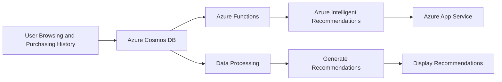
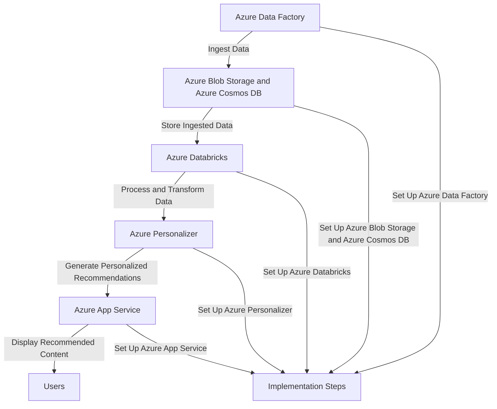
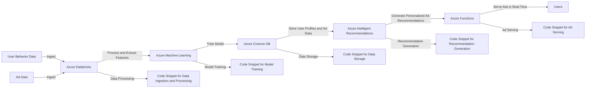
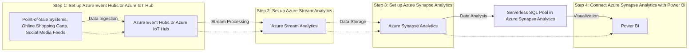
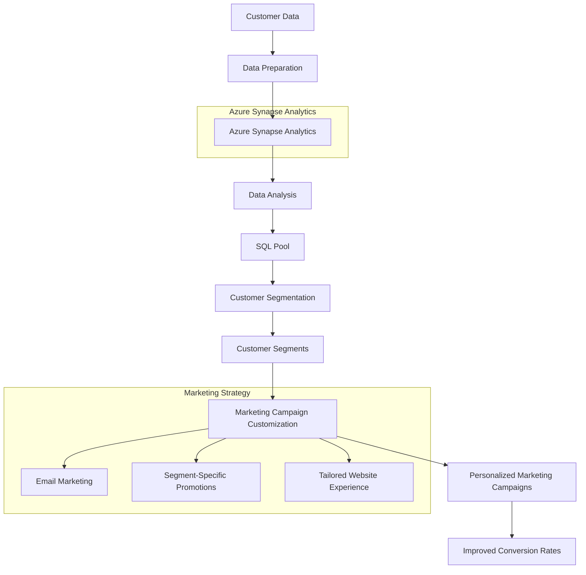
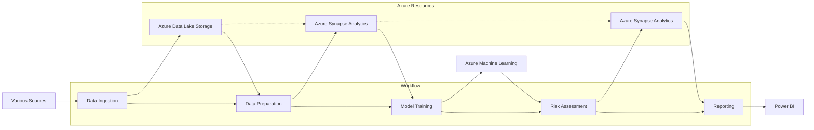
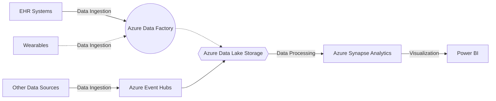

# Azure Artifitial Intelligence + ML Overview

----------

Costa Rica

Belinda Brown, belindabrownr04@gmail.com

[](https://github.com/)
[brown9804](https://github.com/brown9804)

----------

## Content 

- [Azure Artifitial Intelligence + ML Overview](#azure-artifitial-intelligence--ml-overview)
    - [Content](#content)
    - [Wiki](#wiki)
    - [Azure AI Studio](#azure-ai-studio)
    - [Azure Machine Learning](#azure-machine-learning)
    - [AI Search](./0_AISearch/README.md)
    - [AI Video Indexer](./1_AIVideoIndexer/README.md)
    - [AI Content Safety](./2_AIContentSafety/README.md)
    - [Bot Services](./3_BotServices/README.md)
    - [Computer Vision](./4_ComputerVision/README.md)
    - [Custom Vision](./5_CustomVision/README.md)
    - [Document Intelligences](./6_DocumentIntelligences/README.md)
    - [Face APIs](./7_FaceAPIs/README.md)
    - [Immersive readers](./8_ImmersiveReaders/README.md)
    - [Azure OpenAI](./9_AzureOpenAI/README.md)
    - [Speech Services](./10_SpeechServices/README.md)
    <details><summary> 12. <a href="#translators"> Translators  </a></summary><ul>
            <li> <a href="#multilingual-customer-support---azure-translators"> Multilingual Customer Support - Azure Translators: </a> </li>
            <li> <a href="#content-localization---azure-translators" > Content Localization - Azure Translators: </a> </li>
            <li> <a href="#real-time-communication---azure-translator" > Real-Time Communication - Azure Translators: </a> </li>
            <li> <a href="#language-learning-applications---azure-translators" > Language Learning Applications - Azure Translators: </a> </li>
            <li> <a href="#accessibility---azure-translators" > Accessibility - Azure Translators: </a> </li>
    </details></li> <!-- End 12 -->
    <details><summary> 13. <a href="#intelligent-recommendations-accounts">  Intelligent Recommendations Accounts </a></summary><ul>
            <li> <a href="#e-commerce-personalization---intelligent-recommendations-accounts"> E-commerce Personalization - Intelligent Recommendations Accounts: </a> </li>
            <li> <a href="#content-discovery---intelligent-recommendations-accounts" > Content Discovery - Intelligent Recommendations Accounts: </a> </li>
            <li> <a href="#ad-targeting---intelligent-recommendations-accounts" > Ad Targeting - Intelligent Recommendations Accounts: </a> </li>
            <li> <a href="#learning-path-suggestions---intelligent-recommendations-accounts" > Learning Path Suggestions - Intelligent Recommendations Accounts: </a> </li>
    </details></li> <!-- End 13 -->
    <details><summary> 14. <a href="#azure-synapse-analytics"> Azure Synapse Analytics </a></summary><ul>
            <li> <a href="#real-time-analytics-in-retail---azure-synapse-analytics"> Real-Time Analytics in Retail - Azure Synapse Analytics: </a> </li>
            <li> <a href="#predictive-maintenance-in-manufacturing---azure-synapse-analytics" > Predictive Maintenance in Manufacturing - Azure Synapse Analytics: </a> </li>
            <li> <a href="#customer-segmentation-in-marketing---azure-synapse-analytics" > Customer Segmentation in Marketing - Azure Synapse Analytics: </a> </li>
            <li> <a href="#risk-assessment-in-finance---azure-synapse-analytics" > Risk Assessment in Finance - Azure Synapse Analytics: </a> </li>
            <li> <a href="#healthcare-analytics---azure-synapse-analytics" > Healthcare Analytics - Azure Synapse Analytics: </a> </li>
    </details></li> <!-- End 14 -->
- [Retired](#retired)

## Wiki 
[return to Content](#content)

All Azure services as for now:

| Area | Category | Service | Overview |
| ---- | ---- | ---- | ---- | 
| Artifitial Intelligence | Platform | [Azure AI Studio](#azure-ai-studio) | Azure AI Studio is a comprehensive platform for building, deploying, and managing AI solutions. It's a cloud-based service that makes it easy for developers of all skill levels to build AI applications. It provides a single place to do everything you need to build an AI application, including loading data from a variety of sources, preparing it for training, training a model, and deploying the model to production. <br/> <br/> For more information: <br/> [Product](https://azure.microsoft.com/en-gb/products/ai-studio/) <br/> [How to Build](https://ai.azure.com/build) <br/> [What is Azure AI Studio?](https://openaimaster.com/azure-ai-studio/#google_vignette), and [MS What is Azure AI Studio?](https://learn.microsoft.com/en-us/azure/ai-studio/what-is-ai-studio?tabs=home) |
| Machine Learning | Platform | [Azure Machine Learning](#azure-machine-learning) | Azure Machine Learning Platform is a cloud service for accelerating and managing the machine learning (ML) project lifecycle. It provides an environment to create and manage the end-to-end life cycle of Machine Learning models. Azure Machine Learning’s compatibility with open-source frameworks and platforms like PyTorch and TensorFlow makes it an effective all-in-one platform for integrating and handling data and models. <br/> <br/> For more information: <br/> [Product](https://azure.microsoft.com/en-us/products/machine-learning/) <br/> [What is Azure Machine Learning?](https://learn.microsoft.com/en-us/azure/machine-learning/overview-what-is-azure-machine-learning?view=azureml-api-2) <br/> [Introduction to Azure Machine Learning](https://learn.microsoft.com/en-us/training/modules/intro-to-azure-ml/) <br/> [Azure Machine Learning architecture](https://learn.microsoft.com/en-us/azure/architecture/ai-ml/idea/azure-machine-learning-solution-architecture) <br/> [AI Platform](https://www.microsoft.com/en-us/ai/ai-platform) |
| AI + APIs | Service | AI Services | Azure AI services are a collection of cloud-based services provided by Microsoft Azure to help developers build applications with artificial intelligence capabilities. <br/> <br/> Here’s an overview: <br/> 1. **Azure Machine Learning**: A cloud-based environment you can use to train, deploy, automate, manage, and track ML models. <br/> 2. **Azure Cognitive Services**: A collection of APIs, SDKs, and services available to help developers build intelligent applications without having direct AI or data science skills or knowledge. It includes services for vision, speech, language, decision, and web search. <br/> 3. **Azure Bot Service**: Enables developers to create conversational interfaces on multiple channels. <br/> 4. **Azure Databricks**: An Apache Spark-based analytics platform optimized for Azure. It's integrated with Azure to provide one-click setup, streamlined workflows, and an interactive workspace. <br/> 5. **Azure Search**: A search-as-a-service cloud solution that gives developers APIs and tools for adding a rich search experience over private, heterogeneous content in web, mobile, and enterprise applications. <br/> 6. **Azure Data Lake Analytics**: An on-demand analytics job service that simplifies big data. Instead of deploying, configuring, and tuning hardware, you write queries to transform your data and extract valuable insights. <br/> <br/> These services are designed to work together to help developers and data scientists build end-to-end AI applications. They can be used individually or in combination, depending on the specific application requirements. They are all built on the robust Azure cloud platform, ensuring scalability, reliability, and security. <br/> <br/> Remember, the use of these services requires an Azure subscription. If you don't have one, you can create a free account to get started. <br/> To see the list of Available Azure AI services, click [here](https://learn.microsoft.com/en-us/azure/ai-services/what-are-ai-services#available-azure-ai-services) | 
| AI + APIs | Service | AI Services multi-service account | 1. **AI Services** offer prebuilt and customizable APIs and models for creating intelligent applications. [reference](https://learn.microsoft.com/en-us/azure/ai-services/what-are-ai-services) <br/> 2. A **multi-service account** allows access to multiple Azure AI services with a single key and endpoint, consolidating billing. [reference](https://learn.microsoft.com/en-us/azure/ai-services/multi-service-resource?tabs=windows&pivots=azportal) and [here](https://stackoverflow.com/questions/77407269/how-to-create-azure-ai-services-multi-service-account-using-terraform) <br/> 3. In contrast, a **single-service account** provides access to a specific AI service with a unique key and endpoint. [refenrece](https://github.com/MicrosoftDocs/azure-docs/blob/main/articles/ai-services/multi-service-resource.md) | 
| AI + APIs | AI Service | [AI Search](#ai-search) (formerly known as "Azure AI Search") | Azure AI Search, a powerful information retrieval platform by Microsoft, enables developers to create rich search experiences and generative AI applications. For more information click [here](https://learn.microsoft.com/en-us/azure/search/search-what-is-azure-search) | 
| AI + APIs | AI Service | [AI Video Indexer](#ai-video-indexer) | Azure AI Video Indexer is a cloud and edge video analytics service that uses artificial intelligence to extract actionable insights from stored videos, for more information click [here](https://azure.microsoft.com/en-us/products/ai-video-indexer/) | 
| AI + APIs | AI Service | [AI Content Safety](#ai-content-safety) | The service was used in various scenarios such as online marketplaces that moderate product catalogs and other user-generated content, and gaming companies that moderate user-generated game artifacts and chat rooms. <br/> <br/> Click [here](https://learn.microsoft.com/en-us/azure/ai-services/content-safety/overview) for reference. | 
| AI + APIs | AI Service | [Bot Services](#bot-services) | Azure AI Bot Service was a part of Azure AI services that provided a comprehensive environment for building, testing, hosting, and deploying bots. It was designed to apply AI features and could be used to build intelligent applications. <br/> <br/>  Click [here](https://learn.microsoft.com/en-us/azure/bot-service/?view=azure-bot-service-4.0) for reference, and [2](https://chatbotbusinessframework.com/azure-bot-service-explained-simply/), [3](https://www.devopsschool.com/blog/what-is-azure-bot-service/), [4](https://www.trustradius.com/products/azure-bot-service/reviews?qs=pros-and-cons#reviews). | 
| AI + APIs | Service | [Computer Vision](#computer-vision) | Azure AI Vision, also known as Azure Computer Vision, was a cloud-based service provided by Microsoft Azure. It offered advanced algorithms that processed images and returned information based on the visual features you’re interested in. This service could be used to build intelligent applications. <br/> <br/> For more information click [here](https://azure.microsoft.com/en-us/products/ai-services/ai-vision), [2](https://learn.microsoft.com/en-us/azure/ai-services/computer-vision/overview), [3](https://www.rinf.tech/why-and-when-to-use-azure-computer-vision-and-cognitive-services/), [4](https://www.pluralsight.com/resources/blog/cloud/a-visual-guide-to-computer-vision-in-azure). | 
| AI + APIs | AI Service | [Custom Vision](#custom-vision)| Azure AI Custom Vision was an image recognition service provided by Microsoft Azure. It allowed users to build, deploy, and improve their own image identifier models. An image identifier applied labels to images, according to their visual characteristics. Each label represented a classification or object. <br/> <br/>  Click [here](https://azure.microsoft.com/en-us/products/ai-services/ai-custom-vision) for more information, [2](https://learn.microsoft.com/en-us/azure/ai-services/custom-vision-service/overview), [3](https://azure.microsoft.com/ja-jp/products/ai-services/ai-custom-vision), [4](https://azure.microsoft.com/en-us/pricing/details/cognitive-services/custom-vision-service/). | 
| AI + APIs | AI Service | [Document intelligences](#document-intelligences) | Azure AI Document Intelligence is a service provided by Microsoft Azure. It is an automated data processing system that uses AI and OCR to quickly extract text and structure from documents. <br/> <br/> Click [here](https://azure.microsoft.com/en-us/products/ai-services/ai-document-intelligence) for reference, [2](https://learn.microsoft.com/en-us/azure/ai-services/document-intelligence/?view=doc-intel-4.0.0). | 
| AI + APIs | AI Service | [Face APIs](#face-apis) | Azure Face API is a cloud-based service that provides algorithms for face detection and recognition. It's a part of the Azure Cognitive Services suite. <br/> <br/> Click [here](https://learn.microsoft.com/en-us/rest/api/face/) for reference, [2](https://blog.devgenius.io/how-to-deploy-facial-recognition-with-azure-face-api-9d877b645893), [3](https://learn.microsoft.com/en-us/azure/ai-services/computer-vision/identity-api-reference), [princing](https://azure.microsoft.com/en-us/pricing/details/cognitive-services/face-api/). | 
| AI + APIs | AI Service | [Immersive readers](#immersive-readers) | Azure AI Immersive Reader is an AI service that helps users read and comprehend text. It's a part of the Azure AI Services suite. <br/> <br/> For more information: [Azure AI Immersive Reader Microsoft Azure](https://azure.microsoft.com/en-us/products/ai-services/ai-immersive-reader) <br/> [What is Azure AI Immersive Reader? - Azure AI services](https://learn.microsoft.com/en-us/azure/ai-services/immersive-reader/overview)  <br/> [Azure Immersive Reader](https://azureinfohub.azurewebsites.net/Services/Details?serviceTitle=Azure%20Immersive%20Reader). | 
| AI + APIs | AI Service | [Azure OpenAI](#azure-openai)  | Azure OpenAI Service is an AI service that provides REST API access to OpenAI's powerful language models. It's a part of the Azure AI Services suite. <br/> <br/>  For more information. <br/> - [Azure OpenAI Service – Advanced Language Models](https://azure.microsoft.com/en-us/products/ai-services/openai-service) <br/> - [What is Azure OpenAI Service? - Azure AI services](https://learn.microsoft.com/en-us/azure/ai-services/openai/overview) <br/> - [Azure OpenAI Service powers the next generation of startups](https://startups.microsoft.com/blog/azure-openai-service-for-startups/) <br/> - [Explore the benefits of Azure OpenAI Service with Microsoft Learn](https://azure.microsoft.com/en-us/blog/explore-the-benefits-of-azure-openai-service-with-microsoft-learn/) | 
| AI + APIs | AI Service | [Speech Services](#speech-services)  | Azure Speech Services is a managed service offering industry-leading speech capabilities such as speech-to-text, text-to-speech, speech translation, and speaker recognition. <br/> <br/> For more information <br/> - [What is the Speech service? - Azure AI services](https://learn.microsoft.com/en-us/azure/ai-services/speech-service/overview) <br/> - [Azure AI Speech](https://azure.microsoft.com/en-us/products/ai-services/ai-speech) <br/> - [Speech to Text – Audio to Text Translation](https://azure.microsoft.com/en-us/products/ai-services/speech-to-text) <br/> - [Text to Speech – Realistic AI Voice Generator](https://azure.microsoft.com/en-us/products/ai-services/text-to-speech) | 
| AI + APIs | AI Service | [Translators](#translators)  | Azure Translator Service is a cloud-based neural machine translation service that is part of the Azure AI services family. It can be used with any operating system and powers many Microsoft products and services used by thousands of businesses worldwide for language translation and other language-related operations. <br/> <br/> For more information: <br/> - [What is Azure AI Translator? - Azure AI services](https://learn.microsoft.com/en-us/azure/ai-services/translator/translator-overview) <br/> - [Azure AI Translator](https://azure.microsoft.com/en-us/products/ai-services/ai-translator) <br/> - [Azure AI Translator documentation - quickstarts, tutorials, API ...](https://learn.microsoft.com/en-us/azure/ai-services/translator/). | 
| Industry Machine Learning solutions | Solution | [Intelligent Recommendations Accounts](#intelligent-recommendations-accounts)  | Azure Intelligent Recommendations is a service that democratizes AI and machine learning recommendations through a codeless experience. It's powered by the same technology that fuels Xbox, Microsoft 365, and Microsoft Azure. <br/> <br/>  For more information: <br/> [What is Intelligent Recommendations?](https://learn.microsoft.com/en-us/industry/retail/intelligent-recommendations/overview) <br/> [Create a new Intelligent Recommendations account](https://learn.microsoft.com/en-us/industry/retail/intelligent-recommendations/deploy-intelligent-recommendations-account) <br/> [Microsoft Entra ID Governance introduces two new features in access reviews](https://techcommunity.microsoft.com/t5/microsoft-entra-blog/microsoft-entra-id-governance-introduces-two-new-features-in/ba-p/2466930) | 
| Industry Machine Learning solutions | Solution | [Azure Synapse Analytics](#azure-synapse-analytics)  | Azure Synapse Analytics is an enterprise analytics service that accelerates time to insight across data warehouses and big data systems. It brings together the best of SQL technologies used in enterprise data warehousing, Apache Spark technologies for big data, and Azure Data Explorer for log and time series analytics. <br/> <br/>  For more information: <br/> [Azure Synapse Analytics Overview](https://azure.microsoft.com/en-us/products/synapse-analytics/) <br/> [What is Azure Synapse Analytics?](https://learn.microsoft.com/en-us/azure/synapse-analytics/overview-what-is) <br/> [Azure Synapse Analytics Learning documents](https://learn.microsoft.com/en-us/azure/synapse-analytics/). | 

## Azure AI Studio
[return to Content](#content)


Key Features: [reference](https://www.slideshare.net/slideshow/azure-ai-platform-automated-ml-workshop/133115961)
- Provides a trusted and inclusive platform that empowers developers of all abilities and preferences to innovate with AI and shape the future.
- Seamlessly explore, build, test, and deploy using cutting-edge AI tools and ML models, grounded in responsible AI practices.
- Build together as one team.
- Improve customer experiences, reduce organizational risk, improve work quality, enhance productivity and efficiency.
- Built-in security and compliance investing USD20 billion in cybersecurity.
- 8,500 security and threat intelligence experts compliance certification portfolios.

Creating a new Azure AI Studio account: 
- You can create and manage Azure resources for Azure AI Studio via the Azure portal. 

## Azure Machine Learning
[return to Content](#content)


Key Features: 
- Accelerates time to value.
- Provides a unified experience for data engineering, data science, and business analysis.
- Enables data warehousing and data virtualization scenarios.
- Extends T-SQL to address streaming and machine learning scenarios. 
- Integrates AI with SQL by using machine learning models to score data.
- Allows data engineers to use a code-free visual environment for managing data pipelines.
- Automates query optimization.
- Seamlessly integrates with Power BI, CosmosDB, and AzureML.
- Develop with confidence.
- Design responsibly.
- Take advantage of key features for the full ML lifecycle. 

Creating a new Azure Machine Learning Platform account: 
- You can create and manage Azure resources for Azure Machine Learning Platform via the Azure portal. 

## Translators
[return to Content](#content)

Key Features: 
- **Text Translation**: Execute text translation between supported source and target languages in real time.
- **Asynchronous Batch Document Translation**: Translate batch and complex files while preserving the structure and format of the original documents.
- **Synchronous Document Translation**: Translate a single document file alone or with a glossary file while preserving the structure and format of the original document.
- *Custom Translator**: Build customized models to translate domain- and industry-specific language, terminology, and style.

Applications (Common scenarios for Azure Translator include): 
- **Captioning**: Synchronize captions with your input audio, apply profanity filters, get partial results, apply customizations, and identify spoken languages for multilingual scenarios.
- **Audio Content Creation**: Use neural voices to make interactions with chatbots and voice assistants more natural and engaging, convert digital texts such as e-books into audiobooks and enhance in-car navigation systems.
- **Call Center**: Transcribe calls in real-time or process a batch of calls, redact personally identifying information, and extract insights such as sentiment to help with your call center use case.
- **Language Learning**: Provide pronunciation assessment feedback to language learners, support real-time transcription for remote learning conversations, and read aloud teaching materials with neural voices.
- **Voice Assistants**: Create natural, human-like conversational interfaces for their applications and experiences. 

> [!NOTE]
> Here are some use cases:

### Multilingual Customer Support - Azure Translators:
[return to Content](#content)

Azure Translators can be used to provide real-time translation for customer support. This allows businesses to offer support in multiple languages, improving customer experience and satisfaction.

> [!IMPORTANT]
> Here’s an example of an end-to-end solution using Azure resources and Azure Translators: This solution uses Azure Translator for real-time translation and Azure Bot Service for handling customer interactions. Azure Cognitive Services are used for natural language understanding.

> Architecture
> 
> 1. **Customer Interaction**: Customers interact with the Azure Bot Service in their native language.
> 2. **Translation**: The Azure Bot Service uses Azure Translator to translate the customer's language to English.
> 3. **Processing**: The translated text is processed using Azure Cognitive Services to understand the customer's intent and generate an appropriate response.
> 4. **Response Translation**: The English response is translated back to the customer's language using Azure Translator.
> 5. **Response**: The translated response is sent back to the customer through the Azure Bot Service.
> 
> Implementation Steps
> 1. **Set up Azure Bot Service**: Create a bot using the Azure Bot Service. This bot will handle interactions with the customer.
> 2. **Integrate Azure Translator**: Integrate Azure Translator with the Azure Bot Service. The bot should translate all incoming messages to English and translate all outgoing messages to the customer's language.
> 3. **Set up Azure Cognitive Services**: Use Azure Cognitive Services to process the translated English text and generate an appropriate response.
> 4. **Test the System**: Finally, test the system with users speaking different languages to ensure that the translations and responses are accurate and helpful.
> 
> By using Azure Translator in conjunction with Azure Bot Service and Azure Cognitive Services, businesses can provide effective customer support in multiple languages, improving customer experience and satisfaction.

### Content Localization - Azure Translators:
[return to Content](#content)

Azure Translators can be used to translate and localize content such as websites, applications, and documents. This helps businesses reach a global audience by making their content accessible in various languages.

> [!IMPORTANT]
> Here’s an example of an end-to-end solution using Azure resources and Azure Translators: Azure Translator can be used to translate and localize content such as websites, applications, and documents. This helps businesses reach a global audience by making their content accessible in various languages.

> Prerequisites
> 
> - An Azure account
> - An instance of Azure Translator
> 
> Steps
> 1. **Set up Azure Translator**
> 
>    Create an instance of Azure Translator in your Azure portal and get the subscription key.
> 
> 2. **Integrate Azure Translator with your application**
> 
>    Use the Azure Translator API in your application. Here's a sample code snippet in Python:
> 
>    ```python
>    from azure.cognitiveservices.language.translatortext import TranslatorTextClient
>    from msrest.authentication import CognitiveServicesCredentials
> 
>    subscription_key = 'YOUR_SUBSCRIPTION_KEY'
>    endpoint = 'https://api.cognitive.microsofttranslator.com/'
> 
>    client = TranslatorTextClient(endpoint, CognitiveServicesCredentials(subscription_key))
> 
>    def translate_text(text, to_language):
>        response = client.translate(text, to_language)
>        for translation in response:
>            print("Translated to: ", translation.translations[0].to)
>            print("Translated text: ", translation.translations[0].text)
>     ```
> 
> 3. Translate and localize your content Call the translate_text function with the text you want to translate and the language you want to translate to.
> ```python 
> translate_text('Hello, World!', 'fr')
> ```
> 
> 4. Display the translated content Use the translated text in your application, website, or document. With Azure Translator, you can easily translate and localize your content, making it accessible to a global audience. <br/>
> 
> Please replace `'YOUR_SUBSCRIPTION_KEY'` with your actual subscription key. This is just a basic example. Depending on your application, you might need to handle more complex scenarios, such as translating text in images or handling different character sets.
> 

### Real-Time Communication - Azure Translators:
[return to Content](#content)

Azure Translators can be used in real-time communication scenarios such as international conferences or meetings. It can provide instant translation of spoken language, enabling seamless communication between participants who speak different languages.

> [!IMPORTANT]
> Here’s an example of an end-to-end solution using Azure resources and Azure Translators: This solution enables real-time communication for international conferences or meetings using Azure Translator. It provides instant translation of spoken language, enabling seamless communication between participants who speak different languages.

> Architecture
> 1. **Azure Translator**: This is the core service that provides real-time translation capabilities.
> 2. **Azure Speech Service**: This service converts spoken language into text (Speech-To-Text), and text into spoken language (Text-To-Speech).
> 3. **Azure SignalR Service**: This service enables real-time bi-directional communication between the server and the client.
> 4. **Azure Functions**: These are used to handle requests and responses between the services.
> 
> Workflow
> 1. The spoken language from a participant is captured and sent to the Azure Speech Service for Speech-To-Text conversion.
> 2. The text is then sent to Azure Translator for translation into the desired language.
> 3. The translated text is sent back to the Azure Speech Service for Text-To-Speech conversion.
> 4. The spoken translation is then delivered to the other participants.
> 
> Implementation Steps
> 1. Set up the Azure Translator, Azure Speech Service, Azure SignalR Service, and Azure Functions in your Azure account.
> 2. Configure the Azure Functions to handle the Speech-To-Text, Text-To-Speech, and translation processes.
> 3. Connect the Azure SignalR Service to your client application to enable real-time communication.
> 4. Test the setup by conducting a multi-lingual meeting or conference.
> 
> Please note that this is a high-level overview and the actual implementation may require additional steps based on your specific requirements. Please replace the placeholder text with your actual Azure resource names and keys. Remember to keep your keys secure and do not share them publicly. Also, this is a simplified example and real-world applications may require additional considerations for error handling, scalability, and security.
> 

### Language Learning Applications - Azure Translators:
[return to Content](#content)

Azure Translators can be integrated into language learning applications to provide accurate translations and help users learn a new language more effectively.

> [!IMPORTANT]
> Here’s an example of an end-to-end solution using Azure resources and Azure Translators: This application leverages the power of **Azure Translator** to provide accurate translations, helping users learn a new language more effectively.

> Architecture
> 1. **Frontend Application**: This is where the user interacts with the system. It could be a mobile app or a web app.
> 2. **Backend Server**: This server handles requests from the frontend, interacts with the Azure Translator, and sends responses back to the frontend.
> 3. **Azure Translator**: This Azure service provides real-time translation capabilities.
> 
> Workflow
> 1. The user enters text in their native language that they want to translate.
> 2. The frontend application sends a request to the backend server with the text.
> 3. The backend server sends a request to Azure Translator with the text and the target language.
> 4. Azure Translator translates the text and sends the translated text back to the backend server.
> 5. The backend server sends the translated text back to the frontend application.
> 6. The frontend application displays the translated text to the user.
> 
> Code Snippets: Here are some basic code snippets for interacting with Azure Translator. Backend Server (Node.js)
> 
> ```javascript
> const axios = require('axios');
> const subscriptionKey = 'your-subscription-key';
> const endpoint = 'https://api.cognitive.microsofttranslator.com/';
> 
> async function translateText(text, targetLanguage) {
>     const response = await axios.post(`${endpoint}/translate?api-version=3.0&to=${targetLanguage}`, [{Text: text}], {
>         headers: {
>             'Ocp-Apim-Subscription-Key': subscriptionKey,
>             'Content-type': 'application/json',
>             'X-ClientTraceId': uuid.v4().toString()
>         }
>     });
> 
>     return response.data[0].translations[0].text;
> }
> ``` 
> 
> Please replace 'your-subscription-key' with your actual Azure Translator subscription key. By integrating Azure Translator into a language learning application, we can provide users with accurate translations, enhancing their language learning experience.
> 

### Accessibility - Azure Translators:
[return to Content](#content)

Azure Translators can be used to make content more accessible for people with disabilities. For example, it can be used to translate text into sign language for the hearing impaired, or to convert text into audio for the visually impaired.

> [!IMPORTANT]
> Here’s an example of an end-to-end solution using Azure resources and Azure Translators: This solution aims to make content more accessible for people with disabilities using Azure services.

> Architecture
> 1. **Azure Translator Text API**: This service is used to translate text into different languages.
> 2. **Azure Speech Service API**: This service is used to convert text into audio.
> 
> Workflow
> 1. **Text Input**: The user provides the text input that needs to be made accessible.
> 2. **Translation**: The Azure Translator Text API is used to translate the text into the desired language.
> 3. **Conversion to Audio**: The translated text is then converted into audio using the Azure Speech Service API.
> 
> Code Snippets: Translation
> ```python
> from azure.cognitiveservices.language.translatortext import TranslatorTextClient
> from msrest.authentication import CognitiveServicesCredentials
> 
> subscription_key = "<your-subscription-key>"
> endpoint = "<your-endpoint>"
> 
> client = TranslatorTextClient(endpoint, CognitiveServicesCredentials(subscription_key))
> 
> response = client.translate(["Hello World"], to=["fr"])
> for translation in response[0].translations:
>     print(translation.text)
> ```
> 
> Code Snippets: Conversion to Audio
> ```python 
> from azure.cognitiveservices.speech import SpeechConfig, SpeechSynthesizer, AudioConfig
> 
> speech_config = SpeechConfig(subscription="<your-subscription-key>", region="<your-region>")
> audio_config = AudioConfig(filename="output.mp3")
> 
> synthesizer = SpeechSynthesizer(speech_config=speech_config, audio_config=audio_config)
> synthesizer.speak_text_async("Bonjour le monde").get()
> ```
> 
> By using Azure’s Translator Text API and Speech Service API, we can make content more accessible for people with disabilities. Please replace `<your-subscription-key>`, `<your-endpoint>`, and `<your-region>` with your actual Azure subscription key, endpoint, and region respectively. Also, please ensure that you have the necessary Azure packages installed in your Python environment. You can install them using pip:
> 
> ```bash
> pip install azure-cognitiveservices-language-translatortext azure-cognitiveservices-speech
> ```
> 

## Intelligent Recommendations Accounts
[return to Content](#content)

Key Features: 
- Provides personalized product recommendations and telemetry insights using modern machine-learning algorithms.
- Helps improve catalog navigation and item discovery.
- Creates upsell and cross-sell opportunities.
- Improves shoppers' experiences and product usability.
- Supports various outcomes such as “shop similar looks,” “shop by description,” “real time,” “session based”, Item based recommendations that can combine User interactions and Item Metadata.
- Can promote and personalize any content type, such as sellable products, consumable media, documents, videos, and more.

Capabilities: 
- Built-in world-class AI-ML delivers personalized results within minutes.
- Easy to integrate and extend in any ecosystem and experience.
- Trustworthy software service at scale.
- Highly adaptable to custom business scenarios and logic, based on input data and algorithm choice.

Creating a new Intelligent Recommendations account: 
- You can create and manage Azure resources for Intelligent Recommendations via the Intelligent Recommendations Azure Resource Manager (ARM) portal. You'll create three resources: Account (Parent resource), Serving (Child resource), and Modeling (Child resource).

> [!NOTE]
> Here are some use cases:

### E-commerce Personalization - Intelligent Recommendations Accounts:
[return to Content](#content)

Azure Intelligent Recommendations can be used to provide personalized product recommendations to users based on their browsing and purchasing history. This can significantly improve the user experience and increase sales.

> [!IMPORTANT]
> Here’s an example of an end-to-end solution using Azure resources and Azure Intelligent Recommendations Accounts: This solution leverages Azure Intelligent Recommendations to provide personalized product recommendations to users based on their browsing and purchasing history. This can significantly improve the user experience and increase sales.

> Architecture: The following Azure services are used in this solution
> - **Azure Intelligent Recommendations**: For generating personalized product recommendations.
> - **Azure Cosmos DB**: For storing user browsing and purchasing history.
> - **Azure Functions**: For processing user data and interacting with Azure Intelligent Recommendations.
> - **Azure App Service**: For hosting the e-commerce website.
> 
> Workflow
> 1. **User Browsing and Purchasing History**: User interactions with the e-commerce website are tracked and stored in Azure Cosmos DB.
> 2. **Data Processing**: An Azure Function is triggered on a regular basis (or in response to changes in the Cosmos DB) to process the user data and generate a batch of recommendation requests.
> 3. **Generate Recommendations**: The batch of recommendation requests is sent to Azure Intelligent Recommendations, which returns a set of personalized product recommendations for each user.
> 4. **Display Recommendations**: The product recommendations are displayed to the user on the e-commerce website hosted on Azure App Service.
> 
> Code Samples: Here are some code snippets to illustrate how these components might interact. Note that these are simplified examples and may need to be adapted for a real-world application.
> 
> - Storing User Data in Cosmos DB:
> 
> ```python
> # Python code for storing user data in Cosmos DB
> from azure.cosmos import CosmosClient
> 
> # Initialize Cosmos Client
> cosmos_client = CosmosClient("<Your Cosmos DB Connection String>")
> 
> # Select database
> database = cosmos_client.get_database_client("<Your Database Name>")
> 
> # Select container
> container = database.get_container_client("<Your Container Name>")
> 
> # Insert user data
> user_data = {"id": "1", "browsing_history": [...], "purchase_history": [...]}
> container.upsert_item(user_data)
> ```
> 
> - Generating Recommendations with Azure Intelligent Recommendations:
> ```python 
> # Python code for generating recommendations with Azure Intelligent Recommendations
> import requests
> 
> # Define the API endpoint
> api_endpoint = "https://westus.api.cognitive.microsoft.com/recommendations/v4.0/models/<Your Model Name>/recommend/item"
> 
> # Define the headers
> headers = {
>     "Ocp-Apim-Subscription-Key": "<Your Azure Intelligent Recommendations Key>",
>     "Content-Type": "application/json"
> }
> 
> # Define the payload
> payload = {
>     "itemIds": ["<Item ID 1>", "<Item ID 2>", ...],
>     "numberOfResults": 10,
>     "minimalScore": 0.0
> }
> 
> # Send the POST request
> response = requests.post(api_endpoint, headers=headers, json=payload)
> 
> # Print the recommendations
> print(response.json())
> ```
> 



### Content Discovery - Intelligent Recommendations Accounts:
[return to Content](#content)

In media or news platforms, Azure Intelligent Recommendations can suggest articles, videos, or other content that might interest the user, enhancing user engagement and time spent on the platform.

> [!IMPORTANT]
> Here’s an example of an end-to-end solution using Azure resources and Azure Intelligent Recommendations Accounts: This solution aims to enhance user engagement and time spent on media or news platforms by suggesting articles, videos, or other content that might interest the user.

> Architecture
> 1. **Data Ingestion**: Use **Azure Data Factory** to ingest data from various sources into Azure.
> 2. **Data Storage**: Store the ingested data in **Azure Blob Storage** for unstructured data (like videos, images) and **Azure Cosmos DB** for structured or semi-structured data (like user profiles, article metadata).
> 3. **Data Processing**: Use **Azure Databricks** to process and transform the data into a suitable format for the recommendation engine.
> 4. **Recommendation Engine**: Use **Azure Personalizer**, part of Azure Cognitive Services, to generate personalized recommendations based on the processed data.
> 5. **User Interface**: Display the recommended content to the user through a web or mobile application hosted on **Azure App Service**.
> 
> Implementation Steps
> 1. **Set up Azure Data Factory**: Create pipelines to ingest data from various sources into Azure.
> 2. **Set up Azure Blob Storage and Azure Cosmos DB**: Store the ingested data.
> 3. **Set up Azure Databricks**: Write Spark jobs to process and transform the data.
> 4. **Set up Azure Personalizer**: Train a model with the processed data to generate personalized recommendations.
> 5. **Set up Azure App Service**: Develop and deploy your web or mobile application.
> 




### Ad Targeting - Intelligent Recommendations Accounts:
[return to Content](#content)

Advertisers can use Azure Intelligent Recommendations to target users with ads that are relevant to their interests and online behavior, increasing the effectiveness of ad campaigns.

> [!IMPORTANT]
> Here’s an example of an end-to-end solution using Azure resources and Azure Intelligent Recommendations Accounts: This solution leverages Azure Intelligent Recommendations to target users with ads that are relevant to their interests and online behavior, thereby increasing the effectiveness of ad campaigns.

> Architecture: The following Azure services are used in this solution
> 
> 1. **Azure Databricks**: For data processing and feature extraction.
> 2. **Azure Machine Learning**: For model training and deployment.
> 3. **Azure Cosmos DB**: For storing user profiles and ad data.
> 4. **Azure Intelligent Recommendations**: For generating personalized ad recommendations.
> 5. **Azure Functions**: For real-time ad serving.
> 
> Workflow
> 1. **Data Ingestion and Processing**: User behavior data and ad data are ingested into Azure Databricks, where they are processed and features are extracted.
> 
>     ```python
>     # Code snippet for data ingestion and processing
>     ```
> 
> 2. **Model Training**: The processed data is used to train a recommendation model in Azure Machine Learning.
> 
>     ```python
>     # Code snippet for model training
>     ```
> 
> 3. **Data Storage**: The user profiles and ad data are stored in Azure Cosmos DB.
> 
>     ```python
>     # Code snippet for data storage
>     ```
> 
> 4. **Recommendation Generation**: Azure Intelligent Recommendations is used to generate personalized ad recommendations based on the user profiles and ad data.
> 
>     ```python
>     # Code snippet for recommendation generation
>     ```
> 
> 5. **Ad Serving**: Azure Functions is used to serve the recommended ads to the users in real-time.
> 
>     ```python
>     # Code snippet for ad serving
>     ```



### Learning Path Suggestions - Intelligent Recommendations Accounts:
[return to Content](#content)

In educational platforms, Azure Intelligent Recommendations can suggest courses or learning paths to users based on their learning history and career goals, helping them to achieve their learning objectives more efficiently.

> [!IMPORTANT]
> Here’s an example of an end-to-end solution using Azure resources and Azure Intelligent Recommendations Accounts: In educational platforms, Azure Intelligent Recommendations can suggest courses or learning paths to users based on their learning history and career goals, helping them to achieve their learning objectives more efficiently.

> Architecture: The following Azure services are used in this solution
> - **Azure Cosmos DB**: Stores user profiles, including learning history and career goals.
> - **Azure Databricks**: Processes the data from Cosmos DB and prepares it for the recommendation engine.
> - **Azure Machine Learning**: Trains a model using the processed data to provide course recommendations.
> - **Azure Intelligent Recommendations**: Uses the trained model to suggest learning paths to users.
> 
> Workflow
> 1. **Data Collection**: User learning history and career goals are collected and stored in Azure Cosmos DB.
> 2. **Data Processing**: Azure Databricks processes the data from Cosmos DB. This includes cleaning the data and transforming it into a suitable format for the recommendation engine.
> 3. **Model Training**: Azure Machine Learning trains a recommendation model using the processed data.
> 4. **Recommendation Generation**: Azure Intelligent Recommendations uses the trained model to generate course or learning path suggestions for users.
> 5. **Presentation of Recommendations**: The recommended courses or learning paths are presented to the user through the educational platform's user interface.
>



```mermaid
graph LR
    A[User Learning History and Career Goals] -->|Data Collection| B[Azure Cosmos DB]
    B -->|Data Processing| C[Azure Databricks]
    C -->|Model Training| D[Azure Machine Learning]
    D -->|Recommendation Generation| E[Azure Intelligent Recommendations]
    E -->|Presentation of Recommendations| F[Educational Platform's User Interface]
    subgraph "Data Collection"
    A -.-> B
    end
    subgraph "Data Processing"
    B -.-> C
    end
    subgraph "Model Training"
    C -.-> D
    end
    subgraph "Recommendation Generation"
    D -.-> E
    end
    subgraph "Presentation of Recommendations"
    E -.-> F
    end
```

## Azure Synapse Analytics
[return to Content](#content)

Key Features: 
- Accelerates time to insight across data warehouses and big data systems.
- Offers limitless scale, security, privacy.
- Provides a unified experience for data engineering, data science, and business analysis.
- Enables data warehousing and data virtualization scenarios.
- Extends T-SQL to address streaming and machine learning scenarios.
- Integrates AI with SQL by using machine learning models to score data.
- Allows data engineers to use a code-free visual environment for managing data pipelines.
- Automates query optimization.
- Seamlessly integrates with Power BI, CosmosDB, and AzureML.
  
Creating a new Azure Synapse Analytics account:
- You can create and manage Azure resources for Azure Synapse Analytics via the Azure portal. 

> [!NOTE]
> Here are some use cases:

### Real-Time Analytics in Retail - Azure Synapse Analytics:
[return to Content](#content)

Azure Synapse Analytics can be used to analyze real-time data from point-of-sale systems, online shopping carts, and social media feeds to understand customer behavior and preferences. This can help retailers optimize their inventory, pricing, and promotional strategies.

> [!IMPORTANT]
> Here’s an example of an end-to-end solution using Azure resources and Azure Synapse Analytics: This solution leverages **Azure Synapse Analytics** to analyze real-time data from point-of-sale systems, online shopping carts, and social media feeds to understand customer behavior and preferences. This can help retailers optimize their inventory, pricing, and promotional strategies.

> Architecture
> 1. **Data Ingestion**: Real-time data from point-of-sale systems, online shopping carts, and social media feeds is ingested into the system. This can be achieved using **Azure Event Hubs** or **Azure IoT Hub**.
> 2. **Stream Processing**: The real-time data is then processed using **Azure Stream Analytics**. This service can handle high volumes of data streaming in real-time and can also integrate with Azure Synapse Analytics.
> 3. **Data Storage**: The processed data is stored in **Azure Synapse Analytics**. It provides big data analytics capabilities and can handle both on-demand and provisioned resources.
> 4. **Data Analysis and Visualization**: Data analysts and business users can use the serverless SQL pool in Azure Synapse Analytics to analyze the data. They can create and run T-SQL queries, build reports, and perform analytics. The results can be visualized using **Power BI**.
> 
> Implementation Steps
> 1. Set up Azure Event Hubs or Azure IoT Hub for data ingestion.
> 2. Set up Azure Stream Analytics to process the incoming real-time data.
> 3. Set up Azure Synapse Analytics to store and analyze the processed data.
> 4. Connect Azure Synapse Analytics with Power BI to create visualizations and reports.
>



### Predictive Maintenance in Manufacturing - Azure Synapse Analytics:
[return to Content](#content)

By analyzing sensor data from machinery and equipment, Azure Synapse Analytics can help predict when a machine is likely to fail. This allows for proactive maintenance, reducing downtime and saving costs.

> [!IMPORTANT]
> Here’s an example of an end-to-end solution using Azure resources and Azure Synapse Analytics: This solution aims to predict machinery failure by analyzing sensor data from equipment using Azure Synapse Analytics. This allows for proactive maintenance, reducing downtime, and saving costs.

> Architecture
> 1. **Data Collection**: IoT devices collect data from machinery and send it to Azure IoT Hub.
> 2. **Data Processing**: Stream Analytics job processes the data from IoT Hub and stores it in Azure Synapse Analytics.
> 3. **Data Analysis**: Azure Synapse Analytics is used to analyze the sensor data.
> 4. **Machine Learning**: Azure Machine Learning is used to create and train a predictive model based on the sensor data.
> 5. **Prediction**: The predictive model is used to predict machinery failure.
> 
> Implementation Steps
> - Step 1: Set up Azure IoT Hub: Set up an Azure IoT Hub to receive data from your IoT devices.
> - Step 2: Stream Analytics Job: Create a Stream Analytics job that takes the input from IoT Hub and outputs to Azure Synapse Analytics.
> - Step 3: Azure Synapse Analytics: Use Azure Synapse Analytics to store and analyze the sensor data. You can create views and stored procedures based on your analysis needs.
> - Step 4: Azure Machine Learning: Use Azure Machine Learning to create a predictive model. You can use the Automated Machine Learning capability to identify the best model.
> - Step 5: Prediction: Use the trained model to predict when a machine is likely to fail. This prediction can be used to schedule maintenance activities proactively.
>



```mermaid
graph LR
    A[IoT Devices] -->|Data Collection| B[Azure IoT Hub]
    B -->|Data Processing| C[Stream Analytics Job]
    C -->|Store Data| D[Azure Synapse Analytics]
    D -->|Data Analysis| E[Azure Machine Learning]
    E -->|Train Model| F[Predictive Model]
    F -->|Prediction| G[Machinery Failure]
    subgraph "Step 1: Set up Azure IoT Hub"
    A -.-> B
    end
    subgraph "Step 2: Stream Analytics Job"
    B -.-> C
    end
    subgraph "Step 3: Azure Synapse Analytics"
    C -.-> D
    end
    subgraph "Step 4: Azure Machine Learning"
    D -.-> E
    end
    subgraph "Step 5: Prediction"
    E -.-> F
    end
```

### Customer Segmentation in Marketing - Azure Synapse Analytics:
[return to Content](#content)

Azure Synapse Analytics can analyze customer data to identify distinct segments based on purchasing behavior, demographics, and other factors. This can help marketers tailor their campaigns to specific customer groups, improving conversion rates.

> [!IMPORTANT]
> Here’s an example of an end-to-end solution using Azure resources and Azure Synapse Analytics: 

> Step 1 - Data Preparation: First, we need to ensure that our customer data is stored in Azure Synapse Analytics. This data might include:
> - Customer demographics (age, gender, location, etc.)
> - Purchasing behavior (purchase history, frequency, volume, etc.)
> - Other relevant factors (website activity, customer feedback, etc.)
> 
> Step 2 - Data Analysis: Next, we can use SQL pool in Azure Synapse Analytics to analyze our data. We might run queries to identify patterns in purchasing behavior, demographics, and other factors. For example:
> 
> ```sql
> SELECT 
>     CustomerID, 
>     COUNT(OrderID) as PurchaseFrequency, 
>     AVG(OrderAmount) as AveragePurchaseAmount,
>     MIN(Age) as Age,
>     MIN(Gender) as Gender
> FROM 
>     SalesDatabase
> GROUP BY 
>     CustomerID;
> ```
> 
> Step 3 - Customer Segmentation: Based on the results of our analysis, we can segment our customers into distinct groups. We might create segments based on:
> 
> - Purchase frequency and volume (e.g., high-volume customers, infrequent customers)
> - Demographics (e.g., millennials, retirees)
> - Other factors (e.g., customers who frequently leave feedback)
> 
> Step 4 - Marketing Campaign Customization: Finally, we can tailor our marketing campaigns to each customer segment to improve conversion rates. This might involve:
> 
> - Personalizing email marketing content
> - Offering segment-specific promotions
> - Tailoring our website experience based on the segment
> By using Azure Synapse Analytics for customer segmentation, we can ensure that our marketing efforts are data-driven and tailored to our customers’ unique behaviors and preferences.
> 



### Risk Assessment in Finance - Azure Synapse Analytics:
[return to Content](#content)

Azure Synapse Analytics can analyze financial data to assess the risk of loan defaults, fraudulent transactions, and other financial risks. This can help financial institutions make informed decisions and mitigate risks.

> [!IMPORTANT]
> Here’s an example of an end-to-end solution using Azure resources and Azure Synapse Analytics: Azure Synapse Analytics can analyze financial data to assess the risk of loan defaults, fraudulent transactions, and other financial risks. This can help financial institutions make informed decisions and mitigate risks. By leveraging Azure Synapse Analytics, financial institutions can effectively assess risk and make informed decisions. This end-to-end solution provides a robust framework for risk assessment in finance.

> Architecture
> The following Azure resources are used in this solution:
> 1. **Azure Synapse Analytics**: For big data analytics and exploration.
> 2. **Azure Data Lake Storage**: For storing large amounts of structured and unstructured data.
> 3. **Azure Machine Learning**: For building, training, and deploying machine learning models.
> 4. **Power BI**: For visualizing data and sharing insights.
> 
> Workflow
> 1. **Data Ingestion**: Financial data is ingested into Azure Data Lake Storage from various sources.
> 2. **Data Preparation**: The data is cleaned, transformed, and prepared for analysis using Azure Synapse Analytics.
> 3. **Model Training**: Machine learning models are trained using Azure Machine Learning. These models can predict the likelihood of loan defaults, detect fraudulent transactions, and assess other financial risks.
> 4. **Risk Assessment**: The trained models are applied to the data in Azure Synapse Analytics to assess risk.
> 5. **Reporting**: The results are visualized in Power BI, providing actionable insights for decision-makers.
> 



### Healthcare Analytics - Azure Synapse Analytics:
[return to Content](#content)

Azure Synapse Analytics can analyze patient data to identify trends and patterns, helping healthcare providers improve patient outcomes, reduce costs, and enhance operational efficiency.

> [!IMPORTANT]
> Here’s an example of an end-to-end solution using Azure resources and Azure Synapse Analytics: This solution leverages Azure Synapse Analytics to analyze patient data, identify trends and patterns, and help healthcare providers improve patient outcomes, reduce costs, and enhance operational efficiency. By leveraging Azure Synapse Analytics, healthcare providers can gain valuable insights from their patient data, leading to improved patient outcomes and operational efficiency.

> Architecture
> 
> 1. **Data Ingestion**: Data from various sources (EHR systems, wearables, etc.) is ingested into Azure using services like Azure Data Factory or Azure Event Hubs.
> 2. **Data Lake Storage**: The ingested data is stored in Azure Data Lake Storage, which provides a scalable and secure data lake that can handle large volumes of data.
> 3. **Azure Synapse Analytics**: This is the core of our solution. It provides the analytics capabilities, allowing us to analyze the data in the Data Lake.
> 4. **Power BI**: The results of the analysis are visualized using Power BI, providing actionable insights to healthcare providers.
> 
> Implementation Steps
> 1. **Set up Azure Data Lake Storage**: Create an Azure Data Lake Storage account and configure it to store the incoming patient data.
> 2. **Ingest Data**: Use Azure Data Factory or Azure Event Hubs to ingest patient data into the Data Lake.
> 3. **Set up Azure Synapse Analytics**: Create an Azure Synapse workspace and link it to the Data Lake Storage account.
> 4. **Analyze Data**: Write SQL scripts or use Synapse Studio to analyze the data and identify trends and patterns.
> 5. **Visualize Results**: Connect Power BI to Azure Synapse and create reports and dashboards to visualize the results of the analysis.
> 



## Retired 
[return to Content](#content)

| Area | Category | Service | Overview |
| ---- | ---- | ---- | ---- | 
| AI + APIs | AI Service | Anomaly detectors $${\color{red}Retired}$$ | Azure Anomaly Detector was an AI service provided by Microsoft Azure. It offered a set of APIs that allowed users to monitor and detect anomalies in their time series data with little machine learning (ML) knowledge. This could be done either through batch validation or real-time inference. For reference click [here](https://learn.microsoft.com/en-us/azure/ai-services/anomaly-detector/overview) | 
| AI + APIs | AI Service | Content moderators $${\color{red}Retired}$$ | Azure Content Moderator was an AI service provided by Microsoft Azure. It was designed to handle content that could be potentially offensive, risky, or otherwise undesirable. The service included AI-powered content moderation which scanned text, images, and videos, and automatically applied content flags. However, Azure Content Moderator was deprecated in February 2024 and was retired by February 2027. It was replaced by Azure AI Content Safety, which offered advanced AI features and enhanced performance. Click [here](https://learn.microsoft.com/en-us/azure/ai-services/content-moderator/overview) for reference. | 
| AI + APIs | AI Service | Language  $${\color{red}Retired}$$ | Azure AI Language was a cloud-based service provided by Microsoft Azure. It offered Natural Language Processing (NLP) features for understanding and analyzing text. This service was used to build intelligent applications using the web-based Language Studio, REST APIs, and client libraries. <br/>  <br/> The Azure AI Language service unified the following previously available Azure AI services: Text Analytics, QnA Maker, and LUIS. It also provided several new features. <br/> <br/> Here are some of the key features of the Azure AI Language service: <br/> 1. **Named Entity Recognition (NER)**: This preconfigured feature categorized entities (words or phrases) in unstructured text across several predefined category groups. <br/> 2. **Personally Identifying (PII) and Health (PHI) Information Detection**: This preconfigured feature identified, categorized, and redacted sensitive information in both unstructured text documents, and conversation transcripts. <br/> 3. **Language Detection**: This preconfigured feature detected the language a document was written in, and returned a language code for a wide range of languages, variants, dialects, and some regional/cultural languages. <br/> 4. **Sentiment Analysis and Opinion Mining**: These preconfigured features helped find out what people think of a brand or topic by mining text for clues about positive or negative sentiment, and could associate them with specific aspects of the text. <br/> 5. **Summarization**: This preconfigured feature used extractive text summarization to produce a summary of documents and conversation transcriptions. <br/> <br/> However, please note that as of July 2023, Azure AI services encompassed all of what were previously known as Cognitive Services and Azure Applied AI Services. Click [here](https://learn.microsoft.com/en-us/azure/ai-services/language-service/overview) for reference, and [2](https://language.cognitive.azure.com/), [3](https://learn.microsoft.com/en-us/azure/ai-services/language-service/conversational-language-understanding/overview), [4](https://azure.microsoft.com/en-us/products/ai-services/ai-language) | 
| AI + APIs | AI Service | Metrics Advisors  $${\color{red}Retired}$$ | Azure AI Metrics Advisor was a part of Azure AI services that used AI to perform data monitoring and anomaly detection in time series data. The service automated the process of applying models to your data, and provided a set of APIs and a web-based workspace for data ingestion, anomaly detection, and diagnostics. Developers could build AIOps, predictive maintenance, and business monitor applications on top of the service. <br/> <br/> Here are some of the key features of the Azure AI Metrics Advisor service: <br/> 1. **Connect to a variety of data sources**: Metrics Advisor could connect to, and ingest multi-dimensional metric data from many data stores, including SQL Server, Azure Blob Storage, MongoDB and more. <br/> 2. **Easy-to-use and customizable anomaly detection**: Metrics Advisor automatically selected the best model for your data, without needing to know any machine learning. It could automatically monitor every time series within multi-dimensional metrics. Users could use parameter tuning and interactive feedback to customize the model applied on their data, and future anomaly detection results. <br/> 3. **Real-time notification through multiple channels**: Whenever anomalies were detected, Metrics Advisor was able to send real time notification through multiple channels using hooks, such as email hooks, web hooks, Teams hooks and Azure DevOps hooks. Flexible alert configuration let users customize when and where to send a notification. <br/> 4. **Smart diagnostic insights by analyzing anomalies**: Metrics Advisor combined anomalies detected on the same multi-dimensional metric into a diagnostic tree to help users analyze root cause into specific dimension. <br/> <br/> However, please note that starting from the 20th of September, 2023, creation of new Metrics Advisor resources was discontinued, and the Metrics Advisor service was retired on the 1st of October, 2026. Click [here](https://learn.microsoft.com/en-us/azure/ai-services/metrics-advisor/overview) | 
| AI + APIs | AI Service | Personalizers  $${\color{red}Retired}$$ | Azure AI Personalizer was an AI service provided by Microsoft Azure. It used reinforcement learning to help applications make smarter decisions at scale. Personalizer processed information about the state of your application, scenario, and/or users (contexts), and a set of possible decisions and related attributes (actions) to determine the best decision to make. <br/> <br/> Here are some of the key features of the Azure AI Personalizer service: <br/> - Real-time Learning: Personalizer could improve over time based on user behavior, and discover what maximizes results to stay on top of changing trends. <br/> - Quick Integration: Personalizer could be embedded by adding two lines of code. It worked with your data in any form. <br/> - Apprentice Mode: When turned on, Personalizer learned alongside your existing solution without being exposed to users until it met your performance threshold. <br/> - Evaluation: Users could interpret and evaluate Personalizer through the interface. <br/> <br/> However, please note that starting from the 0th of September, 03, creation of new Personalizer resources was discontinued, and the Personalizer service was retired on the st of October, 06.  Click [here](https://learn.microsoft.com/en-us/azure/ai-services/personalizer/what-is-personalizer) for reference. | 

