# Azure Artifitial Intelligence + ML Overview

----------

Costa Rica

Belinda Brown, belindabrownr04@gmail.com

[](https://github.com/)
[brown9804](https://github.com/brown9804)

----------

## Content 

<!-- TOC -->

- [Azure Artifitial Intelligence + ML Overview](#azure-artifitial-intelligence--ml-overview)
    - [Content](#content)
    - [Wiki](#wiki)
    - [Azure AI Studio](#azure-ai-studio)
    - [Azure Machine Learning](#azure-machine-learning)
    - [AI Search](./0_AISearch/README.md)
    - [AI Video Indexer](./1_AIVideoIndexer/README.md)
    <details><summary> 3. <a href=""> AI Content Safety </a></summary><ul>
            <li> <a href="#social-media-platforms---ai-content-safety">  Social Media Platforms - AI Content Safety: </a> </li>
            <li> <a href="#e-commerce-platforms---ai-content-safety" > E-commerce Platforms - AI Content Safety: </a> </li>
            <li> <a href="#education---ai-content-safety" > Education - AI Content Safety: </a> </li>
            <li> <a href="#gaming---ai-content-safety" > Gaming - AI Content Safety: </a> </li>
            <li> <a href="#news-and-media---ai-content-safety" > News and Media - AI Content Safety: </a> </li>
    </details></li> <!-- End 3 -->
    <details><summary> 4. <a href="#bot-services"> Bot Services </a></summary><ul>
            <li> <a href="#customer-service---bot-services"> Customer Service - Bot Services: </a> </li>
            <li> <a href="#sales-and-marketing---bot-services" > Sales and Marketing - Bot Services: </a> </li>
            <li> <a href="#human-resources---bot-service" > Human Resources - Bot Services:  </a> </li>
            <li> <a href="#it-help-desk---bot-services" > IT Help Desk - Bot Services: </a> </li>
            <li> <a href="#e-commerce---bot-services" > E-commerce - Bot Services: </a> </li>
    </details></li> <!-- End 4 -->
    <details><summary> 5. <a href="#computer-vision"> Computer Vision </a></summary><ul>
            <li> <a href="#retail---computer-vision"> Retail - Computer Vision: </a> </li>
            <li> <a href="#healthcare---computer-vision" > Healthcare - Computer Vision: </a> </li>
            <li> <a href="#manufacturing---computer-vision" > Manufacturing - Computer Vision: </a> </li>
            <li> <a href="#agriculture---computer-vision" > Agriculture - Computer Vision:  </a> </li>
            <li> <a href="#transportation---computer-vision" > Transportation - Computer Vision: </a> </li>
            <li> <a href="#education---computer-vision" > Education - Computer Vision: </a> </li>
    </details></li> <!-- End 5 -->
    <details><summary> 6. <a href="#custom-vision"> Custom Vision </a></summary><ul>
            <li> <a href="#retail---custom-vision"> Retail - Custom Vision: </a> </li>
            <li> <a href="#healthcare---custom-vision" >  Healthcare - Custom Vision: </a> </li>
            <li> <a href="#manufacturing---custom-vision" >  Manufacturing - Custom Vision: </a> </li>
            <li> <a href="#agriculture---custom-vision" > Agriculture - Custom Vision: </a> </li>
            <li> <a href="#transportation---custom-vision" > Transportation - Custom Vision: </a> </li>
    </details></li> <!-- End 6 -->
    <details><summary> 7. <a href="#document-intelligences"> Document intelligences </a></summary><ul>
            <li> <a href="#document-classification---document-intelligence"> Document Classification - Document Intelligence: </a> </li>
            <li> <a href="#information-extraction---document-intelligence" > Information Extraction - Document Intelligence: </a> </li>
            <li> <a href="#content-search---document-intelligence" > Content Search - Document Intelligence: </a> </li>
            <li> <a href="#compliance-and-risk-management---document-intelligence" > Compliance and Risk Management - Document Intelligence: </a> </li>
            <li> <a href="#customer-service---document-intelligence" >Customer Service - Document Intelligence: </a> </li>
    </details></li> <!-- End 7 -->
    <details><summary> 8. <a href="#face-apis"> Face APIs </a></summary><ul>
            <li> <a href="#facial-recognition-for-security-systems---face-apis"> Facial Recognition for Security Systems - Face APIs: </a> </li>
            <li> <a href="#personalized-user-experience---face-apis" > Personalized User Experience - Face APIs: </a> </li>
            <li> <a href="#people-counting---face-apis" > People Counting - Face APIs: </a> </li>
            <li> <a href="#emotion-analysis-for-market-research---face-apis" > Emotion Analysis for Market Research - Face APIs: </a> </li>
            <li> <a href="#identity-verification---face-apis" > Identity Verification - Face APIs: </a> </li>
    </details></li> <!-- End 8 -->
    <details><summary> 9. <a href="#immersive-readers"> Immersive readers </a></summary><ul>
            <li> <a href="#enhancing-reading-comprehension---immersive-readers"> Enhancing Reading Comprehension - Immersive readers: </a> </li>
            <li> <a href="#multilingual-support---immersive-readers" > Multilingual Support - Immersive readers: </a> </li>
            <li> <a href="#accessibility---immersive-readers" > Accessibility - Immersive readers: </a> </li>
            <li> <a href="#education---immersive-readers" > Education - Immersive readers: </a> </li>
    </details></li> <!-- End 9 -->
    <details><summary> 10. <a href="#azure-openai"> Azure OpenAI </a></summary><ul>
            <li> <a href="#text-generation---azure-openai"> Text Generation - Azure OpenAI: </a> </li>
            <li> <a href="#sentiment-analysis---azure-openai" > Sentiment Analysis - Azure OpenAI: </a> </li>
            <li> <a href="#language-translation---azure-openai" > Language Translation - Azure OpenAI: </a> </li>
            <li> <a href="#content-moderation---azure-openai" > Content Moderation - Azure OpenAI: </a> </li>
            <li> <a href="#speech-recognition---azure-openai" > Speech Recognition - Azure OpenAI: </a> </li>
    </details></li> <!-- End 10 -->
    <details><summary> 11. <a href="#speech-services"> Speech Services </a></summary><ul>
            <li> <a href="#transcription-services---azure-speech-services"> Transcription Services - Azure Speech Services: </a> </li>
            <li> <a href="#speech-translation---azure-speech-services" > Speech Translation - Azure Speech Services: </a> </li>
            <li> <a href="#voice-assistants-and-bots---azure-speech-services" > Voice Assistants and Bots - Azure Speech Services: </a> </li>
            <li> <a href="#accessibility---azure-speech-services" > Accessibility - Azure Speech Services: </a> </li>
            <li> <a href="#content-creation---azure-speech-services" > Content Creation - Azure Speech Services: </a> </li>
    </details></li> <!-- End 11 -->
    <details><summary> 12. <a href="#translators"> Translators  </a></summary><ul>
            <li> <a href="#multilingual-customer-support---azure-translators"> Multilingual Customer Support - Azure Translators: </a> </li>
            <li> <a href="#content-localization---azure-translators" > Content Localization - Azure Translators: </a> </li>
            <li> <a href="#real-time-communication---azure-translator" > Real-Time Communication - Azure Translators: </a> </li>
            <li> <a href="#language-learning-applications---azure-translators" > Language Learning Applications - Azure Translators: </a> </li>
            <li> <a href="#accessibility---azure-translators" > Accessibility - Azure Translators: </a> </li>
    </details></li> <!-- End 12 -->
    <details><summary> 13. <a href="#intelligent-recommendations-accounts">  Intelligent Recommendations Accounts </a></summary><ul>
            <li> <a href="#e-commerce-personalization---intelligent-recommendations-accounts"> E-commerce Personalization - Intelligent Recommendations Accounts: </a> </li>
            <li> <a href="#content-discovery---intelligent-recommendations-accounts" > Content Discovery - Intelligent Recommendations Accounts: </a> </li>
            <li> <a href="#ad-targeting---intelligent-recommendations-accounts" > Ad Targeting - Intelligent Recommendations Accounts: </a> </li>
            <li> <a href="#learning-path-suggestions---intelligent-recommendations-accounts" > Learning Path Suggestions - Intelligent Recommendations Accounts: </a> </li>
    </details></li> <!-- End 13 -->
    <details><summary> 14. <a href="#azure-synapse-analytics"> Azure Synapse Analytics </a></summary><ul>
            <li> <a href="#real-time-analytics-in-retail---azure-synapse-analytics"> Real-Time Analytics in Retail - Azure Synapse Analytics: </a> </li>
            <li> <a href="#predictive-maintenance-in-manufacturing---azure-synapse-analytics" > Predictive Maintenance in Manufacturing - Azure Synapse Analytics: </a> </li>
            <li> <a href="#customer-segmentation-in-marketing---azure-synapse-analytics" > Customer Segmentation in Marketing - Azure Synapse Analytics: </a> </li>
            <li> <a href="#risk-assessment-in-finance---azure-synapse-analytics" > Risk Assessment in Finance - Azure Synapse Analytics: </a> </li>
            <li> <a href="#healthcare-analytics---azure-synapse-analytics" > Healthcare Analytics - Azure Synapse Analytics: </a> </li>
    </details></li> <!-- End 14 -->
- [Retired](#retired)

<!-- /TOC -->

## Wiki 
[return to Content](#content)

All Azure services as for now:

| Area | Category | Service | Overview |
| ---- | ---- | ---- | ---- | 
| Artifitial Intelligence | Platform | [Azure AI Studio](#azure-ai-studio) | Azure AI Studio is a comprehensive platform for building, deploying, and managing AI solutions. It's a cloud-based service that makes it easy for developers of all skill levels to build AI applications. It provides a single place to do everything you need to build an AI application, including loading data from a variety of sources, preparing it for training, training a model, and deploying the model to production. <br/> <br/> For more information: <br/> [Product](https://azure.microsoft.com/en-gb/products/ai-studio/) <br/> [How to Build](https://ai.azure.com/build) <br/> [What is Azure AI Studio?](https://openaimaster.com/azure-ai-studio/#google_vignette), and [MS What is Azure AI Studio?](https://learn.microsoft.com/en-us/azure/ai-studio/what-is-ai-studio?tabs=home) |
| Machine Learning | Platform | [Azure Machine Learning](#azure-machine-learning) | Azure Machine Learning Platform is a cloud service for accelerating and managing the machine learning (ML) project lifecycle. It provides an environment to create and manage the end-to-end life cycle of Machine Learning models. Azure Machine Learning’s compatibility with open-source frameworks and platforms like PyTorch and TensorFlow makes it an effective all-in-one platform for integrating and handling data and models. <br/> <br/> For more information: <br/> [Product](https://azure.microsoft.com/en-us/products/machine-learning/) <br/> [What is Azure Machine Learning?](https://learn.microsoft.com/en-us/azure/machine-learning/overview-what-is-azure-machine-learning?view=azureml-api-2) <br/> [Introduction to Azure Machine Learning](https://learn.microsoft.com/en-us/training/modules/intro-to-azure-ml/) <br/> [Azure Machine Learning architecture](https://learn.microsoft.com/en-us/azure/architecture/ai-ml/idea/azure-machine-learning-solution-architecture) <br/> [AI Platform](https://www.microsoft.com/en-us/ai/ai-platform) |
| AI + APIs | Service | AI Services | Azure AI services are a collection of cloud-based services provided by Microsoft Azure to help developers build applications with artificial intelligence capabilities. <br/> <br/> Here’s an overview: <br/> 1. **Azure Machine Learning**: A cloud-based environment you can use to train, deploy, automate, manage, and track ML models. <br/> 2. **Azure Cognitive Services**: A collection of APIs, SDKs, and services available to help developers build intelligent applications without having direct AI or data science skills or knowledge. It includes services for vision, speech, language, decision, and web search. <br/> 3. **Azure Bot Service**: Enables developers to create conversational interfaces on multiple channels. <br/> 4. **Azure Databricks**: An Apache Spark-based analytics platform optimized for Azure. It's integrated with Azure to provide one-click setup, streamlined workflows, and an interactive workspace. <br/> 5. **Azure Search**: A search-as-a-service cloud solution that gives developers APIs and tools for adding a rich search experience over private, heterogeneous content in web, mobile, and enterprise applications. <br/> 6. **Azure Data Lake Analytics**: An on-demand analytics job service that simplifies big data. Instead of deploying, configuring, and tuning hardware, you write queries to transform your data and extract valuable insights. <br/> <br/> These services are designed to work together to help developers and data scientists build end-to-end AI applications. They can be used individually or in combination, depending on the specific application requirements. They are all built on the robust Azure cloud platform, ensuring scalability, reliability, and security. <br/> <br/> Remember, the use of these services requires an Azure subscription. If you don't have one, you can create a free account to get started. <br/> To see the list of Available Azure AI services, click [here](https://learn.microsoft.com/en-us/azure/ai-services/what-are-ai-services#available-azure-ai-services) | 
| AI + APIs | Service | AI Services multi-service account | 1. **AI Services** offer prebuilt and customizable APIs and models for creating intelligent applications. [reference](https://learn.microsoft.com/en-us/azure/ai-services/what-are-ai-services) <br/> 2. A **multi-service account** allows access to multiple Azure AI services with a single key and endpoint, consolidating billing. [reference](https://learn.microsoft.com/en-us/azure/ai-services/multi-service-resource?tabs=windows&pivots=azportal) and [here](https://stackoverflow.com/questions/77407269/how-to-create-azure-ai-services-multi-service-account-using-terraform) <br/> 3. In contrast, a **single-service account** provides access to a specific AI service with a unique key and endpoint. [refenrece](https://github.com/MicrosoftDocs/azure-docs/blob/main/articles/ai-services/multi-service-resource.md) | 
| AI + APIs | AI Service | [AI Search](#ai-search) (formerly known as "Azure AI Search") | Azure AI Search, a powerful information retrieval platform by Microsoft, enables developers to create rich search experiences and generative AI applications. For more information click [here](https://learn.microsoft.com/en-us/azure/search/search-what-is-azure-search) | 
| AI + APIs | AI Service | [AI Video Indexer](#ai-video-indexer) | Azure AI Video Indexer is a cloud and edge video analytics service that uses artificial intelligence to extract actionable insights from stored videos, for more information click [here](https://azure.microsoft.com/en-us/products/ai-video-indexer/) | 
| AI + APIs | AI Service | [AI Content Safety](#ai-content-safety) | The service was used in various scenarios such as online marketplaces that moderate product catalogs and other user-generated content, and gaming companies that moderate user-generated game artifacts and chat rooms. <br/> <br/> Click [here](https://learn.microsoft.com/en-us/azure/ai-services/content-safety/overview) for reference. | 
| AI + APIs | AI Service | [Bot Services](#bot-services) | Azure AI Bot Service was a part of Azure AI services that provided a comprehensive environment for building, testing, hosting, and deploying bots. It was designed to apply AI features and could be used to build intelligent applications. <br/> <br/>  Click [here](https://learn.microsoft.com/en-us/azure/bot-service/?view=azure-bot-service-4.0) for reference, and [2](https://chatbotbusinessframework.com/azure-bot-service-explained-simply/), [3](https://www.devopsschool.com/blog/what-is-azure-bot-service/), [4](https://www.trustradius.com/products/azure-bot-service/reviews?qs=pros-and-cons#reviews). | 
| AI + APIs | Service | [Computer Vision](#computer-vision) | Azure AI Vision, also known as Azure Computer Vision, was a cloud-based service provided by Microsoft Azure. It offered advanced algorithms that processed images and returned information based on the visual features you’re interested in. This service could be used to build intelligent applications. <br/> <br/> For more information click [here](https://azure.microsoft.com/en-us/products/ai-services/ai-vision), [2](https://learn.microsoft.com/en-us/azure/ai-services/computer-vision/overview), [3](https://www.rinf.tech/why-and-when-to-use-azure-computer-vision-and-cognitive-services/), [4](https://www.pluralsight.com/resources/blog/cloud/a-visual-guide-to-computer-vision-in-azure). | 
| AI + APIs | AI Service | [Custom Vision](#custom-vision)| Azure AI Custom Vision was an image recognition service provided by Microsoft Azure. It allowed users to build, deploy, and improve their own image identifier models. An image identifier applied labels to images, according to their visual characteristics. Each label represented a classification or object. <br/> <br/>  Click [here](https://azure.microsoft.com/en-us/products/ai-services/ai-custom-vision) for more information, [2](https://learn.microsoft.com/en-us/azure/ai-services/custom-vision-service/overview), [3](https://azure.microsoft.com/ja-jp/products/ai-services/ai-custom-vision), [4](https://azure.microsoft.com/en-us/pricing/details/cognitive-services/custom-vision-service/). | 
| AI + APIs | AI Service | [Document intelligences](#document-intelligences) | Azure AI Document Intelligence is a service provided by Microsoft Azure. It is an automated data processing system that uses AI and OCR to quickly extract text and structure from documents. <br/> <br/> Click [here](https://azure.microsoft.com/en-us/products/ai-services/ai-document-intelligence) for reference, [2](https://learn.microsoft.com/en-us/azure/ai-services/document-intelligence/?view=doc-intel-4.0.0). | 
| AI + APIs | AI Service | [Face APIs](#face-apis) | Azure Face API is a cloud-based service that provides algorithms for face detection and recognition. It's a part of the Azure Cognitive Services suite. <br/> <br/> Click [here](https://learn.microsoft.com/en-us/rest/api/face/) for reference, [2](https://blog.devgenius.io/how-to-deploy-facial-recognition-with-azure-face-api-9d877b645893), [3](https://learn.microsoft.com/en-us/azure/ai-services/computer-vision/identity-api-reference), [princing](https://azure.microsoft.com/en-us/pricing/details/cognitive-services/face-api/). | 
| AI + APIs | AI Service | [Immersive readers](#immersive-readers) | Azure AI Immersive Reader is an AI service that helps users read and comprehend text. It's a part of the Azure AI Services suite. <br/> <br/> For more information: [Azure AI Immersive Reader Microsoft Azure](https://azure.microsoft.com/en-us/products/ai-services/ai-immersive-reader) <br/> [What is Azure AI Immersive Reader? - Azure AI services](https://learn.microsoft.com/en-us/azure/ai-services/immersive-reader/overview)  <br/> [Azure Immersive Reader](https://azureinfohub.azurewebsites.net/Services/Details?serviceTitle=Azure%20Immersive%20Reader). | 
| AI + APIs | AI Service | [Azure OpenAI](#azure-openai)  | Azure OpenAI Service is an AI service that provides REST API access to OpenAI's powerful language models. It's a part of the Azure AI Services suite. <br/> <br/>  For more information. <br/> - [Azure OpenAI Service – Advanced Language Models](https://azure.microsoft.com/en-us/products/ai-services/openai-service) <br/> - [What is Azure OpenAI Service? - Azure AI services](https://learn.microsoft.com/en-us/azure/ai-services/openai/overview) <br/> - [Azure OpenAI Service powers the next generation of startups](https://startups.microsoft.com/blog/azure-openai-service-for-startups/) <br/> - [Explore the benefits of Azure OpenAI Service with Microsoft Learn](https://azure.microsoft.com/en-us/blog/explore-the-benefits-of-azure-openai-service-with-microsoft-learn/) | 
| AI + APIs | AI Service | [Speech Services](#speech-services)  | Azure Speech Services is a managed service offering industry-leading speech capabilities such as speech-to-text, text-to-speech, speech translation, and speaker recognition. <br/> <br/> For more information <br/> - [What is the Speech service? - Azure AI services](https://learn.microsoft.com/en-us/azure/ai-services/speech-service/overview) <br/> - [Azure AI Speech](https://azure.microsoft.com/en-us/products/ai-services/ai-speech) <br/> - [Speech to Text – Audio to Text Translation](https://azure.microsoft.com/en-us/products/ai-services/speech-to-text) <br/> - [Text to Speech – Realistic AI Voice Generator](https://azure.microsoft.com/en-us/products/ai-services/text-to-speech) | 
| AI + APIs | AI Service | [Translators](#translators)  | Azure Translator Service is a cloud-based neural machine translation service that is part of the Azure AI services family. It can be used with any operating system and powers many Microsoft products and services used by thousands of businesses worldwide for language translation and other language-related operations. <br/> <br/> For more information: <br/> - [What is Azure AI Translator? - Azure AI services](https://learn.microsoft.com/en-us/azure/ai-services/translator/translator-overview) <br/> - [Azure AI Translator](https://azure.microsoft.com/en-us/products/ai-services/ai-translator) <br/> - [Azure AI Translator documentation - quickstarts, tutorials, API ...](https://learn.microsoft.com/en-us/azure/ai-services/translator/). | 
| Industry Machine Learning solutions | Solution | [Intelligent Recommendations Accounts](#intelligent-recommendations-accounts)  | Azure Intelligent Recommendations is a service that democratizes AI and machine learning recommendations through a codeless experience. It's powered by the same technology that fuels Xbox, Microsoft 365, and Microsoft Azure. <br/> <br/>  For more information: <br/> [What is Intelligent Recommendations?](https://learn.microsoft.com/en-us/industry/retail/intelligent-recommendations/overview) <br/> [Create a new Intelligent Recommendations account](https://learn.microsoft.com/en-us/industry/retail/intelligent-recommendations/deploy-intelligent-recommendations-account) <br/> [Microsoft Entra ID Governance introduces two new features in access reviews](https://techcommunity.microsoft.com/t5/microsoft-entra-blog/microsoft-entra-id-governance-introduces-two-new-features-in/ba-p/2466930) | 
| Industry Machine Learning solutions | Solution | [Azure Synapse Analytics](#azure-synapse-analytics)  | Azure Synapse Analytics is an enterprise analytics service that accelerates time to insight across data warehouses and big data systems. It brings together the best of SQL technologies used in enterprise data warehousing, Apache Spark technologies for big data, and Azure Data Explorer for log and time series analytics. <br/> <br/>  For more information: <br/> [Azure Synapse Analytics Overview](https://azure.microsoft.com/en-us/products/synapse-analytics/) <br/> [What is Azure Synapse Analytics?](https://learn.microsoft.com/en-us/azure/synapse-analytics/overview-what-is) <br/> [Azure Synapse Analytics Learning documents](https://learn.microsoft.com/en-us/azure/synapse-analytics/). | 

## Azure AI Studio
[return to Content](#content)


Key Features: [reference](https://www.slideshare.net/slideshow/azure-ai-platform-automated-ml-workshop/133115961)
- Provides a trusted and inclusive platform that empowers developers of all abilities and preferences to innovate with AI and shape the future.
- Seamlessly explore, build, test, and deploy using cutting-edge AI tools and ML models, grounded in responsible AI practices.
- Build together as one team.
- Improve customer experiences, reduce organizational risk, improve work quality, enhance productivity and efficiency.
- Built-in security and compliance investing USD20 billion in cybersecurity.
- 8,500 security and threat intelligence experts compliance certification portfolios.

Creating a new Azure AI Studio account: 
- You can create and manage Azure resources for Azure AI Studio via the Azure portal. 

## Azure Machine Learning
[return to Content](#content)


Key Features: 
- Accelerates time to value.
- Provides a unified experience for data engineering, data science, and business analysis.
- Enables data warehousing and data virtualization scenarios.
- Extends T-SQL to address streaming and machine learning scenarios. 
- Integrates AI with SQL by using machine learning models to score data.
- Allows data engineers to use a code-free visual environment for managing data pipelines.
- Automates query optimization.
- Seamlessly integrates with Power BI, CosmosDB, and AzureML.
- Develop with confidence.
- Design responsibly.
- Take advantage of key features for the full ML lifecycle. 

Creating a new Azure Machine Learning Platform account: 
- You can create and manage Azure resources for Azure Machine Learning Platform via the Azure portal. 

## AI Content Safety	
[return to Content](#content)

> AI Content Safety is a safety system for monitoring content generated by both foundation models and humans. It can detect and block potential risks, threats, and quality problems. It can detect and filter violence, hate, sexual and self-harm content. It can monitor text, images, and multimodal content. It can analyze human and AI-generated content. It provides advanced capabilities to uphold safety and security of foundation models. It allows you to configure your content filters to reflect standards and policies. It provides seamless integration and deployment. [1](https://fair.rackspace.com/insights/ai-use-cases-whats-next/), [2](https://azure.microsoft.com/en-us/products/ai-services/ai-content-safety/), [3](https://www.ibm.com/blog/artificial-intelligence-use-cases/), [4](https://expertbeacon.com/ai-usecases/), [5](https://www.datamation.com/artificial-intelligence/artificial-intelligence-use-cases/)

The service offered several APIs:  
- Image Moderation API: This API scanned images and detected potential adult and racy content.
- Text Moderation API: This API scanned text content and returned profanity terms and personal data.
- Video Moderation API: This API scanned videos and detected potential adult and racy content.
- List Management API: This API allowed users to create and manage custom exclusion or inclusion lists of images and text.

> [!NOTE]
> Here are some use cases:

### Social Media Platforms - AI Content Safety:
[return to Content](#content)

> [!IMPORTANT]
> Here’s an example of an end-to-end solution using Azure resources and Azure AI Content Safety: Please note that this is a high-level overview and the actual implementation may vary based on specific requirements and constraints. Always refer to the official Azure documentation and best practices when implementing your solution. Also, ensure that all actions comply with the terms of service of the social media platform and respect user privacy.

> Architecture
> 
> 1. **Azure Blob Storage**: Stores user-generated content.
> 2. **Azure Event Grid**: Triggers Azure Function whenever new content is added to Blob Storage.
> 3. **Azure Function**: Calls Azure AI Content Safety API to analyze the content.
> 4. **Azure AI Content Safety**: Analyzes the content and returns the analysis results.
> 5. **Azure Logic Apps**: Takes action based on the analysis results (e.g., block content, notify user, etc.).
> 
> Implementation Steps
> 1. **Set up Azure Blob Storage**: Create a Blob Storage account in Azure to store user-generated content.
> 2. **Set up Azure Event Grid**: Create an Event Grid subscription that triggers an Azure Function whenever new content is added to Blob Storage.
> 3. **Set up Azure Function**: Write an Azure Function that gets triggered by Event Grid. This function should call the Azure AI Content Safety API to analyze the content.
> 4. **Set up Azure AI Content Safety**: Use the Azure AI Content Safety API to analyze the content. This API can detect potential risks, threats, and quality problems in the content.
> 5. **Set up Azure Logic Apps**: Create a Logic App that takes action based on the analysis results from Azure AI Content Safety. For example, if the content is flagged as unsafe, the Logic App could block the content and notify the user.
> 
>  Conclusion
> 
> By implementing this solution, social media platforms can effectively monitor and filter user-generated content, helping to maintain a safe and respectful community environment.
> 

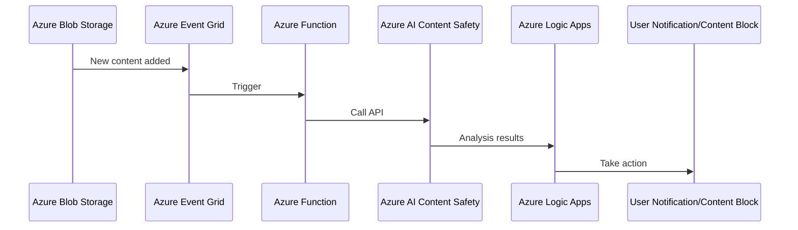

### E-commerce Platforms - AI Content Safety:
[return to Content](#content)

It can be used to review product listings and reviews, ensuring they adhere to platform guidelines and regulations.

> [!IMPORTANT]
> Here’s an example of an end-to-end solution using Azure resources and Azure AI Content Safety: This is a high-level overview and code snippet. You’ll need to fill in the details based on your specific requirements and Azure environment.

> Architecture
> 1. **Azure Blob Storage**: Stores the product listings and reviews data.
> 2. **Azure Function**: Triggered when new data is added to the Blob Storage. It sends the content to Azure AI Content Safety for moderation.
> 3. **Azure AI Content Safety**: Reviews the content and returns a moderation report.
> 4. **Azure Logic Apps**: Receives the moderation report from Azure AI Content Safety and takes appropriate action based on the report (e.g., remove content, notify the user, etc.).
> 
> Steps
> 1. Store the product listings and reviews data in Azure Blob Storage.
> 2. Set up an Azure Function that is triggered when new data is added to the Blob Storage.
> 3. In the Azure Function, send the content to Azure AI Content Safety for moderation.
> 4. Set up Azure Logic Apps to receive the moderation report from Azure AI Content Safety.
> 5. In Azure Logic Apps, define the actions to be taken based on the moderation report.
> 
> Code Snippet
> Here's a code snippet for the Azure Function:
> 
> ```python
> import azure.functions as func
> from azure.ai.contentsafety import ContentSafetyClient
> 
> def main(myblob: func.InputStream):
>     client = ContentSafetyClient("<endpoint>", "<api_key>")
>     response = client.text_moderation(myblob.read().decode())
> 
>     # Send moderation report to Logic Apps
>     # ...
> ```
> Please replace <endpoint> and <api_key> with your Azure AI Content Safety endpoint and API key.

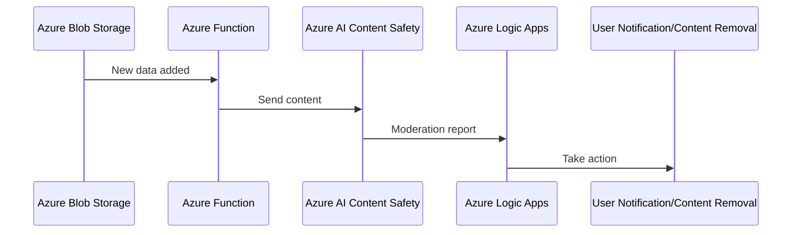

### Education - AI Content Safety:
[return to Content](#content)

In educational institutions, it can be used to monitor and moderate content shared in digital classrooms, forums, and chats.

> [!IMPORTANT]
> Here’s an example of an end-to-end solution using Azure resources and Azure AI Content Safety: Please note that this is a simplified representation. In a real-world application, you would need to handle various edge cases, implement authentication and error handling, and possibly integrate with other services depending on your specific requirements.

> Architecture
> 1. **Azure Communication Services**: This is used to facilitate the digital classrooms, forums, and chats. It provides robust APIs for chat services.
> 2. **Azure AI Content Safety**: This service is used to evaluate the content shared in the classrooms, forums, and chats for any inappropriate or harmful content.
> 3. **Azure Functions**: These are used to create serverless applications that can handle incoming chat messages, send them to the Content Safety API, and take appropriate action based on the response.
> 
> Workflow
> 1. A message is sent in a digital classroom, forum, or chat.
> 2. An Azure Function is triggered by this event, which sends the content of the message to the Azure AI Content Safety API.
> 3. The Content Safety API evaluates the content and returns a response indicating whether the content is safe, unsafe, or requires review.
> 4. The Azure Function processes this response. If the content is safe, it allows the message to be posted. If the content is unsafe, it prevents the message from being posted and notifies the user. If the content requires review, it can be sent to a human moderator for further evaluation.
> 
> Code
> Here's a high-level pseudocode representation of the Azure Function:
> 
> ```python
> def process_message(event):
>     # Extract the message content from the event
>     message_content = event.get_message_content()
> 
>     # Send the content to the Content Safety API
>     response = content_safety_api.evaluate_content(message_content)
> 
>     # Take action based on the response
>     if response.is_safe():
>         event.post_message()
>     elif response.is_unsafe():
>         event.prevent_posting()
>         event.notify_user("Your message was found to be inappropriate.")
>     elif response.requires_review():
>         send_to_moderator(message_content)
> ```

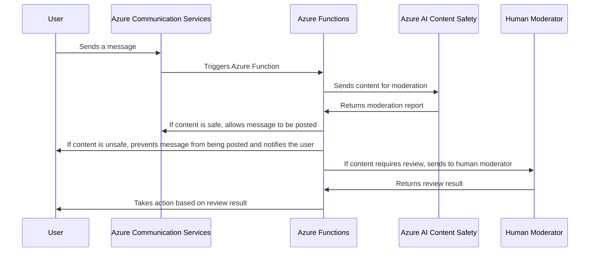

### Gaming - AI Content Safety:
[return to Content](#content)

In the gaming industry, it can be used to monitor in-game chats and user-generated content, helping to create a safe gaming environment.

> [!IMPORTANT]
> Here’s an example of an end-to-end solution using Azure resources and Azure AI Content Safety: Please note that this is a simplified representation. In a real-world application, you would need to handle various edge cases, implement authentication and error handling, and possibly integrate with other services depending on your specific requirements.

> Architecture
> 1. **Azure PlayFab**: This is used to manage user-generated content and in-game chats. It provides robust APIs for multiplayer gaming services.
> 2. **Azure AI Content Safety**: This service is used to evaluate the content shared in the game for any inappropriate or harmful content.
> 3. **Azure Functions**: These are used to create serverless applications that can handle incoming chat messages, send them to the Content Safety API, and take appropriate action based on the response.
> 
> Workflow
> 1. A message is sent in an in-game chat or a piece of user-generated content is created.
> 2. An Azure Function is triggered by this event, which sends the content of the message or user-generated content to the Azure AI Content Safety API.
> 3. The Content Safety API evaluates the content and returns a response indicating whether the content is safe, unsafe, or requires review.
> 4. The Azure Function processes this response. If the content is safe, it allows the message to be posted or the user-generated content to be published. If the content is unsafe, it prevents the message from being posted or the user-generated content from being published and notifies the user. If the content requires review, it can be sent to a human moderator for further evaluation.
> 
> Code
> Here's a high-level pseudocode representation of the Azure Function:
> 
> ```python
> def process_content(event):
>     # Extract the content from the event
>     content = event.get_content()
> 
>     # Send the content to the Content Safety API
>     response = content_safety_api.evaluate_content(content)
> 
>     # Take action based on the response
>     if response.is_safe():
>         event.post_content()
>     elif response.is_unsafe():
>         event.prevent_posting()
>         event.notify_user("Your content was found to be inappropriate.")
>     elif response.requires_review():
>         send_to_moderator(content)
> ````

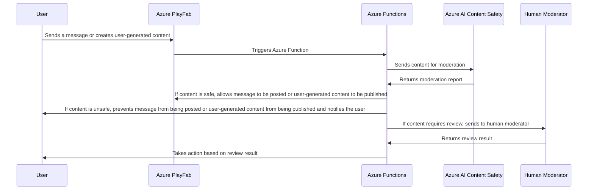

### News and Media - AI Content Safety:
[return to Content](#content)

It can be used to moderate comments and discussions on news articles, ensuring they adhere to community guidelines.

> [!IMPORTANT]
> Here’s an example of an end-to-end solution using Azure resources and Azure AI Content Safety:

> Architecture
> 1. **Azure App Service**: This is used to host the news website where users can read articles and post comments.
> 2. **Azure AI Content Safety**: This service is used to evaluate the comments posted by users for any inappropriate or harmful content.
> 3. **Azure Functions**: These are used to create serverless applications that can handle incoming comments, send them to the Content Safety API, and take appropriate action based on the response.
> 
> Workflow
> 1. A user posts a comment on a news article.
> 2. An Azure Function is triggered by this event, which sends the content of the comment to the Azure AI Content Safety API.
> 3. The Content Safety API evaluates the comment and returns a response indicating whether the comment is safe, unsafe, or requires review.
> 4. The Azure Function processes this response. If the comment is safe, it allows the comment to be posted. If the comment is unsafe, it prevents the comment from being posted and notifies the user. If the comment requires review, it can be sent to a human moderator for further evaluation.
> 
> Code
> Here's a high-level pseudocode representation of the Azure Function:
> 
> ```python
> def process_comment(event):
>     # Extract the comment content from the event
>     comment_content = event.get_comment_content()
> 
>     # Send the content to the Content Safety API
>     response = content_safety_api.evaluate_content(comment_content)
> 
>     # Take action based on the response
>     if response.is_safe():
>         event.post_comment()
>     elif response.is_unsafe():
>         event.prevent_posting()
>         event.notify_user("Your comment was found to be inappropriate.")
>     elif response.requires_review():
>         send_to_moderator(comment_content)
> ```

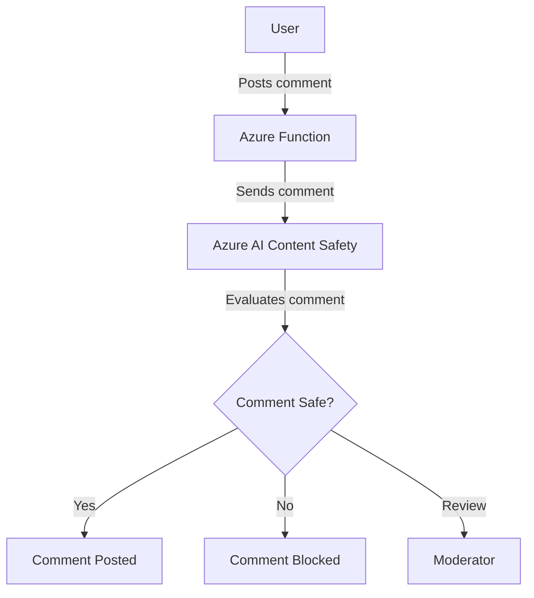

## Bot Services
[return to Content](#content)

> Azure Bot Service is a cloud-based platform provided by Microsoft Azure that enables businesses to build, deploy, and manage AI-powered chatbots[2](https://studioteck.com/azure-bot-service/). These chatbots can interact with users through text or voice and can be integrated into websites, messaging platforms, or mobile apps[2](https://studioteck.com/azure-bot-service/). Azure Bot Service simplifies creating and managing chatbots, making them accessible for businesses with varying technical expertise[2](https://studioteck.com/azure-bot-service/). In addition, Azure Bot Service offers the scalability and performance needed to handle varying workloads[2](https://studioteck.com/azure-bot-service/). Businesses can quickly scale their chatbot infrastructure up or down based on demand, ensuring optimal performance and cost efficiency[2](https://studioteck.com/azure-bot-service/).

Here are some of the key features of the Azure AI Bot Service: 
1. **Integrated Development Environment**: Azure AI Bot Service provided an integrated development environment for bot building. Its integration with Power Virtual Agents, a fully hosted low-code platform, enabled developers of all technical abilities to build conversational AI bots.
2. **Build Bots Quickly**: Users could make, test, and publish bots using a low-code graphical interface. They could also improve their bot applications over time.
3. **Real-Time Notification**: Whenever anomalies were detected, Azure AI Bot Service was able to send real-time notifications through multiple channels using hooks.
4. **Smart Diagnostic Insights**: Azure AI Bot Service combined anomalies detected on the same multi-dimensional metric into a diagnostic tree to help users analyze root cause into specific dimensions.

> [!NOTE]
> Here are some use cases:

### Customer Service - Bot Services:
[return to Content](#content)

- **Automated Support**: Azure Bot Services can be used to create chatbots that provide automated responses to common customer inquiries, reducing the workload on human customer service representatives.

> [!IMPORTANT]
> Here’s an example of an end-to-end solution using Azure resources and Azure Bot Services: Please note that this is a very basic example and a real-world bot would likely be much more complex. You might use the Azure Bot Framework SDK for more advanced features, and you might integrate your bot with a natural language processing (NLP) service like LUIS (Language Understanding Intelligent Service) to better understand user inquiries. You might also integrate your bot with a database to store and retrieve information, and you might use Azure’s QnA Maker service to easily handle frequently asked questions. Finally, you would likely want to add authentication and error handling to your bot.

> Step 1: Create a Bot Service on Azure
> 
> - Navigate to the Azure portal and create a new Bot Service resource.
> - Choose a name, subscription, resource group, and location for your bot.
> - Select the F0 (free) pricing tier for testing purposes.
> 
> Step 2: Configure the Bot Service
> 
> - Once the Bot Service is deployed, go to the resource and navigate to the "Bot Management" section.
> - Click on "Channels" and enable the "Web Chat" channel. This will allow you to embed the bot on a website.
> - Navigate to "Settings" and configure the messaging endpoint, which will be used to handle messages from users.
> 
> Step 3: Develop the Bot
> 
> - You can develop the bot directly in the Azure portal using the online code editor, or you can download the bot's source code and develop it locally.
> - The bot's logic will be implemented in a file called `index.js` (for JavaScript bots) or `echoBot.cs` (for C# bots).
> - Implement the logic to handle common customer inquiries. For example, you could use a switch statement to handle different types of inquiries.
> 
> Here's a simple example of what the bot's logic might look like in JavaScript:
> 
> ```javascript
> module.exports = function(context, req) {
>     context.log('JavaScript HTTP trigger function processed a request.');
> 
>     const inquiry = (req.query.inquiry || (req.body && req.body.inquiry));
>     let response;
> 
>     switch(inquiry) {
>         case 'hours':
>             response = 'Our hours are 9am-5pm, Monday-Friday.';
>             break;
>         case 'location':
>             response = 'We are located at 123 Main St.';
>             break;
>         default:
>             response = 'Sorry, I did not understand your inquiry.';
>     }
> 
>     context.res = {
>         // status: 200, /* Defaults to 200 */
>         body: response
>     };
> }
> ```
> Step 4: Test the Bot
> - After implementing the bot’s logic, you can test the bot directly in the Azure portal using the “Test in Web Chat” feature.
> Step 5: Deploy the Bot
> - If you developed the bot locally, you’ll need to deploy the bot to Azure. You can do this using the Azure CLI or the Azure portal.
> - After deploying the bot, you can embed it on your website using the embed code provided in the “Channels” section of the Bot Service resource.

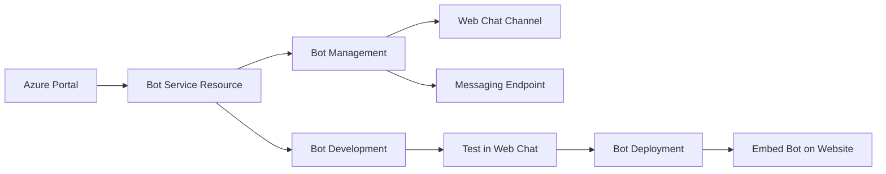

- **Ticket Routing**: Bots can be used to gather initial information and then route the customer to the appropriate department or individual based on their needs.

> [!IMPORTANT]
> Here’s an example of an end-to-end solution using Azure resources and Azure Bot Services: Please note that this is a high-level example and the actual implementation may require additional steps and considerations based on the specific requirements of your use case.

> Architecture
> 
> 1. **Azure Bot Services**: Handles interactions with the user to gather initial information.
> 2. **Language Understanding (LUIS)**: Used to understand the user's intent and extract relevant information.
> 3. **Azure Logic Apps**: Orchestrates the process of routing the ticket based on the information gathered.
> 4. **Azure Functions**: Used to run code that determines the appropriate department or individual for ticket routing.
> 5. **Azure SQL Database**: Stores information about tickets, departments, and individuals for routing purposes.
> 
> Workflow
> 
> 1. The customer interacts with the bot created with Azure Bot Services.
> 2. The bot uses LUIS to understand the customer's intent and extract relevant information.
> 3. This information is passed to an Azure Logic App, which triggers an Azure Function.
> 4. The Azure Function uses the information to determine the appropriate department or individual.
> 5. The Logic App then routes the ticket to the determined department or individual.
> 6. Information about the ticket and its routing is stored in an Azure SQL Database.
> 
> Implementation Steps
> 
> 1. Create a bot using Azure Bot Services and set it up to interact with customers.
> 2. Set up LUIS to understand customer intents and extract information.
> 3. Create an Azure Logic App that is triggered by the bot passing it information.
> 4. Within the Logic App, set up an Azure Function that determines the appropriate department or individual based on the information.
> 5. Set up the Logic App to route the ticket based on the output of the Azure Function.
> 6. Set up an Azure SQL Database to store ticket and routing information.

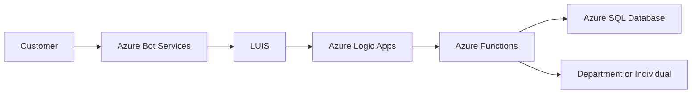

### Sales and Marketing - Bot Services:
[return to Content](#content)

- **Lead Generation**: Bots can engage with potential customers on a website or social media platform, ask qualifying questions, and generate leads for the sales team.

> [!IMPORTANT]
> Here’s an example of an end-to-end solution using Azure resources and Azure Bot Services:

> Architecture
> 
> 1. **Azure Bot Services**: This is the core service that will be used to create, deploy, and manage the bot. The bot will be programmed to ask qualifying questions to potential customers.
> 2. **Azure Cognitive Services (Language Understanding - LUIS)**: This service can be used to enable the bot to understand the intent of the customer's responses to the qualifying questions.
> 3. **Azure Logic Apps**: This service can be used to create workflows that take the qualified leads from the bot and pass them to the sales team.
> 4. **Azure Cosmos DB**: This service can be used to store the leads generated by the bot.
> 
> Steps
> 
> 1. **Create the Bot**: Use the Azure Bot Services to create a new bot. You can use the Bot Framework Composer to design the bot's dialogues and questions.
> 2. **Integrate LUIS**: Integrate the bot with LUIS to enable it to understand the intent of the customer's responses.
> 3. **Create Logic App Workflow**: Create a workflow in Azure Logic Apps that triggers whenever a new lead is generated by the bot. The workflow should take the lead information and pass it to the sales team.
> 4. **Store Leads in Cosmos DB**: Configure the bot to store the generated leads in Azure Cosmos DB.
>

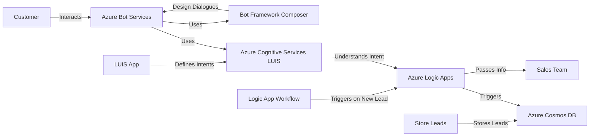

- **Product Recommendations**: Based on customer input, bots can suggest products or services that meet their needs.

> [!IMPORTANT]
> Here’s an example of an end-to-end solution using Azure resources and Azure Bot Services:

> Architecture
> 
> 1. **Azure Bot Service**: Handles the interaction with the user.
> 2. **LUIS (Language Understanding Intelligent Service)**: Processes the user's input to understand their needs.
> 3. **Azure Functions**: Hosts the logic of the bot.
> 4. **Azure Cosmos DB**: Stores the product or service data.
> 
> Steps
> 
> 1. **Set up Azure Bot Service**:
>     - Create a new Bot Channels Registration in the Azure portal.
>     - Enable the channels (like Teams, Web Chat, etc.) where you want your bot to interact with users.
> 
> 2. **Set up LUIS**:
>     - Create a new LUIS app in the LUIS portal.
>     - Define intents that represent the different needs that users might express.
>     - Train and publish your LUIS app.
> 
> 3. **Set up Azure Functions**:
>     - Create a new Function App in the Azure portal.
>     - Add a new function that will be triggered by HTTP requests from your bot.
>     - In this function, use the LUIS SDK to send the user's input to your LUIS app and get the top-scoring intent.
>     - Based on the intent, select relevant products or services from your database.
> 
> 4. **Set up Azure Cosmos DB**:
>     - Create a new Cosmos DB account in the Azure portal.
>     - Add a new database and a container to store your product or service data.
>     - Populate your container with data about your products or services.
> 
> 5. **Connect everything**:
>     - In your bot's code, add the logic to send user input to your Azure function, receive the product or service recommendations, and send them back to the user.
>     - Test your bot in the Azure portal and deploy it to your desired channels.
> 

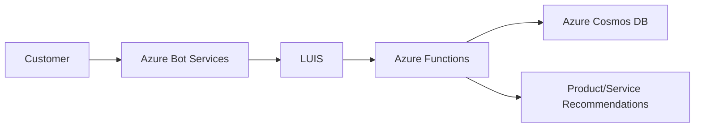

### Human Resources - Bot Services:
[return to Content](#content)

- **Employee Onboarding**: Bots can guide new hires through the onboarding process, answering common questions and providing information about company policies and procedures.
- **Benefits Inquiries**: Bots can provide employees with information about their benefits and direct them to the appropriate resources for further assistance.

> [!IMPORTANT]
> Here’s an example of an end-to-end solution using Azure resources and Azure Bot Services:

> Architecture
> 1. **Azure Bot Services**: The core of the solution, responsible for interacting with the user.
> 2. **LUIS (Language Understanding Intelligent Service)**: To understand the user's natural language input.
> 3. **QnA Maker**: To answer frequently asked questions.
> 4. **Azure Functions**: To handle complex queries and perform actions.
> 5. **Azure Cosmos DB**: To store and retrieve user and onboarding data.
> 
> Steps
> 1. **Create a Bot Service on Azure**: This will be the main interface for the bot.
> 2. **Integrate LUIS with the Bot Service**: Train a LUIS model to understand intents from the user's input.
> 3. **Integrate QnA Maker with the Bot Service**: Populate the QnA Maker with FAQs about the onboarding process.
> 4. **Create Azure Functions**: Write functions to handle complex queries that can't be answered by the QnA Maker.
> 5. **Set up Azure Cosmos DB**: Store user data and onboarding progress.
> 
> Code Snippets: Below are some example code snippets for the Azure Functions and the Bot Service.
> 
> Azure Functions:
> ```csharp
> public static class OnboardingFunction
> {
>     [FunctionName("OnboardingFunction")]
>     public static async Task<IActionResult> Run(
>         [HttpTrigger(AuthorizationLevel.Function, "get", "post", Route = null)] HttpRequest req,
>         ILogger log)
>     {
>         // Your code here
>     }
> }
> ```
> 
> Bot Service: 
> ```csharp
> public class OnboardingBot : ActivityHandler
> {
>     protected override async Task OnMessageActivityAsync(ITurnContext<IMessageActivity> turnContext, CancellationToken cancellationToken)
>     {
>         // Your code here
>     }
> }
> ```

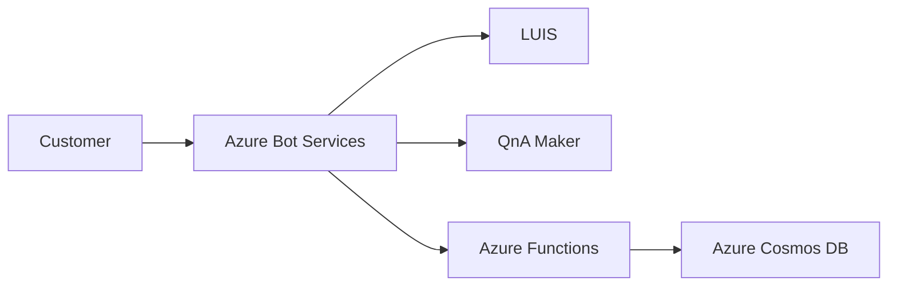

### IT Help Desk - Bot Services:
[return to Content](#content)

- **Troubleshooting**: Bots can assist with common IT issues, such as password resets or software installation, freeing up IT staff for more complex tasks.

> [!IMPORTANT]
> Here’s a high-level example of how you might structure an IT Help Desk bot using Azure Bot Services and other Azure resources. This bot could handle common tasks like password resets and software installation.

> Architecture
> 1. **Azure Bot Services**: Handles user interactions and routes requests to the appropriate services.
> 2. **Azure Active Directory (AAD)**: Manages user identities and handles password reset requests.
> 3. **Azure Logic Apps**: Orchestrates the software installation process.
> 
> Implementation
> - Step 1: Set Up Azure Bot Services: Create a new Bot Resource in the Azure portal. This will be the interface for users to interact with.
> - Step 2: Integrate with Azure Active Directory: Integrate the bot with Azure Active Directory to handle password reset requests. You can use the Microsoft Graph API to interact with AAD.
> - Step 3: Set Up Azure Logic Apps: Create a new Logic App to handle software installation requests. This could involve sending a request to a software management system, or it could involve running a script on the user's machine.
> - Step 4: Implement the Bot Logic: Implement the bot's logic using the Bot Framework SDK. The bot should be able to understand the user's intent (e.g., reset password, install software) and call the appropriate service.

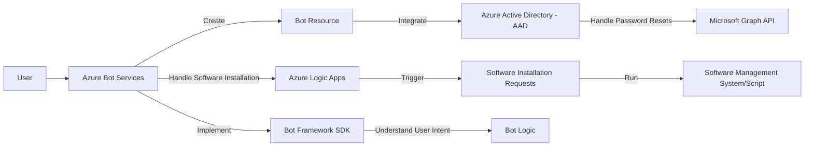

- **Knowledge Base**: Bots can search a knowledge base to provide users with relevant articles or solutions based on their issue.
  
> [!IMPORTANT]
> Here’s an example of an end-to-end solution using Azure resources and Azure Bot Services:

> Architecture
> 1. **User Interaction**: Users interact with the bot through a user interface, which could be a web chat, Teams, or another channel supported by Azure Bot Services.
> 2. **Azure Bot Service**: The bot built with Azure Bot Services receives the user's query and sends it to the QnA Maker service.
> 3. **Azure Cognitive Services (QnA Maker)**: QnA Maker processes the query and returns the most relevant articles or solutions from the knowledge base.
> 4. **Knowledge Base**: The knowledge base is a set of question-and-answer pairs that are added manually, or imported from existing content (like FAQ URLs, product manuals, etc.).
> 
> Implementation Steps
> 1. **Create a QnA Maker resource in Azure**: This will host your knowledge base.
> 2. **Populate the Knowledge Base**: Add question-and-answer pairs to the QnA Maker manually, or by importing from existing content.
> 3. **Create a Bot in Azure Bot Services**: This will be the interface between the users and the knowledge base.
> 4. **Connect the Bot to the QnA Maker**: Use the QnA Maker SDK in your bot's code to connect the bot to the QnA Maker service.
> 5. **Test and Deploy the Bot**: Test the bot in the Azure portal, then deploy it to your desired channels.
> 
> Code Snippets: Here's an example of how you might use the QnA Maker SDK in your bot's code:
> ```csharp
> var qnaMaker = new QnAMaker(new QnAMakerEndpoint
> {
>     KnowledgeBaseId = "<Your-Knowledge-Base-ID>",
>     EndpointKey = "<Your-Endpoint-Key>",
>     Host = "<Your-Host-URL>"
> });
> 
> var options = new QnAMakerOptions { Top = 1 };
> var response = await qnaMaker.GetAnswersAsync(turnContext, options);
> ```
> 
> This code creates a new instance of the QnAMaker class using your knowledge base ID, endpoint key, and host URL. It then sends the user’s query to the QnA Maker service and gets the top answer. Please replace <Your-Knowledge-Base-ID>, <Your-Endpoint-Key>, and <Your-Host-URL> with your actual QnA Maker service details.

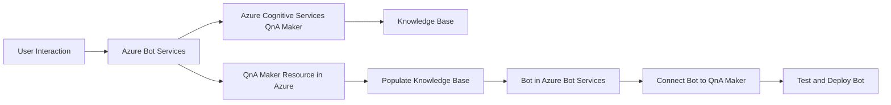

### E-commerce - Bot Services:
[return to Content](#content)

- **Order Tracking**: Bots can provide customers with updates on their order status and estimated delivery times.

> [!IMPORTANT]
> Here’s an example of an end-to-end solution using Azure resources and Azure Bot Services:

>  Architecture
> 1. **Azure Bot Service**: This is the core service that will host the chatbot. It provides the direct line of communication between the users and the bot.
> 2. **LUIS (Language Understanding Intelligent Service)**: This Azure cognitive service is used to understand the user's natural language inputs and convert them into structured data that the bot can process.
> 3. **Azure Functions**: Serverless functions can be used to handle specific events or triggers in the bot's workflow, such as fetching order details from the database.
> 4. **Azure SQL Database**: This is where the order details are stored. The bot fetches data from this database to provide order status and delivery updates.
> 
>  Implementation Steps
> 1. **Create the Bot Service**: Use the Azure portal to create a new Bot Service resource. Choose the SDK v4 and the appropriate language for your bot (e.g., C#, JavaScript).
> 2. **Develop the Bot**: Use the Bot Framework SDK to develop the bot. Implement dialogs for handling different types of user queries, such as "What's the status of my order?" or "When will my order be delivered?".
> 3. **Integrate LUIS**: Train a LUIS app to understand these queries and return structured data. Integrate this LUIS app with your bot to handle natural language processing.
> 4. **Implement Azure Functions**: Write serverless functions that fetch order details from the Azure SQL Database based on the structured data from LUIS.
> 5. **Test the Bot**: Use the Bot Framework Emulator to test the bot locally. Once you're satisfied with its performance, publish it to the Azure Bot Service.
> 6. **Connect Channels**: Finally, connect your bot to various channels like your e-commerce website, Facebook Messenger, etc., through the Azure Bot Service.

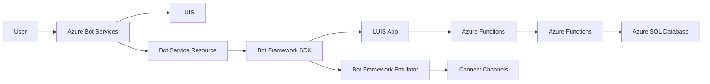

- **Shopping Assistance**: Bots can help customers find products, answer questions about items, and guide them through the checkout process.

> [!IMPORTANT]
> Here’s an example of an end-to-end solution using Azure resources and Azure Bot Services:

> Architecture: The solution leverages several Azure services
> - **Azure Bot Services**: For bot framework and bot connector service.
> - **Azure Cognitive Services (LUIS)**: For natural language understanding.
> - **Azure Cosmos DB**: For storing product information and user shopping data.
> - **Azure Functions**: For serverless compute to process user requests.
> 
> Workflow
> 1. **User Interaction**: The user interacts with the bot through a supported channel (e.g., website, Teams, etc.).
> 2. **Intent Recognition**: The bot uses LUIS to understand the user's intent and entities from the user's message.
> 3. **Process Request**: Depending on the intent, the bot processes the request. This could involve querying Cosmos DB for product information or guiding the user through the checkout process using dialog flows.
> 4. **Respond to User**: The bot sends a response back to the user, providing the requested information or asking for more details if necessary.
> 
> Code
> The actual implementation would involve creating a bot using the Azure Bot Framework SDK, setting up LUIS for intent recognition, and implementing Azure Functions to handle various tasks. Please refer to the Azure Bot Service Documentation and Azure Functions Documentation for detailed guides and tutorials.

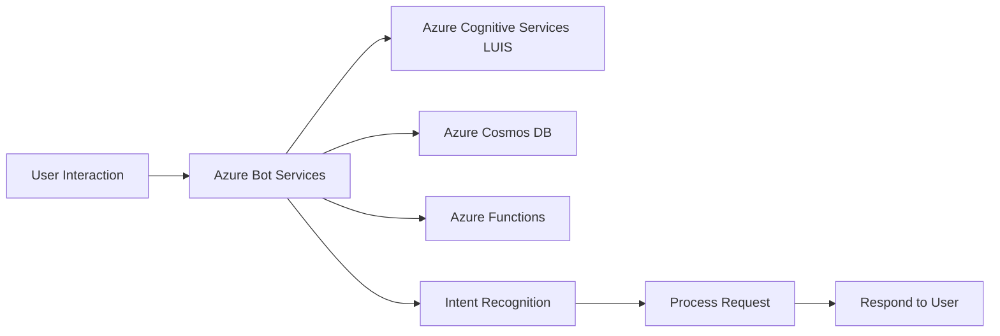

## Computer Vision
[return to Content](#content)

Here are some of the key features of the Azure AI Vision service:
- Optical Character Recognition (OCR): The OCR service extracted text from images. It used deep-learning-based models and worked with text on various surfaces and backgrounds.
- Image Analysis: The Image Analysis service extracted many visual features from images, such as objects, faces, adult content, and auto-generated text descriptions.
- Face: The Face service provided AI algorithms that detected, recognized, and analyzed human faces in images.
-  Video Analysis: Video Analysis included video-related features like Spatial Analysis and Video Retrieval.  

| Azure Computer Vision vs Azure Custom Vision |  Azure Computer Vision  |  Azure Custom Vision | 
| --- | --- | --- |
| Azure Computer Vision and Azure Custom Vision are both services that deal with image analysis, but they serve different purposes and offer different levels of customization. <br/>  <br/> In summary, while Azure Computer Vision provides a wide range of pre-trained models for various tasks, Azure Custom Vision offers more customization but requires your own data for training.| Azure Computer Vision is a pre-trained model that provides several general services: <br/> - **Image Classification**: The API gives a number of tags that classify the image along with a confidence score.<br/> - **Content Moderation**: The API can determine if the image meets certain criteria like being adult or racy content.<br/> - **OCR**: The API can read text within the images, including handwritten text.<br/> - **Facial Recognition**: This API can recognize the faces of celebrities or other well-known people within images.<br/> - **Landmark Recognition**: This API can recognize landmarks within images. | Azure Custom Vision is a service that allows you to build, deploy, and improve your own image classifiers. You can specify your own labels and train custom models to detect them. It primarily supports image classification and object detection. However, unlike Azure Computer Vision, you need to provide your own images for training. |

> [!NOTE]
> Here are some use cases:

### Retail - Computer Vision:
[return to Content](#content)

- **Product Recommendations**: Analyze user's shopping behavior and recommend similar products.
- **Inventory Management**: Identify products on the shelf and track inventory in real time.

### Healthcare - Computer Vision:
[return to Content](#content)

- **Medical Imaging**: Assist radiologists by identifying patterns in X-rays, MRIs, CT scans, etc.
- **Patient Monitoring**: Monitor patient's health condition through visual data.

### Manufacturing - Computer Vision:
[return to Content](#content)

- **Quality Control**: Detect defects in products on the assembly line.
- **Safety Compliance**: Ensure workers are wearing appropriate safety gear.

### Agriculture - Computer Vision:
[return to Content](#content)

- **Crop Health Monitoring**: Identify unhealthy plants or areas needing attention based on drone or satellite imagery.
- **Yield Estimation**: Estimate crop yield based on visual data of the field.

### Transportation - Computer Vision:
[return to Content](#content)

- **Traffic Management**: Analyze traffic patterns and optimize traffic signal timings.
- **Vehicle Identification**: Identify vehicle types, license plates, etc. for toll collection or security purposes.

### Education - Computer Vision:
[return to Content](#content)

- **Virtual Learning**: Enhance virtual learning experiences with visual aids.
- **Accessibility**: Help visually impaired students by describing visual content.

## Custom Vision
[return to Content](#content)

Here are some of the key features of the Azure AI Custom Vision service:
1. **Customization to your scenario**: Users could set their model to perceive a particular object for their use case.
2. **Intuitive model creation**: Users could easily build their image identifier model using the simple interface.
3. **Flexible deployment**: Users could run AI Custom Vision in the cloud or on the edge in containers.
4. **Built-in security**: Users could rely on enterprise-grade security and privacy for their data and any trained models. 

> [!NOTE]
> Here are some use cases:

### Retail - Custom Vision:
[return to Content](#content)

- **Product Identification**: Retailers can use Azure Custom Vision to identify products from images taken by customers. This can be used in a mobile app to allow customers to find similar products.
- **Inventory Management**: Images from store shelves can be analyzed to determine which products are out of stock.

### Healthcare - Custom Vision:
[return to Content](#content)

- **Medical Imaging**: Azure Custom Vision can be trained to identify anomalies or diseases in medical images such as X-rays or MRIs.
- **Patient Monitoring**: In a hospital setting, Azure Custom Vision can be used to monitor patients and alert staff if it detects any unusual activity.

### Manufacturing - Custom Vision:
[return to Content](#content)

- **Quality Control**: Manufacturers can use Azure Custom Vision to inspect products on an assembly line for defects.
- **Safety Compliance**: It can be used to ensure that safety protocols are being followed on the manufacturing floor by analyzing images from CCTV feeds.

### Agriculture - Custom Vision:
[return to Content](#content)

- **Crop Disease Detection**: Farmers can use Azure Custom Vision to analyze drone-captured images of crops to detect diseases early.
- **Animal Monitoring**: It can be used to monitor the health and well-being of livestock by analyzing images or video feeds.

### Transportation - Custom Vision:
[return to Content](#content)

- **Vehicle Identification**: Azure Custom Vision can be used in toll booths or parking lots for automatic number plate recognition.
- **Traffic Management**: It can analyze drone or satellite images to monitor traffic conditions and detect accidents or roadblocks.

## Document intelligences
[return to Content](#content)

Key Features:
- **Text Extraction**: Easily pull data and organize information with prebuilt and custom features.
- **Customized Results**: Get output tailored to your layouts with automatic custom extraction and improve it with human feedback.
- **Flexible Deployment**: Ingest data from the cloud or at the edge and apply to search indexes, business automation workflows, and more.
- **Built-in Security**: Rely on enterprise-grade security and privacy applied to both your data and any trained models.

Capabilities: 
- **Document Analysis**: Detects and extracts text and layout of documents, like tables, check boxes, and objects.
- **Prebuilt Models**: These are pretrained models for common scenarios such as IDs, receipts, and invoices, that extract text, key-value pairs, and line items from documents.
- **Custom Models**: This custom form service lets you train on your own data to learn the structure of your documents in an intelligent way.

Applications: 
- Azure AI Document Intelligence can be used to automate your data processing in applications and workflows, enhance data-driven strategies, and enrich document search capabilities. 

> [!NOTE]
> Here are some use cases:

### Document Classification - Document Intelligence:
[return to Content](#content)

Azure Document Intelligence can be used to automatically classify documents into predefined categories. This can be particularly useful in industries like legal, finance, and healthcare where large volumes of documents need to be categorized.

> [!IMPORTANT]
> Here’s an example of an end-to-end solution using Azure resources and Azure Document Intelligence: Azure Document Intelligence can be used to automatically classify documents into predefined categories. This can be particularly useful in industries like legal, finance, and healthcare where large volumes of documents need to be categorized.

> Prerequisites
> - An Azure account with an active subscription.
> - Azure Document Intelligence resource.
> 
> Steps
> 1. Create a new Azure Document Intelligence resource: 
> - Create a new resource in the Azure portal. You'll need to provide details such as your subscription, resource group, region, and the name of your resource.
> 2. Upload your documents: 
> - Upload the documents you want to classify to an Azure Blob Storage container. Make sure the documents are in a format that Azure Document Intelligence can process (such as .pdf, .docx, .pptx, .xlsx, .jpg, .png, .tiff).
> 3. Configure your classification model: 
> - In the Azure portal, navigate to your Document Intelligence resource. Under "Model Management", create a new classification model. You'll need to specify the categories you want your documents to be classified into.
> 4. Train your model: 
> - Once your model is configured, you can train it using your uploaded documents. The training process involves the model learning from your documents and their associated categories.
> 5. Classify your documents: 
> - After your model is trained, you can use it to classify your documents. The classification process involves the model predicting the category of each document.
> 6. Review your results: 
> - After your documents have been classified, you can review the results in the Azure portal. You'll be able to see the predicted category for each document, along with a confidence score.
> 

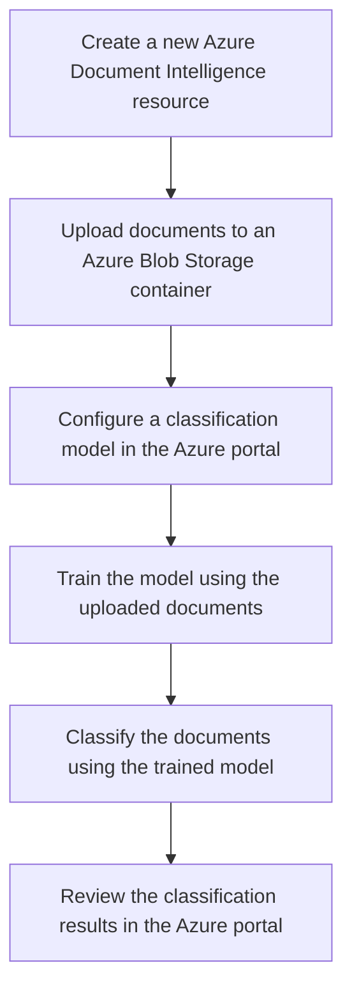


### Information Extraction - Document Intelligence:
[return to Content](#content)

Azure Document Intelligence can extract key information from unstructured documents. This can automate data entry tasks and improve data accuracy.

> [!IMPORTANT]
> Here’s an example of an end-to-end solution using Azure resources and Azure Document Intelligence: Azure Document Intelligence can extract key information from unstructured documents. For example, it can pull out specific details like dates, names, and financial figures from contracts or invoices. This can automate data entry tasks and improve data accuracy.

> Prerequisites
> - An Azure account
> - Azure Document Intelligence resource
> 
> Steps
> 1. Create an Azure Document Intelligence resource: First, you need to create an Azure Document Intelligence resource in the Azure portal.
> 2. Upload the documents: Upload the unstructured documents (like contracts or invoices) to a blob storage in Azure.
> 3. Use Azure Document Intelligence to analyze the documents: Use the Azure Document Intelligence SDK to analyze the documents. You can specify what kind of information you want to extract (like dates, names, and financial figures).
> 
> ```python
> from azure.ai.formrecognizer import FormRecognizerClient
> from azure.core.credentials import AzureKeyCredential
> 
> endpoint = "<your-resource-endpoint>"
> key = "<your-resource-key>"
> 
> form_recognizer_client = FormRecognizerClient(endpoint, AzureKeyCredential(key))
> 
> with open("<your-document-path>", "rb") as fd:
>     form = fd.read()
> 
> poller = form_recognizer_client.begin_recognize_content(form)
> result = poller.result()
> 
> for page in result:
>     for line in page.lines:
>         print(line.text)
> ```
> 
> 4. Process the results: The result will be a structured output of the information extracted from the documents. You can then use this data as needed, for example, to automate data entry tasks.

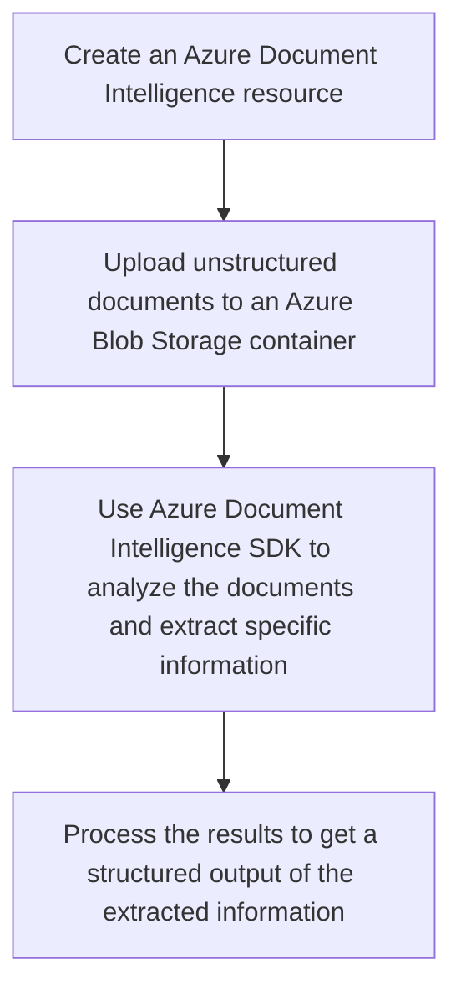

### Content Search - Document Intelligence:
[return to Content](#content)

Azure Document Intelligence can enable full text search across millions of documents. This can help users find specific documents or information within documents quickly and accurately.

> [!IMPORTANT]
> Here’s an example of an end-to-end solution using Azure resources and Azure Document Intelligence:

> Steps
> 1. **Upload Documents to Azure Blob Storage**: First, you need to upload your documents to Azure Blob Storage. This can be done using the Azure portal, Azure Storage Explorer, or programmatically using Azure SDKs.
> 2. **Create an instance of Azure Document Intelligence**: Navigate to the Azure portal and create a new instance of Azure Document Intelligence. You will need to provide necessary details such as subscription, resource group, region, and name.
> 3. **Connect Azure Blob Storage with Azure Document Intelligence**: In the Azure Document Intelligence instance, create a new data source connection. Select Azure Blob Storage and provide the connection string of the Blob Storage where your documents are stored.
> 4. **Create an Indexer**: An indexer is a crawler that extracts searchable data and metadata from the documents in your data source. In the Azure Document Intelligence instance, create a new indexer that targets the data source connection you created.
> 5. **Run the Indexer**: Run the indexer to populate Azure Document Intelligence with searchable data. The time it takes will depend on the number of documents and their complexity.
> 6. **Search the Documents**: Now you can use the search explorer in Azure Document Intelligence to search the documents. You can also integrate the search functionality into your applications using the Azure Search APIs.

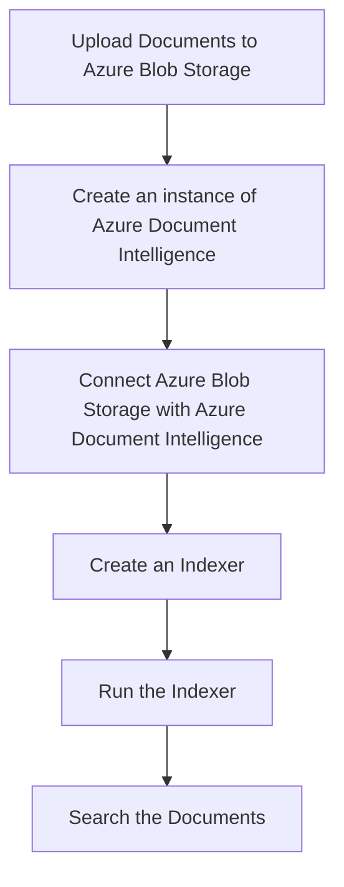

### Compliance and Risk Management - Document Intelligence:
[return to Content](#content)

Azure Document Intelligence can help organizations maintain compliance and manage risk by identifying sensitive information in documents. It can detect and redact information like social security numbers, credit card numbers, and other personally identifiable information (PII).

> [!IMPORTANT]
> Here’s an example of an end-to-end solution using Azure resources and Azure Document Intelligence:

> Architecture
> 1. **Data Storage**: Store your documents in **Azure Blob Storage**. This provides a scalable and secure place for all your files.
> 2. **Document Processing**: Use **Azure Document Intelligence** to process the documents stored in Blob Storage. This service can identify and redact sensitive information.
> 3. **Data Cataloging**: Catalog processed data using **Azure Purview**. This allows you to keep track of what data you have and where it is.
> 4. **Monitoring**: Monitor the health of your services and the processing of your data using **Azure Monitor** and **Log Analytics**.
> 
> Implementation Steps
> 1. **Set up Azure Blob Storage**: Create a new storage account in Azure and upload your documents.
> 2. **Configure Azure Document Intelligence**: Set up a new Document Intelligence resource in Azure. Configure it to redact sensitive information from the documents in your Blob Storage.
> 3. **Catalog Data with Azure Purview**: Set up Azure Purview to catalog your data. This will help you keep track of your data and its lineage.
> 4. **Monitor with Azure Monitor and Log Analytics**: Set up monitoring for your services using Azure Monitor and Log Analytics. This will help you keep track of the health of your services and the processing of your data.
>

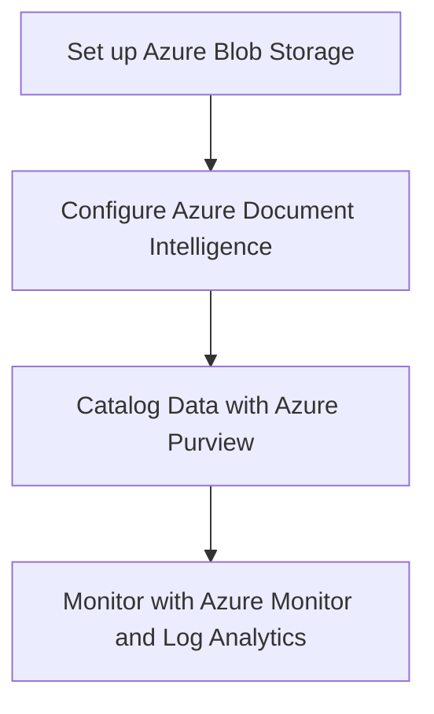

### Customer Service - Document Intelligence:
[return to Content](#content)

Azure Document Intelligence can be used to improve customer service by providing quick and accurate responses to customer inquiries. By analyzing customer emails, chat transcripts, and other documents, it can provide relevant information to customer service representatives or even automate responses.

> [!IMPORTANT]
> Here’s an example of an end-to-end solution using Azure resources and Azure Document Intelligence: This solution aims to improve customer service by providing quick and accurate responses to customer inquiries. By analyzing customer emails, chat transcripts, and other documents, it can provide relevant information to customer service representatives or even automate responses.

> Architecture: The following Azure services are used in this solution
> 1. **Azure Document Intelligence**: To extract, identify, and understand data from customer emails, chat transcripts, and other documents.
> 2. **Azure Logic Apps**: To automate workflows and coordinate with other services.
> 3. **Azure Functions**: To run code snippets in response to triggers.
> 4. **Azure Storage**: To store customer emails, chat transcripts, and other documents.
> 5. **Azure Cognitive Services (Language Understanding)**: To understand customer inquiries and determine the best responses.
> 
> Workflow
> 1. Customer emails and chat transcripts are stored in Azure Storage.
> 2. Azure Logic Apps triggers an Azure Function when a new document is added.
> 3. The Azure Function sends the document to Azure Document Intelligence for analysis.
> 4. Azure Document Intelligence extracts and identifies data from the document.
> 5. The extracted data is sent to Azure Cognitive Services to understand the customer inquiry and determine the best response.
> 6. The response is either sent directly to the customer or provided to a customer service representative for further action.

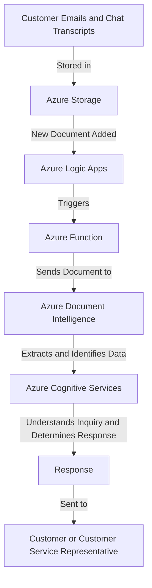

## Face APIs
[return to Content](#content)

Key Features: 
- **Face Detection and Recognition**: The service provides AI algorithms that detect, recognize, and analyze human faces in images.
- **Facial Recognition Software**: This software is important in many different scenarios, such as security, natural user interface, image content analysis and management, mobile apps, and robotics.
- **API Categories**: The Face APIs comprise the following categories: Face Algorithm APIs, DetectLiveness session APIs, FaceList APIs, LargePersonGroup Person APIs, LargePersonGroup APIs, LargeFaceList APIs, PersonGroup Person APIs, PersonGroup APIs, PersonDirectory Person APIs, PersonDirectory DynamicPersonGroup APIs, Liveness Session APIs and Liveness-With-Verify Session APIs.

> [!NOTE]
> Here are some use cases:
### Facial Recognition for Security Systems - Face APIs:
[return to Content](#content)

Azure Face API can be used to build security systems that use facial recognition. The API can detect, recognize, and analyze human faces in images. This can be used to authenticate users based on their facial features.

> [!IMPORTANT]
> Here’s an example of an end-to-end solution using Azure resources and Azure Face APIs: This solution uses Azure Face API for facial recognition and Azure Document Intelligence for document processing. The system can detect, recognize, and analyze human faces in images for user authentication.

> Architecture
> 1. **User Interface (UI)**: A web or mobile application where users can upload their face images and documents.
> 2. **Azure Blob Storage**: Stores the uploaded images and documents.
> 3. **Azure Function**: Triggered when new data is uploaded to Blob Storage. It calls the Face API and Document Intelligence API.
> 4. **Azure Face API**: Used to detect and recognize faces in the uploaded images.
> 5. **Azure Document Intelligence**: Used to process and analyze the uploaded documents.
> 6. **Azure SQL Database**: Stores the processed results from Face API and Document Intelligence.
> 
> Implementation Steps
> 1. **Set up Azure Services**: Create and configure the Azure Blob Storage, Azure Function, Azure Face API, Azure Document Intelligence, and Azure SQL Database.
> 2. **Develop the User Interface**: Implement a web or mobile application where users can upload their face images and documents. The application should upload these files to the Azure Blob Storage.
> 3. **Implement Azure Function**: Develop an Azure Function that is triggered when new data is uploaded to Blob Storage. This function should call the Face API with the image data and the Document Intelligence API with the document data.
> 4. **Process with Face API**: The Face API will detect and recognize faces in the uploaded images. The results are then stored in the Azure SQL Database.
> 5. **Process with Document Intelligence**: The Document Intelligence API will process and analyze the uploaded documents. The results are then stored in the Azure SQL Database.
> 6. **User Authentication**: Implement a user authentication mechanism in the application. This can use the facial recognition data from the Face API and the document data from Document Intelligence to authenticate users.

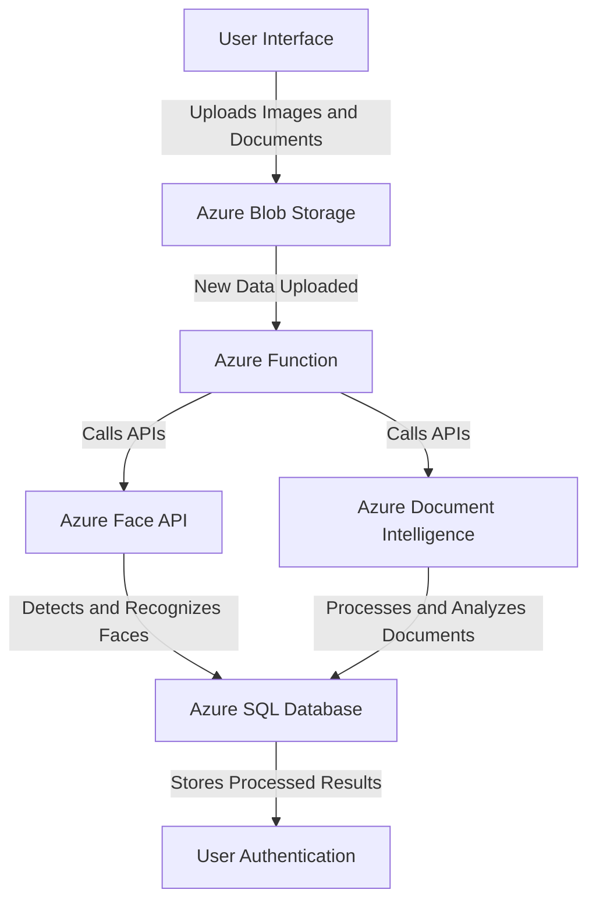

### Personalized User Experience - Face APIs:
[return to Content](#content)

Azure Face API can be used to create personalized user experiences in applications. For example, a digital billboard can change its content based on the age, gender, or emotion of the person looking at it.

> [!IMPORTANT]
> Here’s an example of an end-to-end solution using Azure resources and Azure Face APIs: This solution uses the Azure Face API to detect and analyze faces in real-time. The data gathered (age, gender, emotion) is then used to personalize the content displayed on a digital billboard.

> Architecture
> 
> 1. **Azure Face API**: This service detects human faces in an image and returns face locations, face landmarks, and optional attributes including age, gender, and emotion.
> 2. **Azure Function**: This serverless function is triggered by the Face API's output. It processes the data and decides what content to display based on the detected attributes.
> 3. **Azure Digital Twins**: This IoT service helps model the relationships and interactions between people, places, and devices. In this case, it models the digital billboard and updates its state based on the data received from the Azure Function.
> 
> Implementation Steps
> 1. **Set up the Face API**: Create a Face API instance in the Azure portal. You'll need to configure it with your specific requirements, such as enabling detection of age, gender, and emotion.
> 2. **Create an Azure Function**: This function will take the output from the Face API, process it, and decide what content to display. You'll need to write code that can interpret the Face API's output and make decisions based on it.
> 3. **Model the Digital Billboard in Azure Digital Twins**: Create a Digital Twin for your billboard. This will allow you to easily update the billboard's state based on the data from the Azure Function.
> 4. **Connect the services**: Finally, you'll need to connect these services together. The Face API should trigger the Azure Function whenever it detects a face, and the Azure Function should update the Digital Twin whenever it decides to change the content.
> 

```mermaid
graph TD
    A[Face API Setup] --> B[Azure Face API]
    C[Azure Function Setup] --> D[Azure Function]
    E[Digital Billboard Modeling] --> F[Azure Digital Twins]
    B -->|Detects and Analyzes Faces| D
    D -->|Processes Data and Decides Content| F
    F -->|Updates Billboard State| G[Digital Billboard]
```

### People Counting - Face APIs:
[return to Content](#content)

Azure Face API can be used to count the number of people in a room or area by analyzing the video feed from a camera. This can be useful in scenarios like crowd management or occupancy monitoring in smart buildings.

> [!IMPORTANT]
> Here’s an example of an end-to-end solution using Azure resources and Azure Face APIs: This solution uses the Azure Face API to count the number of people in a room or area by analyzing the video feed from a camera. This can be useful in scenarios like crowd management or occupancy monitoring in smart buildings.

> Architecture
> 
> 1. **Camera**: A camera is set up in the room or area. The video feed from the camera is sent to an Azure IoT Hub.
> 2. **Azure IoT Hub**: The IoT Hub receives the video feed and forwards it to an Azure Stream Analytics job.
> 3. **Azure Stream Analytics**: The Stream Analytics job processes the video feed in real-time and sends frames to the Azure Face API for analysis.
> 4. **Azure Face API**: The Face API analyzes the frames, detects faces, and returns the count of detected faces.
> 5. **Azure Function**: An Azure Function is triggered by the output of the Face API, processes the face count, and sends it to an Azure SignalR Service.
> 6. **Azure SignalR Service**: The SignalR Service broadcasts the face count to connected clients in real-time.
> 
> Code: This is a high-level solution and the actual implementation will depend on the specific requirements of your project. Here is a pseudo-code example of how the Azure Function might look:
> 
> ```python
> import os
> from azure.cognitiveservices.vision.face import FaceClient
> from msrest.authentication import CognitiveServicesCredentials
> 
> # Set up the FaceClient
> face_client = FaceClient(os.environ['FACE_ENDPOINT'], CognitiveServicesCredentials(os.environ['FACE_KEY']))
> 
> def process_frame(frame):
>     # Use the Face API to detect faces in the frame
>     face_ids = [face.face_id for face in face_client.face.detect_with_stream(frame)]
>     
>     # Return the count of detected faces
>     return len(face_ids)
> ```
> 
> Next Steps: To implement this solution, you would need to.
> 
> 1. Set up the camera and connect it to the Azure IoT Hub.
> 2. Create the Azure Stream Analytics job and configure it to send frames to the Face API.
> 3. Implement the Azure Function to process the face count and send it to the SignalR Service.
> 4. Connect your clients to the SignalR Service to receive the face count in real-time.

```mermaid
graph TD
    A[Camera] -->|Video Feed| B[Azure IoT Hub]
    B -->|Forwards Video Feed| C[Azure Stream Analytics]
    C -->|Sends Frames to| D[Azure Face API]
    D -->|Analyzes Frames, Detects Faces| E[Azure Function]
    E -->|Processes Face Count| F[Azure SignalR Service]
    F -->|Broadcasts Face Count| G[Connected Clients]
```

### Emotion Analysis for Market Research - Face APIs:
[return to Content](#content)

Azure Face API can analyze emotions expressed by people's faces. This can be used in market research to understand how customers react to a product or advertisement.

> [!IMPORTANT]
> Here’s an example of an end-to-end solution using Azure resources and Azure Face APIs: how you might use Azure Face API for emotion analysis in market research. This example is written in Python and uses the azure-cognitiveservices-vision-face package.

> Prerequisites
> 
> - An Azure account
> - A Cognitive Services resource created in the Azure portal
> - Python 3.6+ and pip (which comes with Python)
> - The azure-cognitiveservices-vision-face package, which you can install with pip:
> 
> ```bash
> pip install --upgrade azure-cognitiveservices-vision-face
> ```
> 
> Code: First, import the necessary modules and set up your Face API client
> 
> ```python
> from azure.cognitiveservices.vision.face import FaceClient
> from msrest.authentication import CognitiveServicesCredentials
> 
> # Replace with your own subscription key and endpoint
> SUBSCRIPTION_KEY = "your_subscription_key"
> ENDPOINT = "your_endpoint"
> 
> # Create an authenticated FaceClient.
> face_client = FaceClient(ENDPOINT, CognitiveServicesCredentials(SUBSCRIPTION_KEY))
> 
> # Next, detect faces in an image and analyze their emotions:
> # Replace with the URL of an image that you want to analyze.
> IMAGE_URL = "https://example.com/image.jpg"
> 
> # Detect faces in the image
> detected_faces = face_client.face.detect_with_url(IMAGE_URL, return_face_attributes=['emotion'])
> 
> # Print the emotions detected in each face
> for face in detected_faces:
>     print(face.face_attributes.emotion)
> ```
> 
> This will output the emotions detected in each face, such as happiness, sadness, surprise, and so on. You can use this information to understand how customers react to a product or advertisement. Please replace `"your_subscription_key"` and `"your_endpoint"` with your actual subscription key and endpoint. Also, replace `"https://example.com/image.jpg"` with the URL of the image you want to analyze. Remember to handle exceptions in your code. You can find more details in the Azure Face API documentation.
> 

```mermaid
graph TB
    A[Azure Account] --> B[Cognitive Services Resource]
    B --> C[Python 3.6+ and pip]
    C --> D[azure-cognitiveservices-vision-face package]
    D --> E[Face API Client Setup]
    E --> F[Detect faces in an image]
    F --> G[Analyze emotions]
    G --> H[Output emotions]
```

### Identity Verification - Face APIs:
[return to Content](#content)

Azure Face API can be used for identity verification in applications. For example, it can be used to verify a person's identity during a remote exam or online banking transaction.

> [!IMPORTANT]
> Here’s an example of an end-to-end solution using Azure resources and Azure Face APIs: how you might use Azure Face API for identity verification in a remote exam or online banking transaction. This example is written in Python.

> Prerequisites: 
> - An Azure account
> - A resource group in Azure
> - A Face resource in the resource group
> 
> Steps
> 1. **Install the Azure Face API Python SDK**:
> 
> ```python
> pip install azure-cognitiveservices-vision-face
> ```
> 
> 2. Import the necessary modules and create a FaceClient instance:
> ```python 
> from azure.cognitiveservices.vision.face import FaceClient
> from msrest.authentication import CognitiveServicesCredentials
> 
> # Replace with your Face resource's endpoint and key
> face_client = FaceClient('<your-face-resource-endpoint>', CognitiveServicesCredentials('<your-face-resource-key>'))
> ```
> 
> 3. Detect faces in an image:
> ```python 
> # Replace with the URL of an image or a path to a local image file
> image_url = '<image-url-or-path>'
> 
> detected_faces = face_client.face.detect_with_url(image_url) if image_url.startswith('http') else face_client.face.detect_with_stream(open(image_url, 'r+b'))
> 
> if not detected_faces:
>     raise Exception('No face detected in image')
> 
> # Assume the first face is the one we're interested in
> face_id = detected_faces[0].face_id
> ```
> 
> 4. Verify the face against a person in a PersonGroup or LargePersonGroup:
> ```python 
> # Replace with the ID of a PersonGroup or LargePersonGroup and a person in the group
> person_group_id = '<person-group-id>'
> person_id = '<person-id>'
> 
> verify_result = face_client.face.verify_face_to_person(face_id, person_id, person_group_id)
> 
> if verify_result.is_identical:
>     print('The face in the image is verified to be the same as the one in the group')
> else:
>     print('The face in the image is not the same as the one in the group')
> ```
> 
> Please replace `<your-face-resource-endpoint>`, `<your-face-resource-key>`, `<image-url-or-path>`, `<person-group-id>`, and `<person-id>` with your actual values. Also, please note that this is a simplified example and might need to be adjusted based on your specific use case. For more information, you can refer to the Azure Face API documentation.
> 

```mermaid
graph TB
    A[Azure Account] --> B[Resource Group in Azure]
    B --> C[Face Resource in the Resource Group]
    C --> D[Install Azure Face API Python SDK]
    D --> E[Create a FaceClient instance]
    E --> F[Detect faces in an image]
    F --> G[Verify the face against a person in a PersonGroup or LargePersonGroup]
    G --> H[Output verification result]
```

## Immersive readers
[return to Content](#content)

Key Features: 
- **Reading and Comprehension**: The service provides AI algorithms that help users of any age and reading ability with reader tools and features like reading aloud, translating languages, and focusing attention through highlighting and other design elements.
- **Translation**: Translation is available in more than 100 languages.
-  **Accessibility**: Immersive Reader is designed to make reading easier and more accessible for everyone. It can isolate content for improved readability, display pictures for common words, highlight parts of speech, read content aloud, translate content in real-time, and split words into syllables.
-  **Data Privacy**: Immersive reader doesn't store any customer data. 

> [!NOTE]
> Here are some use cases:

### Enhancing Reading Comprehension - Immersive readers:
[return to Content](#content)

Azure Immersive Reader can be used to enhance reading comprehension for users. It provides features like Read Aloud, Line Focus, and Picture Dictionary that can help users, especially those with learning difficulties, to better understand the content.

> [!IMPORTANT]
> Here’s an example of an end-to-end solution using Azure resources and Azure Immersive readers: Azure Immersive Reader is a tool that can be used to enhance reading comprehension for users. It provides features like Read Aloud, Line Focus, and Picture Dictionary that can help users, especially those with learning difficulties, to better understand the content.

> Prerequisites
> 
> - An Azure account
> - An Immersive Reader resource in Azure
> 
> Steps
> 1. **Set up the Immersive Reader SDK**: The Immersive Reader SDK is available as a JavaScript package that can be included in your web application.
> 
>     ```html
>     <script src="https://contentstorage.onenote.office.net/onenoteltir/immersivereadersdk/immersive-reader-sdk.0.0.1.js"></script>
>     ```
> 
> 2. **Obtain an Access Token**: You'll need to set up a server-side component to obtain an access token from your Immersive Reader resource. This token is used to authenticate your application with the Immersive Reader.
> 
>     ```javascript
>     var options = {
>         method: 'POST',
>         url: '<Your Azure Function URL>',
>         headers: {
>             'content-type': 'application/x-www-form-urlencoded'
>         },
>         form: {
>             subdomain: '<Your Immersive Reader resource subdomain>',
>             secret: '<Your Immersive Reader resource secret>'
>         }
>     };
> 
>     request(options, function (error, response, body) {
>         if (error) throw new Error(error);
>         console.log(body);
>     });
>     ```
> 
> 3. **Launch the Immersive Reader**: Once you have an access token, you can launch the Immersive Reader to enhance the reading comprehension of your content.
> 
>     ```javascript
>     ImmersiveReader.launchAsync(token, subdomain, content, options)
>         .catch(function (error) {
>             console.log('Error on launch:', error);
>         });
>     ```
> 
>     Where `content` is a JavaScript object that represents the content you want to enhance, and `options` is an optional JavaScript object that can be used to customize the behavior of the Immersive Reader.
> 
> By integrating Azure Immersive Reader into your application, you can provide a more accessible and inclusive reading experience for your users.
> 

```mermaid
graph TD
    A[Azure Account] --> B[Immersive Reader Resource in Azure]
    B --> C[Set up Immersive Reader SDK]
    C --> D[Obtain Access Token]
    D --> E[Launch the Immersive Reader]
    E --> F[Enhanced Reading Experience]
```

### Multilingual Support - Immersive readers:
[return to Content](#content)

Azure Immersive Reader supports text translation in over 70 languages. This can be used in applications that have a diverse user base, allowing users to translate and understand content in their preferred language.

> [!IMPORTANT]
> Here’s an example of an end-to-end solution using Azure resources and Azure Immersive readers: 

> Prerequisites
> 
> - An Azure account with an active subscription.
> - An Immersive Reader resource under Azure Cognitive Services.
> 
> Setup: First, install the `@azure/cognitiveservices-immersive-reader` package
> 
> ```bash
> npm install @azure/cognitiveservices-immersive-reader
> ```
> 
> Usage: Here’s a basic example of how to use the Immersive Reader SDK
> 
> ```javascript
> const { ImmersiveReaderClient } = require('@azure/cognitiveservices-immersive-reader');
> 
> // Replace with your Immersive Reader resource information
> const immersiveReaderEndpoint = '<Your Immersive Reader Endpoint>';
> const immersiveReaderKey = '<Your Immersive Reader Key>';
> 
> const client = new ImmersiveReaderClient(immersiveReaderKey, immersiveReaderEndpoint);
> 
> const content = {
>     title: 'Hello, world!',
>     chunks: [{
>         content: 'Welcome to our application. We support over 70 languages.',
>         mimeType: 'text/plain'
>     }]
> };
> 
> client.launchAsync(content)
>     .then(() => console.log('Immersive Reader launched!'))
>     .catch(err => console.error(err));
> 
> ```
> 
> This will launch the Immersive Reader with the provided content. Users can then use the built-in tools to translate the text into their preferred language. Please replace `<Your Immersive Reader Endpoint>` and `<Your Immersive Reader Key>` with your actual Immersive Reader resource information. You can find these in the Azure portal, under the 'Keys and Endpoint' section of your Immersive Reader resource.

```mermaid
graph TD
    A[Azure Account with Active Subscription] --> B[Immersive Reader Resource in Azure Cognitive Services]
    B --> C[Install @azure/cognitiveservices-immersive-reader package]
    C --> D[Initialize ImmersiveReaderClient with Endpoint and Key]
    D --> E[Define Content to be Enhanced]
    E --> F[Launch Immersive Reader with Content]
    F --> G[Translate Text into Preferred Language]
    G --> H[Enhanced Understanding of Content]
```

### Accessibility - Immersive readers:
[return to Content](#content)

Azure Immersive Reader improves the accessibility of applications by providing features that make content more accessible to people with disabilities. For example, it can increase text spacing, break words into syllables, and highlight parts of speech to make text easier to read.

> [!IMPORTANT]
> Here’s an example of an end-to-end solution using Azure resources and Azure Immersive readers: 

> Prerequisites:
> - An Azure account with an active subscription.
> - An Immersive Reader resource under Azure Cognitive Services.
> 
> Steps:
> 1. **Install the SDK**
> 
>     You can install the Azure Cognitive Services Immersive Reader SDK using npm:
> 
>     ```bash
>     npm install @microsoft/immersive-reader-sdk
>     ```
> 
> 2. **Initialize the SDK**
> 
>     In your JavaScript file, import the SDK and initialize it with your Immersive Reader resource details:
> 
>     ```javascript
>     import * as immersiveReader from '@microsoft/immersive-reader-sdk';
> 
>     const tenantId = '<Your_Tenant_Id>';
>     const clientId = '<Your_Client_Id>';
>     const clientSecret = '<Your_Client_Secret>';
>     const subdomain = '<Your_Resource_Subdomain>'; // Do not include standard domain (cognitiveservices.azure.com)
>     ```
> 
> 3. **Launch the Immersive Reader**
> 
>     You can now launch the Immersive Reader. In this example, we'll increase text spacing, break words into syllables, and highlight parts of speech:
> 
>     ```javascript
>     const content = {
>         title: 'Sample Text',
>         chunks: [{
>             content: 'This is a sample text for the Azure Immersive Reader.'
>         }]
>     };
> 
>     const options = {
>         uiZIndex: 1000,
>         timeout: 15000,
>         customizations: {
>             textSize: 200,
>             textSpacing: 200,
>             partsOfSpeech: {
>                 verbs: { color: 'blue', highlight: 'underline' },
>                 nouns: { color: 'green', highlight: 'underline' }
>             }
>         }
>     };
> 
>     immersiveReader.launchAsync(tenantId, clientId, clientSecret, subdomain, content, options)
>         .catch((error) => {
>             console.log('Error launching Immersive Reader:', error);
>         });
>     ```
> 
> Please replace <Your_Tenant_Id>, <Your_Client_Id>, <Your_Client_Secret>, and <Your_Resource_Subdomain> with your actual Azure Immersive Reader resource details. This code will launch the Azure Immersive Reader with the specified customizations when run.

```mermaid
graph TB
    A[Azure Account with Active Subscription] -->|Prerequisite| B[Immersive Reader Resource in Azure Cognitive Services]
    B -->|Step 1| C[Install @microsoft/immersive-reader-sdk package]
    C -->|Step 2| D[Initialize ImmersiveReader with Tenant Id, Client Id, Client Secret, and Subdomain]
    D -->|Step 3| E[Define Content and Customizations]
    E -->|Step 4| F[Launch Immersive Reader with Content and Customizations]
    F -->|Result| G[Increased Text Spacing, Syllable Breakdown, and Highlighted Parts of Speech]
    G -->|Outcome| H[Improved Accessibility of Application]
```

### Education - Immersive readers:
[return to Content](#content)

In the education sector, Azure Immersive Reader can be used to create more inclusive classrooms. It can help students with dyslexia, ADHD, emerging readers, and non-native speakers to improve their reading skills.

> [!IMPORTANT]
> Here’s an example of an end-to-end solution using Azure resources and Azure Immersive readers:

> Solution Architecture: The following Azure resources will be used in this solution
> 1. **Azure Immersive Reader**: This is the core service that will be used to improve reading skills of students.
> 2. **Azure App Service**: This will host the web application where students will interact with the content.
> 3. **Azure Cognitive Services**: These services will be used to further enhance the learning experience, such as text analytics for understanding the content better.
> 
> Implementation Steps
> 1. **Set up Azure Immersive Reader**
>    - Create an Azure resource for Immersive Reader.
>    - Obtain the necessary keys and endpoints.
> 2. **Develop the Web Application**
>    - Develop a web application using your preferred language and framework.
>    - Integrate the Azure Immersive Reader into the web application using the SDK.
> 3. **Deploy the Web Application on Azure App Service**
>    - Create an Azure App Service Plan and a Web App.
>    - Deploy the web application to the Azure Web App.
> 4. **Integrate Azure Cognitive Services (Optional)**
>    - Depending on the requirements, integrate relevant Azure Cognitive Services to enhance the learning experience.
> 

 ```mermaid
graph TD
    A[Azure Immersive Reader]
    B[Azure App Service]
    C[Azure Cognitive Services]
    D[Web Application]
    E[Azure App Service Plan and Web App]
    F[Azure Cognitive Services Integration - Optional]
    A -->|1. Set up| D
    D -->|2. Develop| E
    E -->|3. Deploy| B
    B -->|4. Host| D
    C -->|5. Enhance - Optional| D
```

## Azure OpenAI
[return to Content](#content)

Key Features: 
- **Advanced AI Models**: The service provides access to advanced AI models for conversational, content creation, and data grounding use cases.
- **Fine-tuning**: You can fine-tune the models, apply generative AI, and integrate with other Azure AI services.
- **Models Available**: The models available through Azure OpenAI Service include GPT-4, GPT-3.5-Turbo, and Embeddings.
-  **Security and Compliance**: Azure OpenAI Service offers the security and enterprise promise of Azure.

> [!NOTE]
> Here are some use cases:

### Text Generation - Azure OpenAI:
[return to Content](#content)

Azure OpenAI can be used to generate human-like text. This can be useful in a variety of applications such as drafting emails, writing articles, creating engaging chatbots, and more.

> [!IMPORTANT]
> Here’s an example of an end-to-end solution using Azure resources and Azure OpenAI: Azure OpenAI provides access to powerful models like GPT-3 for generating human-like text. This can be used in a variety of applications such as drafting emails, writing articles, creating engaging chatbots, and more.

> Prerequisites
> - An Azure account
> - An instance of the OpenAI service on Azure
> 
> Setup: First, install the OpenAI Python client with pip:
> 
> ```bash
> pip install openai
> ```
> 
> Usage: You can generate text using the openai.ChatCompletion.create() method. Here’s an example.
> ```python 
> import openai
> 
> openai.api_key = 'your-api-key'
> 
> response = openai.ChatCompletion.create(
>   model="gpt-3.5-turbo",
>   messages=[
>         {"role": "system", "content": "You are a helpful assistant."},
>         {"role": "user", "content": "Who won the world series in 2020?"},
>     ]
> )
> 
> print(response['choices'][0]['message']['content'])
> ```
> 
> In this example, the system message is used to set the behavior of the assistant, and the user message is what you want the model to respond to. Replace 'your-api-key' with your actual OpenAI API key.
> 

```mermaid
graph TB
    A[Azure OpenAI]
    B[Applications]
    C[Prerequisites]
    D[Setup]
    E[Usage]
    F[Example]
    G[End-to-End Solution]
    H[Models like GPT-3]
    I[Generate Human-like Text]
    J[Drafting Emails]
    K[Writing Articles]
    L[Creating Engaging Chatbots]
    M[An Azure Account]
    N[An Instance of OpenAI Service on Azure]
    O[Install OpenAI Python Client with pip]
    P[Generate Text Using openai.ChatCompletion.create Method]
    Q[System Message]
    R[User Message]
    A --> G
    G --> H
    H --> I
    I --> B
    B --> J
    B --> K
    B --> L
    A --> C
    C --> M
    C --> N
    A --> D
    D --> O
    A --> E
    E --> P
    P --> F
    F --> Q
    F --> R
```

### Sentiment Analysis - Azure OpenAI:
[return to Content](#content)

Azure OpenAI can analyze the sentiment of a piece of text. This can be used in social media monitoring, customer feedback analysis, and understanding customer behavior.

> [!IMPORTANT]
> Here’s an example of an end-to-end solution using Azure resources and Azure OpenAI:

> Prerequisites
> 
> - An Azure account
> - Azure Text Analytics API resource
> - Azure Functions resource
> 
> Steps
> 1. Create a Text Analytics Resource
> - In the Azure portal, create a new Text Analytics resource. After creation, note down the `key1` and `endpoint` from the resource's 'Keys and Endpoint' tab.
> 2. Create an Azure Function
> - Create a new Azure Function App in the portal. You can use an HTTP trigger for this function.
> 3. Write the Function Code
> - In your function code, you'll need to call the Text Analytics API to perform sentiment analysis. Here's an example in JavaScript:
> 
> ```javascript
> const axios = require('axios');
> 
> module.exports = async function (context, req) {
>     const textToAnalyze = req.body.text;
> 
>     const sentimentAnalysisUrl = `${process.env.TEXT_ANALYTICS_ENDPOINT}/text/analytics/v3.1-preview.5/sentiment`;
>     const sentimentAnalysisResponse = await axios.post(sentimentAnalysisUrl, {
>         documents: [
>             { id: '1', text: textToAnalyze }
>         ]
>     }, {
>         headers: {
>             'Ocp-Apim-Subscription-Key': process.env.TEXT_ANALYTICS_KEY
>         }
>     });
> 
>     const sentiment = sentimentAnalysisResponse.data.documents[0].sentiment;
> 
>     context.res = {
>         body: { sentiment }
>     };
> };
> ```
> 
> This function takes in a piece of text as input, sends it to the Text Analytics API for sentiment analysis, and returns the sentiment of the text.
> 
> 4. Configure Application Settings
> - In your function app settings, add two new application settings: TEXT_ANALYTICS_KEY and TEXT_ANALYTICS_ENDPOINT. Set their values to the key1 and endpoint of your Text Analytics resource, respectively.
> 5. Test the Function
> - You can now test your function by sending a POST request to the function’s URL with a JSON body containing the text to analyze. The function should return the sentiment of the text.

```mermaid
graph TB
    A[Azure OpenAI]
    B[Applications]
    C[Prerequisites]
    D[Steps]
    E[Example]
    F[End-to-End Solution]
    G[Analyze Sentiment of Text]
    H[Social Media Monitoring]
    I[Customer Feedback Analysis]
    J[Understanding Customer Behavior]
    K[An Azure Account]
    L[Azure Text Analytics API Resource]
    M[Azure Functions Resource]
    N[Create a Text Analytics Resource]
    O[Create an Azure Function]
    P[Write the Function Code]
    Q[Configure Application Settings]
    R[Test the Function]
    A --> F
    F --> G
    G --> B
    B --> H
    B --> I
    B --> J
    A --> C
    C --> K
    C --> L
    C --> M
    A --> D
    D --> N
    D --> O
    D --> P
    D --> Q
    D --> R
    P --> E
```

### Language Translation - Azure OpenAI:
[return to Content](#content)

Azure OpenAI can translate text from one language to another. This can be used in applications such as real-time translation services, multilingual content generation, and more.

> [!IMPORTANT]
> Here’s an example of an end-to-end solution using Azure resources and Azure OpenAI:

> Steps:
> - Create an instance of the Azure Translator Text API: This service provides real-time translation between multiple languages.
> - Create an Azure Function: This will act as the interface between your application and the Translator Text API. The function will receive text and a target language as input, and return the translated text as output.
> - Integrate the Azure Function into your application: Your application will send requests to the Azure Function whenever it needs to translate text.
> Here’s a simple example of what the Azure Function code might look like in Node.js:
> 
> ```javascript
> const axios = require('axios');
> 
> module.exports = async function (context, req) {
>     context.log('JavaScript HTTP trigger function processed a request.');
> 
>     const textToTranslate = req.query.text || (req.body && req.body.text);
>     const targetLanguage = req.query.to || (req.body && req.body.to);
> 
>     if (textToTranslate && targetLanguage) {
>         const subscriptionKey = process.env['TRANSLATOR_TEXT_SUBSCRIPTION_KEY'];
>         const endpoint = process.env['TRANSLATOR_TEXT_ENDPOINT'] + '/translate?api-version=3.0';
> 
>         const options = {
>             headers: {
>                 'Ocp-Apim-Subscription-Key': subscriptionKey,
>                 'Content-type': 'application/json',
>                 'X-ClientTraceId': uuidv4().toString()
>             },
>             params: {
>                 'to': targetLanguage
>             },
>             data: [{
>                 'text': textToTranslate
>             }],
>             method: 'post',
>             url: endpoint
>         };
> 
>         try {
>             const response = await axios(options);
>             context.res = {
>                 // status: 200, /* Defaults to 200 */
>                 body: response.data[0].translations[0].text
>             };
>         } catch (error) {
>             context.res = {
>                 status: 500,
>                 body: "Error: " + error
>             };
>         }
>     }
>     else {
>         context.res = {
>             status: 400,
>             body: "Please pass text and a target language in the request"
>         };
>     }
> };
> ```
> 
> 
> Please replace `process.env['TRANSLATOR_TEXT_SUBSCRIPTION_KEY']` and `process.env['TRANSLATOR_TEXT_ENDPOINT']` with your actual Translator Text API subscription key and endpoint. This is a basic example and might need to be adjusted based on the specific requirements of your application. For instance, you might want to add error handling for cases where the translation service is not able to translate the provided text, or where the requested target language is not supported. You might also want to implement caching of translations to improve performance and reduce costs. Remember to secure your keys and endpoints, and do not expose them in your client-side code. Always keep them server-side, or use secure methods like Azure Key Vault for storing sensitive information. 
>

```mermaid
graph TB
    A[Azure OpenAI]
    B[Applications]
    C[Steps]
    D[Example]
    E[End-to-End Solution]
    F[Translate Text from One Language to Another]
    G[Real-time Translation Services]
    H[Multilingual Content Generation]
    I[Create an Instance of the Azure Translator Text API]
    J[Create an Azure Function]
    K[Integrate the Azure Function into Your Application]
    L[Function Code]
    M[Configure Application Settings]
    N[Test the Function]
    A --> E
    E --> F
    F --> B
    B --> G
    B --> H
    A --> C
    C --> I
    C --> J
    C --> K
    K --> L
    L --> M
    M --> N
```

### Content Moderation - Azure OpenAI:
[return to Content](#content)

Azure OpenAI can be used to moderate content in real-time. This can be useful in applications such as moderating user-generated content on social media platforms, forums, and more.

> [!IMPORTANT]
> Here’s an example of an end-to-end solution using Azure resources and Azure OpenAI: This can be useful for moderating user-generated content on social media platforms, forums, and more.

> Prerequisites
> 
> - An Azure account
> - The Azure SDK for Python installed
> 
> Steps
> 
> 1. **Import the necessary libraries**
> 
> ```python
> from azure.ai.textanalytics import TextAnalyticsClient
> from azure.core.credentials import AzureKeyCredential
> ```
> 
> 2. Set up the client
> ```python 
> key = "your-text-analytics-key"
> endpoint = "your-text-analytics-endpoint"
> 
> def authenticate_client():
>     ta_credential = AzureKeyCredential(key)
>     text_analytics_client = TextAnalyticsClient(
>             endpoint=endpoint, 
>             credential=ta_credential)
>     return text_analytics_client
> 
> client = authenticate_client()
> ```
> 
> 3. Analyze the content
> ```python 
> def moderate_content(client, documents):
>     response = client.analyze_sentiment(documents=documents)[0]
>     print("Document Sentiment: {}".format(response.sentiment))
>     print("Overall scores: positive={0:.2f}; neutral={1:.2f}; negative={2:.2f} \n".format(
>         response.confidence_scores.positive,
>         response.confidence_scores.neutral,
>         response.confidence_scores.negative,
>     ))
> ```
> 
> 4. Use the function
> ```python 
> documents = ["Add your text here"]
> moderate_content(client, documents)
> ```
> 
> This will give you the sentiment of the text, which you can use to moderate content. For example, you might decide to block or flag content that has a negative sentiment score. Please replace `"your-text-analytics-key"` and `"your-text-analytics-endpoint"` with your actual Text Analytics key and endpoint. Also, replace `"Add your text here"` with the content you want to moderate.
>

```mermaid
graph TB
    A[Azure OpenAI]
    B[Applications]
    C[Prerequisites]
    D[Steps]
    E[End-to-End Solution]
    F[Moderate Content in Real-Time]
    G[Moderating User-Generated Content on Social Media Platforms]
    H[Moderating Content on Forums]
    I[An Azure Account]
    J[The Azure SDK for Python Installed]
    K[Import the Necessary Libraries]
    L[Set Up the Client]
    M[Analyze the Content]
    N[Use the Function]
    A --> E
    E --> F
    F --> B
    B --> G
    B --> H
    A --> C
    C --> I
    C --> J
    A --> D
    D --> K
    D --> L
    D --> M
    D --> N
```

### Speech Recognition - Azure OpenAI:
[return to Content](#content)

Azure OpenAI can transcribe spoken language into written text. This can be used in applications such as voice assistants, transcription services, and more.

> [!IMPORTANT]
> Here’s an example of an end-to-end solution using Azure resources and Azure OpenAI:

> Prerequisites
> 
> - An Azure account
> - A Speech Services resource on Azure
> 
> Setup
> 
> First, install the Azure Cognitive Services Speech SDK:
> 
> ```bash
> pip install azure-cognitiveservices-speech
> ```
> 
> Code: Here’s a simple Python script that uses the SDK to transcribe speech from an audio file
> 
> ```python 
> import azure.cognitiveservices.speech as speechsdk
> 
> def transcribe_speech(speech_key, service_region, audio_file):
>     speech_config = speechsdk.SpeechConfig(subscription=speech_key, region=service_region)
>     audio_input = speechsdk.AudioConfig(filename=audio_file)
>     speech_recognizer = speechsdk.SpeechRecognizer(speech_config=speech_config, audio_config=audio_input)
> 
>     result = speech_recognizer.recognize_once()
> 
>     if result.reason == speechsdk.ResultReason.RecognizedSpeech:
>         print("Recognized: {}".format(result.text))
>     elif result.reason == speechsdk.ResultReason.NoMatch:
>         print("No speech could be recognized")
>     elif result.reason == speechsdk.ResultReason.Canceled:
>         cancellation_details = result.cancellation_details
>         print("Speech Recognition canceled: {}".format(cancellation_details.reason))
>         if cancellation_details.reason == speechsdk.CancellationReason.Error:
>             print("Error details: {}".format(cancellation_details.error_details))
> 
> # Replace with your own subscription key, service region, and audio file
> speech_key = "your-speech-key"
> service_region = "your-service-region"
> audio_file = "path-to-your-audio-file.wav"
> 
> transcribe_speech(speech_key, service_region, audio_file)
> ```
> 
> This script will transcribe speech from the provided audio file using Azure Cognitive Services and print the transcription. Please replace `"your-speech-key"`, `"your-service-region"`, and `"path-to-your-audio-file.wav"` with your actual Speech Services subscription key, service region, and path to your audio file, respectively.
>

```mermaid
graph TB
    A[Azure OpenAI]
    B[Applications]
    C[Prerequisites]
    D[Setup]
    E[Code]
    F[End-to-End Solution]
    G[Transcribe Spoken Language into Written Text]
    H[Voice Assistants]
    I[Transcription Services]
    J[An Azure Account]
    K[A Speech Services Resource on Azure]
    L[Install the Azure Cognitive Services Speech SDK]
    M[Python Script to Transcribe Speech from an Audio File]
    A --> F
    F --> G
    G --> B
    B --> H
    B --> I
    A --> C
    C --> J
    C --> K
    A --> D
    D --> L
    A --> E
    E --> M
```

## Speech Services
[return to Content](#content)

Key Features:
- **Speech to Text**: Transcribe audio into text, either in real-time or asynchronously with batch transcription.
- **Text to Speech**: Produce natural-sounding text-to-speech voices.
- **Speech Translation**: Translate spoken audio.
- **Speaker Recognition**: Use speaker recognition during conversations.

You can create custom voices, add specific words to your base vocabulary, or build your own models. It's easy to speech enable your applications, tools, and devices with the Speech CLI, Speech SDK, Speech Studio, or REST APIs. <br/> 

Applications (Common scenarios for speech include):
- **Captioning**: Synchronize captions with your input audio, apply profanity filters, get partial results, apply customizations, and identify spoken languages for multilingual scenarios.
- **Audio Content Creation**: Use neural voices to make interactions with chatbots and voice assistants more natural and engaging, convert digital texts such as e-books into audiobooks and enhance in-car navigation systems.
- **Call Center**: Transcribe calls in real-time or process a batch of calls, redact personally identifying information, and extract insights such as sentiment to help with your call center use case.
-  **Language Learning**: Provide pronunciation assessment feedback to language learners, support real-time transcription for remote learning conversations, and read aloud teaching materials with neural voices.
-  **Voice Assistants**: Create natural, human-like conversational interfaces for their applications and experiences. 

> [!NOTE]
> Here are some use cases:

### Transcription Services - Azure Speech Services:
[return to Content](#content)

Azure Speech Services can be used to transcribe audio into text in real time. This can be particularly useful in scenarios such as live events, meetings, or conferences where there's a need to provide real-time captions for the audience.

> [!IMPORTANT]
> Here’s an example of an end-to-end solution using Azure resources and Azure Speech Services: This guide will show you how to set up a real-time transcription service using Azure Speech Services.

> Prerequisites
> 
> - An Azure account with an active subscription. Create an account for free here.
> - The Azure Speech Services resource. Create one here.
> - Python 3.6 or later.
> - The Azure Speech SDK for Python. Install it with pip:
> 
> ```bash
> pip install azure-cognitiveservices-speech
> ```
> 
> Code: Here’s a simple Python script that transcribes audio from your microphone in real-time
> ```python 
> import azure.cognitiveservices.speech as speechsdk
> 
> def transcribe():
>     # Replace with your own subscription key and region identifier from Azure.
>     speech_key, service_region = "YourSubscriptionKey", "YourServiceRegion"
> 
>     # Creates an instance of a speech config with specified subscription key and service region.
>     speech_config = speechsdk.SpeechConfig(subscription=speech_key, region=service_region)
> 
>     # Creates a recognizer with the given settings.
>     speech_recognizer = speechsdk.SpeechRecognizer(speech_config=speech_config)
> 
>     # Starts speech recognition, and returns after a single utterance is recognized. The end of a
>     # single utterance is determined by listening for silence at the end or until a maximum of 15
>     # seconds of audio is processed. It returns the recognition text as result.
>     print("Speak into your microphone.")
>     result = speech_recognizer.recognize_once()
> 
>     # Checks result.
>     if result.reason == speechsdk.ResultReason.RecognizedSpeech:
>         print("Recognized: {}".format(result.text))
>     elif result.reason == speechsdk.ResultReason.NoMatch:
>         print("No speech could be recognized.")
>     elif result.reason == speechsdk.ResultReason.Canceled:
>         cancellation_details = result.cancellation_details
>         print("Speech Recognition canceled: {}".format(cancellation_details.reason))
>         if cancellation_details.reason == speechsdk.CancellationReason.Error:
>             print("Error details: {}".format(cancellation_details.error_details))
> 
> transcribe()
> ```
> 
> This script listens for speech from your microphone and prints the transcribed text to the console. You can modify this script to suit your needs, such as transcribing audio from different sources or streaming the transcription results to a different output.
> 
> Next Steps
> - You can explore the Azure Speech Services documentation to learn more about its capabilities, including speech translation and text-to-speech.
> - Please replace `"YourSubscriptionKey"` and `"YourServiceRegion"` with your actual Azure Speech Services subscription key and service region. Remember to keep your subscription key secure. Do not share it with anyone or expose it in public repositories.
> 

### Speech Translation - Azure Speech Services:
[return to Content](#content)

Azure Speech Services can provide real-time, multi-language speech translation. This can be used in international conferences, customer support centers, or any scenario where there's a need to communicate across different languages.

> [!IMPORTANT]
> Here’s an example of an end-to-end solution using Azure resources and Azure Speech Services:

> Prerequisites
> 
> - An Azure account
> - Azure Speech Service instance
> - Python 3.6 or later
> 
> Setup
> 1. Install the Azure Cognitive Services Speech SDK:
> 
> ```bash
> pip install azure-cognitiveservices-speech
> ```
> 
> 2. Import the necessary modules in your Python script:
> 
> ```python 
> import azure.cognitiveservices.speech as speechsdk
> ```
> 
> 3. Create an instance of a speech translation config, which requires your subscription key and the service region of your Speech Service instance. It also requires the language you’re translating from and to:
> ```python 
> speech_key, service_region = "YourSubscriptionKey", "YourServiceRegion"
> from_language, to_language = 'en-US', 'fr-FR'
> 
> translation_config = speechsdk.translation.SpeechTranslationConfig(
>     subscription=speech_key, region=service_region,
>     speech_recognition_language=from_language,
>     target_languages=(to_language,)
> )
> ```
> 
> Translating Speech
> 1. Create a translation recognizer. This will perform the translation:
> ```python 
> recognizer = speechsdk.translation.TranslationRecognizer(translation_config=translation_config)
> ```
> 2. Start continuous recognition. This will start an asynchronous operation to translate the incoming speech until recognizer.stop_continuous_recognition() is called:
> ```python 
> recognizer.start_continuous_recognition()
> ```
> 3. Connect callbacks to the events fired by the recognizer:
> ```python 
> recognizer.recognizing.connect(lambda evt: print(f'RECOGNIZING: {evt.result.text}'))
> recognizer.recognized.connect(lambda evt: print(f'RECOGNIZED: {evt.result.text}'))
> recognizer.translating.connect(lambda evt: print(f'TRANSLATING: {evt.result.translations[to_language]}'))
> recognizer.translated.connect(lambda evt: print(f'TRANSLATED: {evt.result.translations[to_language]}'))
> ```
> 4. Stop continuous recognition:
> ```python 
> recognizer.stop_continuous_recognition()
> ```
> 
> With this setup, you should be able to translate speech from one language to another using Azure Speech Services. This can be very useful in scenarios like international conferences or customer support centers. Please replace `"YourSubscriptionKey"` and `"YourServiceRegion"` with your actual Azure Speech Service subscription key and service region. The `from_language` and `to_language` variables should be set to the language codes of your source and target languages (e.g., 'en-US' for English, 'fr-FR' for French). <br/> <br/>
> 
> Remember to install the necessary packages and to run this script in an environment where your microphone is accessible.
> 

### Voice Assistants and Bots - Azure Speech Services:
[return to Content](#content)

Azure Speech Services can be used to build intelligent voice assistants and bots. These can provide hands-free interaction, take commands, answer questions, and provide services through spoken language.

> [!IMPORTANT]
> Here’s an example of an end-to-end solution using Azure resources and Azure Speech Services: This solution leverages Azure Bot Service, Azure Speech Service, and Azure Cognitive Services (LUIS) to build intelligent voice assistants and bots.

> Architecture
> 1. **User Interaction**: Users interact with the bot through a client application (e.g., a web app, mobile app, or a voice-enabled device).
> 2. **Azure Bot Service**: The client application sends the user's input to the Azure Bot Service, which manages the conversation flow.
> 3. **Azure Speech Service**: The Azure Bot Service uses Azure Speech Service for speech-to-text and text-to-speech conversion.
> 4. **Azure Cognitive Services (LUIS)**: The Azure Bot Service sends the user's text input to LUIS, which interprets the user's intent.
> 5. **Bot Logic**: Based on the user's intent, the Azure Bot Service executes the appropriate bot logic.
> 6. **Response Generation**: The Azure Bot Service generates a response, which is converted to speech by the Azure Speech Service and sent back to the user through the client application.
> 
> Implementation Steps
> 1. **Create a Bot Service**: Use the Azure portal to create a new Bot Service resource.
> 2. **Develop the Bot**: Use the Bot Framework SDK to develop the bot. Define the conversation flow and implement the bot logic.
> 3. **Integrate Speech Service**: Integrate Azure Speech Service into the bot for speech-to-text and text-to-speech conversion.
> 4. **Train a LUIS Model**: Use the LUIS portal to train a language understanding model. Define intents and entities that match the tasks your bot can perform.
> 5. **Integrate LUIS**: Integrate the trained LUIS model into the bot. Use the model to interpret user input and determine the appropriate bot logic to execute.
> 6. **Deploy the Bot**: Deploy the bot to Azure. Test the bot using the Web Chat channel in the Azure portal.
> 7. **Integrate the Bot into a Client Application**: Integrate the bot into a client application where users can interact with it.
> 
> By leveraging Azure Bot Service, Azure Speech Service, and Azure Cognitive Services (LUIS), we can build intelligent voice assistants and bots that provide hands-free interaction, take commands, answer questions, and provide services through spoken language.
> 

### Accessibility - Azure Speech Services:
[return to Content](#content)

Azure Speech Services can be used to make applications more accessible. For example, it can be used to provide voice navigation in applications for visually impaired users, or to provide speech-to-text services for users with hearing impairments.

> [!IMPORTANT]
> Here’s an example of an end-to-end solution using Azure resources and Azure Speech Services: This solution leverages Azure Speech Services to make applications more accessible. It provides voice navigation for visually impaired users and speech-to-text services for users with hearing impairments.

> Architecture
> 1. **User Interaction**: Users interact with the application through various interfaces. Visually impaired users can use voice commands for navigation, while users with hearing impairments can use speech-to-text services.
> 2. **Azure Speech Service**: The application uses Azure Speech Service for both speech-to-text and text-to-speech conversion.
> 3. **Application Logic**: The application interprets the user's input (either text or voice commands), executes the appropriate logic, and generates a response.
> 4. **Response Generation**: The application generates a response, which is converted to speech by the Azure Speech Service (for visually impaired users) or displayed as text (for users with hearing impairments).
> 
> Implementation Steps
> 1. **Integrate Azure Speech Service**: Integrate Azure Speech Service into the application for speech-to-text and text-to-speech conversion.
> 2. **Develop Voice Navigation**: Develop voice navigation features for visually impaired users. Use the text-to-speech capabilities of Azure Speech Service to provide audio feedback and instructions.
> 3. **Develop Speech-to-Text Features**: Develop speech-to-text features for users with hearing impairments. Use the speech-to-text capabilities of Azure Speech Service to convert spoken language into written text.
> 4. **Test the Application**: Test the application with users who have visual and hearing impairments to ensure that the features are working as expected and are improving the accessibility of the application.
> 
> By leveraging Azure Speech Services, we can make applications more accessible for all users. Voice navigation can assist visually impaired users in navigating the application, while speech-to-text services can assist users with hearing impairments in understanding spoken language.
> 

### Content Creation - Azure Speech Services:
[return to Content](#content)

Azure Speech Services can be used in content creation, such as generating audio for video narration, creating podcasts, or converting blog posts into audio format.

> [!IMPORTANT]
> Here’s an example of an end-to-end solution using Azure resources and Azure Speech Services: This solution leverages Azure Speech Services for content creation. It can be used to generate audio for video narration, create podcasts, or convert blog posts into audio format.

> Architecture
> 1. **Content Input**: The content to be converted into audio is input into the system. This could be a script for video narration, a text for a podcast, or a blog post.
> 2. **Azure Speech Service**: The Azure Speech Service converts the text content into audio.
> 3. **Content Output**: The generated audio content is output and can be used for various purposes such as video narration, podcasts, or audio versions of blog posts.
> 
> Implementation Steps
> 1. **Integrate Azure Speech Service**: Integrate Azure Speech Service into your content creation process. Use the text-to-speech capabilities of Azure Speech Service to convert text content into audio.
> 2. **Develop Content Creation Features**: Develop features for creating different types of content. This could include features for generating scripts for video narration, creating text for podcasts, or converting blog posts into text format.
> 3. **Convert Text to Audio**: Use Azure Speech Service to convert the text content into audio. Customize the voice and speech speed to fit the type of content and the target audience.
> 4. **Output the Audio Content**: Output the generated audio content. This could involve integrating the audio into a video, publishing a podcast, or providing an audio version of a blog post.
> 
> By leveraging Azure Speech Services, we can create a variety of audio content. This can enhance the accessibility and versatility of our content, allowing it to reach a wider audience and provide a better user experience.
> 

## Translators
[return to Content](#content)

Key Features: 
- **Text Translation**: Execute text translation between supported source and target languages in real time.
- **Asynchronous Batch Document Translation**: Translate batch and complex files while preserving the structure and format of the original documents.
- **Synchronous Document Translation**: Translate a single document file alone or with a glossary file while preserving the structure and format of the original document.
- *Custom Translator**: Build customized models to translate domain- and industry-specific language, terminology, and style.

Applications (Common scenarios for Azure Translator include): 
- **Captioning**: Synchronize captions with your input audio, apply profanity filters, get partial results, apply customizations, and identify spoken languages for multilingual scenarios.
- **Audio Content Creation**: Use neural voices to make interactions with chatbots and voice assistants more natural and engaging, convert digital texts such as e-books into audiobooks and enhance in-car navigation systems.
- **Call Center**: Transcribe calls in real-time or process a batch of calls, redact personally identifying information, and extract insights such as sentiment to help with your call center use case.
- **Language Learning**: Provide pronunciation assessment feedback to language learners, support real-time transcription for remote learning conversations, and read aloud teaching materials with neural voices.
- **Voice Assistants**: Create natural, human-like conversational interfaces for their applications and experiences. 

> [!NOTE]
> Here are some use cases:

### Multilingual Customer Support - Azure Translators:
[return to Content](#content)

Azure Translators can be used to provide real-time translation for customer support. This allows businesses to offer support in multiple languages, improving customer experience and satisfaction.

> [!IMPORTANT]
> Here’s an example of an end-to-end solution using Azure resources and Azure Translators: This solution uses Azure Translator for real-time translation and Azure Bot Service for handling customer interactions. Azure Cognitive Services are used for natural language understanding.

> Architecture
> 
> 1. **Customer Interaction**: Customers interact with the Azure Bot Service in their native language.
> 2. **Translation**: The Azure Bot Service uses Azure Translator to translate the customer's language to English.
> 3. **Processing**: The translated text is processed using Azure Cognitive Services to understand the customer's intent and generate an appropriate response.
> 4. **Response Translation**: The English response is translated back to the customer's language using Azure Translator.
> 5. **Response**: The translated response is sent back to the customer through the Azure Bot Service.
> 
> Implementation Steps
> 1. **Set up Azure Bot Service**: Create a bot using the Azure Bot Service. This bot will handle interactions with the customer.
> 2. **Integrate Azure Translator**: Integrate Azure Translator with the Azure Bot Service. The bot should translate all incoming messages to English and translate all outgoing messages to the customer's language.
> 3. **Set up Azure Cognitive Services**: Use Azure Cognitive Services to process the translated English text and generate an appropriate response.
> 4. **Test the System**: Finally, test the system with users speaking different languages to ensure that the translations and responses are accurate and helpful.
> 
> By using Azure Translator in conjunction with Azure Bot Service and Azure Cognitive Services, businesses can provide effective customer support in multiple languages, improving customer experience and satisfaction.

### Content Localization - Azure Translators:
[return to Content](#content)

Azure Translators can be used to translate and localize content such as websites, applications, and documents. This helps businesses reach a global audience by making their content accessible in various languages.

> [!IMPORTANT]
> Here’s an example of an end-to-end solution using Azure resources and Azure Translators: Azure Translator can be used to translate and localize content such as websites, applications, and documents. This helps businesses reach a global audience by making their content accessible in various languages.

> Prerequisites
> 
> - An Azure account
> - An instance of Azure Translator
> 
> Steps
> 1. **Set up Azure Translator**
> 
>    Create an instance of Azure Translator in your Azure portal and get the subscription key.
> 
> 2. **Integrate Azure Translator with your application**
> 
>    Use the Azure Translator API in your application. Here's a sample code snippet in Python:
> 
>    ```python
>    from azure.cognitiveservices.language.translatortext import TranslatorTextClient
>    from msrest.authentication import CognitiveServicesCredentials
> 
>    subscription_key = 'YOUR_SUBSCRIPTION_KEY'
>    endpoint = 'https://api.cognitive.microsofttranslator.com/'
> 
>    client = TranslatorTextClient(endpoint, CognitiveServicesCredentials(subscription_key))
> 
>    def translate_text(text, to_language):
>        response = client.translate(text, to_language)
>        for translation in response:
>            print("Translated to: ", translation.translations[0].to)
>            print("Translated text: ", translation.translations[0].text)
>     ```
> 
> 3. Translate and localize your content Call the translate_text function with the text you want to translate and the language you want to translate to.
> ```python 
> translate_text('Hello, World!', 'fr')
> ```
> 
> 4. Display the translated content Use the translated text in your application, website, or document. With Azure Translator, you can easily translate and localize your content, making it accessible to a global audience. <br/>
> 
> Please replace `'YOUR_SUBSCRIPTION_KEY'` with your actual subscription key. This is just a basic example. Depending on your application, you might need to handle more complex scenarios, such as translating text in images or handling different character sets.
> 

### Real-Time Communication - Azure Translators:
[return to Content](#content)

Azure Translators can be used in real-time communication scenarios such as international conferences or meetings. It can provide instant translation of spoken language, enabling seamless communication between participants who speak different languages.

> [!IMPORTANT]
> Here’s an example of an end-to-end solution using Azure resources and Azure Translators: This solution enables real-time communication for international conferences or meetings using Azure Translator. It provides instant translation of spoken language, enabling seamless communication between participants who speak different languages.

> Architecture
> 1. **Azure Translator**: This is the core service that provides real-time translation capabilities.
> 2. **Azure Speech Service**: This service converts spoken language into text (Speech-To-Text), and text into spoken language (Text-To-Speech).
> 3. **Azure SignalR Service**: This service enables real-time bi-directional communication between the server and the client.
> 4. **Azure Functions**: These are used to handle requests and responses between the services.
> 
> Workflow
> 1. The spoken language from a participant is captured and sent to the Azure Speech Service for Speech-To-Text conversion.
> 2. The text is then sent to Azure Translator for translation into the desired language.
> 3. The translated text is sent back to the Azure Speech Service for Text-To-Speech conversion.
> 4. The spoken translation is then delivered to the other participants.
> 
> Implementation Steps
> 1. Set up the Azure Translator, Azure Speech Service, Azure SignalR Service, and Azure Functions in your Azure account.
> 2. Configure the Azure Functions to handle the Speech-To-Text, Text-To-Speech, and translation processes.
> 3. Connect the Azure SignalR Service to your client application to enable real-time communication.
> 4. Test the setup by conducting a multi-lingual meeting or conference.
> 
> Please note that this is a high-level overview and the actual implementation may require additional steps based on your specific requirements. Please replace the placeholder text with your actual Azure resource names and keys. Remember to keep your keys secure and do not share them publicly. Also, this is a simplified example and real-world applications may require additional considerations for error handling, scalability, and security.
> 

### Language Learning Applications - Azure Translators:
[return to Content](#content)

Azure Translators can be integrated into language learning applications to provide accurate translations and help users learn a new language more effectively.

> [!IMPORTANT]
> Here’s an example of an end-to-end solution using Azure resources and Azure Translators: This application leverages the power of **Azure Translator** to provide accurate translations, helping users learn a new language more effectively.

> Architecture
> 1. **Frontend Application**: This is where the user interacts with the system. It could be a mobile app or a web app.
> 2. **Backend Server**: This server handles requests from the frontend, interacts with the Azure Translator, and sends responses back to the frontend.
> 3. **Azure Translator**: This Azure service provides real-time translation capabilities.
> 
> Workflow
> 1. The user enters text in their native language that they want to translate.
> 2. The frontend application sends a request to the backend server with the text.
> 3. The backend server sends a request to Azure Translator with the text and the target language.
> 4. Azure Translator translates the text and sends the translated text back to the backend server.
> 5. The backend server sends the translated text back to the frontend application.
> 6. The frontend application displays the translated text to the user.
> 
> Code Snippets: Here are some basic code snippets for interacting with Azure Translator. Backend Server (Node.js)
> 
> ```javascript
> const axios = require('axios');
> const subscriptionKey = 'your-subscription-key';
> const endpoint = 'https://api.cognitive.microsofttranslator.com/';
> 
> async function translateText(text, targetLanguage) {
>     const response = await axios.post(`${endpoint}/translate?api-version=3.0&to=${targetLanguage}`, [{Text: text}], {
>         headers: {
>             'Ocp-Apim-Subscription-Key': subscriptionKey,
>             'Content-type': 'application/json',
>             'X-ClientTraceId': uuid.v4().toString()
>         }
>     });
> 
>     return response.data[0].translations[0].text;
> }
> ``` 
> 
> Please replace 'your-subscription-key' with your actual Azure Translator subscription key. By integrating Azure Translator into a language learning application, we can provide users with accurate translations, enhancing their language learning experience.
> 

### Accessibility - Azure Translators:
[return to Content](#content)

Azure Translators can be used to make content more accessible for people with disabilities. For example, it can be used to translate text into sign language for the hearing impaired, or to convert text into audio for the visually impaired.

> [!IMPORTANT]
> Here’s an example of an end-to-end solution using Azure resources and Azure Translators: This solution aims to make content more accessible for people with disabilities using Azure services.

> Architecture
> 1. **Azure Translator Text API**: This service is used to translate text into different languages.
> 2. **Azure Speech Service API**: This service is used to convert text into audio.
> 
> Workflow
> 1. **Text Input**: The user provides the text input that needs to be made accessible.
> 2. **Translation**: The Azure Translator Text API is used to translate the text into the desired language.
> 3. **Conversion to Audio**: The translated text is then converted into audio using the Azure Speech Service API.
> 
> Code Snippets: Translation
> ```python
> from azure.cognitiveservices.language.translatortext import TranslatorTextClient
> from msrest.authentication import CognitiveServicesCredentials
> 
> subscription_key = "<your-subscription-key>"
> endpoint = "<your-endpoint>"
> 
> client = TranslatorTextClient(endpoint, CognitiveServicesCredentials(subscription_key))
> 
> response = client.translate(["Hello World"], to=["fr"])
> for translation in response[0].translations:
>     print(translation.text)
> ```
> 
> Code Snippets: Conversion to Audio
> ```python 
> from azure.cognitiveservices.speech import SpeechConfig, SpeechSynthesizer, AudioConfig
> 
> speech_config = SpeechConfig(subscription="<your-subscription-key>", region="<your-region>")
> audio_config = AudioConfig(filename="output.mp3")
> 
> synthesizer = SpeechSynthesizer(speech_config=speech_config, audio_config=audio_config)
> synthesizer.speak_text_async("Bonjour le monde").get()
> ```
> 
> By using Azure’s Translator Text API and Speech Service API, we can make content more accessible for people with disabilities. Please replace `<your-subscription-key>`, `<your-endpoint>`, and `<your-region>` with your actual Azure subscription key, endpoint, and region respectively. Also, please ensure that you have the necessary Azure packages installed in your Python environment. You can install them using pip:
> 
> ```bash
> pip install azure-cognitiveservices-language-translatortext azure-cognitiveservices-speech
> ```
> 

## Intelligent Recommendations Accounts
[return to Content](#content)

Key Features: 
- Provides personalized product recommendations and telemetry insights using modern machine-learning algorithms.
- Helps improve catalog navigation and item discovery.
- Creates upsell and cross-sell opportunities.
- Improves shoppers' experiences and product usability.
- Supports various outcomes such as “shop similar looks,” “shop by description,” “real time,” “session based”, Item based recommendations that can combine User interactions and Item Metadata.
- Can promote and personalize any content type, such as sellable products, consumable media, documents, videos, and more.

Capabilities: 
- Built-in world-class AI-ML delivers personalized results within minutes.
- Easy to integrate and extend in any ecosystem and experience.
- Trustworthy software service at scale.
- Highly adaptable to custom business scenarios and logic, based on input data and algorithm choice.

Creating a new Intelligent Recommendations account: 
- You can create and manage Azure resources for Intelligent Recommendations via the Intelligent Recommendations Azure Resource Manager (ARM) portal. You'll create three resources: Account (Parent resource), Serving (Child resource), and Modeling (Child resource).

> [!NOTE]
> Here are some use cases:

### E-commerce Personalization - Intelligent Recommendations Accounts:
[return to Content](#content)

Azure Intelligent Recommendations can be used to provide personalized product recommendations to users based on their browsing and purchasing history. This can significantly improve the user experience and increase sales.

> [!IMPORTANT]
> Here’s an example of an end-to-end solution using Azure resources and Azure Intelligent Recommendations Accounts: This solution leverages Azure Intelligent Recommendations to provide personalized product recommendations to users based on their browsing and purchasing history. This can significantly improve the user experience and increase sales.

> Architecture: The following Azure services are used in this solution
> - **Azure Intelligent Recommendations**: For generating personalized product recommendations.
> - **Azure Cosmos DB**: For storing user browsing and purchasing history.
> - **Azure Functions**: For processing user data and interacting with Azure Intelligent Recommendations.
> - **Azure App Service**: For hosting the e-commerce website.
> 
> Workflow
> 1. **User Browsing and Purchasing History**: User interactions with the e-commerce website are tracked and stored in Azure Cosmos DB.
> 2. **Data Processing**: An Azure Function is triggered on a regular basis (or in response to changes in the Cosmos DB) to process the user data and generate a batch of recommendation requests.
> 3. **Generate Recommendations**: The batch of recommendation requests is sent to Azure Intelligent Recommendations, which returns a set of personalized product recommendations for each user.
> 4. **Display Recommendations**: The product recommendations are displayed to the user on the e-commerce website hosted on Azure App Service.
> 
> Code Samples: Here are some code snippets to illustrate how these components might interact. Note that these are simplified examples and may need to be adapted for a real-world application.
> 
> - Storing User Data in Cosmos DB:
> 
> ```python
> # Python code for storing user data in Cosmos DB
> from azure.cosmos import CosmosClient
> 
> # Initialize Cosmos Client
> cosmos_client = CosmosClient("<Your Cosmos DB Connection String>")
> 
> # Select database
> database = cosmos_client.get_database_client("<Your Database Name>")
> 
> # Select container
> container = database.get_container_client("<Your Container Name>")
> 
> # Insert user data
> user_data = {"id": "1", "browsing_history": [...], "purchase_history": [...]}
> container.upsert_item(user_data)
> ```
> 
> - Generating Recommendations with Azure Intelligent Recommendations:
> ```python 
> # Python code for generating recommendations with Azure Intelligent Recommendations
> import requests
> 
> # Define the API endpoint
> api_endpoint = "https://westus.api.cognitive.microsoft.com/recommendations/v4.0/models/<Your Model Name>/recommend/item"
> 
> # Define the headers
> headers = {
>     "Ocp-Apim-Subscription-Key": "<Your Azure Intelligent Recommendations Key>",
>     "Content-Type": "application/json"
> }
> 
> # Define the payload
> payload = {
>     "itemIds": ["<Item ID 1>", "<Item ID 2>", ...],
>     "numberOfResults": 10,
>     "minimalScore": 0.0
> }
> 
> # Send the POST request
> response = requests.post(api_endpoint, headers=headers, json=payload)
> 
> # Print the recommendations
> print(response.json())
> ```
> 

```mermaid
graph LR
    A[User Browsing and Purchasing History]
    B[Azure Cosmos DB]
    C[Azure Functions]
    D[Azure Intelligent Recommendations]
    E[Azure App Service]
    F[Data Processing]
    G[Generate Recommendations]
    H[Display Recommendations]
    A --> B
    B --> C
    C --> D
    D --> E
    B --> F
    F --> G
    G --> H
```

### Content Discovery - Intelligent Recommendations Accounts:
[return to Content](#content)

In media or news platforms, Azure Intelligent Recommendations can suggest articles, videos, or other content that might interest the user, enhancing user engagement and time spent on the platform.

> [!IMPORTANT]
> Here’s an example of an end-to-end solution using Azure resources and Azure Intelligent Recommendations Accounts: This solution aims to enhance user engagement and time spent on media or news platforms by suggesting articles, videos, or other content that might interest the user.

> Architecture
> 1. **Data Ingestion**: Use **Azure Data Factory** to ingest data from various sources into Azure.
> 2. **Data Storage**: Store the ingested data in **Azure Blob Storage** for unstructured data (like videos, images) and **Azure Cosmos DB** for structured or semi-structured data (like user profiles, article metadata).
> 3. **Data Processing**: Use **Azure Databricks** to process and transform the data into a suitable format for the recommendation engine.
> 4. **Recommendation Engine**: Use **Azure Personalizer**, part of Azure Cognitive Services, to generate personalized recommendations based on the processed data.
> 5. **User Interface**: Display the recommended content to the user through a web or mobile application hosted on **Azure App Service**.
> 
> Implementation Steps
> 1. **Set up Azure Data Factory**: Create pipelines to ingest data from various sources into Azure.
> 2. **Set up Azure Blob Storage and Azure Cosmos DB**: Store the ingested data.
> 3. **Set up Azure Databricks**: Write Spark jobs to process and transform the data.
> 4. **Set up Azure Personalizer**: Train a model with the processed data to generate personalized recommendations.
> 5. **Set up Azure App Service**: Develop and deploy your web or mobile application.
> 

```mermaid
graph TB
    A[Azure Data Factory] -->|Ingest Data| B[Azure Blob Storage and Azure Cosmos DB]
    B -->|Store Ingested Data| C[Azure Databricks]
    C -->|Process and Transform Data| D[Azure Personalizer]
    D -->|Generate Personalized Recommendations| E[Azure App Service]
    E -->|Display Recommended Content| F[Users]
    A -->|Set Up Azure Data Factory| G[Implementation Steps]
    B -->|Set Up Azure Blob Storage and Azure Cosmos DB| G
    C -->|Set Up Azure Databricks| G
    D -->|Set Up Azure Personalizer| G
    E -->|Set Up Azure App Service| G
```


### Ad Targeting - Intelligent Recommendations Accounts:
[return to Content](#content)

Advertisers can use Azure Intelligent Recommendations to target users with ads that are relevant to their interests and online behavior, increasing the effectiveness of ad campaigns.

> [!IMPORTANT]
> Here’s an example of an end-to-end solution using Azure resources and Azure Intelligent Recommendations Accounts: This solution leverages Azure Intelligent Recommendations to target users with ads that are relevant to their interests and online behavior, thereby increasing the effectiveness of ad campaigns.

> Architecture: The following Azure services are used in this solution
> 
> 1. **Azure Databricks**: For data processing and feature extraction.
> 2. **Azure Machine Learning**: For model training and deployment.
> 3. **Azure Cosmos DB**: For storing user profiles and ad data.
> 4. **Azure Intelligent Recommendations**: For generating personalized ad recommendations.
> 5. **Azure Functions**: For real-time ad serving.
> 
> Workflow
> 1. **Data Ingestion and Processing**: User behavior data and ad data are ingested into Azure Databricks, where they are processed and features are extracted.
> 
>     ```python
>     # Code snippet for data ingestion and processing
>     ```
> 
> 2. **Model Training**: The processed data is used to train a recommendation model in Azure Machine Learning.
> 
>     ```python
>     # Code snippet for model training
>     ```
> 
> 3. **Data Storage**: The user profiles and ad data are stored in Azure Cosmos DB.
> 
>     ```python
>     # Code snippet for data storage
>     ```
> 
> 4. **Recommendation Generation**: Azure Intelligent Recommendations is used to generate personalized ad recommendations based on the user profiles and ad data.
> 
>     ```python
>     # Code snippet for recommendation generation
>     ```
> 
> 5. **Ad Serving**: Azure Functions is used to serve the recommended ads to the users in real-time.
> 
>     ```python
>     # Code snippet for ad serving
>     ```

```mermaid
graph LR
    A[User Behavior Data] -->|Ingest| B[Azure Databricks]
    C[Ad Data] -->|Ingest| B
    B -->|Process and Extract Features| D[Azure Machine Learning]
    D -->|Train Model| E[Azure Cosmos DB]
    E -->|Store User Profiles and Ad Data| F[Azure Intelligent Recommendations]
    F -->|Generate Personalized Ad Recommendations| G[Azure Functions]
    G -->|Serve Ads in Real-Time| H[Users]
    B -->|Data Processing| I[Code Snippet for Data Ingestion and Processing]
    D -->|Model Training| J[Code Snippet for Model Training]
    E -->|Data Storage| K[Code Snippet for Data Storage]
    F -->|Recommendation Generation| L[Code Snippet for Recommendation Generation]
    G -->|Ad Serving| M[Code Snippet for Ad Serving]
```

### Learning Path Suggestions - Intelligent Recommendations Accounts:
[return to Content](#content)

In educational platforms, Azure Intelligent Recommendations can suggest courses or learning paths to users based on their learning history and career goals, helping them to achieve their learning objectives more efficiently.

> [!IMPORTANT]
> Here’s an example of an end-to-end solution using Azure resources and Azure Intelligent Recommendations Accounts: In educational platforms, Azure Intelligent Recommendations can suggest courses or learning paths to users based on their learning history and career goals, helping them to achieve their learning objectives more efficiently.

> Architecture: The following Azure services are used in this solution
> - **Azure Cosmos DB**: Stores user profiles, including learning history and career goals.
> - **Azure Databricks**: Processes the data from Cosmos DB and prepares it for the recommendation engine.
> - **Azure Machine Learning**: Trains a model using the processed data to provide course recommendations.
> - **Azure Intelligent Recommendations**: Uses the trained model to suggest learning paths to users.
> 
> Workflow
> 1. **Data Collection**: User learning history and career goals are collected and stored in Azure Cosmos DB.
> 2. **Data Processing**: Azure Databricks processes the data from Cosmos DB. This includes cleaning the data and transforming it into a suitable format for the recommendation engine.
> 3. **Model Training**: Azure Machine Learning trains a recommendation model using the processed data.
> 4. **Recommendation Generation**: Azure Intelligent Recommendations uses the trained model to generate course or learning path suggestions for users.
> 5. **Presentation of Recommendations**: The recommended courses or learning paths are presented to the user through the educational platform's user interface.
>

```mermaid
graph LR
    A[User Learning History and Career Goals] -->|Data Collection| B[Azure Cosmos DB]
    B -->|Data Processing| C[Azure Databricks]
    C -->|Model Training| D[Azure Machine Learning]
    D -->|Recommendation Generation| E[Azure Intelligent Recommendations]
    E -->|Presentation of Recommendations| F[Educational Platform's User Interface]
    subgraph "Data Collection"
    A -.-> B
    end
    subgraph "Data Processing"
    B -.-> C
    end
    subgraph "Model Training"
    C -.-> D
    end
    subgraph "Recommendation Generation"
    D -.-> E
    end
    subgraph "Presentation of Recommendations"
    E -.-> F
    end
```

## Azure Synapse Analytics
[return to Content](#content)

Key Features: 
- Accelerates time to insight across data warehouses and big data systems.
- Offers limitless scale, security, privacy.
- Provides a unified experience for data engineering, data science, and business analysis.
- Enables data warehousing and data virtualization scenarios.
- Extends T-SQL to address streaming and machine learning scenarios.
- Integrates AI with SQL by using machine learning models to score data.
- Allows data engineers to use a code-free visual environment for managing data pipelines.
- Automates query optimization.
- Seamlessly integrates with Power BI, CosmosDB, and AzureML.
  
Creating a new Azure Synapse Analytics account:
- You can create and manage Azure resources for Azure Synapse Analytics via the Azure portal. 

> [!NOTE]
> Here are some use cases:

### Real-Time Analytics in Retail - Azure Synapse Analytics:
[return to Content](#content)

Azure Synapse Analytics can be used to analyze real-time data from point-of-sale systems, online shopping carts, and social media feeds to understand customer behavior and preferences. This can help retailers optimize their inventory, pricing, and promotional strategies.

> [!IMPORTANT]
> Here’s an example of an end-to-end solution using Azure resources and Azure Synapse Analytics: This solution leverages **Azure Synapse Analytics** to analyze real-time data from point-of-sale systems, online shopping carts, and social media feeds to understand customer behavior and preferences. This can help retailers optimize their inventory, pricing, and promotional strategies.

> Architecture
> 1. **Data Ingestion**: Real-time data from point-of-sale systems, online shopping carts, and social media feeds is ingested into the system. This can be achieved using **Azure Event Hubs** or **Azure IoT Hub**.
> 2. **Stream Processing**: The real-time data is then processed using **Azure Stream Analytics**. This service can handle high volumes of data streaming in real-time and can also integrate with Azure Synapse Analytics.
> 3. **Data Storage**: The processed data is stored in **Azure Synapse Analytics**. It provides big data analytics capabilities and can handle both on-demand and provisioned resources.
> 4. **Data Analysis and Visualization**: Data analysts and business users can use the serverless SQL pool in Azure Synapse Analytics to analyze the data. They can create and run T-SQL queries, build reports, and perform analytics. The results can be visualized using **Power BI**.
> 
> Implementation Steps
> 1. Set up Azure Event Hubs or Azure IoT Hub for data ingestion.
> 2. Set up Azure Stream Analytics to process the incoming real-time data.
> 3. Set up Azure Synapse Analytics to store and analyze the processed data.
> 4. Connect Azure Synapse Analytics with Power BI to create visualizations and reports.
>

```mermaid
graph LR
    A[Point-of-Sale Systems, Online Shopping Carts, Social Media Feeds] -->|Data Ingestion| B[Azure Event Hubs or Azure IoT Hub]
    B -->|Stream Processing| C[Azure Stream Analytics]
    C -->|Data Storage| D[Azure Synapse Analytics]
    D -->|Data Analysis| E[Serverless SQL Pool in Azure Synapse Analytics]
    E -->|Visualization| F[Power BI]
    subgraph "Step 1: Set up Azure Event Hubs or Azure IoT Hub"
    A -.-> B
    end
    subgraph "Step 2: Set up Azure Stream Analytics"
    B -.-> C
    end
    subgraph "Step 3: Set up Azure Synapse Analytics"
    C -.-> D
    end
    subgraph "Step 4: Connect Azure Synapse Analytics with Power BI"
    D -.-> F
    end
```

### Predictive Maintenance in Manufacturing - Azure Synapse Analytics:
[return to Content](#content)

By analyzing sensor data from machinery and equipment, Azure Synapse Analytics can help predict when a machine is likely to fail. This allows for proactive maintenance, reducing downtime and saving costs.

> [!IMPORTANT]
> Here’s an example of an end-to-end solution using Azure resources and Azure Synapse Analytics: This solution aims to predict machinery failure by analyzing sensor data from equipment using Azure Synapse Analytics. This allows for proactive maintenance, reducing downtime, and saving costs.

> Architecture
> 1. **Data Collection**: IoT devices collect data from machinery and send it to Azure IoT Hub.
> 2. **Data Processing**: Stream Analytics job processes the data from IoT Hub and stores it in Azure Synapse Analytics.
> 3. **Data Analysis**: Azure Synapse Analytics is used to analyze the sensor data.
> 4. **Machine Learning**: Azure Machine Learning is used to create and train a predictive model based on the sensor data.
> 5. **Prediction**: The predictive model is used to predict machinery failure.
> 
> Implementation Steps
> - Step 1: Set up Azure IoT Hub: Set up an Azure IoT Hub to receive data from your IoT devices.
> - Step 2: Stream Analytics Job: Create a Stream Analytics job that takes the input from IoT Hub and outputs to Azure Synapse Analytics.
> - Step 3: Azure Synapse Analytics: Use Azure Synapse Analytics to store and analyze the sensor data. You can create views and stored procedures based on your analysis needs.
> - Step 4: Azure Machine Learning: Use Azure Machine Learning to create a predictive model. You can use the Automated Machine Learning capability to identify the best model.
> - Step 5: Prediction: Use the trained model to predict when a machine is likely to fail. This prediction can be used to schedule maintenance activities proactively.
>

```mermaid
graph LR
    A[IoT Devices] -->|Data Collection| B[Azure IoT Hub]
    B -->|Data Processing| C[Stream Analytics Job]
    C -->|Store Data| D[Azure Synapse Analytics]
    D -->|Data Analysis| E[Azure Machine Learning]
    E -->|Train Model| F[Predictive Model]
    F -->|Prediction| G[Machinery Failure]
    subgraph "Step 1: Set up Azure IoT Hub"
    A -.-> B
    end
    subgraph "Step 2: Stream Analytics Job"
    B -.-> C
    end
    subgraph "Step 3: Azure Synapse Analytics"
    C -.-> D
    end
    subgraph "Step 4: Azure Machine Learning"
    D -.-> E
    end
    subgraph "Step 5: Prediction"
    E -.-> F
    end
```

### Customer Segmentation in Marketing - Azure Synapse Analytics:
[return to Content](#content)

Azure Synapse Analytics can analyze customer data to identify distinct segments based on purchasing behavior, demographics, and other factors. This can help marketers tailor their campaigns to specific customer groups, improving conversion rates.

> [!IMPORTANT]
> Here’s an example of an end-to-end solution using Azure resources and Azure Synapse Analytics: 

> Step 1 - Data Preparation: First, we need to ensure that our customer data is stored in Azure Synapse Analytics. This data might include:
> - Customer demographics (age, gender, location, etc.)
> - Purchasing behavior (purchase history, frequency, volume, etc.)
> - Other relevant factors (website activity, customer feedback, etc.)
> 
> Step 2 - Data Analysis: Next, we can use SQL pool in Azure Synapse Analytics to analyze our data. We might run queries to identify patterns in purchasing behavior, demographics, and other factors. For example:
> 
> ```sql
> SELECT 
>     CustomerID, 
>     COUNT(OrderID) as PurchaseFrequency, 
>     AVG(OrderAmount) as AveragePurchaseAmount,
>     MIN(Age) as Age,
>     MIN(Gender) as Gender
> FROM 
>     SalesDatabase
> GROUP BY 
>     CustomerID;
> ```
> 
> Step 3 - Customer Segmentation: Based on the results of our analysis, we can segment our customers into distinct groups. We might create segments based on:
> 
> - Purchase frequency and volume (e.g., high-volume customers, infrequent customers)
> - Demographics (e.g., millennials, retirees)
> - Other factors (e.g., customers who frequently leave feedback)
> 
> Step 4 - Marketing Campaign Customization: Finally, we can tailor our marketing campaigns to each customer segment to improve conversion rates. This might involve:
> 
> - Personalizing email marketing content
> - Offering segment-specific promotions
> - Tailoring our website experience based on the segment
> By using Azure Synapse Analytics for customer segmentation, we can ensure that our marketing efforts are data-driven and tailored to our customers’ unique behaviors and preferences.
> 

```mermaid
graph TD
    A[Customer Data] --> B[Data Preparation]
    B --> C[Azure Synapse Analytics]
    C --> D[Data Analysis]
    D --> E[SQL Pool]
    E --> F[Customer Segmentation]
    F --> G[Customer Segments]
    G --> H[Marketing Campaign Customization]
    H --> I[Personalized Marketing Campaigns]
    I --> J[Improved Conversion Rates]
    subgraph "Azure Synapse Analytics"
    C
    end
    subgraph "Marketing Strategy"
    H --> K[Email Marketing]
    H --> L[Segment-Specific Promotions]
    H --> M[Tailored Website Experience]
    end
```

### Risk Assessment in Finance - Azure Synapse Analytics:
[return to Content](#content)

Azure Synapse Analytics can analyze financial data to assess the risk of loan defaults, fraudulent transactions, and other financial risks. This can help financial institutions make informed decisions and mitigate risks.

> [!IMPORTANT]
> Here’s an example of an end-to-end solution using Azure resources and Azure Synapse Analytics: Azure Synapse Analytics can analyze financial data to assess the risk of loan defaults, fraudulent transactions, and other financial risks. This can help financial institutions make informed decisions and mitigate risks. By leveraging Azure Synapse Analytics, financial institutions can effectively assess risk and make informed decisions. This end-to-end solution provides a robust framework for risk assessment in finance.

> Architecture
> The following Azure resources are used in this solution:
> 1. **Azure Synapse Analytics**: For big data analytics and exploration.
> 2. **Azure Data Lake Storage**: For storing large amounts of structured and unstructured data.
> 3. **Azure Machine Learning**: For building, training, and deploying machine learning models.
> 4. **Power BI**: For visualizing data and sharing insights.
> 
> Workflow
> 1. **Data Ingestion**: Financial data is ingested into Azure Data Lake Storage from various sources.
> 2. **Data Preparation**: The data is cleaned, transformed, and prepared for analysis using Azure Synapse Analytics.
> 3. **Model Training**: Machine learning models are trained using Azure Machine Learning. These models can predict the likelihood of loan defaults, detect fraudulent transactions, and assess other financial risks.
> 4. **Risk Assessment**: The trained models are applied to the data in Azure Synapse Analytics to assess risk.
> 5. **Reporting**: The results are visualized in Power BI, providing actionable insights for decision-makers.
> 

```mermaid
graph LR
    A[Various Sources] --> B[Data Ingestion]
    B --> C[Azure Data Lake Storage]
    C --> D[Data Preparation]
    D --> E[Azure Synapse Analytics]
    E --> F[Model Training]
    F --> G[Azure Machine Learning]
    G --> H[Risk Assessment]
    H --> I[Azure Synapse Analytics]
    I --> J[Reporting]
    J --> K[Power BI]

    subgraph "Azure Resources"
    C -.-> E
    E -.-> I
    end

    subgraph "Workflow"
    B --> D
    D --> F
    F --> H
    H --> J
    end
```

### Healthcare Analytics - Azure Synapse Analytics:
[return to Content](#content)

Azure Synapse Analytics can analyze patient data to identify trends and patterns, helping healthcare providers improve patient outcomes, reduce costs, and enhance operational efficiency.

> [!IMPORTANT]
> Here’s an example of an end-to-end solution using Azure resources and Azure Synapse Analytics: This solution leverages Azure Synapse Analytics to analyze patient data, identify trends and patterns, and help healthcare providers improve patient outcomes, reduce costs, and enhance operational efficiency. By leveraging Azure Synapse Analytics, healthcare providers can gain valuable insights from their patient data, leading to improved patient outcomes and operational efficiency.

> Architecture
> 
> 1. **Data Ingestion**: Data from various sources (EHR systems, wearables, etc.) is ingested into Azure using services like Azure Data Factory or Azure Event Hubs.
> 2. **Data Lake Storage**: The ingested data is stored in Azure Data Lake Storage, which provides a scalable and secure data lake that can handle large volumes of data.
> 3. **Azure Synapse Analytics**: This is the core of our solution. It provides the analytics capabilities, allowing us to analyze the data in the Data Lake.
> 4. **Power BI**: The results of the analysis are visualized using Power BI, providing actionable insights to healthcare providers.
> 
> Implementation Steps
> 1. **Set up Azure Data Lake Storage**: Create an Azure Data Lake Storage account and configure it to store the incoming patient data.
> 2. **Ingest Data**: Use Azure Data Factory or Azure Event Hubs to ingest patient data into the Data Lake.
> 3. **Set up Azure Synapse Analytics**: Create an Azure Synapse workspace and link it to the Data Lake Storage account.
> 4. **Analyze Data**: Write SQL scripts or use Synapse Studio to analyze the data and identify trends and patterns.
> 5. **Visualize Results**: Connect Power BI to Azure Synapse and create reports and dashboards to visualize the results of the analysis.
> 

```mermaid
graph LR
    A[EHR Systems] -->|Data Ingestion| B((Azure Data Factory))
    C[Wearables] -.->|Data Ingestion| B
    B -.-> D{{Azure Data Lake Storage}}
    D -->|Data Processing| E[Azure Synapse Analytics]
    E -->|Visualization| F[Power BI]
    G[Other Data Sources] -->|Data Ingestion| H[Azure Event Hubs]
    H --> D
```

## Retired 
[return to Content](#content)

| Area | Category | Service | Overview |
| ---- | ---- | ---- | ---- | 
| AI + APIs | AI Service | Anomaly detectors $${\color{red}Retired}$$ | Azure Anomaly Detector was an AI service provided by Microsoft Azure. It offered a set of APIs that allowed users to monitor and detect anomalies in their time series data with little machine learning (ML) knowledge. This could be done either through batch validation or real-time inference. For reference click [here](https://learn.microsoft.com/en-us/azure/ai-services/anomaly-detector/overview) | 
| AI + APIs | AI Service | Content moderators $${\color{red}Retired}$$ | Azure Content Moderator was an AI service provided by Microsoft Azure. It was designed to handle content that could be potentially offensive, risky, or otherwise undesirable. The service included AI-powered content moderation which scanned text, images, and videos, and automatically applied content flags. However, Azure Content Moderator was deprecated in February 2024 and was retired by February 2027. It was replaced by Azure AI Content Safety, which offered advanced AI features and enhanced performance. Click [here](https://learn.microsoft.com/en-us/azure/ai-services/content-moderator/overview) for reference. | 
| AI + APIs | AI Service | Language  $${\color{red}Retired}$$ | Azure AI Language was a cloud-based service provided by Microsoft Azure. It offered Natural Language Processing (NLP) features for understanding and analyzing text. This service was used to build intelligent applications using the web-based Language Studio, REST APIs, and client libraries. <br/>  <br/> The Azure AI Language service unified the following previously available Azure AI services: Text Analytics, QnA Maker, and LUIS. It also provided several new features. <br/> <br/> Here are some of the key features of the Azure AI Language service: <br/> 1. **Named Entity Recognition (NER)**: This preconfigured feature categorized entities (words or phrases) in unstructured text across several predefined category groups. <br/> 2. **Personally Identifying (PII) and Health (PHI) Information Detection**: This preconfigured feature identified, categorized, and redacted sensitive information in both unstructured text documents, and conversation transcripts. <br/> 3. **Language Detection**: This preconfigured feature detected the language a document was written in, and returned a language code for a wide range of languages, variants, dialects, and some regional/cultural languages. <br/> 4. **Sentiment Analysis and Opinion Mining**: These preconfigured features helped find out what people think of a brand or topic by mining text for clues about positive or negative sentiment, and could associate them with specific aspects of the text. <br/> 5. **Summarization**: This preconfigured feature used extractive text summarization to produce a summary of documents and conversation transcriptions. <br/> <br/> However, please note that as of July 2023, Azure AI services encompassed all of what were previously known as Cognitive Services and Azure Applied AI Services. Click [here](https://learn.microsoft.com/en-us/azure/ai-services/language-service/overview) for reference, and [2](https://language.cognitive.azure.com/), [3](https://learn.microsoft.com/en-us/azure/ai-services/language-service/conversational-language-understanding/overview), [4](https://azure.microsoft.com/en-us/products/ai-services/ai-language) | 
| AI + APIs | AI Service | Metrics Advisors  $${\color{red}Retired}$$ | Azure AI Metrics Advisor was a part of Azure AI services that used AI to perform data monitoring and anomaly detection in time series data. The service automated the process of applying models to your data, and provided a set of APIs and a web-based workspace for data ingestion, anomaly detection, and diagnostics. Developers could build AIOps, predictive maintenance, and business monitor applications on top of the service. <br/> <br/> Here are some of the key features of the Azure AI Metrics Advisor service: <br/> 1. **Connect to a variety of data sources**: Metrics Advisor could connect to, and ingest multi-dimensional metric data from many data stores, including SQL Server, Azure Blob Storage, MongoDB and more. <br/> 2. **Easy-to-use and customizable anomaly detection**: Metrics Advisor automatically selected the best model for your data, without needing to know any machine learning. It could automatically monitor every time series within multi-dimensional metrics. Users could use parameter tuning and interactive feedback to customize the model applied on their data, and future anomaly detection results. <br/> 3. **Real-time notification through multiple channels**: Whenever anomalies were detected, Metrics Advisor was able to send real time notification through multiple channels using hooks, such as email hooks, web hooks, Teams hooks and Azure DevOps hooks. Flexible alert configuration let users customize when and where to send a notification. <br/> 4. **Smart diagnostic insights by analyzing anomalies**: Metrics Advisor combined anomalies detected on the same multi-dimensional metric into a diagnostic tree to help users analyze root cause into specific dimension. <br/> <br/> However, please note that starting from the 20th of September, 2023, creation of new Metrics Advisor resources was discontinued, and the Metrics Advisor service was retired on the 1st of October, 2026. Click [here](https://learn.microsoft.com/en-us/azure/ai-services/metrics-advisor/overview) | 
| AI + APIs | AI Service | Personalizers  $${\color{red}Retired}$$ | Azure AI Personalizer was an AI service provided by Microsoft Azure. It used reinforcement learning to help applications make smarter decisions at scale. Personalizer processed information about the state of your application, scenario, and/or users (contexts), and a set of possible decisions and related attributes (actions) to determine the best decision to make. <br/> <br/> Here are some of the key features of the Azure AI Personalizer service: <br/> - Real-time Learning: Personalizer could improve over time based on user behavior, and discover what maximizes results to stay on top of changing trends. <br/> - Quick Integration: Personalizer could be embedded by adding two lines of code. It worked with your data in any form. <br/> - Apprentice Mode: When turned on, Personalizer learned alongside your existing solution without being exposed to users until it met your performance threshold. <br/> - Evaluation: Users could interpret and evaluate Personalizer through the interface. <br/> <br/> However, please note that starting from the 0th of September, 03, creation of new Personalizer resources was discontinued, and the Personalizer service was retired on the st of October, 06.  Click [here](https://learn.microsoft.com/en-us/azure/ai-services/personalizer/what-is-personalizer) for reference. | 

